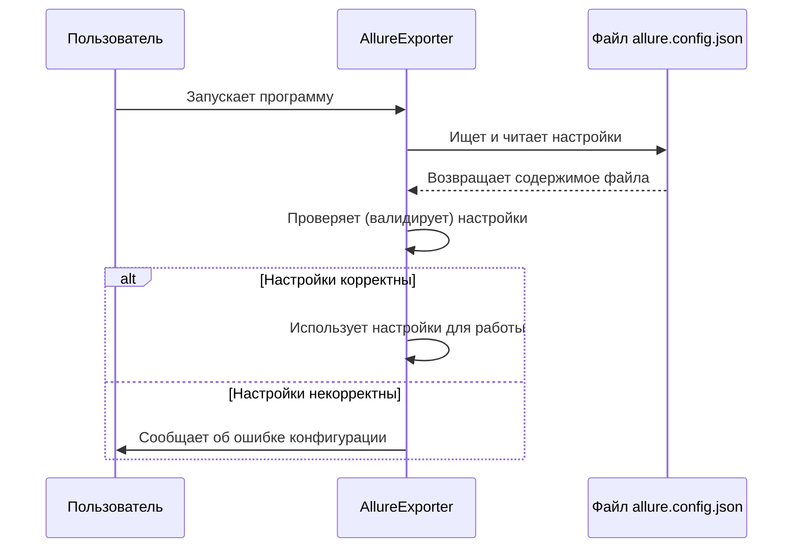

# Chapter 1: Конфигурация Приложения


Добро пожаловать в руководство по `AllureExporter`! Эта утилита поможет вам экспортировать ваши тест-кейсы из системы Allure TestOps. Но прежде чем мы начнем экспорт, нам нужно научить `AllureExporter`, как и куда подключаться, и что именно делать. Для этого используется конфигурация.

Представьте, что `AllureExporter` — это новый кухонный прибор. Прежде чем начать готовить, вам нужно прочитать инструкцию: куда его подключить, какие кнопки нажать, какие ингредиенты использовать. Без инструкции прибор бесполезен. Точно так же `AllureExporter` нуждается в своей "инструкции" — файле конфигурации. Этот файл говорит программе:

*   К какому серверу Allure подключаться (адрес).
*   Как получить доступ к вашему проекту (токен).
*   Из какого проекта забирать данные (имя проекта).
*   Куда сохранять результат экспорта (путь к папке).

Без этих настроек `AllureExporter` просто не будет знать, что ему делать.

## Файл `allure.config.json` — Ваша Панель Управления

Основной способ настроить `AllureExporter` — это создать файл с именем `allure.config.json`. Этот файл должен лежать в той же папке, где находится сама программа `AllureExporter`.

Файл написан в формате JSON (JavaScript Object Notation) — это простой текстовый формат для хранения и передачи данных, который легко читать и человеку, и машине. Вот как он может выглядеть:

**Пример 1: Использование Api-Token**

```json
{
    "resultPath": "/Users/user01/Documents/allure_exports", // Куда сохранять результат
    "allure": {
        "url": "https://allure.example.com/", // Адрес вашего Allure сервера
        "apiToken": "токен_доступа_api_из_allure", // Ваш API токен
        "projectName": "Мой Супер Проект", // Название проекта в Allure
        "migrateAutotests": true // Экспортировать ли автотесты? (true или false)
    }
}
```

**Пример 2: Использование Bearer-Token**

```json
{
    "resultPath": "C:\\Exports\\Allure", // Другой пример пути для Windows
    "allure": {
        "url": "https://mycompany.allure.ru/", // Адрес вашего Allure сервера
        "bearerToken": "длинный_токен_доступа_bearer_из_allure", // Ваш Bearer токен
        "projectName": "Project X", // Название проекта в Allure
        "migrateAutotests": false // Не экспортировать автотесты
    }
}
```

Давайте разберем основные параметры:

*   `resultPath`: Это полный путь к папке на вашем компьютере, куда `AllureExporter` сохранит экспортированные тест-кейсы в виде JSON файлов. Убедитесь, что эта папка существует и у программы есть права на запись в нее.
*   `allure`: Это блок настроек для подключения к Allure TestOps.
    *   `url`: Полный адрес (URL) вашего сервера Allure TestOps. Не забудьте `/` в конце.
    *   `apiToken` **или** `bearerToken`: Это ваш "ключ" для доступа к Allure API. Вам нужно указать *только один* из них. Узнать или сгенерировать токен можно в настройках вашего профиля в Allure TestOps.
        *   `apiToken`: Стандартный способ аутентификации.
        *   `bearerToken`: Альтернативный способ, который может потребоваться в некоторых конфигурациях Allure.
    *   `projectName`: Точное название вашего проекта в Allure TestOps, откуда вы хотите экспортировать данные. Регистр букв важен!
    *   `migrateAutotests` (необязательный): Этот параметр отвечает за экспорт автотестов. Если установлено `true`, автотесты будут включены в экспорт. Если `false` или параметр отсутствует, экспортируются только ручные тест-кейсы.

## Как Это Работает Под Капотом?

Когда вы запускаете `AllureExporter`, происходит несколько шагов, связанных с конфигурацией:

1.  **Чтение файла:** Программа ищет файл `allure.config.json` в своей папке.
2.  **Загрузка настроек:** Содержимое файла читается и преобразуется во внутренние объекты программы.
3.  **Проверка (Валидация):** Программа проверяет, все ли обязательные настройки указаны и корректны ли они (например, является ли `url` действительным адресом, указан ли хотя бы один токен).
4.  **Использование настроек:** Если все в порядке, эти настройки используются другими частями программы для подключения к Allure и сохранения результатов.

Вот упрощенная схема этого процесса:



## Немного о Коде: Загрузка и Валидация

Вам не обязательно разбираться в коде, чтобы использовать `AllureExporter`, но для любопытных покажем, как это реализовано.

**1. Загрузка Конфигурации (`Program.cs`)**

Когда приложение стартует, специальный код указывает, откуда брать настройки. Функция `SetupConfiguration` говорит: "Ищи настройки в файле `allure.config.json`".

```csharp
// Файл: Program.cs

private static IConfiguration SetupConfiguration()
{
    // Создаем построитель конфигурации
    return new ConfigurationBuilder()
        // Указываем, что искать файлы в текущей папке
        .SetBasePath(Directory.GetCurrentDirectory())
        // Говорим читать файл allure.config.json
        .AddJsonFile("allure.config.json")
        // Также можно использовать переменные окружения (более сложный сценарий)
        .AddEnvironmentVariables()
        // Собираем конфигурацию
        .Build();
}
```

Этот код, по сути, подключает наш файл `allure.config.json` как источник настроек для всего приложения.

**2. Модели Данных (`Models/Config/AppConfig.cs`)**

Чтобы программе было удобно работать с настройками, они загружаются в специальные классы C#.

```csharp
// Файл: Models/Config/AppConfig.cs (упрощенно)

// Главный класс для всех настроек
internal class AppConfig
{
    // Путь для результатов (обязательное поле)
    [Required] public string ResultPath { get; set; }

    // Блок настроек Allure (обязательное поле)
    [Required] public AllureConfig Allure { get; set; }
}

// Класс для настроек Allure
internal class AllureConfig
{
    // URL сервера (обязательное поле)
    [Required] public string Url { get; set; }

    // Имя проекта (обязательное поле)
    [Required] public string ProjectName { get; set; }

    // Токены (хотя бы один должен быть)
    public string ApiToken { get; set; }
    public string BearerToken { get; set; }

    // Флаг миграции автотестов (необязательный)
    public bool MigrateAutotests { get; set; }
}
```

Атрибуты `[Required]` помогают на раннем этапе понять, какие поля являются обязательными.

**3. Валидация Настроек (`Validators/AppConfigValidator.cs`)**

Прежде чем использовать настройки, программа проверяет их с помощью специального класса-валидатора.

```csharp
// Файл: Validators/AppConfigValidator.cs (упрощенно)

internal class AppConfigValidator : IValidateOptions<AppConfig>
{
    public ValidateOptionsResult Validate(string? name, AppConfig options)
    {
        // Проверка пути для сохранения результатов
        if (string.IsNullOrEmpty(options.ResultPath))
            return ValidateOptionsResult.Fail("ResultPath не может быть пустым."); // Сообщение об ошибке

        // Проверка URL Allure
        if (string.IsNullOrEmpty(options.Allure.Url))
            return ValidateOptionsResult.Fail("Url не может быть пустым.");
        if (!Uri.IsWellFormedUriString(options.Allure.Url, UriKind.Absolute))
            return ValidateOptionsResult.Fail("allure.url должен быть корректным URL.");

        // Проверка имени проекта
        if (string.IsNullOrEmpty(options.Allure.ProjectName))
            return ValidateOptionsResult.Fail("allure.projectName не указано.");

        // Проверка наличия токена (ApiToken или BearerToken)
        if (string.IsNullOrEmpty(options.Allure.ApiToken) &&
            string.IsNullOrEmpty(options.Allure.BearerToken))
            return ValidateOptionsResult.Fail("Должен быть указан allure.apiToken или allure.bearerToken.");

        // Если все проверки пройдены
        return ValidateOptionsResult.Success; // Все в порядке!
    }
}
```

Этот валидатор гарантирует, что программа не запустится с некорректными или отсутствующими основными настройками, и сразу сообщит пользователю, что нужно исправить в `allure.config.json`.

**4. Регистрация Конфигурации и Валидации (`Extensions/ServiceCollectionExtensions.cs`)**

При старте приложения все эти компоненты (загрузчик, модели, валидатор) связываются вместе.

```csharp
// Файл: Extensions/ServiceCollectionExtensions.cs (упрощенно)

public static class ServiceCollectionExtensions
{
    public static void RegisterAppConfig(this IServiceCollection services)
    {
        services
            // Добавляем возможность работать с настройками AppConfig
            .AddOptions<AppConfig>()
            // Связываем настройки с конфигурацией (из файла allure.config.json)
            .BindConfiguration("")
            // Включаем базовую проверку (например, [Required])
            .ValidateDataAnnotations()
            // Запускаем валидацию при старте приложения
            .ValidateOnStart();

        // Регистрируем наш специальный валидатор AppConfigValidator
        services.AddSingleton<IValidateOptions<AppConfig>, AppConfigValidator>();

       // ... Логгирование ...
    }
}
```

Вызов `.ValidateOnStart()` очень важен — он заставляет программу проверить конфигурацию сразу при запуске, а не ждать, пока ошибка проявится где-то в процессе экспорта.

## Куда Дальше?

Итак, мы разобрались, как настроить `AllureExporter` с помощью файла `allure.config.json`. Это первый и самый важный шаг, который дает программе необходимые "инструкции". Мы увидели, какие параметры нужно указать, и немного заглянули "под капот", чтобы понять, как программа читает и проверяет эти настройки.

Теперь, когда у нас есть корректная конфигурация, мы готовы перейти к сердцу программы — сервису, который управляет всем процессом экспорта.

В следующей главе мы познакомимся с [Сервисом Экспорта](02_сервис_экспорта_.md), который использует нашу конфигурацию для координации всех этапов извлечения данных из Allure.

---

Generated by [AI Codebase Knowledge Builder](https://github.com/The-Pocket/Tutorial-Codebase-Knowledge)