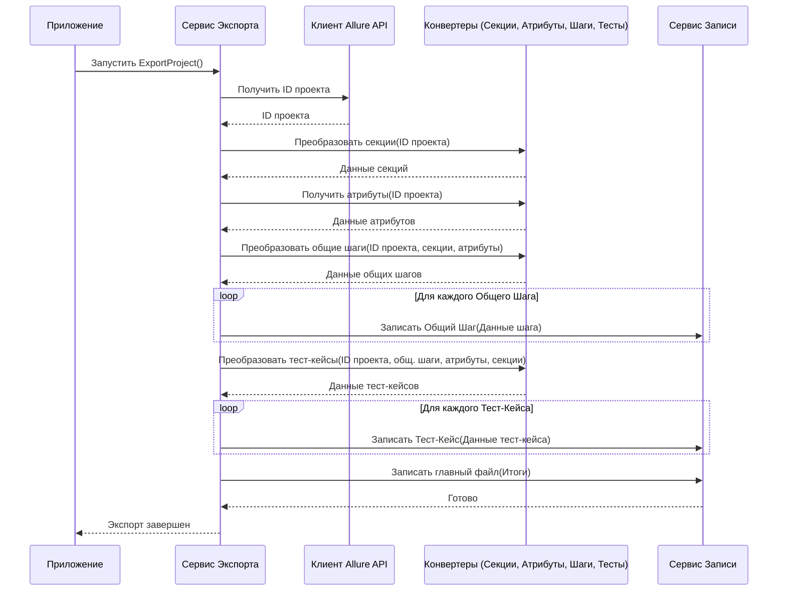

# Chapter 2: Сервис Экспорта


В [предыдущей главе (Конфигурация Приложения)](01_конфигурация_приложения_.md) мы разобрались, как настроить `AllureExporter`, указав ему адрес сервера Allure, данные для доступа и путь для сохранения результатов. Теперь, когда наш "прибор" подключен и знает основные настройки, пора узнать, кто же управляет всем процессом извлечения и сохранения данных.

Встречайте **Сервис Экспорта** (`ExportService`) — главного героя нашего сегодняшнего рассказа!

## Зачем Нужен Сервис Экспорта? Как Дирижер Оркестра

Представьте себе большой оркестр. Есть скрипачи, виолончелисты, трубачи, барабанщики – каждый играет свою партию. Но чтобы получилась гармоничная мелодия, нужен дирижер. Он не играет на всех инструментах сам, но знает партитуру, указывает, когда кому вступать, задает темп и следит за слаженностью всего исполнения.

**Сервис Экспорта** в `AllureExporter` — это такой же дирижер. Процесс экспорта тест-кейсов включает в себя множество шагов:

1.  Получить основную информацию о проекте из Allure.
2.  Получить список всех секций (папок) проекта и преобразовать их.
3.  Получить информацию об атрибутах (например, "Приоритет", "Тег") и обработать ее.
4.  Найти и преобразовать все общие шаги.
5.  Найти и преобразовать все тест-кейсы, включая их шаги и связи с общими шагами.
6.  Записать все полученные и преобразованные данные в файлы в нужном формате.

Сервис Экспорта сам не выполняет каждую из этих задач в деталях. Вместо этого он **координирует** работу других, более специализированных сервисов:

*   [Клиент Allure API](03_клиент_allure_api_.md): Общается с сервером Allure, чтобы получить "сырые" данные.
*   Сервис Конвертации Секций: Преобразует данные о папках проекта.
*   Сервис Конвертации Атрибутов: Преобразует данные об атрибутах.
*   [Сервис Конвертации Общих Шагов](06_сервис_конвертации_общих_шагов_.md): Преобразует общие шаги.
*   [Сервис Конвертации Тест-кейсов](05_сервис_конвертации_тест_кейсов_.md): Преобразует тест-кейсы.
*   [Сервис Записи Результатов](04_сервис_записи_результатов_.md): Записывает готовые данные в файлы.

Сервис Экспорта вызывает эти сервисы в правильной последовательности, передает им нужную информацию и собирает результаты их работы воедино.

## Как Используется Сервис Экспорта?

Вам, как пользователю, не нужно напрямую вызывать Сервис Экспорта. Когда вы запускаете приложение `AllureExporter`, самое главное ядро приложения (`App`) уже знает, что нужно обратиться к Сервису Экспорта, чтобы начать работу.

Вот как это выглядит в коде основного класса приложения:

```csharp
// Файл: App.cs (упрощенно)
using AllureExporter.Services; // Подключаем пространство имен сервисов
using Microsoft.Extensions.Logging;

namespace AllureExporter;

// Основной класс приложения
public class App
{
    private readonly ILogger<App> _logger;
    private readonly IExportService _exportService; // Здесь хранится ссылка на Сервис Экспорта

    // Конструктор: Приложение получает Сервис Экспорта "извне" (Dependency Injection)
    public App(ILogger<App> logger, IExportService exportService)
    {
        _logger = logger;
        _exportService = exportService; // Сохраняем полученный сервис
    }

    // Главный метод, который запускается при старте
    public void Run(string[] args)
    {
        _logger.LogInformation("Starting application"); // Начинаем работу

        try
        {
            // Вот он, ключевой момент! Вызываем метод ExportProject у Сервиса Экспорта
            _exportService.ExportProject().Wait(); // Запускаем экспорт и ждем завершения
        }
        catch (Exception e)
        {
            _logger.LogError(e, "Error occurred during export"); // Если что-то пошло не так
            throw;
        }

        _logger.LogInformation("Ending application"); // Работа завершена
    }
}
```

Как видите, основная логика приложения просто говорит: "Эй, Сервис Экспорта, начни экспорт!". А всю сложную координационную работу выполняет уже сам `ExportService`.

## Что Происходит Внутри: Шаги Экспорта

Давайте представим по шагам, что делает Сервис Экспорта, когда его метод `ExportProject` вызывается:

1.  **Привет, Allure!:** Сначала он просит [Клиент Allure API](03_клиент_allure_api_.md) узнать ID (уникальный номер) проекта, используя имя проекта из вашей [конфигурации](01_конфигурация_приложения_.md).
2.  **Структура Проекта:** Затем он обращается к сервису конвертации секций, чтобы получить структуру папок (секций) вашего проекта.
3.  **Важные Детали (Атрибуты):** После этого он запрашивает у сервиса атрибутов список всех пользовательских атрибутов (таких как Priority, Severity, Tags).
4.  **Общие Блоки (Общие Шаги):** Далее Сервис Экспорта поручает [Сервису Конвертации Общих Шагов](06_сервис_конвертации_общих_шагов_.md) найти и преобразовать все общие шаги в проекте.
5.  **Самое Главное (Тест-кейсы):** Теперь, имея информацию о секциях, атрибутах и общих шагах, он просит [Сервис Конвертации Тест-кейсов](05_сервис_конвертации_тест_кейсов_.md) извлечь и преобразовать все тест-кейсы.
6.  **Запись!:** По мере готовности преобразованных данных (общих шагов и тест-кейсов), Сервис Экспорта передает их [Сервису Записи Результатов](04_сервис_записи_результатов_.md), который аккуратно сохраняет каждый элемент в отдельный JSON-файл.
7.  **Итоговый Файл:** В самом конце Сервис Экспорта собирает общую информацию (имя проекта, список секций, ID всех тест-кейсов и общих шагов, список атрибутов) и просит Сервис Записи создать главный файл `project.json`.

Вот как это можно изобразить на диаграмме:



## Заглянем в Код Сервиса Экспорта (`ExportService.cs`)

Теперь посмотрим на немного упрощенный код самого Сервиса Экспорта.

**1. Получение "Помощников" (Конструктор)**

Сервис Экспорта не создает другие сервисы сам. Он получает их готовыми при своем создании. Это называется "Внедрение зависимостей" (Dependency Injection).

```csharp
// Файл: Services/Implementations/ExportService.cs (упрощенно)
using AllureExporter.Client; // Клиент Allure
using AllureExporter.Helpers; // Вспомогательные утилиты
using JsonWriter; // Сервис записи
using Microsoft.Extensions.Logging; // Логгирование
using Models; // Модели данных

namespace AllureExporter.Services.Implementations;

internal sealed class ExportService : IExportService
{
    // Приватные поля для хранения ссылок на другие сервисы
    private readonly ILogger<ExportService> _logger;
    private readonly IClient _client; // Клиент API Allure
    private readonly IWriteService _writeService; // Сервис записи файлов
    private readonly ISectionService _sectionService; // Сервис для секций
    private readonly ISharedStepService _sharedStepService; // Сервис для общих шагов
    private readonly ITestCaseService _testCaseService; // Сервис для тест-кейсов
    private readonly IAttributeService _attributeService; // Сервис для атрибутов
    // ... другие вспомогательные сервисы ...

    // Конструктор: Сюда "приходят" все нужные сервисы
    public ExportService(
        ILogger<ExportService> logger,
        IClient client,
        IWriteService writeService,
        ISectionService sectionService,
        ISharedStepService sharedStepService,
        ITestCaseService testCaseService,
        IAttributeService attributeService
        /* ... другие ... */)
    {
        // Сохраняем полученные сервисы в приватные поля
        _logger = logger;
        _client = client;
        _writeService = writeService;
        _sectionService = sectionService;
        _sharedStepService = sharedStepService;
        _testCaseService = testCaseService;
        _attributeService = attributeService;
        // ...
    }

    // Метод экспорта будет здесь...
    public async Task ExportProject() { /* ... */ }
}
```

**2. Основной Метод `ExportProject`**

Этот метод реализует описанную выше последовательность шагов.

```csharp
// Файл: Services/Implementations/ExportService.cs (продолжение)

public async Task ExportProject()
{
    _logger.LogInformation("Starting export"); // Сообщаем о начале экспорта

    // 1. Получаем информацию о проекте через Клиент API
    var project = await _client.GetProjectId();

    // 2. Получаем преобразованные секции
    var section = await _sectionService.ConvertSection(project.Id);

    // 3. Получаем преобразованные атрибуты
    var attributes = await _attributeService.GetCustomAttributes(project.Id);
    // Преобразуем атрибуты в словарь для удобного доступа по имени
    var customAttributes = attributes.ToDictionary(k => k.Name, v => v.Id);

    // 4. Получаем преобразованные общие шаги
    var sharedSteps = await _sharedStepService.ConvertSharedSteps(project.Id, section.MainSection.Id, attributes);
    // Преобразуем общие шаги в словарь для удобного доступа по ID
    var sharedStepsMap = sharedSteps.ToDictionary(k => k.Key.ToString(), v => v.Value.Id);

    // 5. Получаем преобразованные тест-кейсы
    var testCases = await _testCaseService.ConvertTestCases(project.Id, sharedStepsMap, customAttributes, section);

    // 6. Записываем общие шаги в файлы
    _logger.LogInformation("Writing {Count} shared steps...", sharedSteps.Count);
    foreach (var sharedStep in sharedSteps)
    {
        // Здесь могут быть дополнительные обработки, например, обрезка слишком длинных тегов
        await _writeService.WriteSharedStep(sharedStep.Value); // Вызов сервиса записи
    }

    // 6. Записываем тест-кейсы в файлы
    _logger.LogInformation("Writing {Count} test cases...", testCases.Count);
    foreach (var testCase in testCases)
    {
        // Здесь также могут быть дополнительные обработки
        await _writeService.WriteTestCase(testCase); // Вызов сервиса записи
    }

    // 7. Формируем и записываем основной файл `project.json`
    _logger.LogInformation("Writing main project file...");
    var mainJson = new Root // Создаем объект с общей информацией
    {
        ProjectName = project.Name,
        Sections = [section.MainSection], // Корневая секция
        TestCases = testCases.Select(t => t.Id).ToList(), // Список ID тест-кейсов
        SharedSteps = sharedSteps.Values.Select(s => s.Id).ToList(), // Список ID общ. шагов
        Attributes = attributes // Список атрибутов
    };
    await _writeService.WriteMainJson(mainJson); // Вызов сервиса записи

    _logger.LogInformation("Ending export"); // Сообщаем о завершении
}
```

Как видите, код метода `ExportProject` довольно точно следует шагам, которые мы описали. Он делегирует сложную работу по получению данных [Клиенту Allure API](03_клиент_allure_api_.md), по преобразованию — специализированным сервисам конвертации ([Общих Шагов](06_сервис_конвертации_общих_шагов_.md), [Тест-кейсов](05_сервис_конвертации_тест_кейсов_.md) и т.д.), а по сохранению — [Сервису Записи Результатов](04_сервис_записи_результатов_.md). Сам же он выступает в роли координатора, оркеструя весь процесс.

## Заключение

В этой главе мы познакомились с **Сервисом Экспорта** — сердцем `AllureExporter`, отвечающим за координацию всего процесса. Мы узнали, что он работает как дирижер оркестра, управляя другими специализированными сервисами для выполнения конкретных задач: получения данных, их преобразования и записи. Мы увидели, как основной класс приложения запускает экспорт, и рассмотрели шаги, которые выполняет Сервис Экспорта "под капотом", включая вызовы других важных компонентов.

Теперь, когда мы понимаем общую схему работы, настало время познакомиться с первым "музыкантом" нашего оркестра — тем, кто непосредственно общается с Allure TestOps.

В следующей главе мы подробно рассмотрим [Клиент Allure API](03_клиент_allure_api_.md), который отвечает за отправку запросов к Allure и получение необработанных данных для дальнейшей обработки.

---

Generated by [AI Codebase Knowledge Builder](https://github.com/The-Pocket/Tutorial-Codebase-Knowledge)