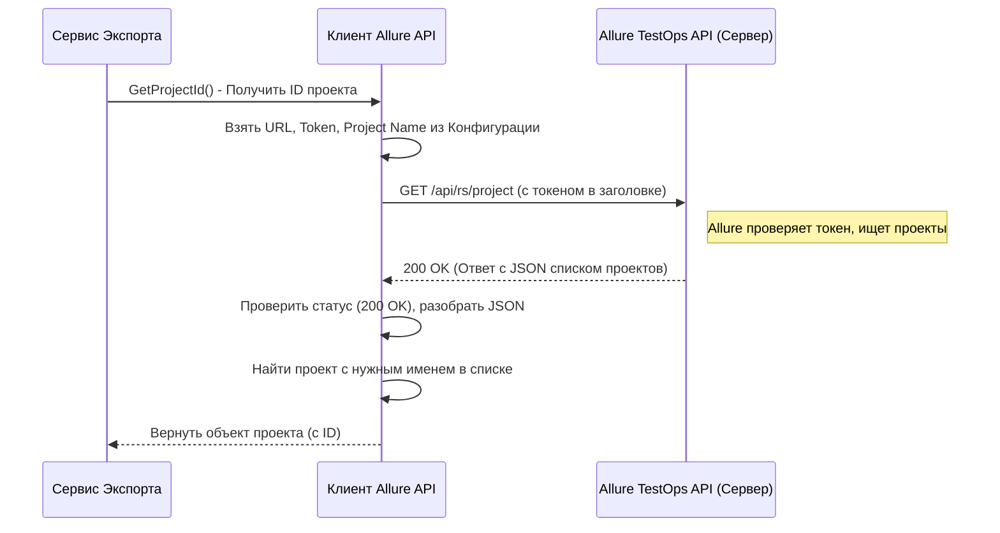

# Chapter 3: Клиент Allure API


В [предыдущей главе (Сервис Экспорта)](02_сервис_экспорта_.md) мы увидели, как `ExportService` дирижирует всем процессом экспорта, координируя работу различных компонентов. Мы упоминали, что для получения самих данных из Allure TestOps он обращается к специальному помощнику. Пришло время познакомиться с этим помощником поближе!

В этой главе мы поговорим о **Клиенте Allure API** (`Client`). Это именно тот компонент, который отвечает за все общение с сервером Allure TestOps.

## Зачем нужен "Переводчик" для Allure?

Представьте, что `AllureExporter` хочет получить список тест-кейсов из вашего проекта в Allure TestOps. Но Allure TestOps — это отдельная система, работающая на вашем сервере или в облаке. Как `AllureExporter` может "попросить" у нее эти данные?

Он не может просто зайти и взять их. Ему нужен способ общаться с Allure на понятном для нее языке. Этот язык называется **API** (Application Programming Interface — Программный Интерфейс Приложения). API — это набор правил и команд, которые одна программа может использовать для взаимодействия с другой.

И вот тут на сцену выходит **Клиент Allure API**. Он как опытный переводчик или дипломат:

1.  **Знает адрес:** Он берет URL вашего сервера Allure из [Конфигурации Приложения](01_конфигурация_приложения_.md).
2.  **Предъявляет "паспорт":** Использует ваш API-токен (или Bearer-токен) из конфигурации, чтобы доказать Allure, что у него есть право запрашивать данные.
3.  **Говорит на языке API:** Формирует специальные запросы (HTTP-запросы) точно так, как ожидает Allure (например, "дай мне ID проекта с именем X", "дай мне все тест-кейсы из проекта Y", "дай мне детали тест-кейса Z").
4.  **Передает ответ:** Получает ответ от Allure (обычно в формате JSON), разбирает его и передает "сырые", необработанные данные дальше, тому же [Сервису Экспорта](02_сервис_экспорта_.md) или другим компонентам для обработки.

Без Клиента Allure API наш `AllureExporter` был бы как человек, оказавшийся в чужой стране без знания языка и карты – он не смог бы ни с кем поговорить и ничего найти. Клиент — это наш мост к данным в Allure.

## Как Клиент Allure API используется `AllureExporter`?

Вы, как пользователь, напрямую с Клиентом не взаимодействуете. Его использует "дирижер" — [Сервис Экспорта](02_сервис_экспорта_.md). Когда Cервис Экспорта решает, что ему нужны какие-то данные из Allure (например, ID проекта), он обращается к Клиенту API.

Помните код из предыдущей главы в `ExportService`?

```csharp
// Файл: Services/Implementations/ExportService.cs (фрагмент)

// ... другие сервисы ...
private readonly IClient _client; // Поле для хранения Клиента API

public ExportService(ILogger<ExportService> logger, IClient client, /* ... другие ... */)
{
    _logger = logger;
    _client = client; // Получаем Клиента API при создании Сервиса Экспорта
    // ...
}

public async Task ExportProject()
{
    // ...
    // Вот вызов метода у Клиента API!
    var project = await _client.GetProjectId();
    // ... теперь используем полученный ID проекта ...
    // ... другие вызовы клиента для получения тест-кейсов, шагов и т.д. ...
    var testCasesData = await _client.GetTestCaseById(someId);
    var stepsData = await _client.GetSteps(someId);
    // ...
}
```

`ExportService` просто говорит: `_client, дай мне ID проекта!` или `_client, дай тест-кейс номер 123!`. Всю "грязную" работу по общению с сервером Allure берет на себя `Client`.

## Под Капотом: Как Клиент Общается с Allure?

Давайте шаг за шагом посмотрим, что происходит, когда `ExportService` просит Клиент API получить, например, ID проекта.

1.  **Подготовка:** Клиент берет имя проекта (`projectName`) и адрес сервера (`url`) из [Конфигурации Приложения](01_конфигурация_приложения_.md). Он также находит ваш токен доступа.
2.  **Формирование Запроса:** Клиент создает HTTP GET-запрос к определенному адресу на сервере Allure (например, `https://allure.example.com/api/rs/project`). В заголовки запроса он добавляет ваш токен для аутентификации.
3.  **Отправка:** Запрос отправляется по сети на ваш сервер Allure TestOps.
4.  **Обработка в Allure:** Allure API получает запрос, проверяет токен, находит все проекты и формирует ответ (список проектов с их именами и ID в формате JSON).
5.  **Получение Ответа:** Клиент получает ответ от сервера Allure.
6.  **Проверка:** Клиент проверяет, был ли ответ успешным (например, код ответа 200 OK). Если нет (например, 401 Unauthorized - неверный токен, или 404 Not Found - адрес не найден), он сообщает об ошибке.
7.  **Разбор JSON:** Если ответ успешный, Клиент читает тело ответа (JSON-строку) и преобразует ее во внутренние объекты C#, которые удобно использовать дальше. В нашем случае, он ищет в списке проектов тот, чье имя совпадает с `projectName`.
8.  **Возврат Результата:** Клиент возвращает найденный объект проекта (содержащий ID) обратно [Сервису Экспорта](02_сервис_экспорта_.md).

Вот как это выглядит на диаграмме:



## Заглянем в Код Клиента

Основная логика Клиента находится в файлах `Client/Client.cs` (реализация) и `Client/IClient.cs` (интерфейс, контракт).

**1. Создание и Настройка (`Client.cs`)**

Когда приложение запускается, оно создает объект `Client`, передавая ему настройки и специальный объект `HttpClient` (стандартный .NET инструмент для отправки HTTP-запросов).

```csharp
// Файл: Client/Client.cs (упрощенно)

using AllureExporter.Models.Config;
using Microsoft.Extensions.Logging;
using Microsoft.Extensions.Options;
using System.Net.Http.Headers; // Для заголовков аутентификации

namespace AllureExporter.Client;

internal class Client : IClient
{
    private readonly HttpClient _httpClient; // Инструмент для HTTP-запросов
    private readonly ILogger<Client> _logger;
    private readonly string _projectName;
    // ... другие поля ...

    // Конструктор: Получает логгер, конфигурацию (AppConfig) и HttpClient
    public Client(ILogger<Client> logger, IOptions<AppConfig> config, HttpClient httpClient)
    {
        _logger = logger;
        _projectName = config.Value.Allure.ProjectName; // Запоминаем имя проекта
        _httpClient = httpClient; // Сохраняем HttpClient
        InitClient(config.Value); // Вызываем настройку HttpClient
    }

    // Метод для начальной настройки HttpClient
    private void InitClient(AppConfig config)
    {
        // Устанавливаем базовый адрес из конфигурации
        _httpClient.BaseAddress = new Uri(config.Allure.Url);

        // Добавляем заголовок авторизации, используя один из токенов
        if (!string.IsNullOrEmpty(config.Allure.ApiToken))
            _httpClient.DefaultRequestHeaders.Authorization =
                new AuthenticationHeaderValue("Api-Token", config.Allure.ApiToken);
        else if (!string.IsNullOrEmpty(config.Allure.BearerToken))
            _httpClient.DefaultRequestHeaders.Authorization =
                new AuthenticationHeaderValue("Bearer", config.Allure.BearerToken);
        else // Если ни один токен не указан (уже проверено валидатором, но на всякий случай)
            throw new ArgumentException("Api-Token или Bearer-Token не указан");
    }

    // ... другие методы для запроса данных ...
}
```

Метод `InitClient` настраивает `HttpClient`, чтобы все будущие запросы отправлялись на правильный URL Allure и с нужным токеном в заголовке `Authorization`.

**2. Пример Метода: Получение ID Проекта (`Client.cs`)**

Вот упрощенный метод `GetProjectId`, который мы разбирали выше:

```csharp
// Файл: Client/Client.cs (продолжение, упрощенно)

using System.Text.Json; // Для работы с JSON
using AllureExporter.Models.Project; // Модели данных для проекта

// ...

public async Task<BaseEntity> GetProjectId()
{
    _logger.LogInformation("Получаем ID проекта с именем {Name}", _projectName);

    // Отправляем GET-запрос на адрес 'api/rs/project' (базовый адрес уже настроен)
    var response = await _httpClient.GetAsync("api/rs/project");

    // Проверяем, успешен ли ответ
    if (!response.IsSuccessStatusCode)
    {
        _logger.LogError("Не удалось получить ID проекта. Код: {StatusCode}", response.StatusCode);
        // В реальном коде здесь еще будет тело ответа для диагностики
        throw new Exception($"Ошибка получения ID проекта. Код: {response.StatusCode}");
    }

    // Читаем тело ответа как строку
    var content = await response.Content.ReadAsStringAsync();
    // Преобразуем (десериализуем) JSON-строку в объект BaseEntities
    var projects = JsonSerializer.Deserialize<BaseEntities>(content);

    // Ищем проект с нужным именем (игнорируя регистр)
    var project = projects?.Content.FirstOrDefault(p =>
        string.Equals(p.Name, _projectName, StringComparison.InvariantCultureIgnoreCase));

    // Если проект найден, возвращаем его
    if (project != null) return project;

    // Если не найден, сообщаем об ошибке
    _logger.LogError("Проект не найден");
    throw new Exception("Проект не найден");
}

// ... другие методы GetTestCaseById, GetSteps, DownloadAttachment и т.д. ...
```

Этот метод демонстрирует основной цикл работы Клиента API: отправить запрос -> проверить ответ -> разобрать JSON -> вернуть результат. Другие методы (`GetTestCaseById`, `GetSteps`, `GetAttachmentsByTestCaseId` и т.д.) работают по схожему принципу, но обращаются к другим адресам API Allure и разбирают другие структуры данных.

**3. Контракт: Интерфейс `IClient` (`IClient.cs`)**

Интерфейс `IClient` определяет, *что* Клиент API *должен уметь* делать, не вдаваясь в детали *как* он это делает. Это как меню в ресторане: вы видите список блюд (методов), но не процесс их приготовления.

```csharp
// Файл: Client/IClient.cs (фрагмент)

using AllureExporter.Models.Project;
using AllureExporter.Models.TestCase;
// ... другие using ...

namespace AllureExporter.Client;

// Интерфейс определяет "контракт" Клиента API
public interface IClient
{
    // Должен уметь получать ID проекта
    Task<BaseEntity> GetProjectId();

    // Должен уметь получать список ID тест-кейсов для проекта
    // (В реальности есть отдельные методы для корневой папки и конкретных папок)
    Task<List<long>> GetTestCaseIdsFromSuite(long projectId, long suiteId);

    // Должен уметь получать детали конкретного тест-кейса по ID
    Task<AllureTestCase> GetTestCaseById(long testCaseId);

    // Должен уметь получать шаги тест-кейса
    Task<List<AllureStep>> GetSteps(long testCaseId);

    // Должен уметь скачивать вложения
    Task<byte[]> DownloadAttachmentForTestCase(long attachmentId);

    // ... и многие другие методы для получения общих шагов, связей, комментариев и т.д.
}
```

Наличие интерфейса `IClient` очень важно. Оно позволяет другим частям программы (как [Сервис Экспорта](02_сервис_экспорта_.md)) зависеть не от конкретной реализации `Client`, а от абстрактного "контракта". Это делает систему более гибкой и тестируемой.

## Заключение

В этой главе мы познакомились с **Клиентом Allure API** — нашим "переводчиком" и "дипломатом", который отвечает за все взаимодействие с внешней системой Allure TestOps. Мы узнали, что он:

*   Использует настройки из [Конфигурации Приложения](01_конфигурация_приложения_.md) для подключения и аутентификации.
*   Отправляет HTTP-запросы к API Allure, чтобы получить нужные данные (проекты, тест-кейсы, шаги, вложения и т.д.).
*   Получает ответы в формате JSON и преобразует их во внутренние объекты.
*   Предоставляет эти "сырые" данные другим сервисам ([Сервису Экспорта](02_сервис_экспорта_.md), сервисам конвертации вроде [Сервис Конвертации Тест-кейсов](05_сервис_конвертации_тест_кейсов_.md) и [Сервис Конвертации Общих Шагов](06_сервис_конвертации_общих_шагов_.md)) для дальнейшей обработки.

Теперь, когда мы знаем, как `AllureExporter` получает данные из Allure, возникает следующий вопрос: куда он их сохраняет? Как происходит запись результатов экспорта в файлы?

В следующей главе мы разберем [Сервис Записи Результатов](04_сервис_записи_результатов_.md), который отвечает за создание JSON-файлов с экспортированными данными в указанной вами папке.

---

Generated by [AI Codebase Knowledge Builder](https://github.com/The-Pocket/Tutorial-Codebase-Knowledge)