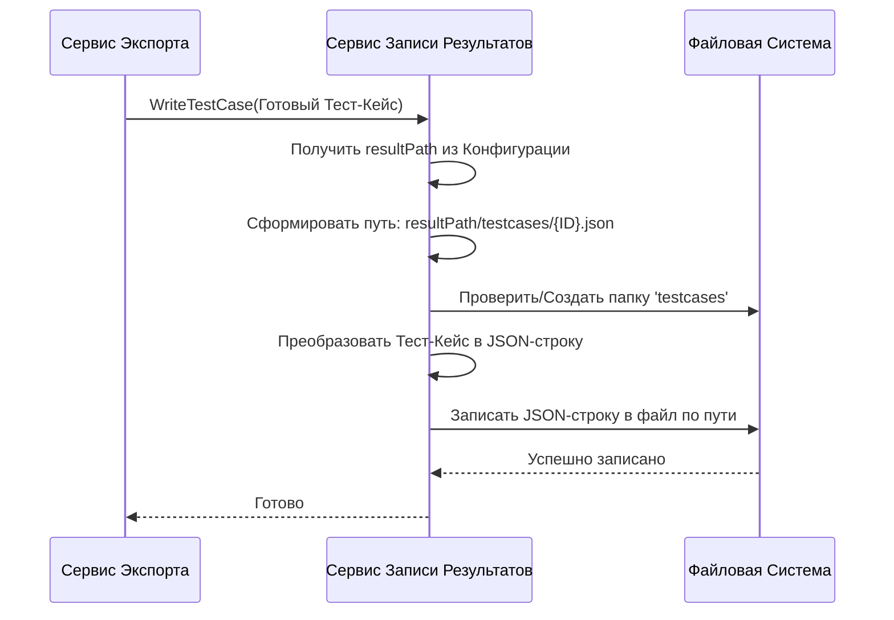

# Chapter 4: Сервис Записи Результатов


В [предыдущей главе (Клиент Allure API)](03_клиент_allure_api_.md) мы узнали, как `AllureExporter` с помощью специального "переводчика" общается с сервером Allure TestOps и получает от него "сырые" данные: информацию о проекте, тест-кейсах, шагах и вложениях.

Но получить данные — это только полдела. Их нужно где-то сохранить, причем в удобном и структурированном виде! Представьте, что вы получили по почте множество документов (наши данные из Allure). Вам нужен кто-то, кто аккуратно разложит их по папкам и файлам в вашем архиве.

Именно эту роль в `AllureExporter` выполняет **Сервис Записи Результатов** (`WriteService`).

## Зачем Нужен "Архивариус"?

Сервис Записи Результатов действует как секретарь или архивариус во всем процессе экспорта. Его главная задача — **брать уже готовую, обработанную информацию** от других сервисов и **записывать её в файлы** на вашем компьютере.

Он не занимается получением данных из Allure (это работа [Клиента Allure API](03_клиент_allure_api_.md)) и не преобразует их в нужный формат (этим займутся сервисы конвертации, о которых мы поговорим позже, например, [Сервис Конвертации Тест-кейсов](05_сервис_конвертации_тест_кейсов_.md)). Сервис Записи получает уже "чистые", отформатированные данные и выполняет следующие задачи:

1.  **Создает основной файл `project.json`:** Записывает общую информацию о проекте: его имя, структуру папок (секций), списки ID всех экспортированных тест-кейсов и общих шагов, а также информацию об атрибутах.
2.  **Сохраняет Тест-кейсы:** Каждый преобразованный тест-кейс сохраняется в отдельный JSON-файл в подпапку `testcases`. Например, `testcases/{уникальный_id_тест-кейса}.json`.
3.  **Сохраняет Общие Шаги:** Аналогично, каждый общий шаг сохраняется в свой JSON-файл в подпапку `sharedsteps`. Например, `sharedsteps/{уникальный_id_общего_шага}.json`.
4.  **Сохраняет Вложения:** Если у тест-кейсов или общих шагов есть вложения (картинки, логи и т.д.), сервис скачивает их (используя [Клиент Allure API](03_клиент_allure_api_.md) для получения байтов) и сохраняет в специальные подпапки `attachments`, созданные для каждого тест-кейса или общего шага, которому они принадлежат.

Место, куда все это сохраняется, определяется параметром `resultPath` в вашей [Конфигурации Приложения](01_конфигурация_приложения_.md).

## Как Используется Сервис Записи?

Как и с [Клиентом Allure API](03_клиент_allure_api_.md), вы напрямую не взаимодействуете с Сервисом Записи. Его вызывают другие сервисы, в основном "дирижер" — [Сервис Экспорта](02_сервис_экспорта_.md).

Когда [Сервис Экспорта](02_сервис_экспорта_.md) получает готовый к записи объект (например, преобразованный тест-кейс), он передает его Сервису Записи:

```csharp
// Файл: Services/Implementations/ExportService.cs (фрагмент)

// ... другие сервисы ...
private readonly IWriteService _writeService; // Поле для Сервиса Записи

public ExportService(
    // ...
    IWriteService writeService, // Получаем Сервис Записи при создании
    // ...
    )
{
    // ...
    _writeService = writeService;
    // ...
}

public async Task ExportProject()
{
    // ... получаем и преобразуем данные ...
    var testCases = await _testCaseService.ConvertTestCases(/*...*/);
    var sharedSteps = await _sharedStepService.ConvertSharedSteps(/*...*/);

    // ...
    _logger.LogInformation("Writing {Count} shared steps...", sharedSteps.Count);
    foreach (var sharedStep in sharedSteps)
    {
        // Передаем готовый общий шаг Сервису Записи
        await _writeService.WriteSharedStep(sharedStep.Value);
    }

    // ...
    _logger.LogInformation("Writing {Count} test cases...", testCases.Count);
    foreach (var testCase in testCases)
    {
        // Передаем готовый тест-кейс Сервису Записи
        await _writeService.WriteTestCase(testCase);
    }

    // ...
    // Формируем и передаем данные для главного файла
    var mainJson = new Root { /*...*/ };
    await _writeService.WriteMainJson(mainJson);
    // ...
}
```

[Сервис Экспорта](02_сервис_экспорта_.md) просто говорит: `_writeService, запиши этот тест-кейс!`, `_writeService, запиши этот общий шаг!`, `_writeService, запиши главный файл!`. А как именно это сделать — знает Сервис Записи.

## Что Происходит Под Капотом: Процесс Записи

Давайте представим, что [Сервис Экспорта](02_сервис_экспорта_.md) передал Сервису Записи готовый тест-кейс для сохранения. Что происходит дальше?

1.  **Определение Пути:** Сервис Записи берет основной путь для сохранения (`resultPath`) из [Конфигурации Приложения](01_конфигурация_приложения_.md).
2.  **Формирование Имени Файла:** Он создает полный путь к файлу для тест-кейса. Обычно это что-то вроде `{resultPath}/testcases/{ID_тест-кейса}.json`. ID берется из данных самого тест-кейса.
3.  **Создание Папок:** Сервис проверяет, существуют ли папки `testcases` внутри `resultPath`. Если нет — он их создает.
4.  **Преобразование в JSON:** Объект тест-кейса (который в программе представлен как класс C#) преобразуется в текстовую строку в формате JSON. Этот процесс называется *сериализацией*.
5.  **Запись в Файл:** Полученная JSON-строка записывается в файл по сформированному на шаге 2 пути. Если файл уже существует, он перезаписывается.
6.  **Запись Вложений (если нужно):** Если этот сервис также отвечает за скачивание вложений (через `AttachmentService`, который использует `WriteService`), то для каждого вложения:
    *   Создается папка `{resultPath}/attachments/{ID_тест-кейса}/`.
    *   В эту папку записываются байты скачанного файла вложения под его оригинальным (или скорректированным) именем.

Вот упрощенная диаграмма для записи тест-кейса:



## Заглянем в Код: `JsonWriter`

Логика записи файлов вынесена в отдельный проект под названием `JsonWriter`, который используется `AllureExporter`. Основные компоненты там:

**1. Контракт: Интерфейс `IWriteService`**

Этот интерфейс определяет, *что* должен уметь делать Сервис Записи.

```csharp
// Файл: JsonWriter/IWriteService.cs (упрощенно)
using Models; // Подключаем общие модели данных

namespace JsonWriter;

// Интерфейс Сервиса Записи
public interface IWriteService
{
    // Записать главный файл project.json
    Task WriteMainJson(Root mainJson);

    // Записать файл для одного тест-кейса
    Task WriteTestCase(TestCase testCase);

    // Записать файл для одного общего шага
    Task WriteSharedStep(SharedStep sharedStep);

    // Записать файл вложения (байты) в папку по ID сущности (тест-кейса или шага)
    // Возвращает имя сохраненного файла
    Task<string> WriteAttachment(Guid entityId, byte[] content, string filename);
}
```

**2. Реализация: Класс `WriteService`**

Этот класс содержит конкретный код для выполнения задач, описанных в интерфейсе.

```csharp
// Файл: JsonWriter/WriteService.cs (упрощенно)
using System.Text.Json; // Для работы с JSON
using Microsoft.Extensions.Options; // Для получения настроек
using Models; // Общие модели
using Models.Config; // Модель конфигурации

namespace JsonWriter;

internal class WriteService : IWriteService
{
    private readonly string _resultPath; // Хранит путь из конфигурации
    private readonly JsonSerializerOptions _options; // Настройки для JSON-сериализации

    // Конструктор: получает конфигурацию (AppConfig)
    public WriteService(IOptions<AppConfig> config)
    {
        // Запоминаем путь из настроек
        _resultPath = config.Value.ResultPath;

        // Настраиваем красивый вывод JSON (с отступами)
        _options = new JsonSerializerOptions
        {
            WriteIndented = true, // Делает JSON читаемым
            // Можно добавить другие настройки, например, правила именования
        };

        // Создаем базовые папки, если их нет
        Directory.CreateDirectory(Path.Combine(_resultPath, Constants.TestCasePath));
        Directory.CreateDirectory(Path.Combine(_resultPath, Constants.SharedStepPath));
        Directory.CreateDirectory(Path.Combine(_resultPath, Constants.AttachmentPath));
    }

    // Пример: Запись тест-кейса
    public async Task WriteTestCase(TestCase testCase)
    {
        // Формируем путь: /path/to/results/testcases/GUID.json
        var filePath = Path.Combine(_resultPath, Constants.TestCasePath, $"{testCase.Id}.json");

        // Сериализуем объект testCase в JSON
        var json = JsonSerializer.Serialize(testCase, _options);

        // Асинхронно записываем JSON в файл
        await File.WriteAllTextAsync(filePath, json);
    }

    // Пример: Запись вложения
    public async Task<string> WriteAttachment(Guid entityId, byte[] content, string filename)
    {
        // Формируем путь к папке для вложений этой сущности: /path/to/results/attachments/GUID/
        var directoryPath = Path.Combine(_resultPath, Constants.AttachmentPath, entityId.ToString());
        // Создаем папку, если ее нет
        Directory.CreateDirectory(directoryPath);

        // Формируем полный путь к файлу: /path/to/results/attachments/GUID/filename.ext
        var filePath = Path.Combine(directoryPath, filename);

        // Асинхронно записываем байты в файл
        await File.WriteAllBytesAsync(filePath, content);

        // Возвращаем относительный путь для ссылки
        return Path.Combine(Constants.AttachmentPath, entityId.ToString(), filename);
    }

    // ... Реализация WriteMainJson и WriteSharedStep похожа на WriteTestCase ...
}
```

Ключевые моменты здесь:

*   `Path.Combine`: Безопасный способ соединить части пути к файлу, не беспокоясь о правильных слешах (`/` или `\`).
*   `Directory.CreateDirectory`: Создает папку (и все родительские папки, если нужно), если она еще не существует.
*   `JsonSerializer.Serialize`: Превращает объект C# (например, `TestCase`) в строку JSON.
*   `File.WriteAllTextAsync` / `File.WriteAllBytesAsync`: Асинхронно записывают текст или байты в файл. "Асинхронно" означает, что программа может заниматься другими делами, пока идет запись на диск, что важно для производительности.

**Важно:** Сервис Записи не принимает решений *что* писать, он просто выполняет поручения по записи того, что ему передали, в указанное в [Конфигурации Приложения](01_конфигурация_приложения_.md) место.

## Заключение

В этой главе мы познакомились с **Сервисом Записи Результатов** (`WriteService`) — нашим "архивариусом". Мы узнали, что он:

*   Отвечает за финальный этап — сохранение обработанных данных в файлы.
*   Работает как "секретарь", получая готовые данные от других сервисов (например, [Сервиса Экспорта](02_сервис_экспорта_.md)).
*   Создает основной файл `project.json`, JSON-файлы для каждого тест-кейса и общего шага, а также сохраняет скачанные вложения.
*   Использует путь `resultPath` из [Конфигурации Приложения](01_конфигурация_приложения_.md) для определения места сохранения.
*   Преобразует объекты данных в JSON перед записью в файлы.

Мы увидели, как [Клиент Allure API](03_клиент_allure_api_.md) получает данные, а Сервис Записи их сохраняет. Но кто же находится между ними? Кто превращает "сырые" данные от клиента в красивые, структурированные объекты, готовые для записи?

Об этом мы поговорим в следующих главах, начиная с [Сервиса Конвертации Тест-кейсов](05_сервис_конвертации_тест_кейсов_.md), который отвечает за преобразование данных о тест-кейсах из формата Allure API в формат, понятный Сервису Записи.

---

Generated by [AI Codebase Knowledge Builder](https://github.com/The-Pocket/Tutorial-Codebase-Knowledge)