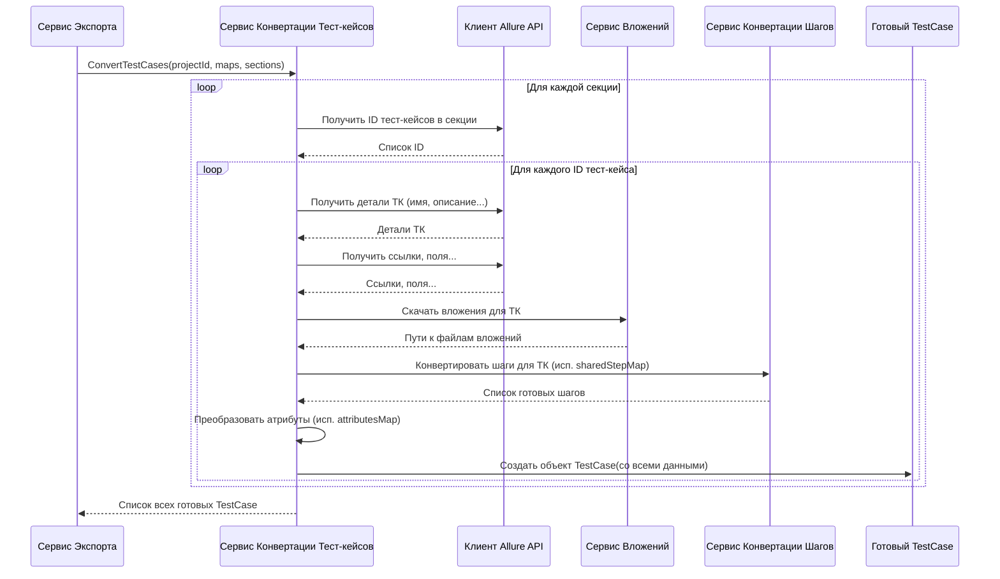

# Chapter 5: Сервис Конвертации Тест-кейсов


В [предыдущей главе (Сервис Записи Результатов)](04_сервис_записи_результатов_.md) мы узнали про "архивариуса" `AllureExporter` — `WriteService`, который аккуратно сохраняет итоговые данные в файлы. Но откуда берутся эти "итоговые данные"? [Клиент Allure API](03_клиент_allure_api_.md) предоставляет нам "сырые" данные в том виде, как их отдает Allure TestOps, а `WriteService` ожидает информацию в строго определенном формате (`TestCase`, `SharedStep` и т.д.).

Здесь нам нужен "сборщик" или "переводчик" данных. В этой главе мы познакомимся с **Сервисом Конвертации Тест-кейсов** (`TestCaseService`).

## Зачем нужен "Сборщик Пазлов" для Тест-кейсов?

Представьте, что информация о каждом тест-кейсе в Allure TestOps — это разобранный пазл. У нас есть отдельные кусочки:

*   Название тест-кейса
*   Его описание
*   Список шагов (иногда с вложенными шагами)
*   Предусловия и постусловия
*   Атрибуты (приоритет, статус, пользовательские поля)
*   Ссылки на задачи или другие ресурсы
*   Вложения (картинки, логи)
*   Информация о том, в какой папке (секции) он лежит

Эти "кусчоки" [Клиент Allure API](03_клиент_allure_api_.md) получает в виде разных структур данных из разных запросов к Allure API. Задача **Сервиса Конвертации Тест-кейсов** — взять все эти разрозненные детали для *каждого* тест-кейса и аккуратно собрать их в единую, структурированную "картинку" — объект `TestCase`.

Этот объект `TestCase` — это уже внутренний формат `AllureExporter`, который понимает [Сервис Записи Результатов](04_сервис_записи_результатов_.md). `TestCaseService` действует как мост между "сырыми" данными из Allure и готовым представлением тест-кейса для экспорта.

## Как Он Работает: От Деталей к Целому

`TestCaseService` не работает в одиночку. Он активно сотрудничает с другими сервисами, чтобы собрать полную картину:

1.  **Получение Основной Информации:** Он использует [Клиент Allure API](03_клиент_allure_api_.md) для получения базовой информации о тест-кейсе (имя, описание, статус и т.д.), его ссылок и пользовательских полей.
2.  **Скачивание Вложений:** Для каждого вложения он обращается к специальному сервису `AttachmentService` (который, в свою очередь, использует [Клиент Allure API](03_клиент_allure_api_.md) для скачивания и [Сервис Записи Результатов](04_сервис_записи_результатов_.md) для сохранения), чтобы получить файлы и информацию о том, где они сохранены.
3.  **Конвертация Шагов:** Сами шаги тест-кейса (действия, ожидаемые результаты) он просит преобразовать другой специализированный сервис — [Сервис Конвертации Шагов](07_сервис_конвертации_шагов_.md). Этот сервис также разбирается, является ли шаг ссылкой на [Общий Шаг](06_сервис_конвертации_общих_шагов_.md).
4.  **Обработка Атрибутов:** Он преобразует информацию о статусе, слое и пользовательских полях из Allure в формат атрибутов, понятный системе-приемнику.
5.  **Сборка:** Наконец, он собирает всю эту информацию (основные данные, пути к вложениям, преобразованные шаги, ссылки, атрибуты) в один объект `TestCase`.
6.  **Дополнительная Обработка:** Он может выполнять дополнительные действия, например, проверять имя тест-кейса на максимальную длину или изменять структуру секций на основе атрибутов (как "Feature" и "Story").

## Как Используется Сервис Конвертации Тест-кейсов?

Как и другие "внутренние" сервисы, `TestCaseService` используется главным "дирижером" — [Сервисом Экспорта](02_сервис_экспорта_.md). После того как `ExportService` получил информацию о проекте, секциях, атрибутах и общих шагах, он вызывает `TestCaseService`, чтобы тот преобразовал все тест-кейсы проекта.

```csharp
// Файл: Services/Implementations/ExportService.cs (фрагмент)

internal sealed class ExportService(
    /* ...другие сервисы... */
    ITestCaseService testCaseService // Сервис конвертации тест-кейсов
    /* ... */
    ) : IExportService
{
    public async Task ExportProject()
    {
        // ... Получаем ID проекта, секции, атрибуты, общие шаги ...
        var project = await client.GetProjectId();
        var section = await sectionService.ConvertSection(project.Id);
        var attributes = await attributeService.GetCustomAttributes(project.Id);
        var customAttributes = attributes.ToDictionary(k => k.Name, v => v.Id);
        var sharedSteps = await sharedStepService.ConvertSharedSteps(/* ... */);
        var sharedStepsMap = sharedSteps.ToDictionary(k => k.Key.ToString(), v => v.Value.Id);

        // Вызываем Сервис Конвертации Тест-кейсов!
        var testCases = await testCaseService.ConvertTestCases(
            project.Id,           // ID проекта
            sharedStepsMap,       // Карта общих шагов (чтобы связать шаги)
            customAttributes,     // Карта атрибутов (чтобы связать атрибуты)
            section               // Информация о секциях (чтобы поместить ТК в нужную папку)
        );

        // ... Затем передаем полученные testCases Сервису Записи ...
        foreach (var testCase in testCases)
        {
            // ... Дополнительная обработка (например, обрезка тегов) ...
            await writeService.WriteTestCase(testCase);
        }
        // ...
    }
}
```

[Сервис Экспорта](02_сервис_экспорта_.md) передает `TestCaseService` всю необходимую контекстную информацию (ID проекта, карты атрибутов и общих шагов, структуру секций), а в ответ получает готовый список объектов `TestCase`.

## Шаги Конвертации Одного Тест-кейса

Давайте посмотрим, что происходит внутри `TestCaseService`, когда он получает команду преобразовать тест-кейсы:

1.  **Перебор Секций:** Сервис получает структуру папок (`sectionInfo`) и для каждой папки (секции) запрашивает у [Клиента Allure API](03_клиент_allure_api_.md) список ID тест-кейсов, находящихся в ней.
2.  **Перебор Тест-кейсов:** Для каждого полученного ID тест-кейса выполняется его индивидуальная конвертация.
3.  **Запрос Данных:** С помощью [Клиента Allure API](03_клиент_allure_api_.md) запрашиваются все необходимые "сырые" данные для этого ID: основная информация, ссылки, связи, пользовательские поля.
4.  **Скачивание Вложений:** Вызывается `AttachmentService` для скачивания и сохранения всех вложений, связанных с этим тест-кейсом. Сервис получает обратно пути к сохраненным файлам.
5.  **Конвертация Шагов:** Вызывается [Сервис Конвертации Шагов](07_сервис_конвертации_шагов_.md), который получает "сырые" шаги от [Клиента Allure API](03_клиент_allure_api_.md) и преобразует их, учитывая возможные связи с общими шагами (используя `sharedStepMap`).
6.  **Преобразование Атрибутов:** Обрабатываются стандартные (статус, слой) и пользовательские атрибуты тест-кейса, преобразуясь в список `CaseAttribute` с использованием карты `attributes`.
7.  **Сборка `TestCase`:** Все полученные и преобразованные данные (имя, описание, шаги, предусловия, постусловия, атрибуты, ссылки, пути к вложениям) собираются в один объект `TestCase`. Генерируется уникальный ID (`Guid`) для этого тест-кейса в экспортируемых данных.
8.  **Дополнительная Логика:** Применяется логика обработки имени (обрезка `CutNameFeature`) и логика реструктуризации секций (`ProcessFeatureSection`), если она настроена.
9.  **Добавление в Список:** Готовый объект `TestCase` добавляется в общий список.
10. **Возврат Результата:** После обработки всех тест-кейсов во всех секциях, итоговый список `List<TestCase>` возвращается [Сервису Экспорта](02_сервис_экспорта_.md).

### Упрощенная Диаграмма Конвертации



## Заглянем в Код

**1. Контракт: Интерфейс `ITestCaseService`**

Интерфейс определяет главную функцию сервиса — преобразовывать тест-кейсы.

```csharp
// Файл: Services/ITestCaseService.cs
using AllureExporter.Models.Project;
using Models; // Используем общие модели (TestCase, SectionInfo и т.д.)

namespace AllureExporter.Services;

// Определяет, что должен уметь Сервис Конвертации Тест-кейсов
public interface ITestCaseService
{
    // Главный метод: принимает ID проекта и вспомогательные данные,
    // возвращает асинхронно список готовых объектов TestCase.
    Task<List<TestCase>> ConvertTestCases(
        long projectId,                      // Из какого проекта берем
        Dictionary<string, Guid> sharedStepMap, // Карта для связывания общих шагов
        Dictionary<string, Guid> attributes,   // Карта для связывания атрибутов
        SectionInfo sectionInfo              // Информация о структуре папок
    );
}
```

**2. Реализация: Класс `TestCaseService`**

Этот класс содержит реальный код для выполнения конвертации.

```csharp
// Файл: Services/Implementations/TestCaseService.cs (упрощенно)
using AllureExporter.Client;
using AllureExporter.Models.Config; // Для доступа к конфигурации (например, URL)
using AllureExporter.Models.Project;
using AllureExporter.Models.TestCase; // "Сырые" модели из Allure API
using Microsoft.Extensions.Logging;
using Microsoft.Extensions.Options;
using Models; // Финальные модели (TestCase, Step, Link и т.д.)

namespace AllureExporter.Services.Implementations;

internal sealed class TestCaseService : ITestCaseService
{
    private readonly ILogger<TestCaseService> _logger;
    private readonly IClient _client; // Нужен для получения данных из Allure
    private readonly IAttachmentService _attachmentService; // Для обработки вложений
    private readonly IStepService _stepService; // Для конвертации шагов
    private readonly IOptions<AppConfig> _config; // Для доступа к настройкам, если нужно

    // Конструктор: Сервис получает все необходимые ему инструменты (зависимости)
    public TestCaseService(
        ILogger<TestCaseService> logger,
        IClient client,
        IAttachmentService attachmentService,
        IStepService stepService,
        IOptions<AppConfig> config)
    {
        _logger = logger;
        _client = client;
        _attachmentService = attachmentService;
        _stepService = stepService;
        _config = config;
    }

    // Основной метод, реализующий интерфейс
    public async Task<List<TestCase>> ConvertTestCases(
        long projectId,
        Dictionary<string, Guid> sharedStepMap,
        Dictionary<string, Guid> attributes,
        SectionInfo sectionInfo)
    {
        _logger.LogInformation("Начинаем конвертацию тест-кейсов...");
        var sectionIdMap = sectionInfo.SectionDictionary; // Карта ID секций Allure -> Guid секций в экспорте
        var allTestCases = new List<TestCase>(); // Список для накопления результатов

        // 1. Перебираем все секции
        foreach (var section in sectionIdMap)
        {
            _logger.LogDebug("Обрабатываем секцию {SectionId}", section.Key);
            List<long> testCaseIdsInSection;

            // 2. Получаем ID тест-кейсов для текущей секции
            if (section.Key == Constants.MainSectionId) // Особый случай для корневой папки
                testCaseIdsInSection = await _client.GetTestCaseIdsFromMainSuite(projectId);
            else
                testCaseIdsInSection = await _client.GetTestCaseIdsFromSuite(projectId, section.Key);

            _logger.LogDebug("Найдено {Count} тест-кейсов в секции {SectionId}", testCaseIdsInSection.Count, section.Key);

            // 3. Перебираем ID тест-кейсов в этой секции
            foreach (var testCaseId in testCaseIdsInSection)
            {
                // 4. Вызываем внутренний метод для конвертации одного тест-кейса
                var convertedTestCase = await ConvertSingleTestCase(
                    projectId, testCaseId, sharedStepMap, section.Value, attributes
                );

                // 5. Применяем дополнительную логику (Feature/Story)
                ProcessFeatureSection(convertedTestCase, attributes, sectionInfo);

                allTestCases.Add(convertedTestCase); // Добавляем готовый ТК в общий список
            }
        }

        _logger.LogInformation("Конвертация тест-кейсов завершена. Сконвертировано: {Count}", allTestCases.Count);
        return allTestCases; // Возвращаем результат
    }

    // Внутренний метод для конвертации ОДНОГО тест-кейса (сильно упрощено)
    private async Task<TestCase> ConvertSingleTestCase(
        long projectId, long testCaseId, Dictionary<string, Guid> sharedStepMap,
        Guid sectionId, Dictionary<string, Guid> attributes)
    {
        _logger.LogDebug("Конвертируем тест-кейс с ID: {TestCaseId}", testCaseId);

        // Получаем "сырые" данные из Allure
        var allureTestCase = await _client.GetTestCaseById(testCaseId);
        var regularLinks = allureTestCase.Links; // Обычные ссылки
        var issueLinks = await _client.GetIssueLinks(testCaseId); // Ссылки на задачи
        var relations = await _client.GetRelations(testCaseId); // Связи с другими ТК

        // Генерируем уникальный ID для нашего внутреннего представления ТК
        var testCaseGuid = Guid.NewGuid();

        // Скачиваем вложения
        var tmsAttachments = await _attachmentService.DownloadAttachmentsforTestCase(testCaseId, testCaseGuid);

        // Конвертируем шаги (делегируем StepService)
        var steps = await _stepService.ConvertStepsForTestCase(testCaseId, sharedStepMap);

        // Конвертируем атрибуты (свой внутренний метод)
        var caseAttributes = await ConvertAttributes(testCaseId, allureTestCase, attributes);

        // Собираем все вместе в объект TestCase
        var resultTestCase = new TestCase
        {
            Id = testCaseGuid, // Наш новый Guid
            Name = allureTestCase.Name, // Имя из Allure
            Description = allureTestCase.Description, // Описание из Allure
            SectionId = sectionId, // Guid секции, в которой он был найден
            State = StateType.NotReady, // Устанавливаем статус по умолчанию
            Priority = PriorityType.Medium, // Приоритет по умолчанию
            Tags = allureTestCase.Tags.Select(t => t.Name).ToList(), // Теги

            // Конвертированные предусловия, постусловия, шаги
            PreconditionSteps = ConvertHtmlToSteps(allureTestCase.PreconditionHtml),
            PostconditionSteps = ConvertHtmlToSteps(allureTestCase.ExpectedResultHtml),
            Steps = steps,

            Attributes = caseAttributes, // Конвертированные атрибуты
            Links = ConvertAllureLinks(regularLinks, issueLinks, relations, projectId), // Собранные ссылки
            Attachments = tmsAttachments, // Пути к скачанным вложениям

            Iterations = new List<Iteration>() // Итерации (пока не поддерживаются)
        };

        // Обрезаем имя, если оно слишком длинное
        CutNameIfEnabled(resultTestCase);

        _logger.LogDebug("Тест-кейс {TestCaseId} сконвертирован: {@TestCase}", testCaseId, resultTestCase);
        return resultTestCase;
    }

    // ... другие приватные методы: ConvertHtmlToSteps, ConvertAllureLinks, ConvertAttributes, CutNameIfEnabled, ProcessFeatureSection ...
    // Они выполняют более мелкие задачи по преобразованию конкретных данных.
}
```

**Ключевые моменты:**

*   **Разделение Ответственности:** `TestCaseService` оркеструет процесс конвертации тест-кейсов, но делегирует специфические задачи (получение данных, скачивание вложений, конвертацию шагов) другим сервисам.
*   **Итеративный Подход:** Сервис проходит по всем секциям и всем тест-кейсам внутри них, чтобы обработать весь проект.
*   **Сборка `TestCase`:** Основная цель — собрать всю информацию из разных источников в единый объект `TestCase`.
*   **Карты (`sharedStepMap`, `attributes`, `sectionIdMap`):** Эти словари используются для корректной связи данных между собой (например, чтобы понять, какой `Guid` у общего шага с определенным ID из Allure).

## Заключение

В этой главе мы разобрались с **Сервисом Конвертации Тест-кейсов** (`TestCaseService`). Мы увидели, что он играет ключевую роль "сборщика пазлов":

*   Берет разрозненные "сырые" данные о тест-кейсе, полученные [Клиентом Allure API](03_клиент_allure_api_.md).
*   Использует другие сервисы (для вложений, шагов) для обработки специфических частей.
*   Собирает всю информацию в единую, структурированную модель `TestCase`.
*   Передает готовые `TestCase` [Сервису Экспорта](02_сервис_экспорта_.md) для последующей записи [Сервисом Записи Результатов](04_сервис_записи_результатов_.md).

Мы упомянули, что `TestCaseService` использует карты общих шагов и вызывает сервис для их конвертации. Но как именно обрабатываются сами общие шаги?

В следующей главе мы погрузимся в детали работы [Сервиса Конвертации Общих Шагов](06_сервис_конвертации_общих_шагов_.md) и узнаем, как `AllureExporter` работает с переиспользуемыми блоками шагов.

---

Generated by [AI Codebase Knowledge Builder](https://github.com/The-Pocket/Tutorial-Codebase-Knowledge)