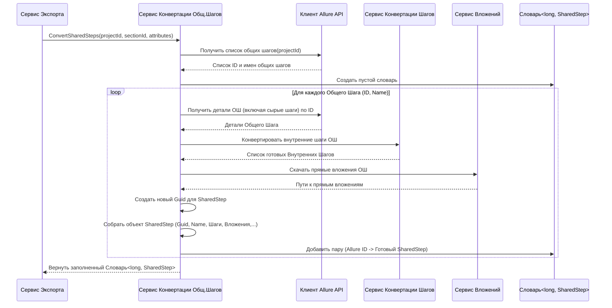

# Chapter 6: Сервис Конвертации Общих Шагов


В [предыдущей главе (Сервис Конвертации Тест-кейсов)](05_сервис_конвертации_тест_кейсов_.md) мы узнали, как `AllureExporter` превращает сырые данные о тест-кейсах из Allure TestOps в готовые объекты `TestCase`. Мы видели, что одним из важных элементов тест-кейса являются шаги. Иногда одни и те же последовательности шагов повторяются во многих тест-кейсах (например, "Войти в систему", "Открыть профиль пользователя"). В Allure для этого есть удобный механизм — "Общие шаги" (Shared Steps).

Но как `AllureExporter` обрабатывает эти переиспользуемые "строительные блоки"? Для этого существует специальный сервис, о котором мы и поговорим в этой главе: **Сервис Конвертации Общих Шагов** (`SharedStepService`).

## Зачем нужен "Библиотекарь" для Общих Шагов?

Представьте, что вы пишете множество инструкций (тест-кейсов). И во многих из них есть одинаковый блок действий, например, "Подготовить рабочее место": 1. Взять ручку, 2. Взять лист бумаги, 3. Сесть за стол. Чтобы не переписывать эти три шага каждый раз, вы можете вынести их в отдельную "карточку" с названием "Подготовка рабочего места" и просто ссылаться на эту карточку в своих инструкциях.

Общие шаги в Allure TestOps работают похожим образом. Это отдельные, именованные наборы шагов, которые можно вставлять в разные тест-кейсы.

**Сервис Конвертации Общих Шагов** (`SharedStepService`) работает как библиотекарь для этих "карточек":

1.  **Находит все карточки:** Он запрашивает у Allure список всех общих шагов, созданных в вашем проекте.
2.  **Читает содержимое карточки:** Для каждого общего шага он получает его название и, самое главное, список шагов внутри него.
3.  **Обрабатывает внутренние шаги:** Так как общие шаги содержат свои собственные шаги (которые тоже могут включать вложения или даже другие общие шаги!), `SharedStepService` просит помощи у других сервисов ([Сервис Конвертации Шагов](07_сервис_конвертации_шагов_.md), `AttachmentService`) для их корректной обработки.
4.  **Подготавливает для экспорта:** Он собирает всю информацию об общем шаге (его ID, имя, преобразованные шаги, вложения, атрибуты) в единый объект `SharedStep` — формат, понятный [Сервису Записи Результатов](04_сервис_записи_результатов_.md).

По сути, он делает работу, очень похожую на [Сервис Конвертации Тест-кейсов](05_сервис_конвертации_тест_кейсов_.md), но фокусируется не на полных сценариях, а на этих переиспользуемых "строительных блоках".

## Как Он Работает: От Ссылки к Блоку

`SharedStepService`, как и его "коллега" для тест-кейсов, не работает в вакууме. Он тесно сотрудничает с другими частями `AllureExporter`:

*   **Запрос Данных:** Использует [Клиент Allure API](03_клиент_allure_api_.md) чтобы получить список всех общих шагов проекта и детальную информацию по каждому из них (включая список "сырых" шагов внутри).
*   **Конвертация Внутренних Шагов:** Для преобразования шагов, *содержащихся внутри* общего шага, он обращается к [Сервису Конвертации Шагов](07_сервис_конвертации_шагов_.md). Это важно, потому что шаги внутри общего шага тоже могут иметь свои особенности.
*   **Обработка Вложений:** Если внутри общего шага есть вложения, он использует `AttachmentService` (сервис для работы с вложениями), чтобы скачать их и получить пути к сохраненным файлам.
*   **Сборка `SharedStep`:** Собрав всю информацию (ID, имя, готовые внутренние шаги, пути к вложениям, атрибуты), он формирует объект `SharedStep`.
*   **Возврат Карты:** В итоге он возвращает не просто список, а *словарь* (или *карту*), где ключом является оригинальный ID общего шага из Allure, а значением — созданный объект `SharedStep` с нашим новым внутренним ID (`Guid`). Это нужно [Сервису Экспорта](02_сервис_экспорта_.md) и [Сервису Конвертации Тест-кейсов](05_сервис_конвертации_тест_кейсов_.md), чтобы правильно связывать шаги тест-кейсов с соответствующими общими шагами.

## Как Используется Сервис Конвертации Общих Шагов?

Главный "дирижер" [Сервис Экспорта](02_сервис_экспорта_.md) использует `SharedStepService` на раннем этапе, *перед* тем как начать конвертацию тест-кейсов. Ему нужна карта общих шагов, чтобы потом передать ее [Сервису Конвертации Тест-кейсов](05_сервис_конвертации_тест_кейсов_.md), который, в свою очередь, передаст ее [Сервису Конвертации Шагов](07_сервис_конвертации_шагов_.md). Эта карта позволяет правильно заменять ссылки на общие шаги их реальными идентификаторами в экспортируемой системе.

Вот как это выглядит в коде `ExportService`:

```csharp
// Файл: Services/Implementations/ExportService.cs (фрагмент)

internal sealed class ExportService(
    /* ...другие сервисы... */
    ISharedStepService sharedStepService, // Сервис для общих шагов
    ITestCaseService testCaseService,
    /* ... */
    ) : IExportService
{
    public async Task ExportProject()
    {
        logger.LogInformation("Начинаем экспорт");

        // ... Получаем ID проекта, секции, атрибуты ...
        var project = await client.GetProjectId();
        var section = await sectionService.ConvertSection(project.Id);
        var attributes = await attributeService.GetCustomAttributes(project.Id);
        var customAttributes = attributes.ToDictionary(k => k.Name, v => v.Id);

        // Вызываем Сервис Конвертации Общих Шагов!
        // Передаем ID проекта, корневую секцию (куда их формально поместить) и атрибуты
        var sharedSteps = await sharedStepService.ConvertSharedSteps(
            project.Id,
            section.MainSection.Id, // Помещаем в корневую секцию
            attributes);

        // Создаем карту: ID из Allure -> наш Guid
        var sharedStepsMap = sharedSteps.ToDictionary(k => k.Key.ToString(), v => v.Value.Id);

        // Теперь вызываем конвертацию тест-кейсов, передавая ей карту общих шагов
        var testCases = await testCaseService.ConvertTestCases(
            project.Id,
            sharedStepsMap, // <--- Вот карта!
            customAttributes,
            section);

        // ... Затем записываем общие шаги и тест-кейсы ...
        foreach (var sharedStep in sharedSteps)
        {
            // ... Дополнительная обработка (например, тегов) ...
            await writeService.WriteSharedStep(sharedStep.Value);
        }
        // ...
    }
}
```

[Сервис Экспорта](02_сервис_экспорта_.md) получает от `SharedStepService` словарь `sharedSteps`, преобразует его в `sharedStepsMap` и использует эту карту для дальнейшей конвертации тест-кейсов и для записи самих общих шагов.

## Шаги Конвертации Общих Шагов: Под Капотом

Что происходит, когда `ExportService` вызывает `sharedStepService.ConvertSharedSteps`?

1.  **Запрос Списка:** `SharedStepService` просит [Клиент Allure API](03_клиент_allure_api_.md) дать ему список всех общих шагов для указанного `projectId`.
2.  **Перебор Общих Шагов:** Сервис начинает обрабатывать каждый общий шаг из полученного списка.
3.  **Запрос Деталей:** Для текущего общего шага он снова обращается к [Клиенту Allure API](03_клиент_allure_api_.md), чтобы получить детальную информацию, включая список его внутренних "сырых" шагов.
4.  **Конвертация Внутренних Шагов:** Он передает "сырые" внутренние шаги [Сервису Конвертации Шагов](07_сервис_конвертации_шагов_.md). Тот возвращает список уже готовых `Step` объектов (включая обработку вложений внутри этих шагов).
5.  **Скачивание Вложений (Общего Шага):** Он вызывает `AttachmentService`, чтобы скачать и сохранить вложения, которые могут быть прикреплены *непосредственно к* самому общему шагу (а не к его внутренним шагам).
6.  **Сборка `SharedStep`:** Генерируется новый уникальный ID (`Guid`). Затем вся полученная информация — имя, описание (если есть), список конвертированных внутренних шагов, пути к прямым вложениям, атрибуты (обычно используются стандартные или унаследованные) — собирается в объект `SharedStep`.
7.  **Добавление в Словарь:** Готовый объект `SharedStep` добавляется в словарь, где ключ — это оригинальный ID общего шага из Allure (`long`), а значение — наш созданный объект `SharedStep`.
8.  **Возврат Словаря:** После обработки всех общих шагов итоговый словарь `Dictionary<long, SharedStep>` возвращается [Сервису Экспорта](02_сервис_экспорта_.md).

### Упрощенная Диаграмма Конвертации



## Заглянем в Код

**1. Контракт: Интерфейс `ISharedStepService`**

Этот интерфейс лаконично описывает главную задачу сервиса.

```csharp
// Файл: Services/ISharedStepService.cs
using Models; // Используем общие модели (SharedStep, Attribute)
using Attribute = Models.Attribute; // Уточняем, что используем наш Attribute

namespace AllureExporter.Services;

// Определяет, что должен уметь Сервис Конвертации Общих Шагов
public interface ISharedStepService
{
    // Главный метод: принимает ID проекта, Guid секции (куда их поместить),
    // и список атрибутов (для применения по умолчанию).
    // Возвращает асинхронно словарь, связывающий ID Allure с нашими объектами SharedStep.
    Task<Dictionary<long, SharedStep>> ConvertSharedSteps(
        long projectId,
        Guid sectionId,
        List<Attribute> attributes
    );
}
```

Интерфейс говорит: "Этот сервис должен уметь преобразовывать общие шаги и возвращать их в виде словаря".

**2. Реализация: Класс `SharedStepService`**

Здесь находится код, выполняющий работу.

```csharp
// Файл: Services/Implementations/SharedStepService.cs (упрощенно)
using AllureExporter.Client; // Нужен для общения с Allure
using Microsoft.Extensions.Logging; // Для записи логов
using Models; // Общие модели (SharedStep, Step, StateType и т.д.)
using Attribute = Models.Attribute; // Наша модель атрибута

namespace AllureExporter.Services.Implementations;

internal class SharedStepService : ISharedStepService
{
    private readonly ILogger<SharedStepService> _logger;
    private readonly IClient _client; // Клиент Allure API
    private readonly IStepService _stepService; // Сервис для конвертации *внутренних* шагов
    private readonly IAttachmentService _attachmentService; // Сервис для вложений

    // Конструктор: Сервис получает необходимые инструменты
    public SharedStepService(
        ILogger<SharedStepService> logger,
        IClient client,
        IStepService stepService,
        IAttachmentService attachmentService)
    {
        _logger = logger;
        _client = client;
        _stepService = stepService;
        _attachmentService = attachmentService;
    }

    // Реализация метода из интерфейса
    public async Task<Dictionary<long, SharedStep>> ConvertSharedSteps(
        long projectId,
        Guid sectionId, // Куда формально помещаем общие шаги
        List<Attribute> attributes) // Атрибуты для применения
    {
        _logger.LogInformation("Начинаем конвертацию общих шагов...");

        // 1. Получаем список всех общих шагов из Allure
        var allureSharedSteps = await _client.GetSharedStepsByProjectId(projectId);
        _logger.LogDebug("Найдено {Count} общих шагов.", allureSharedSteps.Count);

        var tmsSharedSteps = new Dictionary<long, SharedStep>(); // Словарь для результатов

        // 2. Перебираем каждый полученный общий шаг
        foreach (var allureSharedStep in allureSharedSteps)
        {
            _logger.LogDebug("Обрабатываем общий шаг ID: {SharedStepId}, Имя: {Name}",
                allureSharedStep.Id, allureSharedStep.Name);

            // 3. Получаем "сырые" внутренние шаги (В реальном коде это может быть часть allureSharedStep
            // или отдельный вызов, как GetStepsInfoBySharedStepId)
            // var allureStepsInfo = await _client.GetStepsInfoBySharedStepId(allureSharedStep.Id);

            // 4. Конвертируем внутренние шаги с помощью StepService
            // Передаем ID общего шага, чтобы StepService мог получить его шаги
            var convertedInternalSteps = await _stepService.ConvertStepsForSharedStep(allureSharedStep.Id);
            _logger.LogDebug("Сконвертировано {Count} внутренних шагов.", convertedInternalSteps.Count);

            // 5. Генерируем наш ID и скачиваем прямые вложения
            var sharedStepGuid = Guid.NewGuid();
            var tmsAttachments = await _attachmentService.DownloadAttachmentsforSharedStep(
                allureSharedStep.Id,
                sharedStepGuid); // Скачиваем в папку с нашим новым Guid

             // Подготовка атрибутов (упрощено: применяем все переданные атрибуты с пустым значением)
            var caseAttributes = attributes.Select(a =>
                new CaseAttribute { Id = a.Id, Value = string.Empty }).ToList();

            // 6. Собираем объект SharedStep
            var tmsSharedStep = new SharedStep
            {
                Id = sharedStepGuid, // Наш новый Guid
                Name = allureSharedStep.Name, // Имя из Allure
                Description = string.Empty, // Описание (если есть, брать из Allure)
                Steps = convertedInternalSteps, // Конвертированные внутренние шаги
                SectionId = sectionId, // Формальная секция для размещения
                State = StateType.NotReady, // Статус по умолчанию
                Priority = PriorityType.Medium, // Приоритет по умолчанию
                Attributes = caseAttributes, // Примененные атрибуты
                Links = new List<Link>(), // Ссылки (если поддерживаются для ОШ)
                Tags = new List<string>(), // Теги (если есть, брать из Allure)
                Attachments = tmsAttachments // Прямые вложения
            };

            _logger.LogDebug("Сконвертированный общий шаг: {@SharedStep}", tmsSharedStep);

            // 7. Добавляем в словарь
            tmsSharedSteps.Add(allureSharedStep.Id, tmsSharedStep);
        }

        _logger.LogInformation("Конвертация общих шагов завершена.");
        // 8. Возвращаем словарь
        return tmsSharedSteps;
    }
}
```

**Основные моменты в коде:**

*   **Получение Зависимостей:** Сервис получает `IClient`, `IStepService`, `IAttachmentService` через конструктор (это называется Внедрение Зависимостей — Dependency Injection).
*   **Цикл Обработки:** Код проходит по всем общим шагам, полученным от клиента.
*   **Делегирование:** Сложные задачи конвертации внутренних шагов (`_stepService.ConvertStepsForSharedStep`) и скачивания вложений (`_attachmentService.DownloadAttachmentsforSharedStep`) передаются другим сервисам.
*   **Сборка `SharedStep`:** Создается финальный объект `SharedStep` с новым `Guid`, собранными данными и связями.
*   **Создание Словаря:** Результат собирается в `Dictionary<long, SharedStep>`, чтобы связать старые ID с новыми объектами.

## Заключение

В этой главе мы рассмотрели **Сервис Конвертации Общих Шагов** (`SharedStepService`). Мы узнали, что он отвечает за обработку переиспользуемых блоков шагов из Allure TestOps:

*   Находит все общие шаги в проекте с помощью [Клиента Allure API](03_клиент_allure_api_.md).
*   Для каждого общего шага конвертирует его внутренние шаги (используя [Сервис Конвертации Шагов](07_сервис_конвертации_шагов_.md)) и обрабатывает вложения.
*   Собирает все в единый объект `SharedStep`.
*   Возвращает результат в виде словаря, который используется другими частями `AllureExporter` для связывания данных.

Мы уже несколько раз упомянули [Сервис Конвертации Шагов](07_сервис_конвертации_шагов_.md), который помогает обрабатывать шаги как внутри тест-кейсов, так и внутри общих шагов. Как же он работает? Как он понимает, является ли шаг обычным или ссылкой на общий шаг?

Об этом мы подробно поговорим в следующей, заключительной главе нашего погружения в сервисы `AllureExporter`: [Сервис Конвертации Шагов](07_сервис_конвертации_шагов_.md).

---

Generated by [AI Codebase Knowledge Builder](https://github.com/The-Pocket/Tutorial-Codebase-Knowledge)