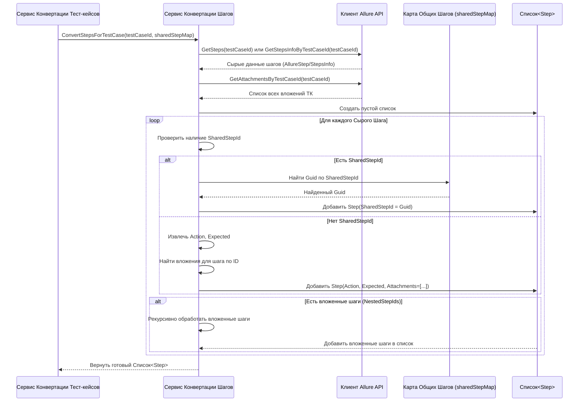

# Chapter 7: Сервис Конвертации Шагов


В [предыдущей главе (Сервис Конвертации Общих Шагов)](06_сервис_конвертации_общих_шагов_.md) мы узнали, как `AllureExporter` обрабатывает переиспользуемые блоки — общие шаги. Мы видели, что и [Сервис Конвертации Тест-кейсов](05_сервис_конвертации_тест_кейсов_.md), и [Сервис Конвертации Общих Шагов](06_сервис_конвертации_общих_шагов_.md) полагаются на своего рода "помощника" для обработки самых мелких деталей — отдельных шагов внутри тест-кейсов или общих шагов.

Пришло время познакомиться с этим "помощником" — **Сервисом Конвертации Шагов** (`StepService`).

## Зачем Нужен "Переводчик Инструкций"?

Представьте, что тест-кейс или общий шаг — это рецепт. В нем есть список действий: "Нарезать лук", "Обжарить на сковороде", "Добавить специи". Каждое такое действие — это шаг. Иногда шаг может содержать не только действие, но и ожидаемый результат ("Лук должен стать золотистым"), а также прикрепленные файлы (фотография нарезанного лука). Кроме того, иногда вместо конкретного действия мы можем сослаться на другой, стандартный мини-рецепт (общий шаг), например, "Приготовить соус Бешамель (см. рецепт №5)".

Данные о шагах, которые мы получаем из Allure TestOps через [Клиента Allure API](03_клиент_allure_api_.md), похожи на такой рецепт, но написанный на "языке Allure". Нам же нужно представить эти шаги в едином формате `Step`, который использует `AllureExporter` для сохранения.

**Сервис Конвертации Шагов** (`StepService`) — это наш детальный переводчик и редактор инструкций. Он берет каждый отдельный шаг из Allure и тщательно "переводит" его в формат `Step`, делая следующее:

1.  **Извлекает Действие:** Берет текст, описывающий, что нужно сделать.
2.  **Извлекает Ожидаемый Результат:** Находит текст, описывающий, что должно получиться.
3.  **Обрабатывает Вложения:** Находит ссылки на прикрепленные файлы (картинки, логи) и подготавливает информацию о них для финального объекта `Step`. Фактическую загрузку обычно координирует сервис уровнем выше (как [Сервис Конвертации Тест-кейсов](05_сервис_конвертации_тест_кейсов_.md)) через `AttachmentService`.
4.  **Распознает Ссылки на Общие Шаги:** Если шаг в Allure на самом деле является ссылкой на [Общий Шаг](06_сервис_конвертации_общих_шагов_.md), `StepService` распознает это и вместо текста действия вставляет специальную ссылку (ID) на уже преобразованный общий шаг.

Без этого сервиса наши "рецепты" (тест-кейсы и общие шаги) были бы неполными или некорректными, так как самые важные детали — сами инструкции — не были бы правильно переведены и оформлены.

## Как Используется Сервис Конвертации Шагов?

Этот сервис — внутренний работник. Вы не будете вызывать его напрямую. Его используют другие сервисы конвертации:

*   [Сервис Конвертации Тест-кейсов](05_сервис_конвертации_тест_кейсов_.md): Когда он обрабатывает тест-кейс, он просит `StepService` преобразовать все шаги этого тест-кейса.
*   [Сервис Конвертации Общих Шагов](06_сервис_конвертации_общих_шагов_.md): Когда он обрабатывает общий шаг, он просит `StepService` преобразовать шаги *внутри* этого общего шага.

Вот как выглядит вызов `StepService` внутри `TestCaseService` (упрощенно):

```csharp
// Файл: Services/Implementations/TestCaseService.cs (фрагмент)

internal sealed class TestCaseService : ITestCaseService
{
    // ... другие сервисы ...
    private readonly IStepService _stepService; // Сервис для конвертации шагов

    public TestCaseService(/*...*/ IStepService stepService, /*...*/)
    {
        // ...
        _stepService = stepService;
        // ...
    }

    private async Task<TestCase> ConvertTestCase(
        long projectId, long testCaseId, Dictionary<string, Guid> sharedStepMap, /*...*/)
    {
        // ... получаем данные тест-кейса ...

        // Вызываем StepService для конвертации шагов ТЕСТ-КЕЙСА
        // Передаем ID тест-кейса и карту общих шагов
        var steps = await _stepService.ConvertStepsForTestCase(testCaseId, sharedStepMap);

        // ... собираем объект TestCase, используя полученные steps ...
        var allureTestCase = new TestCase
        {
            // ...
            Steps = steps, // <--- Используем результат работы StepService
            // ...
        };

        return allureTestCase;
    }
    // ...
}
```

А вот похожий вызов внутри `SharedStepService`:

```csharp
// Файл: Services/Implementations/SharedStepService.cs (фрагмент)

internal class SharedStepService : ISharedStepService
{
    // ... другие сервисы ...
    private readonly IStepService _stepService; // Сервис для конвертации шагов

    public SharedStepService(/*...*/ IStepService stepService, /*...*/)
    {
        // ...
        _stepService = stepService;
        // ...
    }

    public async Task<Dictionary<long, SharedStep>> ConvertSharedSteps(
        long projectId, Guid sectionId, /*...*/)
    {
        // ... получаем список общих шагов ...
        var tmsSharedSteps = new Dictionary<long, SharedStep>();

        foreach (var sharedStep in allureSharedSteps)
        {
            // ... получаем детали общего шага ...

            // Вызываем StepService для конвертации шагов ВНУТРИ ОБЩЕГО ШАГА
            // Передаем ID общего шага (карта общих шагов здесь не нужна,
            // т.к. вложенные общие шаги обычно не поддерживаются или обрабатываются иначе)
            var convertedInternalSteps = await _stepService.ConvertStepsForSharedStep(sharedStep.Id);

            // ... собираем объект SharedStep, используя convertedInternalSteps ...
            var step = new SharedStep
            {
                // ...
                Steps = convertedInternalSteps, // <--- Результат StepService
                // ...
            };
            tmsSharedSteps.Add(sharedStep.Id, step);
        }
        return tmsSharedSteps;
    }
}

```

В обоих случаях сервис-родитель просто передает ID сущности (тест-кейса или общего шага) и, если нужно, карту общих шагов, а `StepService` возвращает готовый список объектов `Step`.

## Что Происходит Под Капотом: Конвертация Шагов

Давайте проследим за работой `StepService`, когда его просят сконвертировать шаги для тест-кейса:

1.  **Запрос "Сырых" Шагов:** `StepService` обращается к [Клиенту Allure API](03_клиент_allure_api_.md), чтобы получить список "сырых" данных о шагах для данного тест-кейса (используя `testCaseId`). Allure может вернуть шаги в разных форматах, иногда это простой список, иногда — древовидная структура (`StepsInfo`).
2.  **Запрос Вложений:** Сервис также может запросить у клиента список всех вложений, прикрепленных к этому тест-кейсу/общему шагу, чтобы потом сопоставить их с конкретными шагами.
3.  **Перебор Шагов:** Сервис начинает итерацию по полученным "сырым" шагам.
4.  **Проверка на Общий Шаг:** Для каждого шага он проверяет, есть ли у него поле `SharedStepId`.
    *   **Если Да (Это ссылка):** Он берет этот ID, находит соответствующий ему `Guid` в переданной карте `sharedStepMap` и создает объект `Step`, где поле `SharedStepId` заполнено этим `Guid`, а поля `Action` и `Expected` остаются пустыми.
    *   **Если Нет (Это обычный шаг):**
        *   Он извлекает текст действия (`Action`, в Allure это может быть поле `Name`, `Keyword` или `Body`).
        *   Он извлекает текст ожидаемого результата (`Expected`, может быть поле `ExpectedResult` или извлекаться из вложенных шагов со специальным именем вроде "Expected Result").
        *   Он находит вложения, относящиеся именно к этому шагу (по их ID) и добавляет их *имена* в списки `ActionAttachments`, `ExpectedAttachments` или `TestDataAttachments`. (Сами файлы уже скачаны или будут скачаны сервисом уровнем выше).
        *   Он создает объект `Step` с заполненными полями `Action`, `Expected`, списками имен вложений и пустым `SharedStepId`.
5.  **Обработка Вложенности:** Если Allure вернул древовидную структуру шагов (`StepsInfo`), сервис рекурсивно обходит это дерево, сохраняя правильный порядок и иерархию шагов.
6.  **Сборка Списка:** Готовые объекты `Step` добавляются в список.
7.  **Возврат Результата:** После обработки всех шагов итоговый `List<Step>` возвращается вызвавшему сервису ([Сервису Конвертации Тест-кейсов](05_сервис_конвертации_тест_кейсов_.md) или [Сервису Конвертации Общих Шагов](06_сервис_конвертации_общих_шагов_.md)).

### Упрощенная Диаграмма Конвертации (для тест-кейса)



## Заглянем в Код

**1. Контракт: Интерфейс `IStepService`**

Интерфейс очень прост и описывает две основные функции сервиса.

```csharp
// Файл: Services/IStepService.cs
using Models; // Используем нашу финальную модель Step

namespace AllureExporter.Services;

// Определяет, что должен уметь Сервис Конвертации Шагов
public interface IStepService
{
    // Конвертировать шаги для тест-кейса
    // Принимает ID тест-кейса и карту для разрешения ссылок на общие шаги
    Task<List<Step>> ConvertStepsForTestCase(long testCaseId, Dictionary<string, Guid> sharedStepMap);

    // Конвертировать шаги для общего шага
    // Принимает ID общего шага (карта не нужна, т.к. вложенность ОШ обычно не обрабатывается)
    Task<List<Step>> ConvertStepsForSharedStep(long sharedStepId);
}
```

**2. Реализация: Класс `StepService`**

Этот класс содержит логику для выполнения конвертации. Код здесь может быть довольно сложным из-за разных форматов представления шагов в Allure API и необходимости обработки вложенности. Мы посмотрим на упрощенные фрагменты.

```csharp
// Файл: Services/Implementations/StepService.cs (упрощенно)
using AllureExporter.Client; // Для получения данных из Allure
using AllureExporter.Models.Step; // Модели "сырых" шагов из Allure
using Microsoft.Extensions.Logging; // Для логгирования
using Models; // Наша финальная модель Step
// Другие используемые пространства имен

namespace AllureExporter.Services.Implementations;

internal class StepService : IStepService
{
    private readonly ILogger<StepService> _logger;
    private readonly IClient _client; // Клиент для запросов к Allure API

    public StepService(ILogger<StepService> logger, IClient client)
    {
        _logger = logger;
        _client = client;
    }

    // Метод для конвертации шагов тест-кейса
    public async Task<List<Step>> ConvertStepsForTestCase(long testCaseId, Dictionary<string, Guid> sharedStepMap)
    {
        _logger.LogDebug("Конвертируем шаги для тест-кейса ID: {TestCaseId}", testCaseId);

        // Получаем "сырую" информацию о шагах (может быть сложная структура StepsInfo)
        var stepsInfo = await _client.GetStepsInfoByTestCaseId(testCaseId);
        // Получаем общий список вложений для этого тест-кейса
        var commonAttachments = await _client.GetAttachmentsByTestCaseId(testCaseId);

        // Вызываем рекурсивный метод для обработки древовидной структуры шагов
        return ConvertStepsFromStepsInfo(
            stepsInfo.Root!.NestedStepIds, // Начинаем с корневых шагов
            stepsInfo,                     // Вся структура данных
            commonAttachments,             // Общий список вложений
            sharedStepMap                  // Карта общих шагов
        );
    }

    // Метод для конвертации шагов общего шага (очень похож)
    public async Task<List<Step>> ConvertStepsForSharedStep(long sharedStepId)
    {
        _logger.LogDebug("Конвертируем шаги для общего шага ID: {SharedStepId}", sharedStepId);

        var stepsInfo = await _client.GetStepsInfoBySharedStepId(sharedStepId);
        var commonAttachments = await _client.GetAttachmentsBySharedStepId(sharedStepId);

        // Вызываем другой рекурсивный метод (или тот же с флагом), т.к. карта sharedStepMap не нужна
        return ConvertStepsFromSharedStepsInfo(
             stepsInfo.Root!.NestedStepIds,
             stepsInfo,
             commonAttachments
         );
    }

    // Рекурсивный метод для обхода дерева шагов (сильно упрощено)
    // Этот метод вызывается для каждого уровня вложенности
    private List<Step> ConvertStepsFromStepsInfo(
        List<long> nestedStepIds, // ID шагов на текущем уровне
        AllureStepsInfo stepsInfo, // Все данные о шагах ТК
        List<AllureAttachment> commonAttachments, // Все вложения ТК
        Dictionary<string, Guid> sharedStepMap) // Карта ОШ
    {
        var steps = new List<Step>();

        foreach (var stepId in nestedStepIds)
        {
            // Получаем детали текущего шага из общей структуры
            var allureStep = stepsInfo.ScenarioStepsDictionary[stepId.ToString()];

            Step currentStep;

            // Проверяем, является ли шаг ссылкой на общий шаг
            if (allureStep.SharedStepId != null)
            {
                // Да, это ссылка. Создаем Step со ссылкой на Guid общего шага
                currentStep = new Step
                {
                    Action = string.Empty, // Действие пустое
                    Expected = string.Empty, // Результат пустой
                    SharedStepId = sharedStepMap[allureStep.SharedStepId.ToString()!], // Указываем Guid ОШ
                    ActionAttachments = new List<string>(),
                    ExpectedAttachments = new List<string>(),
                    TestDataAttachments = new List<string>()
                };
                _logger.LogTrace("Шаг {StepId} является ссылкой на общий шаг {SharedStepId}", stepId, allureStep.SharedStepId);
            }
            else
            {
                // Нет, это обычный шаг.
                // (Логика извлечения Action, Expected и Attachments здесь упрощена)
                var actionText = allureStep.Body ?? string.Empty; // Пример извлечения действия
                var expectedText = allureStep.ExpectedResult ?? string.Empty; // Пример извлечения результата

                // Находим вложения для этого шага
                var actionAttachments = FindAttachmentNames(allureStep.AttachmentId, stepsInfo.AttachmentsDictionary, commonAttachments);
                // (Нужна более сложная логика для Expected вложений 'FillExpectedAttachments')

                currentStep = new Step
                {
                    Action = actionText,
                    Expected = expectedText,
                    ActionAttachments = actionAttachments,
                    ExpectedAttachments = new List<string>(), // Заполняется отдельно
                    TestDataAttachments = new List<string>(),
                    SharedStepId = null // Это не ссылка на ОШ
                };
                _logger.LogTrace("Шаг {StepId} сконвертирован: Action='{Action}', Expected='{Expected}'", stepId, actionText, expectedText);
            }

            steps.Add(currentStep); // Добавляем созданный шаг в список

            // Если у текущего шага есть свои вложенные шаги, рекурсивно вызываем этот же метод
            if (allureStep.NestedStepIds != null && allureStep.NestedStepIds.Any())
            {
                _logger.LogTrace("У шага {StepId} есть {Count} вложенных шагов, обрабатываем...", stepId, allureStep.NestedStepIds.Count);
                var nestedSteps = ConvertStepsFromStepsInfo(
                    allureStep.NestedStepIds, stepsInfo, commonAttachments, sharedStepMap);
                steps.AddRange(nestedSteps); // Добавляем результат рекурсивного вызова
            }
        }

        return steps; // Возвращаем список шагов для текущего уровня
    }
    // ... Метод ConvertStepsFromSharedStepsInfo похож, но не использует sharedStepMap ...
    // ... Вспомогательные методы типа FindAttachmentNames, FillExpectedResult, FillExpectedAttachments ...
}
```

**Ключевые моменты в коде:**

*   **Два Пути Конвертации:** Разные методы (`ConvertStepsForTestCase`, `ConvertStepsForSharedStep`) вызываются в зависимости от того, что мы обрабатываем, так как обработка ссылок на общие шаги нужна только для тест-кейсов.
*   **Получение Данных:** Всегда начинается с запроса "сырых" данных о шагах и вложениях через `_client`.
*   **Рекурсия:** Для обработки вложенных шагов часто используется рекурсивный подход (`ConvertStepsFromStepsInfo`), который вызывает сам себя для обработки дочерних уровней.
*   **Проверка `SharedStepId`:** Ключевая логика для различения обычных шагов и ссылок на общие шаги.
*   **Сборка `Step`:** Финальный объект `Step` собирается по-разному в зависимости от того, ссылка это или обычный шаг.
*   **Обработка Вложений:** Требует сопоставления ID вложений шага с общим списком вложений сущности и сохранения имен файлов.

## Заключение

В этой главе мы подробно рассмотрели **Сервис Конвертации Шагов** (`StepService`), который отвечает за самую детальную работу по преобразованию инструкций из Allure TestOps:

*   Он обрабатывает каждый шаг внутри тест-кейсов и общих шагов.
*   Извлекает текст действия (`Action`) и ожидаемого результата (`Expected`).
*   Находит и связывает имена вложений с шагами.
*   Распознает ссылки на [Общие Шаги](06_сервис_конвертации_общих_шагов_.md) и корректно проставляет их ID в финальном объекте `Step`.
*   Используется другими сервисами конвертации ([Сервис Конвертации Тест-кейсов](05_сервис_конвертации_тест_кейсов_.md), [Сервис Конвертации Общих Шагов](06_сервис_конвертации_общих_шагов_.md)) для получения готовых списков шагов.

На этом мы завершаем наше путешествие по основным сервисам `AllureExporter`. Мы начали с [Конфигурации Приложения](01_конфигурация_приложения_.md), познакомились с главным "дирижером" [Сервисом Экспорта](02_сервис_экспорта_.md), узнали, как [Клиент Allure API](03_клиент_allure_api_.md) получает данные, как [Сервис Записи Результатов](04_сервис_записи_результатов_.md) их сохраняет, и подробно разобрали, как сервисы конвертации ([Тест-кейсов](05_сервис_конвертации_тест_кейсов_.md), [Общих Шагов](06_сервис_конвертации_общих_шагов_.md) и [Шагов](07_сервис_конвертации_шагов_.md)) преобразуют данные в нужный формат.

Теперь у вас есть представление о том, как устроен `AllureExporter` "под капотом" и как различные компоненты взаимодействуют друг с другом для выполнения задачи экспорта ваших тест-кейсов из Allure TestOps!

---

Generated by [AI Codebase Knowledge Builder](https://github.com/The-Pocket/Tutorial-Codebase-Knowledge)