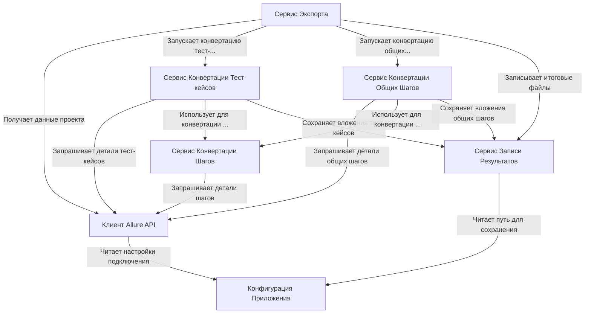

# Tutorial: AllureExporter

**AllureExporter** - это инструмент для *выгрузки* (экспорта) ваших тест-кейсов из системы **Allure TestOps**.
Он подключается к Allure по API, забирает оттуда информацию о проекте, тест-кейсах, шагах и вложениях.
Затем он преобразует эти данные в *специальный формат* (файлы JSON) и сохраняет их на ваш компьютер.
Эти файлы можно использовать для переноса (импорта) тест-кейсов в другую систему, например, Test IT.

**Source Repository:** [None](None)

## Chapters

1. [Конфигурация Приложения
](01_конфигурация_приложения_.md)
2. [Сервис Экспорта
](02_сервис_экспорта_.md)
3. [Клиент Allure API
](03_клиент_allure_api_.md)
4. [Сервис Записи Результатов
](04_сервис_записи_результатов_.md)
5. [Сервис Конвертации Тест-кейсов
](05_сервис_конвертации_тест_кейсов_.md)
6. [Сервис Конвертации Общих Шагов
](06_сервис_конвертации_общих_шагов_.md)
7. [Сервис Конвертации Шагов
](07_сервис_конвертации_шагов_.md)

---

Generated by [AI Codebase Knowledge Builder](https://github.com/The-Pocket/Tutorial-Codebase-Knowledge)