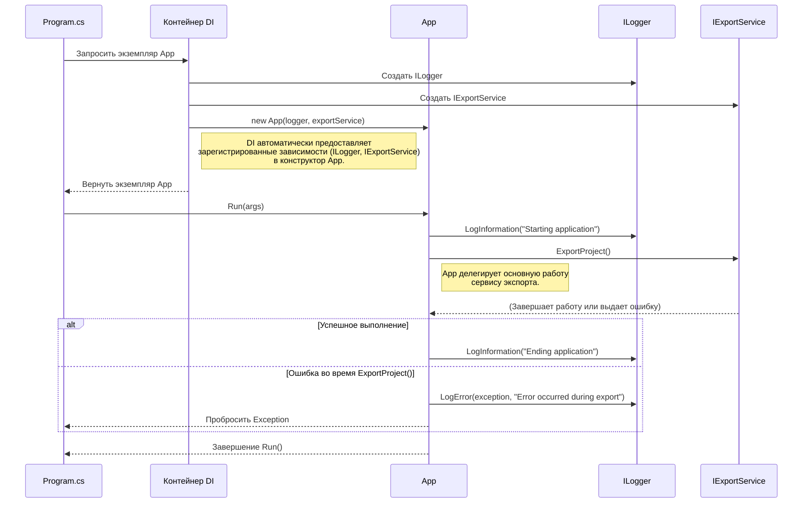

# Chapter 1: Приложение (App)


Добро пожаловать в руководство по `AzureExporter`! В этой первой главе мы познакомимся с самым главным «дирижером» нашего приложения — классом `App`.

Представьте, что вы собрали сложный механизм (наше приложение для экспорта данных), состоящий из множества деталей (сервисов). Все готово к работе, все настроено. Но как запустить весь этот механизм? Нужна главная кнопка "Старт". В нашем проекте `AzureExporter` роль этой кнопки выполняет класс `App`.

**Зачем нужен `App`?**

После того как вся подготовительная работа сделана в файле `Program.cs` (настройка конфигурации, регистрация различных вспомогательных сервисов, настройка логирования), нам нужно место, которое возьмет эти готовые инструменты и запустит основной процесс — экспорт данных из Azure DevOps. Класс `App` как раз для этого и предназначен. Он является точкой входа в основную логику приложения.

**Ключевые Идеи**

1.  **Точка входа:** `App` содержит метод `Run`, который запускается из `Program.cs` после всей начальной настройки. Это как поворот ключа в замке зажигания автомобиля.
2.  **Получение зависимостей:** `App` не создает нужные ему сервисы сам. Он получает их "готовыми" при своем создании. Например, ему нужен сервис для выполнения экспорта ([Сервис Экспорта](02_сервис_экспорта_.md)). Этот сервис ему передается автоматически благодаря механизму *Внедрения Зависимостей (Dependency Injection)*, настроенному в `Program.cs`. Это делает код более гибким и тестируемым.
3.  **Оркестрация:** Основная задача `App` — вызвать главный метод экспорта из полученного сервиса, а также записать в лог сообщения о начале и завершении работы и обработать любые неожиданные ошибки, которые могут возникнуть во время процесса.

**Как это работает (Взгляд со стороны `Program.cs`)**

Обычно вам не придется напрямую изменять код `App.cs`. Важно понимать, как он запускается. Давайте посмотрим на ключевые моменты в файле `Program.cs`:

1.  **Регистрация `App`:**
    ```csharp
    // Фрагмент из Program.cs
    .ConfigureServices((_, services) =>
    {
        // ... регистрация других сервисов ...
        services.AddSingleton<App>(); // Сообщаем приложению, как создавать App
        services.AddSingleton<IExportService, ExportService>(); // Регистрируем сервис экспорта
        // ... и другие сервисы ...
    });
    ```
    Эта строчка `services.AddSingleton<App>();` говорит системе Dependency Injection: "Если кому-то понадобится `App`, создай один экземпляр и используй его". `AddSingleton` означает, что будет создан только один экземпляр `App` на всё время работы приложения. То же самое происходит и для `IExportService`.

2.  **Запуск `App`:**
    ```csharp
    // Фрагмент из Program.cs
    static void Main(string[] args)
    {
        // ... настройка хоста ...
        using var host = CreateHostBuilder(args).Build();
        using var scope = host.Services.CreateScope();

        var services = scope.ServiceProvider;

        try
        {
            // Получаем готовый экземпляр App и вызываем его метод Run
            services.GetRequiredService<App>().Run(args);
        }
        catch (Exception e)
        {
            Console.WriteLine(e.Message); // Выводим сообщение об ошибке, если что-то пошло не так
        }
    }
    ```
    Здесь `services.GetRequiredService<App>()` запрашивает у системы тот самый единственный экземпляр `App`. Система автоматически создает его, передавая ему все необходимые зависимости (например, логгер и `IExportService`, которые мы зарегистрировали ранее). Сразу после получения экземпляра вызывается его метод `.Run(args)`, который и запускает основной процесс.

**Заглянем под капот: Внутренняя реализация `App`**

Давайте разберемся, что происходит внутри самого `App`, когда вызывается его метод `Run`.

**Шаг за шагом (без кода):**

1.  `Program.cs` вызывает метод `Run` у экземпляра `App`.
2.  `App.Run` записывает в лог сообщение "Starting application" (Начинаем работу приложения).
3.  `App.Run` обращается к сервису экспорта (`_service`), который был ему передан при создании, и вызывает у него метод `ExportProject()`. Этот метод выполняет всю основную работу по экспорту данных (подробнее об этом в главе [Сервис Экспорта](02_сервис_экспорта_.md)).
4.  `App.Run` ожидает (`Wait()`), пока метод `ExportProject()` завершит свою работу.
5.  **Если во время экспорта произошла ошибка:** `App.Run` перехватывает эту ошибку (`catch`), записывает детальную информацию об ошибке в лог (включая сообщение "Error occurred during export") и "пробрасывает" ошибку дальше (чтобы `Program.cs` мог ее поймать и вывести сообщение пользователю).
6.  **Если экспорт прошел успешно:** `App.Run` записывает в лог сообщение "Ending application" (Завершаем работу приложения).

**Диаграмма взаимодействия:**



**Разбор кода `App.cs`:**

```csharp
// --- Файл: App.cs ---
using AzureExporter.Services; // Подключаем пространство имен для IExportService
using Microsoft.Extensions.Logging; // Подключаем пространство имен для ILogger

namespace AzureExporter;

public class App
{
    // Приватные поля для хранения зависимостей
    private readonly ILogger<App> _logger; // Сервис для записи логов
    private readonly IExportService _service; // Сервис для выполнения экспорта

    // Конструктор: Сюда DI-контейнер передает нужные сервисы
    public App(ILogger<App> logger, IExportService service)
    {
        _logger = logger; // Сохраняем логгер
        _service = service; // Сохраняем сервис экспорта
    }

    // Основной метод, запускающий логику приложения
    public void Run(string[] args)
    {
        _logger.LogInformation("Starting application"); // Лог: Начало работы

        try
        {
            // Вызываем главный метод сервиса экспорта и ждем его завершения
            _service.ExportProject().Wait();
            // Wait() используется, т.к. ExportProject может быть асинхронным
        }
        catch (Exception e) // Ловим любые ошибки во время экспорта
        {
            _logger.LogError(e, "Error occurred during export"); // Лог: Ошибка
            throw; // Пробрасываем ошибку дальше, чтобы ее могли обработать выше (в Program.cs)
        }

        _logger.LogInformation("Ending application"); // Лог: Конец работы (если не было ошибок)
    }
}
```

**Объяснение кода:**

*   **`using ...;`**: Директивы `using` подключают необходимые пространства имен, чтобы мы могли использовать типы вроде `ILogger` и `IExportService`.
*   **`private readonly ...`**: Мы объявляем приватные поля `_logger` и `_service` только для чтения (`readonly`). Это значит, что их значения можно установить только в конструкторе. В них мы будем хранить полученные зависимости.
*   **`public App(...)`**: Это конструктор класса. Когда `Program.cs` просит создать `App`, система Dependency Injection вызывает этот конструктор и автоматически передает в него уже готовые экземпляры `ILogger<App>` и `IExportService`. Конструктор просто сохраняет эти экземпляры в полях `_logger` и `_service`.
*   **`public void Run(...)`**: Это сердце класса `App`.
    *   Сначала он логирует начало работы с помощью `_logger.LogInformation`.
    *   Затем идет блок `try...catch`. Внутри `try` происходит самое главное: вызов `_service.ExportProject().Wait()`. Мы обращаемся к нашему сервису экспорта (`_service`) и запускаем его основную функцию (`ExportProject`). `.Wait()` заставляет программу подождать, пока экспорт не завершится.
    *   Если во время `_service.ExportProject()` произойдет какая-либо ошибка (`Exception`), выполнение перейдет в блок `catch`. Там ошибка логируется с помощью `_logger.LogError`, и затем она "пробрасывается" дальше с помощью `throw`. Это важно, чтобы ошибка не была "проглочена" тихо, а была видна на верхнем уровне (в `Program.cs`).
    *   Если блок `try` выполнился без ошибок, то после него выполняется `_logger.LogInformation("Ending application")`, сообщая об успешном завершении.

**Заключение**

В этой главе мы узнали о классе `App` — главном координаторе нашего приложения `AzureExporter`. Он не выполняет сам экспорт, но играет ключевую роль:

*   Является **точкой входа** в логику приложения после инициализации.
*   **Получает** необходимые сервисы (как `IExportService`) через конструктор (благодаря Dependency Injection).
*   **Запускает** основной процесс (`_service.ExportProject()`).
*   **Обрабатывает** базовые ошибки и **логирует** начало и конец работы.

Теперь, когда мы понимаем, *кто* запускает процесс, самое время узнать, *что* именно запускается. В следующей главе мы подробно рассмотрим сердце нашего экспортера — [Сервис Экспорта](02_сервис_экспорта_.md).

---

Generated by [AI Codebase Knowledge Builder](https://github.com/The-Pocket/Tutorial-Codebase-Knowledge)