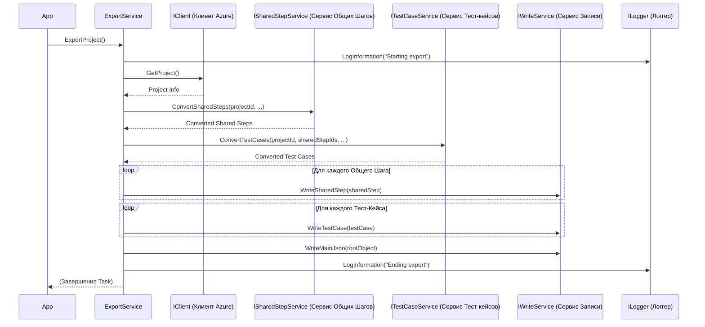

# Chapter 2: Сервис Экспорта


В предыдущей главе, [Приложение (App)](01_приложение__app__.md), мы увидели, как `App` запускает весь процесс экспорта. Но сам `App` не выполняет тяжелую работу. Он делегирует её главному «менеджеру проекта» нашего экспортера — **Сервису Экспорта** (`ExportService`).

Представьте, что вам нужно организовать переезд офиса. Вы (как `App`) не будете сами паковать каждую коробку и таскать мебель. Вы наймете менеджера по переезду (`ExportService`), который уже найдет грузчиков для мебели (один сервис), упаковщиков для документов (другой сервис), закажет машину (третий сервис) и проконтролирует, чтобы все было сделано вовремя и перевезено в нужное место (запись в файлы). Вот именно такую роль менеджера-организатора и выполняет `ExportService` в нашем приложении.

**Зачем нужен отдельный Сервис Экспорта?**

Основная задача `AzureExporter` — получить данные из Azure DevOps и сохранить их в определенном формате. Этот процесс включает несколько шагов:

1.  **Связаться** с Azure DevOps.
2.  **Запросить** информацию о проекте, рабочих элементах (тест-кейсах, общих шагах и т.д.).
3.  **Преобразовать** полученные данные в нужную нам структуру.
4.  **Сохранить** эти преобразованные данные в файлы.

Выполнять все эти шаги в одном месте (например, прямо в `App`) было бы очень сложно и запутанно. Поэтому мы выделяем **Сервис Экспорта** (`ExportService`) как центральный компонент, который координирует выполнение этих шагов, обращаясь к другим, более специализированным сервисам.

**Ключевые Идеи**

1.  **Оркестратор:** `ExportService` не выполняет всю работу сам. Он действует как дирижер оркестра, управляя другими сервисами:
    *   Он просит [Клиент Azure DevOps](03_клиент_azure_devops_.md) получить данные из Azure.
    *   Он передает эти данные [Сервису Тестовых Случаев](05_сервис_тестовых_случаев_.md) и [Сервису Общих Шагов](06_сервис_общих_шагов_.md) для преобразования.
    *   Он использует `IWriteService` (сервис записи) для сохранения результатов в файлы.
2.  **Центральная Логика Экспорта:** Именно здесь определяется последовательность шагов экспорта всего проекта.
3.  **Использование Зависимостей:** Как и `App`, `ExportService` получает нужные ему для работы вспомогательные сервисы (клиент Azure, сервис тест-кейсов, сервис записи и т.д.) через конструктор с помощью механизма Внедрения Зависимостей (Dependency Injection).
4.  **Асинхронность:** Получение данных из Azure DevOps может занять время, поэтому основной метод `ExportProject` является асинхронным (`async Task`), что позволяет приложению не "зависать" во время ожидания ответа от сервера.

**Как он используется?**

Класс `App`, как мы видели в [прошлой главе](01_приложение__app__.md), получает экземпляр `IExportService` и вызывает его единственный метод `ExportProject()`.

```csharp
// --- Фрагмент из App.cs ---
public class App
{
    // ... поля и конструктор ...
    private readonly IExportService _service; // Сервис для выполнения экспорта

    // ... конструктор получает _service через DI ...

    public void Run(string[] args)
    {
        _logger.LogInformation("Starting application");
        try
        {
            // Вызываем главный метод сервиса экспорта и ждем его завершения
            _service.ExportProject().Wait(); // Вот здесь происходит вызов!
        }
        // ... обработка ошибок и логирование ...
        _logger.LogInformation("Ending application");
    }
}
```

Когда `App` вызывает `_service.ExportProject()`, он запускает весь механизм экспорта, управляемый Сервисом Экспорта.

**Заглянем под капот: Как работает `ExportService`?**

Давайте разберем по шагам, что происходит внутри метода `ExportProject`, когда его вызывают.

**Шаг за шагом (упрощенно):**

1.  **Начало:** `ExportService` записывает в лог сообщение о начале процесса экспорта.
2.  **Получаем Проект:** Он обращается к [Клиенту Azure DevOps](03_клиент_azure_devops_.md) (`_client`) и просит информацию о проекте (например, его имя и ID). `_client.GetProject()`.
3.  **Получаем Атрибуты:** Запрашивает список пользовательских атрибутов проекта у `IAttributeService` (`_attributeService`). Эти атрибуты могут быть использованы в тест-кейсах или шагах.
4.  **Готовим "Скелет":** Создает основную структуру (`Section`) для организации экспортированных данных.
5.  **Конвертируем Общие Шаги:** Просит [Сервис Общих Шагов](06_сервис_общих_шагов_.md) (`_sharedStepService`) найти все общие шаги в проекте Azure DevOps, преобразовать их в наш формат и подготовить для записи. `_sharedStepService.ConvertSharedSteps(...)`.
6.  **Конвертируем Тест-кейсы:** Просит [Сервис Тестовых Случаев](05_сервис_тестовых_случаев_.md) (`_testCaseService`) найти все тест-кейсы, преобразовать их (используя информацию об общих шагах, если нужно) в наш формат. `_testCaseService.ConvertTestCases(...)`.
7.  **Записываем Общие Шаги:** Для каждого преобразованного общего шага `ExportService` просит сервис записи (`_writeService`) сохранить его в отдельный файл. `_writeService.WriteSharedStep(...)`.
8.  **Записываем Тест-кейсы:** Аналогично, для каждого преобразованного тест-кейса `ExportService` просит сервис записи (`_writeService`) сохранить его в отдельный файл. `_writeService.WriteTestCase(...)`.
9.  **Собираем Всё Вместе:** Создает главный файл (`Root`), который содержит общую информацию о проекте, ссылки на все сохраненные тест-кейсы и общие шаги, а также список атрибутов.
10. **Записываем Главный Файл:** Просит сервис записи (`_writeService`) сохранить этот главный файл. `_writeService.WriteMainJson(...)`.
11. **Завершение:** Записывает в лог сообщение об успешном завершении экспорта.

**Диаграмма Взаимодействия:**



**Разбор Кода `ExportService.cs`**

Давайте посмотрим на ключевые части кода самого `ExportService`.

**1. Структура Класса и Зависимости:**

```csharp
// --- Файл: Services/ExportService.cs ---
using AzureExporter.Client; // Для IClient
using JsonWriter;          // Для IWriteService (и моделей типа Section, Root)
using Microsoft.Extensions.Logging; // Для ILogger
using Models;              // Для моделей данных (например, Section)
// ... возможны другие using ...

namespace AzureExporter.Services;

// Класс реализует интерфейс IExportService
public class ExportService : IExportService
{
    // Приватные поля для хранения зависимостей
    private readonly ILogger<ExportService> _logger;         // Логгер
    private readonly IClient _client;                       // Клиент для общения с Azure DevOps
    private readonly ITestCaseService _testCaseService;     // Сервис для обработки тест-кейсов
    private readonly IWriteService _writeService;         // Сервис для записи файлов
    private readonly ISharedStepService _sharedStepService; // Сервис для обработки общих шагов
    private readonly IAttributeService _attributeService;   // Сервис для работы с атрибутами (упоминается, но не имеет отдельной главы)

    // Конструктор: Сюда DI-контейнер передает нужные сервисы
    public ExportService(ILogger<ExportService> logger, IClient client, /* ... другие сервисы ... */ IAttributeService attributeService)
    {
        _logger = logger;
        _client = client;
        _testCaseService = testCaseService;
        _writeService = writeService;
        _sharedStepService = sharedStepService;
        _attributeService = attributeService;
        // Сохраняем все полученные сервисы в приватные поля
    }

    // Основной метод экспорта (о нем ниже)
    public async Task ExportProject()
    {
        // ... логика экспорта ...
    }
}
```

*   **`using ...;`**: Подключаем пространства имен, чтобы использовать типы вроде `ILogger`, `IClient`, `ITestCaseService` и т.д.
*   **`public class ExportService : IExportService`**: Объявляем класс `ExportService`, который реализует интерфейс `IExportService`. Это означает, что он *обязан* предоставить реализацию метода `ExportProject()`, определенного в этом интерфейсе.
*   **`private readonly ...`**: Поля для хранения экземпляров сервисов, которые нужны `ExportService` для работы. `readonly` означает, что они устанавливаются только в конструкторе.
*   **`public ExportService(...)`**: Конструктор, который вызывается системой Внедрения Зависимостей (`Program.cs` настроил это). Он получает экземпляры всех необходимых сервисов (логгер, клиент Azure, сервис тест-кейсов и т.д.) и сохраняет их в соответствующие приватные поля.

**2. Метод `ExportProject` (Упрощенный по шагам):**

```csharp
// Внутри класса ExportService
public async Task ExportProject()
{
    _logger.LogInformation("Starting export"); // 1. Начало

    // 2. Получаем проект из Azure
    var project = await _client.GetProject();
    _logger.LogInformation("Processing project: {ProjectName}", project.Name);

    // 3. Получаем атрибуты (для дальнейшего использования)
    var attributes = await _attributeService.GetCustomAttributes(project.Id);
    var attributeMap = attributes.ToDictionary(k => k.Name, v => v.Id); // Удобный словарь для поиска ID атрибута по имени

    // 4. Готовим корневую секцию для структуры вывода
    var section = new Section { /* ... начальные настройки ... */ };

    // 5. Конвертируем Общие Шаги
    _logger.LogInformation("Converting Shared Steps...");
    var sharedSteps = await _sharedStepService.ConvertSharedSteps(project.Id, section.Id, attributeMap);
    // sharedSteps - это словарь, где ключ - ID из Azure, значение - наш объект SharedStep
    var sharedStepsMap = sharedSteps.ToDictionary(k => k.Key, v => v.Value.Id); // Словарь ID Azure -> наш ID
    _logger.LogInformation("Converted {Count} Shared Steps", sharedSteps.Count);

    // 6. Конвертируем Тест-кейсы
    _logger.LogInformation("Converting Test Cases...");
    var testCases = await _testCaseService.ConvertTestCases(project.Id, sharedStepsMap, section.Id, attributeMap);
    _logger.LogInformation("Converted {Count} Test Cases", testCases.Count);

    // 7. Записываем Общие Шаги в файлы
    _logger.LogInformation("Writing Shared Steps...");
    foreach (var sharedStep in sharedSteps.Values) // Используем .Values, так как нам нужны сами объекты
    {
        await _writeService.WriteSharedStep(sharedStep);
    }

    // 8. Записываем Тест-кейсы в файлы
    _logger.LogInformation("Writing Test Cases...");
    foreach (var testCase in testCases)
    {
        await _writeService.WriteTestCase(testCase);
    }

    // 9. Собираем главный JSON
    var mainJson = new Root
    {
        ProjectName = project.Name,
        Sections = new List<Section> { section },
        TestCases = testCases.Select(t => t.Id).ToList(), // Собираем ID всех тест-кейсов
        SharedSteps = sharedSteps.Values.Select(s => s.Id).ToList(), // Собираем ID всех общих шагов
        Attributes = attributes // Добавляем список атрибутов
    };

    // 10. Записываем главный файл
    _logger.LogInformation("Writing main JSON file...");
    await _writeService.WriteMainJson(mainJson);

    _logger.LogInformation("Ending export"); // 11. Завершение
}
```

*   **`async Task`**: Указывает, что метод асинхронный и не возвращает конкретного значения, но его выполнение можно ожидать (`await`).
*   **`await _client.GetProject()`**: Вызывает метод клиента Azure и *ожидает* его завершения, не блокируя основной поток. Результат (информация о проекте) записывается в переменную `project`.
*   **`await _sharedStepService.ConvertSharedSteps(...)` и `await _testCaseService.ConvertTestCases(...)`**: Аналогично, вызов и ожидание завершения работы сервисов преобразования данных.
*   **`foreach (...) { await _writeService.Write... }`**: В циклах мы проходим по всем преобразованным объектам (общие шаги, тест-кейсы) и для каждого вызываем соответствующий метод сервиса записи (`_writeService`), также ожидая (`await`) завершения записи каждого файла.
*   **Создание `mainJson`**: Формируется корневой объект `Root`, который содержит основную информацию и списки ID созданных файлов тест-кейсов и общих шагов.
*   **`await _writeService.WriteMainJson(mainJson)`**: Запись финального JSON-файла, который связывает всё вместе.

**Заключение**

В этой главе мы познакомились с `ExportService` — сердцем логики экспорта в `AzureExporter`. Мы узнали, что он не делает всю работу сам, а выступает в роли **координатора (оркестратора)**, который:

*   Запускает и контролирует весь процесс экспорта проекта.
*   Использует другие специализированные сервисы ([Клиент Azure DevOps](03_клиент_azure_devops_.md), [Сервис Тестовых Случаев](05_сервис_тестовых_случаев_.md), [Сервис Общих Шагов](06_сервис_общих_шагов_.md), сервис записи) для выполнения конкретных задач (получение данных, преобразование, сохранение).
*   Определяет последовательность шагов экспорта.

Теперь мы понимаем, *кто* организует экспорт. Но как `ExportService` получает нужную информацию из Azure DevOps? Об этом мы поговорим в следующей главе, посвященной [Клиенту Azure DevOps](03_клиент_azure_devops_.md).

---

Generated by [AI Codebase Knowledge Builder](https://github.com/The-Pocket/Tutorial-Codebase-Knowledge)