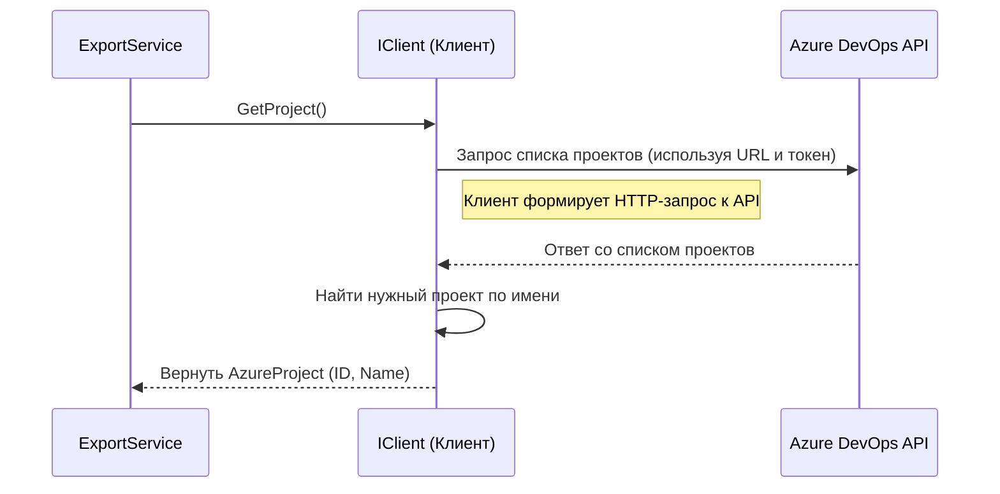

# Chapter 3: Клиент Azure DevOps


В предыдущей главе, [Сервис Экспорта](02_сервис_экспорта_.md), мы узнали, что `ExportService` выступает в роли главного организатора процесса экспорта. Он определяет, *что* нужно сделать (получить данные, преобразовать, сохранить), но он не выполняет всю работу сам. Одним из его важнейших помощников является **Клиент Azure DevOps** (`Client`).

Представьте, что `ExportService` — это менеджер, которому нужно получить информацию из очень большого и строго охраняемого архива (это наш Azure DevOps). Менеджер не может просто так войти и взять нужные папки. Ему нужен специальный сотрудник — **библиотекарь** или **архивариус** (`Client`) — который:

1.  Имеет пропуск (токен аутентификации) для доступа в архив.
2.  Знает точное расположение всех документов (проектов, тест-кейсов, вложений).
3.  Знает, как правильно оформить запрос (использует API Azure DevOps), чтобы получить нужную информацию.

Вот именно такую роль и выполняет `Клиент Azure DevOps` в нашем приложении `AzureExporter`. Он — наш «специалист» по взаимодействию с Azure DevOps.

**Зачем нужен Клиент Azure DevOps?**

Основная задача — получить данные из Azure DevOps. Но как это сделать? Нельзя просто "попросить" Azure отдать нам все тест-кейсы. Нужно:

*   **Подключиться** к правильному серверу Azure DevOps.
*   **Аутентифицироваться**, то есть доказать, что у нас есть право на доступ к данным (используя специальный токен).
*   **Сформулировать запрос** на понятном для Azure DevOps языке (используя его API - Application Programming Interface, интерфейс прикладного программирования). Например, "дай мне все рабочие элементы типа 'Test Case' из проекта X".
*   **Получить ответ** и передать его тому, кто запросил (например, `ExportService`).

Выполнять все эти технические детали в `ExportService` или других сервисах было бы неудобно и привело бы к дублированию кода. Поэтому мы выносим всю логику общения с Azure DevOps в отдельный компонент — **Клиент Azure DevOps** (`Client`). Он инкапсулирует (прячет внутри себя) все сложности взаимодействия с API Azure, предоставляя другим частям приложения простой и понятный интерфейс.

**Ключевые Идеи**

1.  **Посредник:** `Client` является единственным компонентом, который напрямую "разговаривает" с Azure DevOps API. Все остальные сервисы обращаются к Azure DevOps *через* него.
2.  **Инкапсуляция:** Скрывает детали подключения, аутентификации и вызовов конкретных методов API Azure DevOps.
3.  **Аутентификация:** Использует URL вашего Azure DevOps и персональный токен доступа (PAT - Personal Access Token), указанные в конфигурационном файле (`azure.config.json`), для безопасного подключения.
4.  **Предоставление данных:** Имеет методы для получения конкретной информации:
    *   Информации о проекте (`GetProject`).
    *   Списка ID рабочих элементов определенного типа (`GetWorkItemIds`).
    *   Детальной информации о конкретном рабочем элементе по его ID (`GetWorkItemById`).
    *   Содержимого вложений (`GetAttachmentById`).
    *   И других данных (например, итераций).

**Как он используется? (Взгляд со стороны `ExportService`)**

Сервисы, которым нужна информация из Azure (например, `ExportService`, `TestCaseService` или `SharedStepService`), получают экземпляр `IClient` через конструктор (благодаря Dependency Injection). Затем они просто вызывают его методы.

Давайте посмотрим, как `ExportService` использует `Client` для получения информации о проекте:

```csharp
// --- Фрагмент из Services/ExportService.cs ---
using AzureExporter.Client; // Подключаем интерфейс клиента
// ... другие using ...

public class ExportService : IExportService
{
    private readonly IClient _client; // Поле для хранения клиента
    private readonly ILogger<ExportService> _logger;
    // ... другие поля ...

    // Клиент передается в конструктор через DI
    public ExportService(ILogger<ExportService> logger, IClient Cclient /* ... другие сервисы ... */)
    {
        _logger = logger;
        _client = Cclient; // Сохраняем клиент
        // ... сохранение других сервисов ...
    }

    public async Task ExportProject()
    {
        _logger.LogInformation("Starting export");

        // Вот здесь ExportService использует клиент!
        // Он просит клиента получить информацию о проекте.
        var project = await _client.GetProject(); // Вызов метода клиента

        _logger.LogInformation("Processing project: {ProjectName}", project.Name);

        // ... дальнейшая логика экспорта, использующая project ...
    }
}
```

**Объяснение:**

1.  `ExportService` объявляет поле `_client` типа `IClient`. `IClient` — это *интерфейс*, контракт, который описывает, *что* клиент должен уметь делать (например, иметь метод `GetProject`), но не говорит, *как* именно он это делает.
2.  В конструкторе `ExportService` получает готовый экземпляр, реализующий `IClient` (в нашем случае это будет экземпляр класса `Client`), и сохраняет его в поле `_client`.
3.  В методе `ExportProject` он вызывает `_client.GetProject()`. `ExportService` не нужно знать, как `Client` подключается к Azure, как аутентифицируется или какой URL API использует. Он просто просит: "Дай мне проект".
4.  Ключевое слово `await` означает, что `ExportService` будет ждать, пока `Client` не получит ответ от Azure DevOps и не вернет информацию о проекте (`AzureProject`).

Точно так же другие сервисы могут использовать другие методы `IClient`, например, `GetWorkItemIds` или `GetWorkItemById`.

**Заглянем под капот: Как работает `Client`?**

Теперь давайте посмотрим, что происходит внутри самого `Client`, когда, например, `ExportService` вызывает `_client.GetProject()`.

**Шаг за шагом (без кода):**

1.  **Получение Запроса:** Метод `GetProject()` внутри класса `Client` вызывается.
2.  **Подготовка:** `Client` уже настроен при его создании (в конструкторе). Он прочитал URL сервера Azure DevOps, имя проекта и токен доступа из конфигурационного файла (`azure.config.json`). Он также создал специальные объекты (например, `ProjectHttpClient`) из библиотеки Azure DevOps SDK, которые умеют отправлять запросы к API.
3.  **Формирование Запроса:** `Client` использует `ProjectHttpClient`, чтобы сформировать и отправить запрос к API Azure DevOps с просьбой получить список всех проектов, доступных по данному токену.
4.  **Отправка и Ожидание:** Запрос отправляется на сервер Azure DevOps. `Client` ожидает ответа.
5.  **Получение Ответа:** Azure DevOps API обрабатывает запрос и возвращает список проектов.
6.  **Обработка Ответа:** `Client` получает ответ. Он находит в списке проект, имя которого совпадает с тем, что указано в конфигурации (`_projectName`).
7.  **Проверка и Преобразование:** Если проект найден, `Client` извлекает нужную информацию (ID и имя проекта) и упаковывает ее в удобный объект `AzureProject`.
8.  **Возврат Результата:** `Client` возвращает объект `AzureProject` тому, кто его вызвал (в нашем примере - `ExportService`). Если проект не найден, генерируется ошибка.

**Диаграмма Взаимодействия (Упрощенная):**



**Разбор Кода:**

Для понимания работы клиента важны два файла:

1.  `Client/IClient.cs`: Интерфейс, определяющий "контракт" клиента.
2.  `Client/Client.cs`: Класс, реализующий этот интерфейс и содержащий логику взаимодействия с Azure DevOps.

**1. Интерфейс `IClient.cs`:**

Этот файл очень короткий. Он просто перечисляет методы, которые должен предоставлять любой класс, реализующий интерфейс `IClient`.

```csharp
// --- Файл: Client/IClient.cs ---
using AzureExporter.Models; // Используем модели данных (AzureProject, AzureWorkItem и т.д.)

namespace AzureExporter.Client;

// Интерфейс описывает возможности нашего клиента
public interface IClient
{
    // Получить информацию о проекте
    Task<AzureProject> GetProject();

    // Получить список ID рабочих элементов заданного типа (например, "Test Case")
    Task<List<int>> GetWorkItemIds(string type);

    // Получить детальную информацию о рабочем элементе по его ID
    Task<AzureWorkItem> GetWorkItemById(int id);

    // Получить список путей итераций для проекта
    Task<List<string>> GetIterations(Guid projectId);

    // Получить содержимое файла вложения по его ID
    Task<byte[]> GetAttachmentById(Guid id);
}
```

*   **`public interface IClient`**: Объявление интерфейса.
*   **`Task<AzureProject> GetProject()`**: Определение метода. `Task<T>` означает, что метод асинхронный (может занять время) и по завершении вернет результат типа `AzureProject`. Аналогично для других методов.

**2. Реализация `Client.cs`:**

Этот класс содержит реальный код для общения с Azure DevOps.

**Конструктор и Настройка:**

```csharp
// --- Файл: Client/Client.cs ---
using AzureExporter.Models;
using Microsoft.Extensions.Configuration; // Для чтения конфигурации
using Microsoft.Extensions.Logging;      // Для логирования
// ... другие using для библиотек Azure DevOps ...
using Microsoft.TeamFoundation.Core.WebApi;
using Microsoft.TeamFoundation.WorkItemTracking.WebApi;
using Microsoft.VisualStudio.Services.Common;
using Microsoft.VisualStudio.Services.WebApi;

namespace AzureExporter.Client;

public class Client : IClient // Класс реализует интерфейс IClient
{
    private readonly ILogger<Client> _logger;
    private readonly ProjectHttpClient _projectClient; // Клиент для работы с проектами
    private readonly WorkItemTrackingHttpClient _workItemTrackingClient; // Клиент для рабочих элементов
    // ... другие клиенты могут быть здесь ...
    private readonly string _projectName; // Имя проекта из конфигурации

    // Конструктор: получает логгер и конфигурацию через DI
    public Client(ILogger<Client> logger, IConfiguration configuration)
    {
        _logger = logger;

        var section = configuration.GetSection("azure"); // Читаем секцию "azure" из azure.config.json
        var url = section["url"]; // Получаем URL сервера
        var token = section["token"]; // Получаем токен доступа
        var projectName = section["projectName"]; // Получаем имя проекта

        // Проверки, что значения заданы (упрощено)
        if (string.IsNullOrEmpty(url) || string.IsNullOrEmpty(token) || string.IsNullOrEmpty(projectName))
        {
            throw new ArgumentException("Azure URL, Token, or Project Name not specified in configuration.");
            // В реальном коде здесь более детальные проверки
        }

        _projectName = projectName; // Сохраняем имя проекта

        // Создаем подключение к Azure DevOps, используя URL и токен
        var connection = new VssConnection(new Uri(url), new VssBasicCredential(string.Empty, token));

        // Получаем специализированные клиенты API из подключения
        _projectClient = connection.GetClient<ProjectHttpClient>();
        _workItemTrackingClient = connection.GetClient<WorkItemTrackingHttpClient>();
        // ... получение других клиентов ...
    }

    // ... Реализация методов интерфейса IClient ...
}
```

*   **Конструктор `Client(...)`**: Вызывается при создании клиента (в `Program.cs`). Он получает доступ к конфигурации (`IConfiguration`).
*   **Чтение конфигурации**: Из секции `azure` файла `azure.config.json` читаются `url`, `token` и `projectName`.
*   **`VssConnection`**: Создается объект подключения к Azure DevOps с использованием URL и токена.
*   **`connection.GetClient<T>()`**: С помощью подключения создаются *специализированные* клиенты (например, `ProjectHttpClient` для работы с проектами, `WorkItemTrackingHttpClient` для работы с тест-кейсами, багами и т.д.). Эти клиенты предоставляют удобные методы для вызова соответствующих API Azure DevOps.

**Пример Реализации Метода `GetProject`:**

```csharp
// --- Внутри класса Client ---

public async Task<AzureProject> GetProject()
{
    // Используем _projectClient для запроса списка проектов
    // .Result здесь используется для упрощения, в реальном коде лучше использовать await
    var projects = _projectClient.GetProjects().Result;

    // Ищем проект с именем, указанным в конфигурации (_projectName)
    var project = projects.FirstOrDefault(p =>
        p.Name.Equals(_projectName, StringComparison.InvariantCultureIgnoreCase));

    // Если проект не найден, выбрасываем исключение
    if (project == null)
    {
        throw new ArgumentException($"Project {_projectName} not found");
    }

    // Если найден, создаем и возвращаем нашу модель AzureProject
    return new AzureProject
    {
        Id = project.Id, // Берем ID из найденного проекта
        Name = project.Name // Берем имя из найденного проекта
    };
    // Для краткости обработка ошибок и асинхронность здесь упрощены
}
```

*   **`_projectClient.GetProjects().Result`**: Используется клиент для проектов (`_projectClient`), чтобы вызвать метод API Azure DevOps, который возвращает список проектов. `.Result` блокирует выполнение до получения результата (в реальной асинхронной реализации здесь был бы `await`).
*   **`projects.FirstOrDefault(...)`**: С помощью LINQ ищется первый проект в полученном списке, у которого имя (`p.Name`) совпадает с `_projectName` (игнорируя регистр).
*   **Проверка и Возврат**: Если проект найден, создается наш объект `AzureProject` с ID и именем найденного проекта и возвращается. Иначе генерируется ошибка.

**Пример Реализации Метода `GetWorkItemIds`:**

```csharp
// --- Внутри класса Client ---

public async Task<List<int>> GetWorkItemIds(string workItemType)
{
    // Формируем запрос на языке WIQL (Work Item Query Language)
    var wiql = new Wiql
    {
        Query = "SELECT [System.Id] " +
                "FROM WorkItems " +
                $"WHERE [System.TeamProject] = '{_projectName}' " + // Для нашего проекта
                $"AND [System.WorkItemType] = '{workItemType}'" // И нужного типа (например, "Test Case")
    };

    // Используем _workItemTrackingClient для выполнения WIQL-запроса
    // .Result используется для упрощения
    var queryResult = _workItemTrackingClient.QueryByWiqlAsync(wiql).Result;

    // Из результата запроса извлекаем только ID рабочих элементов
    // и возвращаем их как список чисел (int)
    return queryResult.WorkItems.Select(w => w.Id).ToList();
    // Для краткости обработка ошибок и асинхронность здесь упрощены
}
```

*   **`Wiql`**: Формируется специальный запрос на языке WIQL, похожем на SQL, чтобы выбрать ID (`System.Id`) рабочих элементов (`WorkItems`) из нашего проекта (`System.TeamProject`) заданного типа (`System.WorkItemType`).
*   **`_workItemTrackingClient.QueryByWiqlAsync(wiql).Result`**: Используется клиент для рабочих элементов (`_workItemTrackingClient`) для выполнения этого запроса к Azure DevOps API.
*   **`queryResult.WorkItems.Select(w => w.Id).ToList()`**: Ответ содержит список ссылок на рабочие элементы. Мы извлекаем из каждой ссылки ее `Id` и формируем из них список целых чисел (`List<int>`).

**Заключение**

В этой главе мы погрузились в мир **Клиента Azure DevOps** (`Client`) — нашего надежного посредника для общения с Azure DevOps. Ключевые моменты:

*   Он **инкапсулирует** всю сложность взаимодействия с API Azure DevOps (подключение, аутентификация, вызовы).
*   Использует **токен доступа** и **URL** из конфигурации для безопасного подключения.
*   Предоставляет **простой интерфейс (`IClient`)** для других сервисов, позволяя им легко запрашивать нужные данные (проекты, рабочие элементы, вложения).
*   Внутри использует **специализированные клиенты** из библиотек Azure DevOps SDK (`ProjectHttpClient`, `WorkItemTrackingHttpClient` и др.) для выполнения запросов.

Теперь, когда мы понимаем, как `AzureExporter` получает исходные данные из Azure DevOps, мы можем перейти к тому, как эти данные представляются внутри нашего приложения. В следующей главе мы рассмотрим модель [Рабочий элемент Azure (Azure Work Item)](04_рабочий_элемент_azure__azure_work_item__.md), которая используется для хранения информации, полученной от клиента.

---

Generated by [AI Codebase Knowledge Builder](https://github.com/The-Pocket/Tutorial-Codebase-Knowledge)