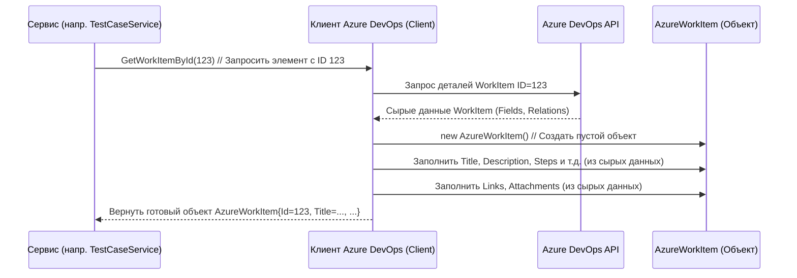

# Chapter 4: Рабочий элемент Azure (Azure Work Item)


В предыдущей главе, посвященной [Клиенту Azure DevOps](03_клиент_azure_devops_.md), мы узнали, как наше приложение `AzureExporter` получает "сырые" данные напрямую из Azure DevOps. Клиент действует как наш агент, который отправляется в Azure, запрашивает информацию (например, о тестовом случае или общем шаге) и приносит ее нам.

Но в каком виде клиент приносит эту информацию? Представьте, что вы отправили курьера (клиента) в разные отделы (Azure API) за разными документами (тестовый случай, общий шаг). Каждый отдел может использовать немного свои шаблоны. Чтобы не запутаться, вы просите курьера переписать ключевую информацию из каждого полученного документа в *стандартную анкету* – одну и ту же форму для всех типов документов.

Вот эту роль стандартной анкеты и выполняет **Рабочий элемент Azure (`AzureWorkItem`)**.

**Зачем нужна эта "анкета"?**

Когда [Клиент Azure DevOps](03_клиент_azure_devops_.md) получает данные от Azure, информация приходит в довольно сложном и "сыром" виде, специфичном для API Azure DevOps. Например, все данные могут быть в одном большом словаре `Fields`, а ссылки и вложения — в отдельном списке `Relations`. Работать напрямую с такой структурой в разных частях нашего приложения (например, при обработке тест-кейсов и общих шагов) было бы неудобно и привело бы к повторению одного и того же кода для извлечения данных.

`AzureWorkItem` решает эту проблему. Это специальный класс в нашем коде (модель данных), который служит **универсальным контейнером** для данных, полученных *из* Azure DevOps *для одной* сущности (тестового случая, общего шага и т.д.). [Клиент Azure DevOps](03_клиент_azure_devops_.md) берет "сырые" данные из ответа Azure API и аккуратно раскладывает их по полочкам в объект `AzureWorkItem`.

**Ключевые Идеи**

1.  **Стандартизация:** `AzureWorkItem` предоставляет единую, предсказуемую структуру для данных, независимо от того, получили мы тестовый случай или общий шаг.
2.  **Промежуточное звено:** Это не конечный результат экспорта, а промежуточный контейнер. Он содержит данные *в том виде, как они были получены* из Azure, но уже в удобной объектной форме.
3.  **Модель Данных:** В коде C# это просто класс (`public class AzureWorkItem`) с набором свойств, которые соответствуют основным полям рабочего элемента в Azure DevOps.

**Какие данные хранятся в `AzureWorkItem`?**

Наша "стандартная анкета" содержит поля для самой важной информации, которую может предоставить Azure DevOps о рабочем элементе:

*   `Id`: Уникальный номер рабочего элемента в Azure.
*   `Title`: Заголовок (например, "Проверить вход пользователя").
*   `Description`: Описание (если есть).
*   `State`: Текущее состояние (например, "Active", "Design", "Closed").
*   `Priority`: Приоритет (число).
*   `Steps`: Шаги для выполнения (специфично для Test Case и Shared Step). Часто это особая строка в формате XML или HTML.
*   `IterationPath`: Путь итерации (спринта), к которому привязан элемент.
*   `Tags`: Метки (теги), присвоенные элементу.
*   `Links`: Список связанных ссылок (например, ссылки на требования или баги).
*   `Attachments`: Список вложений (файлов).
*   `Parameters`: Параметры (используется в Test Case для параметризации данных).

**Как это используется?**

1.  **Создание:** [Клиент Azure DevOps](03_клиент_azure_devops_.md) использует метод `GetWorkItemById`, чтобы получить данные из Azure. Внутри этого метода он создает новый объект `AzureWorkItem` и заполняет его свойства данными из ответа Azure API.
2.  **Передача:** Клиент возвращает этот заполненный объект `AzureWorkItem` тому, кто его вызвал (например, [Сервису Тестовых Случаев](05_сервис_тестовых_случаев_.md) или [Сервису Общих Шагов](06_сервис_общих_шагов_.md)).
3.  **Использование:** Сервисы (например, `TestCaseService`) берут полученный `AzureWorkItem` и используют его как источник данных. Они читают значения из свойств `Title`, `Description`, `Steps` и т.д., чтобы преобразовать их в *конечный* формат, который будет записан в JSON-файлы (об этом подробнее в следующих главах).

**Пример: Как `Client` создает `AzureWorkItem`**

Давайте посмотрим на *упрощенный* фрагмент кода из [Клиента Azure DevOps](03_клиент_azure_devops_.md), который показывает, как из "сырого" ответа (`workItem`) создается наш стандартизированный `AzureWorkItem`.

```csharp
// --- Фрагмент из Client/Client.cs, метод GetWorkItemById ---

// workItem - это объект, полученный напрямую от Azure DevOps SDK
var workItem = _workItemTrackingClient.GetWorkItemAsync(_projectName, id, expand: WorkItemExpand.All).Result;

// Создаем наш объект-контейнер AzureWorkItem
var result = new AzureWorkItem
{
    // Заполняем свойства нашего объекта данными из workItem
    Id = workItem.Id!.Value, // Берем ID
    Title = GetValueOfField(workItem.Fields, "System.Title"), // Ищем заголовок в словаре Fields
    Description = GetValueOfField(workItem.Fields, "System.Description"), // Ищем описание
    State = GetValueOfField(workItem.Fields, "System.State"), // Ищем состояние
    Steps = GetValueOfField(workItem.Fields, "Microsoft.VSTS.TCM.Steps"), // Ищем шаги
    // ... заполнение других полей, таких как Priority, IterationPath, Tags ...

    // Обработка ссылок (извлекаем из workItem.Relations)
    Links = workItem.Relations? // Если список Relations не пустой
        .Where(r => r.Rel == "ArtifactLink") // Выбираем только ссылки типа ArtifactLink
        .Select(r => new AzureLink // Преобразуем каждую в наш формат AzureLink
        {
            Title = GetValueOfField(r.Attributes, "name"), // Имя ссылки из атрибутов
            Url = r.Url // URL ссылки
        })
        .ToList() ?? new List<AzureLink>(), // Если Relations был пуст, создаем пустой список

    // Аналогично обрабатываем вложения (извлекаем из workItem.Relations)
    Attachments = workItem.Relations?
        .Where(r => r.Rel == "AttachedFile") // Выбираем только вложения
        .Select(r => new AzureAttachment // Преобразуем в наш AzureAttachment
        {
            Id = new Guid(r.Url[^36..]), // Извлекаем ID вложения из URL
            Name = GetValueOfField(r.Attributes, "name"), // Имя файла
        })
        .ToList() ?? new List<AzureAttachment>()

    // ... заполнение Parameters ...
};

// Возвращаем созданный и заполненный объект AzureWorkItem
return result;

// Вспомогательная функция для безопасного получения значения из словаря
private static string GetValueOfField(IDictionary<string, object> fields, string key)
{
    // Если ключ найден, возвращаем значение как строку, иначе - пустую строку
    if (fields.TryGetValue(key, out var value))
    {
        return value as string ?? string.Empty;
    }
    return string.Empty;
}
```

**Объяснение кода:**

*   Сначала мы получаем "сырой" объект `workItem` от библиотеки Azure DevOps SDK.
*   Затем мы создаем экземпляр нашего класса `AzureWorkItem`.
*   Мы последовательно заполняем его свойства (`Id`, `Title`, `Description`, `Steps` и т.д.). Для большинства полей мы используем вспомогательную функцию `GetValueOfField`, которая безопасно извлекает значение из словаря `workItem.Fields` по строковому ключу (например, "System.Title"). Это скрывает от нас детали того, как именно Azure хранит эти данные.
*   Для ссылок (`Links`) и вложений (`Attachments`) мы обрабатываем список `workItem.Relations`. Мы фильтруем нужные типы связей (`ArtifactLink`, `AttachedFile`) и преобразуем (`Select`) каждую найденную связь в наши собственные простые объекты `AzureLink` и `AzureAttachment`, извлекая нужные данные (имя, URL, ID).
*   В конце мы возвращаем полностью заполненный объект `result` (типа `AzureWorkItem`).

**Заглянем под капот: Модель `AzureWorkItem`**

Сам класс `AzureWorkItem` очень прост. Это так называемый POCO (Plain Old CLR Object) или DTO (Data Transfer Object) – класс, основная цель которого просто содержать данные.

```csharp
// --- Файл: Models/AzureWorkItem.cs ---
namespace AzureExporter.Models;

// Класс для хранения данных о рабочем элементе, полученных из Azure
public class AzureWorkItem
{
    // Уникальный ID из Azure
    public int Id { get; set; }

    // Заголовок
    public string Title { get; set; }

    // Описание
    public string Description { get; set; }

    // Состояние (Active, Closed, ...)
    public string State { get; set; }

    // Приоритет (число)
    public int Priority { get; set; }

    // Шаги (обычно строка XML/HTML)
    public string Steps { get; set; }

    // Путь итерации
    public string IterationPath { get; set; }

    // Теги (строка с разделителями)
    public string Tags { get; set; }

    // Список ссылок
    public List<AzureLink> Links { get; set; }

    // Список вложений
    public List<AzureAttachment> Attachments { get; set; }

    // Параметры для тестов
    public AzureParameters Parameters { get; set; }
}

// Вспомогательные классы (упрощенно)
public class AzureLink { public string Title { get; set; } public string Url { get; set; } }
public class AzureAttachment { public Guid Id { get; set; } public string Name { get; set; } }
public class AzureParameters { public string Keys { get; set; } public string Values { get; set; } }
```

**Объяснение кода:**

*   Класс `AzureWorkItem` находится в пространстве имен `AzureExporter.Models`.
*   Он содержит только `public` свойства с `get; set;`. Это позволяет легко читать и записывать значения этих свойств.
*   Типы свойств соответствуют данным, которые мы ожидаем получить из Azure (`string`, `int`, `List<T>`).
*   Вспомогательные классы `AzureLink`, `AzureAttachment`, `AzureParameters` также являются простыми контейнерами данных.

**Диаграмма взаимодействия:**

Эта диаграмма показывает, как Сервис (например, [Сервис Тестовых Случаев](05_сервис_тестовых_случаев_.md)) запрашивает данные у Клиента, а Клиент, в свою очередь, получает их из Azure API и упаковывает в объект `AzureWorkItem`.



**Заключение**

В этой главе мы познакомились с `AzureWorkItem` — нашим стандартизированным представлением данных, полученных из Azure DevOps. Запомните главное:

*   `AzureWorkItem` — это **универсальная "анкета"** или модель данных, которую [Клиент Azure DevOps](03_клиент_azure_devops_.md) заполняет информацией, полученной из Azure API.
*   Он служит **промежуточным контейнером**, упрощая дальнейшую обработку данных, так как предоставляет единую структуру для тестовых случаев, общих шагов и, потенциально, других типов рабочих элементов.
*   Он **скрывает сложность** "сырых" данных Azure API, предоставляя удобные свойства (`Title`, `Steps`, `Links` и т.д.).

Теперь, когда мы понимаем, в каком виде мы получаем стандартизированные данные из Azure, мы готовы посмотреть, как эта информация используется для создания наших конечных объектов. В следующей главе мы разберем [Сервис Тестовых Случаев](05_сервис_тестовых_случаев_.md) и увидим, как он берет `AzureWorkItem` и преобразует его в объект `TestCase`, готовый для экспорта.

---

Generated by [AI Codebase Knowledge Builder](https://github.com/The-Pocket/Tutorial-Codebase-Knowledge)