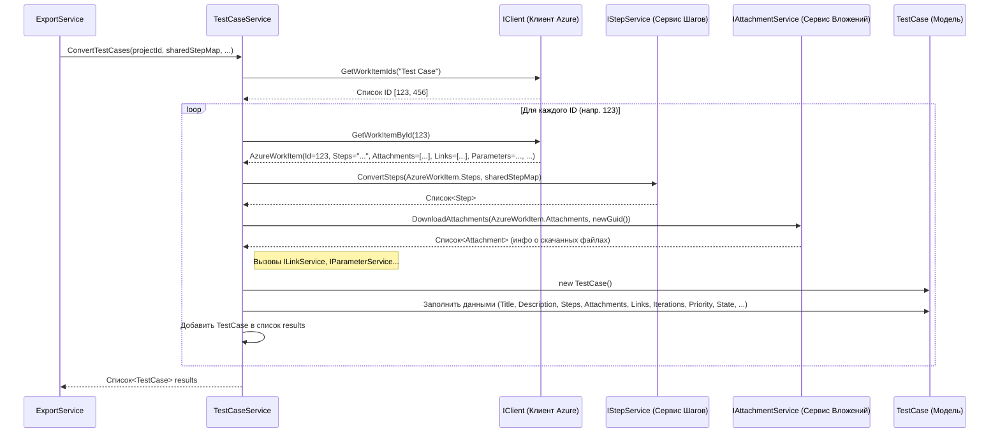

# Chapter 5: Сервис Тестовых Случаев


В предыдущей главе, [Рабочий элемент Azure (Azure Work Item)](04_рабочий_элемент_azure__azure_work_item__.md), мы познакомились с `AzureWorkItem` — нашей стандартной "анкетой", которую [Клиент Azure DevOps](03_клиент_azure_devops_.md) использует для хранения информации, полученной из Azure. Теперь у нас есть стандартизированное представление данных из Azure, не зависящее от типа элемента (будь то тест-кейс или что-то еще).

Но сама по себе эта "анкета" `AzureWorkItem` ещё не готова к записи в финальные файлы для системы Test IT. Нам нужно преобразовать эту общую информацию в конкретную структуру, например, в структуру тест-кейса. Вот здесь и вступает в игру наш специалист — **Сервис Тестовых Случаев (`TestCaseService`)**.

**Зачем нужен отдельный Сервис Тестовых Случаев?**

Представьте, что у вас есть большая коробка с разными запчастями (`AzureWorkItem`), полученными с завода (Azure DevOps). Там лежат общие детали: корпус, винтики, проводки. Ваша задача — собрать из этих запчастей конкретное устройство, например, радиоприемник (`TestCase` для Test IT). Вам нужен специалист именно по сборке радиоприемников, который знает:

*   Какие именно детали из коробки взять (`AzureWorkItem` с типом "Test Case").
*   Как их соединить (преобразовать поля `Title`, `Description`).
*   Как подключить динамик (обработать поле `Steps` с помощью [Сервиса Шагов](07_сервис_шагов_.md)).
*   Как вставить батарейки (скачать файлы с помощью [Сервиса Вложений](08_сервис_вложений_.md)).
*   Как настроить антенну (обработать ссылки и параметры с помощью `ILinkService` и `IParameterService`).

**Сервис Тестовых Случаев** — это именно такой узкоспециализированный "мастер по тест-кейсам" в нашем `AzureExporter`. Он берет стандартизированный `AzureWorkItem` (если это тестовый случай) и тщательно преобразует его в формат `TestCase`, который уже понимает целевая система Test IT.

**Ключевые Идеи**

1.  **Специализация:** `TestCaseService` работает *только* с тестовыми случаями. Он знает все тонкости преобразования именно этого типа рабочих элементов.
2.  **Трансформация Данных:** Его главная задача — взять `AzureWorkItem`, полученный от [Клиента Azure DevOps](03_клиент_azure_devops_.md), и превратить его в объект `TestCase` (этот формат определен в общей библиотеке `Models`, используемой также `JsonWriter` для записи файлов).
3.  **Делегирование Полномочий:** `TestCaseService` не делает всё сам. Для сложных задач он обращается к другим "специалистам":
    *   **[Сервис Шагов](07_сервис_шагов_.md):** Преобразует специальную строку с шагами (из поля `Steps` в `AzureWorkItem`) в понятный список структурированных шагов.
    *   **[Сервис Вложений](08_сервис_вложений_.md):** Скачивает файлы, прикрепленные к тест-кейсу в Azure DevOps, и подготавливает информацию о них.
    *   **`ILinkService`:** Преобразует информацию о связанных элементах (ссылки на требования, баги и т.д.).
    *   **`IParameterService`:** Обрабатывает параметры тест-кейса (если они есть).

**Как он используется?**

Обычно `TestCaseService` вызывается из [Сервиса Экспорта](02_сервис_экспорта_.md), который координирует весь процесс. `ExportService` просит `TestCaseService` обработать все тест-кейсы для данного проекта.

Вот упрощенный пример того, как `ExportService` использует `TestCaseService`:

```csharp
// --- Фрагмент из Services/ExportService.cs ---
public class ExportService : IExportService
{
    // ... другие поля ...
    private readonly ITestCaseService _testCaseService; // Сервис для тест-кейсов
    private readonly ISharedStepService _sharedStepService; // Сервис для общих шагов

    // Сервисы передаются через конструктор (Dependency Injection)
    public ExportService(..., ITestCaseService testCaseService, ISharedStepService sharedStepService, ...)
    {
        // ... сохранение других сервисов ...
        _testCaseService = testCaseService;
        _sharedStepService = sharedStepService;
    }

    public async Task ExportProject()
    {
        // ... получение информации о проекте, атрибутах и т.д. ...

        // Сначала получаем и обрабатываем общие шаги (нужны для тест-кейсов)
        var sharedSteps = await _sharedStepService.ConvertSharedSteps(...);
        // Создаем карту: ID общего шага в Azure -> наш внутренний ID (Guid)
        var sharedStepsMap = sharedSteps.ToDictionary(k => k.Key, v => v.Value.Id);

        // Теперь просим Сервис Тестовых Случаев обработать все тест-кейсы
        // Передаем ему ID проекта, карту общих шагов, ID секции и карту атрибутов
        var testCases = await _testCaseService.ConvertTestCases(
            project.Id,
            sharedStepsMap,
            section.Id,
            attributeMap);

        _logger.LogInformation("Converted {Count} Test Cases", testCases.Count);

        // ... дальнейшая работа с testCases (например, запись в файлы) ...
    }
}
```

**Объяснение:**

1.  `ExportService` сначала получает от [Сервиса Общих Шагов](06_сервис_общих_шагов_.md) обработанные общие шаги и создает `sharedStepsMap` — специальный словарь, чтобы быстро находить внутренний ID общего шага по его ID из Azure. Это нужно, если тестовый случай ссылается на общий шаг.
2.  Затем он вызывает метод `_testCaseService.ConvertTestCases(...)`.
3.  В этот метод передаются:
    *   `project.Id`: ID проекта в Azure.
    *   `sharedStepsMap`: Словарь с ID общих шагов (чтобы сервис мог разрешить ссылки на них).
    *   `section.Id`: ID секции, в которую нужно поместить тест-кейсы в финальной структуре.
    *   `attributeMap`: Словарь с пользовательскими атрибутами (чтобы сервис мог их правильно привязать).
4.  `_testCaseService.ConvertTestCases(...)` возвращает список (`List<TestCase>`) полностью преобразованных тест-кейсов, готовых к дальнейшему использованию (например, к записи в файлы).

**Заглянем под капот: Как работает `TestCaseService`?**

Давайте разберемся, что происходит внутри `TestCaseService`, когда `ExportService` вызывает его метод `ConvertTestCases`.

**Шаг за шагом (без кода):**

1.  **Получение Запроса:** `TestCaseService` получает вызов `ConvertTestCases` со всей необходимой информацией (ID проекта, карты шагов и атрибутов, ID секции).
2.  **Запрос ID Тест-Кейсов:** Он обращается к [Клиенту Azure DevOps](03_клиент_azure_devops_.md) (`_client`) и просит: "Дай мне ID всех рабочих элементов типа 'Test Case' из проекта с ID = `projectId`".
3.  **Перебор ID:** Сервис получает список ID (например, `[123, 456, 789]`) и начинает обрабатывать их по одному.
4.  **Запрос Деталей:** Для каждого ID (например, `123`) он снова обращается к `_client`: "Дай мне полную информацию (`AzureWorkItem`) для рабочего элемента с ID = 123".
5.  **Получение "Анкеты":** Клиент возвращает заполненный `AzureWorkItem` с заголовком, описанием, шагами (в виде строки), списком вложений, ссылок и т.д.
6.  **Вызов Помощников:** Теперь `TestCaseService` использует полученный `AzureWorkItem` как источник данных и вызывает своих помощников:
    *   Передает поле `Steps` из `AzureWorkItem` [Сервису Шагов](07_сервис_шагов_.md) (`_stepService`), который возвращает структурированный список шагов (`List<Step>`). Сервис шагов также использует `sharedStepsMap`, чтобы вставить общие шаги, если нужно.
    *   Передает поле `Parameters` из `AzureWorkItem` сервису `_parameterService`, который возвращает обработанные параметры.
    *   Передает поле `Attachments` из `AzureWorkItem` [Сервису Вложений](08_сервис_вложений_.md) (`_attachmentService`), который скачивает файлы и возвращает список информации о них (`List<Attachment>`).
    *   Передает поле `Links` из `AzureWorkItem` сервису `_linkService`, который возвращает обработанные ссылки.
7.  **Сборка Финального Объекта:** `TestCaseService` создает новый объект `TestCase` (из библиотеки `Models`). Он заполняет его поля:
    *   Берет `Title`, `Description` напрямую из `AzureWorkItem`.
    *   Устанавливает `Steps`, `Attachments`, `Links`, `Iterations` (из параметров) из результатов, полученных от сервисов-помощников.
    *   Преобразует `Priority` и `State` из Azure-формата в формат Test IT (например, числовой приоритет в текстовый типа "High", "Medium").
    *   Добавляет атрибуты (например, путь итерации и исходное состояние из Azure).
    *   Обрабатывает теги.
    *   Устанавливает `SectionId`, полученный от `ExportService`.
    *   Генерирует новый уникальный ID (`Guid`) для этого `TestCase`.
8.  **Добавление в Список:** Готовый `TestCase` добавляется в общий список.
9.  **Возврат Результата:** После обработки всех ID из шага 3, `TestCaseService` возвращает полный список готовых `TestCase` объектов [Сервису Экспорта](02_сервис_экспорта_.md).

**Диаграмма Взаимодействия:**



**Разбор Кода `TestCaseService.cs`**

Давайте посмотрим на ключевые части реализации `TestCaseService`.

**1. Структура Класса и Зависимости:**

Класс `TestCaseService` находится в файле `Services/TestCaseService.cs`. Как и другие сервисы, он получает все необходимые ему зависимости через конструктор.

```csharp
// --- Файл: Services/TestCaseService.cs ---
using AzureExporter.Client; // Для IClient
using Microsoft.Extensions.Logging; // Для ILogger
using Models; // Для TestCase, Step, Attachment, Link и т.д.
// ... другие using ...

namespace AzureExporter.Services;

// Класс реализует интерфейс ITestCaseService
public class TestCaseService : WorkItemBaseService, ITestCaseService
{
    // Приватные поля для хранения зависимостей
    private readonly ILogger<TestCaseService> _logger;
    private readonly IClient _client;                   // Клиент Azure
    private readonly IStepService _stepService;           // Сервис для шагов
    private readonly IAttachmentService _attachmentService; // Сервис для вложений
    private readonly ILinkService _linkService;           // Сервис для ссылок
    private readonly IParameterService _parameterService;    // Сервис для параметров

    // Конструктор: Сюда DI-контейнер передает нужные сервисы
    public TestCaseService(ILogger<TestCaseService> logger, IClient client, IStepService stepService,
        IAttachmentService attachmentService, ILinkService linkService, IParameterService parameterService)
    {
        _logger = logger;
        _client = client;
        _stepService = stepService;
        _attachmentService = attachmentService;
        _linkService = linkService;
        _parameterService = parameterService;
        // Сохраняем все полученные сервисы
    }

    // Основной метод конвертации (о нем ниже)
    public async Task<List<TestCase>> ConvertTestCases(Guid projectId, Dictionary<int, Guid> sharedStepMap,
        Guid sectionId, Dictionary<string, Guid> attributeMap)
    {
        // ... логика конвертации ...
    }

    // ... вспомогательные методы (например, ConvertPriority, ConvertTags) ...
}
```

*   Класс реализует интерфейс `ITestCaseService`, который определяет метод `ConvertTestCases`.
*   Он также наследуется от `WorkItemBaseService` (здесь могут быть общие вспомогательные методы, например, для конвертации приоритета или тегов).
*   В конструкторе он получает и сохраняет экземпляры всех необходимых ему сервисов: логгер, клиент Azure, сервис шагов, сервис вложений, сервис ссылок и сервис параметров.

**2. Метод `ConvertTestCases` (упрощенные шаги):**

```csharp
// Внутри класса TestCaseService
public async Task<List<TestCase>> ConvertTestCases(Guid projectId, Dictionary<int, Guid> sharedStepMap,
    Guid sectionId, Dictionary<string, Guid> attributeMap)
{
    _logger.LogInformation("Конвертируем тест-кейсы...");

    // Шаг 2: Запрос ID Тест-Кейсов у клиента
    var workItemsIds = await _client.GetWorkItemIds(Constants.TestCaseType); // Constants.TestCaseType = "Test Case"
    _logger.LogDebug("Найдено {Count} тест-кейсов.", workItemsIds.Count);

    var testCases = new List<TestCase>(); // Готовим список для результатов

    // Шаг 3: Перебор ID
    foreach (var workItemId in workItemsIds)
    {
        _logger.LogDebug("Конвертируем тест-кейс: {Id}", workItemId);

        // Шаг 4-5: Запрос Деталей (AzureWorkItem) у клиента
        var azureWorkItem = await _client.GetWorkItemById(workItemId);
        _logger.LogDebug("Получен AzureWorkItem: {@AzureWorkItem}", azureWorkItem);

        // Шаг 6: Вызов Помощников
        // Преобразуем шаги
        var steps = _stepService.ConvertSteps(azureWorkItem.Steps, sharedStepMap);
        // Получаем параметры
        var parametersData = _parameterService.ConvertParameters(azureWorkItem.Parameters);
        // Преобразуем параметры в итерации для Test IT
        var iterations = ConvertParametersToIterations(parametersData);
        // Скачиваем вложения
        var testCaseGuid = Guid.NewGuid(); // Генерируем уникальный ID для TestCase
        var tmsAttachments = await _attachmentService.DownloadAttachments(azureWorkItem.Attachments, testCaseGuid);
        // Преобразуем ссылки
        var links = _linkService.CovertLinks(azureWorkItem.Links);

        // Добавляем параметры в текст шагов, если они есть
        if (iterations.Count > 0 && parametersData.Count > 0)
        {
             steps = AddParametersToSteps(steps, parametersData[0].Keys);
        }

        // Шаг 7: Сборка Финального Объекта TestCase
        var tmsTestCase = new TestCase
        {
            Id = testCaseGuid, // Наш новый уникальный ID
            Name = azureWorkItem.Title,
            Description = azureWorkItem.Description,
            State = StateType.NotReady, // Пример: устанавливаем начальный статус
            Priority = ConvertPriority(azureWorkItem.Priority), // Конвертируем приоритет
            Steps = steps, // Результат от Сервиса Шагов
            PreconditionSteps = new List<Step>(), // Предусловия (пока пустые)
            PostconditionSteps = new List<Step>(), // Постусловия (пока пустые)
            Duration = 10000, // Пример: устанавливаем длительность по умолчанию
            Attributes = ConvertAttributes(azureWorkItem, attributeMap), // Привязываем атрибуты
            Tags = ConvertTags(azureWorkItem.Tags), // Конвертируем теги
            Attachments = tmsAttachments, // Результат от Сервиса Вложений
            Iterations = iterations, // Результат от Сервиса Параметров
            Links = links, // Результат от Сервиса Ссылок
            SectionId = sectionId // ID секции, куда поместить кейс
        };

        _logger.LogDebug("Сконвертированный TestCase: {@TestCase}", tmsTestCase);

        // Шаг 8: Добавление в Список
        testCases.Add(tmsTestCase);
    }

    _logger.LogInformation("Экспорт тест-кейсов завершен.");
    // Шаг 9: Возврат Результата
    return testCases;
}
```

**Объяснение ключевых моментов:**

*   **`await _client.GetWorkItemIds(...)`**: Получаем список ID всех элементов типа "Test Case".
*   **`foreach (var workItemId in workItemsIds)`**: Цикл по каждому найденному ID.
*   **`await _client.GetWorkItemById(workItemId)`**: Получаем полную информацию `AzureWorkItem` для текущего ID.
*   **`_stepService.ConvertSteps(...)`**: Вызываем сервис шагов для преобразования строки `Steps`.
*   **`_parameterService.ConvertParameters(...)`, `ConvertParametersToIterations(...)`**: Получаем и преобразуем параметры.
*   **`await _attachmentService.DownloadAttachments(...)`**: Вызываем сервис вложений для скачивания файлов. Важно: генерируем `testCaseGuid` *перед* вызовом, чтобы сервис знал, в какую папку сохранять вложения для этого кейса.
*   **`_linkService.CovertLinks(...)`**: Вызываем сервис ссылок.
*   **`new TestCase { ... }`**: Создаем финальный объект `TestCase` и заполняем его поля, используя данные из `azureWorkItem` и результаты работы сервисов-помощников. Обратите внимание на использование вспомогательных методов вроде `ConvertPriority`, `ConvertAttributes`, `ConvertTags` (они могут быть определены в базовом классе `WorkItemBaseService` или прямо в `TestCaseService`) для адаптации данных к формату Test IT.
*   **`testCases.Add(tmsTestCase)`**: Добавляем готовый объект в список.
*   **`return testCases`**: Возвращаем список всех обработанных тест-кейсов.

**Заключение**

В этой главе мы подробно разобрали **Сервис Тестовых Случаев (`TestCaseService`)**. Теперь вы знаете, что это ключевой компонент для обработки именно тест-кейсов:

*   Он **специализируется** на преобразовании `AzureWorkItem` (типа "Test Case") в финальный формат `TestCase`.
*   Он **оркестрирует** работу нескольких других сервисов-помощников ([Сервис Шагов](07_сервис_шагов_.md), [Сервис Вложений](08_сервис_вложений_.md), `ILinkService`, `IParameterService`) для обработки специфичных деталей (шагов, файлов, ссылок, параметров).
*   Он является **основным поставщиком** готовых к экспорту `TestCase` объектов для [Сервиса Экспорта](02_сервис_экспорта_.md).

Мы увидели, как данные из Azure проходят путь от "сырого" ответа API через стандартизированный `AzureWorkItem` к специализированной обработке в `TestCaseService` и его помощниках, превращаясь в конечный продукт.

Но тестовые случаи часто используют повторяющиеся наборы шагов. В Azure DevOps для этого есть "Общие шаги". Как `AzureExporter` обрабатывает их? Об этом мы поговорим в следующей главе: [Сервис Общих Шагов](06_сервис_общих_шагов_.md).

---

Generated by [AI Codebase Knowledge Builder](https://github.com/The-Pocket/Tutorial-Codebase-Knowledge)