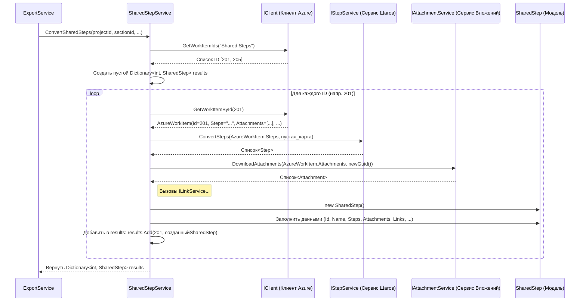

# Chapter 6: Сервис Общих Шагов


В предыдущей главе, [Сервис Тестовых Случаев](05_сервис_тестовых_случаев_.md), мы увидели, как наш «мастер по тест-кейсам» (`TestCaseService`) тщательно собирает финальный объект `TestCase` из информации, полученной из Azure DevOps, привлекая к работе помощников, таких как «Сервис Шагов» и «Сервис Вложений». Но что если в наших тест-кейсах часто повторяются одни и те же последовательности шагов? В Azure DevOps для этого есть специальный инструмент — **Общие Шаги** (Shared Steps).

Представьте, что вы пишете кулинарную книгу. У вас есть много рецептов (тест-кейсов), и в некоторых из них повторяется одно и то же действие, например, «приготовление базового соуса бешамель». Вместо того чтобы копировать инструкции по приготовлению соуса в каждый рецепт, вы можете вынести их в отдельный раздел «Базовые соусы» и в нужных рецептах просто писать «см. рецепт соуса бешамель». Это экономит место и упрощает обновление — если вы улучшите рецепт соуса, вам нужно будет изменить его только в одном месте.

В Azure DevOps «Общие Шаги» работают так же. Это переиспользуемые блоки шагов, которые можно вставить в разные тестовые случаи. Нашему `AzureExporter` нужно уметь правильно обрабатывать эти «общие рецепты», чтобы сохранить связь между ними и основными тест-кейсами при переносе в Test IT. Именно для этой задачи у нас есть свой специалист — **Сервис Общих Шагов (`SharedStepService`)**.

**Зачем нужен отдельный Сервис Общих Шагов?**

Хотя Общий Шаг в Azure DevOps во многом похож на Тестовый Случай (у него есть ID, заголовок, шаги, вложения), его роль и способ использования отличаются. Нам нужно:

1.  **Идентифицировать** именно Общие Шаги среди всех рабочих элементов.
2.  **Преобразовать** их в специальный формат `SharedStep`, который понимает Test IT. Этот формат похож на `TestCase`, но семантически отличается.
3.  **Сохранить информацию** о них так, чтобы [Сервис Тестовых Случаев](05_сервис_тестовых_случаев_.md) мог позже найти нужный `SharedStep` и правильно вставить его в последовательность шагов тест-кейса.

Выполнять эту специфическую логику внутри `TestCaseService` было бы неудобно и усложнило бы его. Поэтому мы создаем отдельного «мастера по общим шагам» — `SharedStepService`.

**Ключевые Идеи**

1.  **Специализация:** `SharedStepService` работает *только* с Общими Шагами (Shared Steps) из Azure DevOps.
2.  **Трансформация Данных:** Его главная задача — взять `AzureWorkItem` (полученный от [Клиента Azure DevOps](03_клиент_azure_devops_.md) и имеющий тип "Shared Steps") и превратить его в объект `SharedStep` (формат определен в библиотеке `Models`).
3.  **Использование Помощников:** Как и `TestCaseService`, он делегирует часть работы другим сервисам:
    *   **[Клиент Azure DevOps](03_клиент_azure_devops_.md):** Для получения информации об общих шагах из Azure.
    *   **[Сервис Шагов](07_сервис_шагов_.md):** Для преобразования строки с шагами в структурированный список.
    *   **[Сервис Вложений](08_сервис_вложений_.md):** Для скачивания прикрепленных файлов.
    *   **`ILinkService`:** Для обработки связанных ссылок.
    *   **`IAttributeService`:** Для обработки и привязки атрибутов (через `attributeMap`).
4.  **Результат — Словарь:** В отличие от `TestCaseService`, который возвращает простой список, `SharedStepService` возвращает *словарь* (`Dictionary<int, SharedStep>`). Ключом в этом словаре является ID Общего Шага из Azure DevOps, а значением — полностью преобразованный объект `SharedStep` с нашим внутренним ID (`Guid`). Это позволяет [Сервису Экспорта](02_сервис_экспорта_.md) и [Сервису Тестовых Случаев](05_сервис_тестовых_случаев_.md) легко находить нужный `SharedStep` по его исходному ID.

**Как он используется?**

[Сервис Экспорта](02_сервис_экспорта_.md) сначала вызывает `SharedStepService`, а *уже потом* — `TestCaseService`. Это важно, потому что `TestCaseService` нуждается в результатах работы `SharedStepService` (в том самом словаре), чтобы правильно обработать ссылки на общие шаги внутри тест-кейсов.

Вот как `ExportService` вызывает `SharedStepService`:

```csharp
// --- Фрагмент из Services/ExportService.cs ---
public class ExportService : IExportService
{
    // ... другие поля и конструктор ...
    private readonly ITestCaseService _testCaseService;
    private readonly ISharedStepService _sharedStepService; // Сервис для общих шагов

    // ... конструктор получает сервисы через DI ...

    public async Task ExportProject()
    {
        _logger.LogInformation("Starting export");
        // ... получение проекта, атрибутов ...

        var section = new Section { /* ... настройки секции ... */ };

        // 1. Сначала конвертируем Общие Шаги
        _logger.LogInformation("Converting Shared Steps...");
        // Вызываем сервис общих шагов, передаем ID проекта, ID секции и карту атрибутов
        var sharedSteps = await _sharedStepService.ConvertSharedSteps(
            project.Id,
            section.Id,
            attributeMap);
        // sharedSteps - это словарь { Azure ID : наш SharedStep объект }
        _logger.LogInformation("Converted {Count} Shared Steps", sharedSteps.Count);

        // 2. Создаем карту ID Azure -> наш ID (Guid) для передачи в TestCaseService
        var sharedStepsMap = sharedSteps.ToDictionary(k => k.Key, v => v.Value.Id);

        // 3. Теперь конвертируем Тест-кейсы, передавая им карту общих шагов
        _logger.LogInformation("Converting Test Cases...");
        var testCases = await _testCaseService.ConvertTestCases(
            project.Id,
            sharedStepsMap, // <--- Вот здесь используется результат работы SharedStepService
            section.Id,
            attributeMap);
        _logger.LogInformation("Converted {Count} Test Cases", testCases.Count);

        // 4. Запись общих шагов в файлы
        _logger.LogInformation("Writing Shared Steps...");
        foreach (var sharedStep in sharedSteps.Values) // Берем значения из словаря
        {
            await _writeService.WriteSharedStep(sharedStep);
        }

        // ... запись тест-кейсов и основного файла ...

        _logger.LogInformation("Ending export");
    }
}
```

**Объяснение:**

1.  `ExportService` вызывает `_sharedStepService.ConvertSharedSteps(...)`, передавая ему необходимую информацию.
2.  `ConvertSharedSteps` возвращает словарь `sharedSteps`, где ключи — это ID общих шагов из Azure, а значения — наши объекты `SharedStep`.
3.  `ExportService` преобразует этот словарь в `sharedStepsMap`, содержащий только пары `Azure ID -> Наш Guid ID`. Эта карта нужна `TestCaseService`, чтобы он мог найти правильный внутренний ID для общего шага, на который ссылается тест-кейс.
4.  После получения `sharedStepsMap`, `ExportService` вызывает `_testCaseService.ConvertTestCases(...)`.
5.  Наконец, `ExportService` проходит по *значениям* словаря `sharedSteps` (то есть по объектам `SharedStep`) и просит сервис записи (`_writeService`) сохранить каждый из них.

**Заглянем под капот: Как работает `SharedStepService`?**

Давайте разберем по шагам, что происходит внутри `SharedStepService`, когда `ExportService` вызывает его метод `ConvertSharedSteps`. Процесс очень похож на работу `TestCaseService`, но с некоторыми отличиями.

**Шаг за шагом (без кода):**

1.  **Получение Запроса:** Метод `ConvertSharedSteps` получает ID проекта, ID секции и карту атрибутов.
2.  **Запрос ID Общих Шагов:** Он обращается к [Клиенту Azure DevOps](03_клиент_azure_devops_.md) (`_client`) и просит: "Дай мне ID всех рабочих элементов типа 'Shared Steps' (`Constants.SharedStepType`) из проекта с ID = `projectId`".
3.  **Подготовка Словаря:** Создает пустой словарь `sharedSteps`, который будет хранить результат (`Dictionary<int, SharedStep>`).
4.  **Перебор ID:** Сервис получает список ID (например, `[201, 205]`) и начинает обрабатывать их по одному.
5.  **Запрос Деталей:** Для каждого ID (например, `201`) он снова обращается к `_client`: "Дай мне полную информацию (`AzureWorkItem`) для рабочего элемента с ID = 201".
6.  **Получение "Анкеты":** Клиент возвращает `AzureWorkItem` с заголовком, шагами (строкой), вложениями, ссылками и т.д.
7.  **Вызов Помощников:** `SharedStepService` использует `AzureWorkItem` и вызывает своих помощников:
    *   Передает поле `Steps` [Сервису Шагов](07_сервис_шагов_.md) (`_stepService`). **Важно:** при обработке шагов *внутри* общего шага мы передаем *пустой* словарь `sharedStepsMap`. Это потому, что Общие Шаги в Azure DevOps не могут ссылаться на *другие* Общие Шаги (по крайней мере, в этой реализации мы это не поддерживаем).
    *   Передает `Attachments` [Сервису Вложений](08_сервис_вложений_.md) (`_attachmentService`), который скачивает файлы.
    *   Передает `Links` сервису `_linkService` для обработки ссылок.
8.  **Сборка Объекта `SharedStep`:** Создает новый объект `SharedStep` (из библиотеки `Models`). Заполняет его поля (`Id`, `Name`, `Description`, `Steps`, `Attachments`, `Links`, `Attributes` и т.д.), используя данные из `AzureWorkItem` и результаты работы сервисов-помощников. Генерирует новый уникальный ID (`Guid`) для этого `SharedStep`. Устанавливает `SectionId`.
9.  **Добавление в Словарь:** Готовый `SharedStep` добавляется в словарь `sharedSteps`. Ключом является *исходный ID из Azure* (`workItemId`), а значением — созданный объект `SharedStep`. Например: `sharedSteps.Add(201, созданныйSharedStepObject)`.
10. **Возврат Результата:** После обработки всех ID, `SharedStepService` возвращает заполненный словарь `sharedSteps` [Сервису Экспорта](02_сервис_экспорта_.md).

**Диаграмма Взаимодействия:**



**Разбор Кода `SharedStepService.cs`**

Реализация находится в файле `Services/SharedStepService.cs`.

**1. Структура Класса и Зависимости:**

```csharp
// --- Файл: Services/SharedStepService.cs ---
using AzureExporter.Client;
using Microsoft.Extensions.Logging;
// using Microsoft.TeamFoundation.WorkItemTracking.WebApi.Models; (Может не понадобиться напрямую)
using Models; // Для SharedStep, Step, Attachment, Link и т.д.
using Constants = AzureExporter.Models.Constants; // Для констант типов
// ... другие using ...

namespace AzureExporter.Services;

// Класс реализует интерфейс ISharedStepService
// Может наследоваться от WorkItemBaseService для общих методов (ConvertPriority, ConvertTags)
public class SharedStepService : WorkItemBaseService, ISharedStepService
{
    // Приватные поля для хранения зависимостей
    private readonly ILogger<SharedStepService> _logger;
    private readonly IClient _client;           // Клиент Azure
    private readonly IStepService _stepService;   // Сервис для шагов
    private readonly IAttachmentService _attachmentService; // Сервис для вложений
    private readonly ILinkService _linkService;   // Сервис для ссылок

    // Конструктор: Сюда DI-контейнер передает нужные сервисы
    public SharedStepService(ILogger<SharedStepService> logger, IClient client, IStepService stepService,
        IAttachmentService attachmentService, ILinkService linkService)
    {
        _logger = logger;
        _client = client;
        _stepService = stepService;
        _attachmentService = attachmentService;
        _linkService = linkService;
        // Сохраняем все полученные сервисы
    }

    // Основной метод конвертации (о нем ниже)
    public async Task<Dictionary<int, SharedStep>> ConvertSharedSteps(Guid projectId, Guid sectionId,
        Dictionary<string, Guid> attributeMap)
    {
        // ... логика конвертации ...
    }

    // ... могут быть унаследованы или определены вспомогательные методы ...
}
```

*   Класс реализует интерфейс `ISharedStepService` (файл `Services/ISharedStepService.cs`), который определяет метод `ConvertSharedSteps`.
*   Он также может наследоваться от `WorkItemBaseService` для использования общих вспомогательных функций.
*   В конструкторе он получает и сохраняет все необходимые зависимости: логгер, клиент Azure, сервис шагов, сервис вложений и сервис ссылок.

**2. Метод `ConvertSharedSteps` (упрощенные шаги):**

```csharp
// Внутри класса SharedStepService
public async Task<Dictionary<int, SharedStep>> ConvertSharedSteps(Guid projectId, Guid sectionId,
    Dictionary<string, Guid> attributeMap)
{
    _logger.LogInformation("Конвертируем общие шаги...");

    // Шаг 2: Запрос ID Общих Шагов у клиента
    var workItemIds = await _client.GetWorkItemIds(Constants.SharedStepType); // Constants.SharedStepType = "Shared Steps"
    _logger.LogDebug("Найдено {Count} общих шагов: {@WorkItems}", workItemIds.Count, workItemIds);

    // Шаг 3: Подготовка Словаря для результатов
    var sharedSteps = new Dictionary<int, SharedStep>();

    // Шаг 4: Перебор ID
    foreach (var workItemId in workItemIds)
    {
        _logger.LogDebug("Конвертируем общий шаг ID: {Id}", workItemId);

        // Шаг 5-6: Запрос Деталей (AzureWorkItem) у клиента
        var azureWorkItem = await _client.GetWorkItemById(workItemId);
        _logger.LogDebug("Получен AzureWorkItem для общего шага: {@AzureWorkItem}", azureWorkItem);

        // Шаг 7: Вызов Помощников
        // Преобразуем шаги, передавая ПУСТУЮ карту для вложенных общих шагов
        var steps = _stepService.ConvertSteps(azureWorkItem.Steps, new Dictionary<int, Guid>());
        _logger.LogDebug("Сконвертировано {Count} шагов", steps.Count);

        // Скачиваем вложения
        var sharedStepGuid = Guid.NewGuid(); // Генерируем уникальный ID для SharedStep
        var tmsAttachments = await _attachmentService.DownloadAttachments(azureWorkItem.Attachments, sharedStepGuid);
        _logger.LogDebug("Скачано {Count} вложений", tmsAttachments.Count);

        // Преобразуем ссылки
        var links = _linkService.CovertLinks(azureWorkItem.Links);
        _logger.LogDebug("Сконвертировано {Count} ссылок", links.Count);

        // Шаг 8: Сборка Финального Объекта SharedStep
        var step = new SharedStep
        {
            Id = sharedStepGuid, // Наш новый уникальный ID
            Name = azureWorkItem.Title,
            Steps = steps, // Результат от Сервиса Шагов
            Description = azureWorkItem.Description,
            State = StateType.NotReady, // Пример: начальный статус
            Priority = ConvertPriority(azureWorkItem.Priority), // Используем общий метод
            Attributes = ConvertAttributes(azureWorkItem, attributeMap), // Привязываем атрибуты
            Links = links, // Результат от Сервиса Ссылок
            Attachments = tmsAttachments, // Результат от Сервиса Вложений
            SectionId = sectionId, // ID секции
            Tags = ConvertTags(azureWorkItem.Tags) // Используем общий метод
        };

        _logger.LogDebug("Сконвертированный SharedStep: {@Step}", step);

        // Шаг 9: Добавление в Словарь (ключ - ID из Azure)
        sharedSteps.Add(workItemId, step);
    }

    _logger.LogInformation("Конвертация общих шагов завершена.");
    // Шаг 10: Возврат Результата
    return sharedSteps;
}
```

**Объяснение ключевых моментов:**

*   **`await _client.GetWorkItemIds(Constants.SharedStepType)`**: Получаем список ID всех элементов типа "Shared Steps".
*   **`var sharedSteps = new Dictionary<int, SharedStep>();`**: Инициализируем словарь для хранения результатов.
*   **`foreach (...)`**: Цикл по каждому ID.
*   **`await _client.GetWorkItemById(workItemId)`**: Получаем `AzureWorkItem` для текущего общего шага.
*   **`_stepService.ConvertSteps(azureWorkItem.Steps, new Dictionary<int, Guid>())`**: Ключевой момент — передаем *пустой* словарь для `sharedStepMap` при конвертации шагов самого общего шага.
*   **`await _attachmentService.DownloadAttachments(...)`**: Скачиваем вложения.
*   **`_linkService.CovertLinks(...)`**: Конвертируем ссылки.
*   **`new SharedStep { ... }`**: Создаем финальный объект `SharedStep`.
*   **`sharedSteps.Add(workItemId, step)`**: Добавляем результат в словарь, используя исходный `workItemId` как ключ.
*   **`return sharedSteps`**: Возвращаем словарь.

**Заключение**

В этой главе мы познакомились с **Сервисом Общих Шагов (`SharedStepService`)**. Мы узнали, что он играет важную роль в обработке переиспользуемых блоков шагов из Azure DevOps:

*   Он **специализируется** на поиске и преобразовании рабочих элементов типа "Shared Steps".
*   Он **трансформирует** `AzureWorkItem` в объект `SharedStep` для Test IT, используя помощь других сервисов ([Сервис Шагов](07_сервис_шагов_.md), [Сервис Вложений](08_сервис_вложений_.md) и др.).
*   Он **возвращает результат в виде словаря**, где ключ — ID из Azure, а значение — наш объект `SharedStep`. Это позволяет другим частям системы (особенно [Сервису Тестовых Случаев](05_сервис_тестовых_случаев_.md)) легко находить и использовать преобразованные общие шаги.

Мы уже несколько раз упоминали, что и `TestCaseService`, и `SharedStepService` обращаются к [Сервису Шагов](07_сервис_шагов_.md) для преобразования поля `Steps`. Как же именно происходит эта магия? Как строка с шагами превращается в структурированный список? Об этом подробно мы поговорим в следующей главе, посвященной [Сервису Шагов](07_сервис_шагов_.md).

---

Generated by [AI Codebase Knowledge Builder](https://github.com/The-Pocket/Tutorial-Codebase-Knowledge)