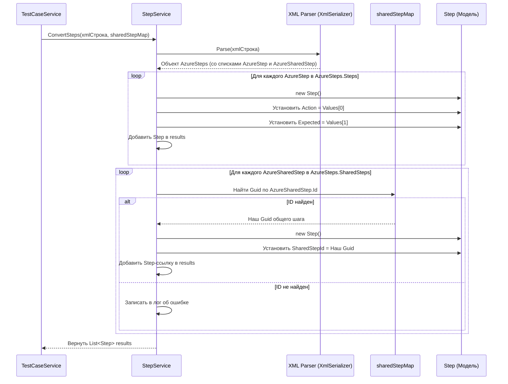

# Chapter 7: Сервис Шагов


В предыдущих главах мы познакомились с [Сервисом Тестовых Случаев](05_сервис_тестовых_случаев_.md) и [Сервисом Общих Шагов](06_сервис_общих_шагов_.md). Оба эти сервиса берут информацию из `AzureWorkItem` и преобразуют ее в понятные для Test IT форматы `TestCase` и `SharedStep`. Мы упоминали, что одной из ключевых задач при этом преобразовании является обработка поля `Steps`. Но как именно это происходит? Как мы превращаем поле с шагами из Azure DevOps в структурированный список шагов для Test IT?

Представьте, что вы получили старинный свиток с инструкциями, написанными особым шифром (это поле `Steps` в `AzureWorkItem`, которое часто хранится в формате XML). Чтобы понять, что делать, вам нужен специалист-дешифратор, который умеет:

1.  Читать этот особый шифр (XML).
2.  Разбивать его на отдельные указания (шаги).
3.  Для каждого указания определять, что нужно *сделать* (Action) и что должно *получиться* (Expected Result).
4.  Распознавать специальные символы, которые отсылают к другим инструкциям (ссылки на Общие Шаги).

В нашем `AzureExporter` роль такого дешифратора выполняет **Сервис Шагов (`StepService`)**.

**Зачем нужен Сервис Шагов?**

В Azure DevOps шаги тестовых случаев и общих шагов часто хранятся в специальном формате, обычно XML. Выглядеть это может примерно так (упрощенно):

```xml
<steps>
  <step>
    <parameterizedString>1. Войти в систему</parameterizedString>
    <parameterizedString>Система успешно открыта</parameterizedString>
  </step>
  <step>
    <parameterizedString>2. Нажать кнопку 'Профиль'</parameterizedString>
    <parameterizedString>Открылась страница профиля</parameterizedString>
  </step>
  <!-- Ссылка на общий шаг -->
  <compref ref="201" />
</steps>
```

Напрямую работать с такой XML-строкой в [Сервисе Тестовых Случаев](05_сервис_тестовых_случаев_.md) или [Сервисе Общих Шагов](06_сервис_общих_шагов_.md) было бы очень неудобно. Нам нужно преобразовать это в ясный и структурированный список объектов `Step`, где каждый объект содержит отдельные поля для действия, ожидаемого результата и, возможно, ссылку на общий шаг.

**Сервис Шагов** предоставляет один главный метод (`ConvertSteps`), который берет эту XML-строку и карту общих шагов (`sharedStepMap`) и возвращает готовый список `List<Step>` для использования в Test IT.

**Ключевые Идеи**

1.  **Парсинг XML:** Сервис умеет разбирать (парсить) XML-структуру, в которой Azure DevOps хранит шаги.
2.  **Извлечение Данных:** Он извлекает из XML действие (Action) и ожидаемый результат (Expected) для каждого шага.
3.  **Обработка Ссылок на Общие Шаги:** Он распознает теги, ссылающиеся на общие шаги (`<compref>`), и с помощью словаря `sharedStepMap` находит соответствующий ID общего шага в Test IT.
4.  **Создание Структуры Test IT:** Результатом его работы является список объектов `Step` (из библиотеки `Models`), готовых для включения в `TestCase` или `SharedStep`.

**Как он используется?**

И [Сервис Тестовых Случаев](05_сервис_тестовых_случаев_.md), и [Сервис Общих Шагов](06_сервис_общих_шагов_.md) получают `IStepService` через конструктор и вызывают его метод `ConvertSteps`.

Вот пример из `TestCaseService`:

```csharp
// --- Фрагмент из Services/TestCaseService.cs ---
public class TestCaseService : WorkItemBaseService, ITestCaseService
{
    // ... другие поля ...
    private readonly IStepService _stepService; // Наш сервис шагов

    public TestCaseService(..., IStepService stepService, ...)
    {
        // ...
        _stepService = stepService; // Сохраняем сервис
    }

    public async Task<List<TestCase>> ConvertTestCases(..., Dictionary<int, Guid> sharedStepMap, ...)
    {
        // ...
        foreach (var workItemId in workItemsIds)
        {
            var azureWorkItem = await _client.GetWorkItemById(workItemId);
            // ...

            // Вот здесь вызывается Сервис Шагов!
            // Передаем ему строку с шагами из AzureWorkItem и карту общих шагов
            var steps = _stepService.ConvertSteps(azureWorkItem.Steps, sharedStepMap);

            _logger.LogDebug("Найдено {@Steps} шагов", steps.Count);

            // Создаем TestCase, используя полученный список steps
            var tmsTestCase = new TestCase
            {
                // ... другие поля ...
                Steps = steps, // <--- Используем результат работы StepService
                // ...
            };
            // ...
        }
        // ...
        return testCases;
    }
    // ...
}
```

**Объяснение:**

1.  `TestCaseService` получает экземпляр `IStepService` (реализацию `StepService`) через конструктор.
2.  Внутри цикла обработки тест-кейсов, после получения `azureWorkItem`, он вызывает `_stepService.ConvertSteps()`.
3.  В метод передается `azureWorkItem.Steps` (та самая XML-строка) и `sharedStepMap` (словарь, который помогает найти нужный `SharedStep` по его ID из Azure).
4.  Метод `ConvertSteps` возвращает `List<Step>`, который затем присваивается полю `Steps` создаваемого объекта `TestCase`.

Аналогично поступает и [Сервис Общих Шагов](06_сервис_общих_шагов_.md), но при вызове `ConvertSteps` он передает *пустой* `sharedStepMap`, так как общие шаги не могут ссылаться на другие общие шаги.

**Заглянем под капот: Как работает `StepService`?**

Давайте посмотрим на внутренний процесс дешифровки, когда вызывается метод `ConvertSteps`.

**Шаг за шагом (логика работы):**

1.  **Получение Данных:** `StepService` получает XML-строку (`stepsContent`) и карту `sharedStepMap`.
2.  **Проверка на Пустоту:** Если строка пустая, сразу возвращается пустой список шагов.
3.  **Парсинг XML:** Используется специальный инструмент C# (`XmlSerializer`) для преобразования XML-строки в объекты C#. Для этого у нас есть вспомогательные классы (`AzureSteps`, `AzureStep`, `AzureSharedStep` в файле `Models/AzureStep.cs`), структура которых соответствует ожидаемой XML.
    *   `AzureSteps` - корневой элемент, содержит списки обычных шагов (`Steps`) и ссылок на общие (`SharedSteps`).
    *   `AzureStep` - представляет один обычный шаг, содержит список строк (`Values`), где первая строка - действие, вторая - ожидаемый результат.
    *   `AzureSharedStep` - представляет ссылку на общий шаг, содержит его ID в Azure (`Id`).
4.  **Обработка Обычных Шагов:** Сервис проходит по списку `azureSteps.Steps`. Для каждого `AzureStep`:
    *   Создается новый объект `Step` (из `Models`).
    *   Поле `Action` заполняется из `azureStep.Values[0]`.
    *   Поле `Expected` заполняется из `azureStep.Values[1]`.
    *   Поля для вложений (`ActionAttachments` и т.д.) создаются пустыми (обработкой вложений занимается другой сервис).
    *   Созданный `Step` добавляется в итоговый список.
5.  **Обработка Ссылок на Общие Шаги:** Сервис проходит по списку `azureSteps.SharedSteps` (ссылок `<compref>`). Для каждой `AzureSharedStep`:
    *   Он ищет `azureSharedStep.Id` (ID из Azure) в переданном словаре `sharedStepMap`.
    *   **Если ID найден:** В `sharedStepMap` находится соответствующий `Guid` (внутренний ID общего шага в Test IT). Создается новый объект `Step`. У этого объекта заполняется *только* поле `SharedStepId` этим `Guid`. Остальные поля (`Action`, `Expected`) остаются пустыми. Этот `Step`-ссылка добавляется в итоговый список.
    *   **Если ID не найден:** Записывается сообщение в лог, и этот общий шаг пропускается.
6.  **Возврат Результата:** Сервис возвращает итоговый список `List<Step>`, содержащий и обычные шаги, и шаги-ссылки на общие.

**Диаграмма Взаимодействия:**



**Разбор Кода `StepService.cs`**

Основная логика находится в файле `Services/StepService.cs`.

**1. Структура Класса и Зависимости:**

```csharp
// --- Файл: Services/StepService.cs ---
using System.Xml.Serialization; // Для разбора XML
using AzureExporter.Models;   // Для AzureSteps, AzureStep, AzureSharedStep
using Microsoft.Extensions.Logging; // Для логирования
using Models;                     // Для итогового объекта Step

namespace AzureExporter.Services;

public class StepService : IStepService // Реализует интерфейс IStepService
{
    private readonly ILogger<StepService> _logger; // Сервис для записи логов

    // Конструктор: получает логгер через DI
    public StepService(ILogger<StepService> logger)
    {
        _logger = logger;
    }

    // Основной метод конвертации (ниже)
    public List<Step> ConvertSteps(string stepsContent, Dictionary<int, Guid> sharedStepMap)
    {
        // ... логика ...
    }

    // Вспомогательные методы (ниже)
    // private static Step ConvertStep(AzureStep azureStep) { ... }
    // private static AzureSteps ParseStepsFromXmlContent(string stepsContent) { ... }
}
```

*   Класс `StepService` реализует интерфейс `IStepService`, который определяет единственный метод `ConvertSteps`.
*   Он зависит только от `ILogger` для записи сообщений в лог.

**2. Интерфейс `IStepService.cs`:**

```csharp
// --- Файл: Services/IStepService.cs ---
using Models; // Используем модель Step из общей библиотеки

namespace AzureExporter.Services;

// Интерфейс определяет контракт для Сервиса Шагов
public interface IStepService
{
    // Метод принимает XML-строку с шагами из Azure
    // и словарь для поиска ID общих шагов.
    // Возвращает список объектов Step для Test IT.
    List<Step> ConvertSteps(string steps, Dictionary<int, Guid> sharedStepMap);
}
```

**3. Модели для XML (`Models/AzureStep.cs`):**

Эти классы помогают `XmlSerializer` понять структуру XML.

```csharp
// --- Файл: Models/AzureStep.cs ---
using System.Xml.Serialization;

namespace AzureExporter.Models;

// Корневой элемент XML
[XmlRoot("steps")]
public class AzureSteps
{
    // Список обычных шагов (<step>)
    [XmlElement("step")]
    public List<AzureStep> Steps { get; set; } = new(); // Инициализируем пустым списком

    // Список ссылок на общие шаги (<compref>)
    [XmlElement("compref")]
    public List<AzureSharedStep> SharedSteps { get; set; } = new(); // Иниц. пустым списком
}

// Представляет обычный шаг (<step>)
public class AzureStep
{
    // Список строк внутри шага (<parameterizedString>)
    // Обычно [0] = Действие, [1] = Ожидаемый результат
    [XmlElement("parameterizedString")]
    public List<string> Values { get; set; }
}

// Представляет ссылку на общий шаг (<compref>)
public class AzureSharedStep
{
    // Атрибут 'ref' содержит ID общего шага в Azure
    [XmlAttribute("ref")]
    public int Id { get; set; }

    // Общий шаг сам по себе тоже может содержать шаги,
    // но мы их не обрабатываем на этом уровне (для Test IT нужна только ссылка)
    // [XmlElement("step")]
    // public List<AzureStep> Steps { get; set; }
}
```

*   Атрибуты `[XmlRoot]`, `[XmlElement]`, `[XmlAttribute]` указывают `XmlSerializer`, как сопоставить XML-теги и атрибуты со свойствами классов C#.

**4. Метод `ConvertSteps`:**

```csharp
// --- Внутри класса StepService ---
public List<Step> ConvertSteps(string stepsContent, Dictionary<int, Guid> sharedStepMap)
{
    _logger.LogDebug("Разбираем шаги: {@AzureSteps}", stepsContent);

    // Шаг 2: Проверка на пустоту
    if (string.IsNullOrWhiteSpace(stepsContent))
    {
        return new List<Step>(); // Возвращаем пустой список
    }

    // Шаг 3: Парсинг XML
    AzureSteps azureSteps;
    try
    {
        azureSteps = ParseStepsFromXmlContent(stepsContent); // Вызов вспомогательного метода
    }
    catch (Exception ex)
    {
        _logger.LogError(ex, "Ошибка парсинга XML для шагов: {StepsContent}", stepsContent);
        return new List<Step>(); // Возвращаем пустой список при ошибке
    }

    var steps = new List<Step>(); // Готовим итоговый список

    // Шаг 4: Обработка Обычных Шагов
    foreach (var azureStep in azureSteps.Steps)
    {
        var step = ConvertStep(azureStep); // Вызов вспомогательного метода
        steps.Add(step);
    }

    // Шаг 5: Обработка Ссылок на Общие Шаги
    foreach (var sharedStepRef in azureSteps.SharedSteps)
    {
        // Ищем ID из <compref> в карте sharedStepMap
        if (sharedStepMap.TryGetValue(sharedStepRef.Id, out var sharedStepGuid))
        {
            // ID найден! Создаем Step-ссылку
            steps.Add(new Step
            {
                SharedStepId = sharedStepGuid, // Указываем ID общего шага Test IT
                // Остальные поля не нужны для ссылки
                Action = string.Empty,
                Expected = string.Empty,
                ActionAttachments = new List<string>(),
                ExpectedAttachments = new List<string>(),
                TestDataAttachments = new List<string>()
            });
        }
        else
        {
            // ID не найден в карте (возможно, общий шаг не был экспортирован?)
            _logger.LogWarning(
                "Не найден общий шаг с Azure ID {AzureId} в карте общих шагов {@SharedStepMap}",
                sharedStepRef.Id, sharedStepMap.Keys);
        }
    }

    _logger.LogDebug("Сконвертировано {Count} шагов: {@Steps}", steps.Count, steps);
    // Шаг 6: Возврат Результата
    return steps;
}
```

**5. Вспомогательные методы `ParseStepsFromXmlContent` и `ConvertStep`:**

```csharp
// --- Внутри класса StepService ---

// Метод для парсинга XML строки
private static AzureSteps ParseStepsFromXmlContent(string stepsContent)
{
    // Используем стандартный XmlSerializer
    using var reader = new StringReader(stepsContent); // Читаем из строки
    var serializer = new XmlSerializer(typeof(AzureSteps)); // Говорим, какой тип ожидаем
    // Десериализуем (преобразуем XML в объект) и возвращаем
    return (AzureSteps)serializer.Deserialize(reader)!;
}

// Метод для конвертации одного обычного шага AzureStep в Step
private static Step ConvertStep(AzureStep azureStep)
{
    // Проверяем, что у шага есть хотя бы 2 строки (действие и результат)
    string action = (azureStep.Values?.Count > 0) ? azureStep.Values[0] : string.Empty;
    string expected = (azureStep.Values?.Count > 1) ? azureStep.Values[1] : string.Empty;

    return new Step
    {
        Action = action, // Берем первую строку
        Expected = expected, // Берем вторую строку
        // Вложения пока пустые
        ActionAttachments = new List<string>(),
        ExpectedAttachments = new List<string>(),
        TestDataAttachments = new List<string>(),
    };
}
```

*   `ParseStepsFromXmlContent` использует `XmlSerializer` для автоматического разбора XML.
*   `ConvertStep` просто берет первые две строки из `Values` как действие и ожидаемый результат.

**Заключение**

В этой главе мы детально рассмотрели **Сервис Шагов (`StepService`)** – нашего специалиста по дешифровке инструкций из Azure DevOps. Мы узнали, что:

*   Он отвечает за **преобразование XML-представления шагов** из Azure в структурированный `List<Step>` для Test IT.
*   Он **извлекает действия и ожидаемые результаты** для обычных шагов.
*   Он **распознает ссылки на общие шаги** и, используя `sharedStepMap`, преобразует их в специальные `Step`-объекты со ссылкой (`SharedStepId`).
*   Он является ключевым помощником для [Сервиса Тестовых Случаев](05_сервис_тестовых_случаев_.md) и [Сервиса Общих Шагов](06_сервис_общих_шагов_.md), позволяя им корректно формировать шаги для экспортируемых сущностей.

Теперь, когда мы понимаем, как обрабатываются шаги, остался еще один важный аспект тест-кейсов и общих шагов – вложенные файлы. Как `AzureExporter` скачивает их и связывает с нужными тест-кейсами или шагами? Об этом мы поговорим в следующей, заключительной главе основного цикла: [Сервис Вложений](08_сервис_вложений_.md).

---

Generated by [AI Codebase Knowledge Builder](https://github.com/The-Pocket/Tutorial-Codebase-Knowledge)