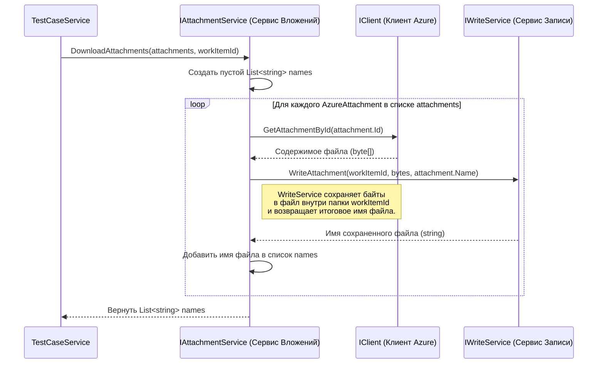

# Chapter 8: Сервис Вложений


В предыдущей главе, посвященной [Сервису Шагов](07_сервис_шагов_.md), мы разобрались, как `AzureExporter` расшифровывает и преобразует инструкции, записанные в шагах тест-кейсов и общих шагов. Мы увидели, как XML-строка превращается в структурированный список действий и ожидаемых результатов, включая ссылки на общие шаги.

Но часто шаги или сами рабочие элементы (тест-кейсы, общие шаги) содержат не только текст, но и прикрепленные файлы: скриншоты с ошибками, логи, примеры данных, диаграммы. Как же `AzureExporter` переносит эти важные файлы из Azure DevOps в нашу целевую систему? Для этого у нас есть специальный курьер – **Сервис Вложений (`AttachmentService`)**.

**Зачем нужен Сервис Вложений?**

Представьте, вы пишете тест-кейс, и один из шагов гласит: "Убедитесь, что появляется сообщение об ошибке (см. `error_screenshot.png`)". Или к общему шагу "Подключиться к базе данных" приложен файл конфигурации `db_config.ini`. Чтобы наш экспорт был полным, недостаточно просто скопировать текст тест-кейса – нужно также перенести и все связанные с ним файлы.

Просто получить список имен файлов недостаточно. Нам нужно:

1.  **Узнать**, какие файлы прикреплены к конкретному рабочему элементу (тест-кейсу или общему шагу).
2.  **Запросить** у Azure DevOps содержимое каждого файла.
3.  **Сохранить** это содержимое в виде файла на нашем диске, причем так, чтобы было понятно, к какому тест-кейсу или общему шагу он относится.

**Сервис Вложений** как раз и занимается этим. Он действует как специализированный курьер: получает от других сервисов (например, [Сервиса Тестовых Случаев](05_сервис_тестовых_случаев_.md)) список "посылок" (файлов), забирает их содержимое у Azure DevOps и передает на "склад" (сохраняет в нужную папку с помощью Сервиса Записи).

**Ключевые Идеи**

1.  **Фокус на Файлах:** Основная и единственная задача этого сервиса – скачивание файлов.
2.  **Сотрудничество:** Он не ищет файлы сам. Он получает список необходимых файлов (в виде объектов `AzureAttachment` с ID и именем) от сервисов, обрабатывающих рабочие элементы ([Сервис Тестовых Случаев](05_сервис_тестовых_случаев_.md), [Сервис Общих Шагов](06_сервис_общих_шагов_.md)).
3.  **Использование Помощников:** Для выполнения своей работы `AttachmentService` использует:
    *   **[Клиент Azure DevOps](03_клиент_azure_devops_.md) (`_client`):** Чтобы по ID вложения запросить и получить его содержимое (байты) от Azure DevOps API.
    *   **Сервис Записи (`IWriteService` `_writeService`):** Чтобы сохранить полученные байты в файл в правильном месте на диске. Сервис Записи также заботится о том, чтобы имена файлов были уникальными и сохранялись в подпапку, соответствующую ID родительского тест-кейса или общего шага.
4.  **Результат – Имена Файлов:** После скачивания и сохранения всех файлов сервис возвращает список _имен_ сохраненных файлов. Эти имена затем используются в объектах `TestCase` или `SharedStep` для ссылки на соответствующие файлы.

**Как он используется?**

`AttachmentService` обычно вызывается из [Сервиса Тестовых Случаев](05_сервис_тестовых_случаев_.md) или [Сервиса Общих Шагов](06_сервис_общих_шагов_.md) в процессе преобразования `AzureWorkItem`.

Давайте посмотрим на *упрощенный* пример вызова из `TestCaseService`:

```csharp
// --- Фрагмент из Services/TestCaseService.cs ---
public class TestCaseService : WorkItemBaseService, ITestCaseService
{
    // ... другие поля и зависимости ...
    private readonly IAttachmentService _attachmentService; // Наш сервис вложений

    public TestCaseService(..., IAttachmentService attachmentService, ...)
    {
        // ...
        _attachmentService = attachmentService; // Сохраняем сервис
        // ...
    }

    public async Task<List<TestCase>> ConvertTestCases(...)
    {
        // ...
        foreach (var workItemId in workItemsIds)
        {
            var azureWorkItem = await _client.GetWorkItemById(workItemId);
            // ...
            var testCaseGuid = Guid.NewGuid(); // Генерируем ID для нашего TestCase

            // Вот здесь вызывается Сервис Вложений!
            // Передаем список вложений из AzureWorkItem и наш ID тест-кейса
            var tmsAttachments = await _attachmentService.DownloadAttachments(
                azureWorkItem.Attachments, // Список AzureAttachment {Id, Name}
                testCaseGuid               // ID нашего тест-кейса для связывания
            );
            // tmsAttachments теперь содержит список имен сохраненных файлов,
            // например: ["attachment_1_logo.png", "attachment_2_error.log"]

            // Создаем TestCase, используя полученный список имен файлов
            var tmsTestCase = new TestCase
            {
                Id = testCaseGuid,
                // ... другие поля ...
                Attachments = tmsAttachments, // <--- Используем результат работы AttachmentService
                // ...
            };
            testCases.Add(tmsTestCase);
        }
        // ...
        return testCases;
    }
    // ...
}
```

**Объяснение:**

1.  `TestCaseService` получает экземпляр `IAttachmentService` через конструктор.
2.  При обработке очередного `azureWorkItem`, он генерирует уникальный `Guid` (`testCaseGuid`) для будущего объекта `TestCase`.
3.  Он вызывает метод `_attachmentService.DownloadAttachments()`.
4.  В метод передаются:
    *   `azureWorkItem.Attachments`: Список объектов `AzureAttachment`, где каждый содержит `Id` (уникальный идентификатор файла в Azure) и `Name` (оригинальное имя файла). Этот список был сформирован [Клиентом Azure DevOps](03_клиент_azure_devops_.md) при получении `AzureWorkItem`.
    *   `testCaseGuid`: Сгенерированный ID нашего `TestCase`. Это нужно, чтобы `AttachmentService` (а точнее, `WriteService`, которого он вызовет) знал, в какую подпапку сохранить файлы (обычно папка называется по этому `Guid`).
5.  Метод `DownloadAttachments` возвращает `List<string>` — список фактических имен файлов, под которыми они были сохранены на диске (эти имена могут немного отличаться от оригинальных, если `WriteService` пришлось обеспечить уникальность).
6.  Этот список имен (`tmsAttachments`) затем используется для заполнения поля `Attachments` в объекте `TestCase`.

Аналогично `AttachmentService` вызывается и из [Сервиса Общих Шагов](06_сервис_общих_шагов_.md).

**Заглянем под капот: Как работает `AttachmentService`?**

Давайте проследим, что происходит внутри `AttachmentService`, когда его вызывают для скачивания файлов.

**Шаг за шагом:**

1.  **Получение Запроса:** Метод `DownloadAttachments` получает список объектов `AzureAttachment` и `Guid` родительского элемента (`workItemId`).
2.  **Подготовка Списка Результатов:** Создается пустой список `names`, в который будут собираться имена сохраненных файлов.
3.  **Перебор Вложений:** Сервис начинает перебирать каждый объект `AzureAttachment` из полученного списка.
4.  **Запрос Контента Файла:** Для текущего вложения `attachment` он обращается к [Клиенту Azure DevOps](03_клиент_azure_devops_.md) (`_client`) и вызывает метод `GetAttachmentById(attachment.Id)`. Этот метод отправляет запрос в Azure API и возвращает содержимое файла в виде массива байт (`byte[]`).
5.  **Сохранение Файла:** Получив массив байт (`bytes`), сервис обращается к Сервису Записи (`_writeService`) и вызывает метод `WriteAttachment(workItemId, bytes, attachment.Name)`. `WriteService` берет эти байты, создает файл с именем `attachment.Name` (или модифицированным именем для уникальности) внутри папки, соответствующей `workItemId`, и записывает туда байты. `WriteService` возвращает фактическое имя сохраненного файла.
6.  **Добавление Имени в Список:** Имя файла, возвращенное `WriteService`, добавляется в список `names`.
7.  **Повтор:** Шаги 4-6 повторяются для всех вложений в списке.
8.  **Возврат Результата:** После обработки всех вложений метод возвращает список `names`, содержащий имена всех успешно скачанных и сохраненных файлов.

**Диаграмма Взаимодействия:**



**Разбор Кода `AttachmentService.cs`**

Теперь посмотрим на реализацию.

**1. Интерфейс `IAttachmentService.cs`:**

Сначала интерфейс, который определяет, что должен уметь наш сервис.

```csharp
// --- Файл: Services/IAttachmentService.cs ---
using AzureExporter.Models; // Используем модель AzureAttachment

namespace AzureExporter.Services;

// Интерфейс определяет контракт для Сервиса Вложений
public interface IAttachmentService
{
    // Метод принимает список информации о вложениях из Azure
    // и ID родительского элемента (TestCase или SharedStep) в нашей системе.
    // Возвращает список имен фактически сохраненных файлов.
    Task<List<string>> DownloadAttachments(List<AzureAttachment> attachments, Guid workItemId);
}

```

*   Интерфейс `IAttachmentService` объявляет один асинхронный метод `DownloadAttachments`, который принимает список `AzureAttachment` и `Guid` родителя, а возвращает `Task<List<string>>`.

**2. Класс `AttachmentService.cs`:**

А вот и сам класс, реализующий этот интерфейс.

```csharp
// --- Файл: Services/AttachmentService.cs ---
using AzureExporter.Client;     // Для IClient
using AzureExporter.Models;     // Для AzureAttachment
using JsonWriter;               // Для IWriteService
using Microsoft.Extensions.Logging; // Для ILogger
// using Microsoft.TeamFoundation.WorkItemTracking.WebApi.Models; // Может не понадобиться напрямую

namespace AzureExporter.Services;

// Класс реализует интерфейс IAttachmentService
public class AttachmentService : IAttachmentService
{
    // Приватные поля для хранения зависимостей
    private readonly ILogger<AttachmentService> _logger; // Логгер
    private readonly IClient _client;                   // Клиент Azure для скачивания
    private readonly IWriteService _writeService;       // Сервис Записи для сохранения

    // Конструктор: Сюда DI-контейнер передает нужные сервисы
    public AttachmentService(ILogger<AttachmentService> logger, IClient client, IWriteService writeService)
    {
        _logger = logger;
        _client = client;
        _writeService = writeService;
        // Сохраняем полученные зависимости
    }

    // Реализация основного метода
    public async Task<List<string>> DownloadAttachments(List<AzureAttachment> attachments, Guid workItemId)
    {
        _logger.LogInformation("Начинаем скачивание вложений для элемента {WorkItemId}...", workItemId);

        // Шаг 2: Подготовка списка имен
        var names = new List<string>();

        // Шаг 3: Перебор вложений
        foreach (var attachment in attachments)
        {
            _logger.LogDebug("Скачиваем вложение: {Name} (Azure ID: {AzureId})", attachment.Name, attachment.Id);

            try // Добавим обработку ошибок на случай проблем со скачиванием/записью
            {
                // Шаг 4: Запрос Контента Файла у клиента
                var bytes = await _client.GetAttachmentById(attachment.Id);
                _logger.LogDebug("Получено {ByteCount} байт для файла {Name}", bytes.Length, attachment.Name);

                // Шаг 5: Сохранение Файла через Сервис Записи
                var savedName = await _writeService.WriteAttachment(workItemId, bytes, attachment.Name);
                _logger.LogDebug("Файл сохранен как: {SavedName}", savedName);

                // Шаг 6: Добавление Имени в Список
                names.Add(savedName);
            }
            catch (Exception ex)
            {
                // Записываем ошибку, но продолжаем со следующими файлами
                _logger.LogError(ex, "Ошибка при скачивании или сохранении вложения {Name} (ID: {Id}) для элемента {WorkItemId}",
                    attachment.Name, attachment.Id, workItemId);
            }
        }

        _logger.LogInformation("Завершено скачивание {Count} вложений для элемента {WorkItemId}. Имена: {@Names}", names.Count, workItemId, names);
        // Шаг 8: Возврат Результата
        return names;
    }
}
```

*   **Зависимости:** Класс зависит от `ILogger`, `IClient` и `IWriteService`, которые получает через конструктор.
*   **`DownloadAttachments`:**
    *   Инициализирует пустой список `names`.
    *   Использует цикл `foreach` для перебора всех `attachment` в списке `attachments`.
    *   Внутри цикла:
        *   Вызывает `_client.GetAttachmentById(attachment.Id)` для получения `byte[]`.
        *   Вызывает `_writeService.WriteAttachment(workItemId, bytes, attachment.Name)` для сохранения байтов в файл и получения его имени `savedName`.
        *   Добавляет `savedName` в список `names`.
    *   Добавлена базовая обработка ошибок (`try-catch`) на случай, если отдельный файл не удастся скачать или сохранить – это не должно прерывать процесс для остальных файлов.
    *   Возвращает список `names`.

**Заключение**

В этой заключительной главе основного цикла мы рассмотрели **Сервис Вложений (`AttachmentService`)**. Мы узнали, что он выполняет критически важную, хотя и узкоспециализированную, задачу:

*   Он отвечает за **скачивание файлов**, прикрепленных к рабочим элементам в Azure DevOps.
*   Он получает **список файлов** для скачивания от других сервисов (например, [Сервиса Тестовых Случаев](05_сервис_тестовых_случаев_.md)).
*   Он **использует [Клиент Azure DevOps](03_клиент_azure_devops_.md)** для получения содержимого файлов и **Сервис Записи (`IWriteService`)** для их сохранения на диск.
*   Он **возвращает список имен** сохраненных файлов, которые затем используются для связи в экспортированных данных.

На этом мы завершаем подробный разбор основных компонентов (`App`, `ExportService`, `Client`, `AzureWorkItem`, `TestCaseService`, `SharedStepService`, `StepService`, `AttachmentService`), составляющих ядро `AzureExporter`. Вы увидели, как эти компоненты взаимодействуют друг с другом, чтобы выполнить задачу экспорта данных из Azure DevOps, преобразуя их шаг за шагом в формат, понятный для Test IT.

Теперь у вас должно быть хорошее представление о внутренней архитектуре и потоке данных в приложении `AzureExporter`.

---

Generated by [AI Codebase Knowledge Builder](https://github.com/The-Pocket/Tutorial-Codebase-Knowledge)