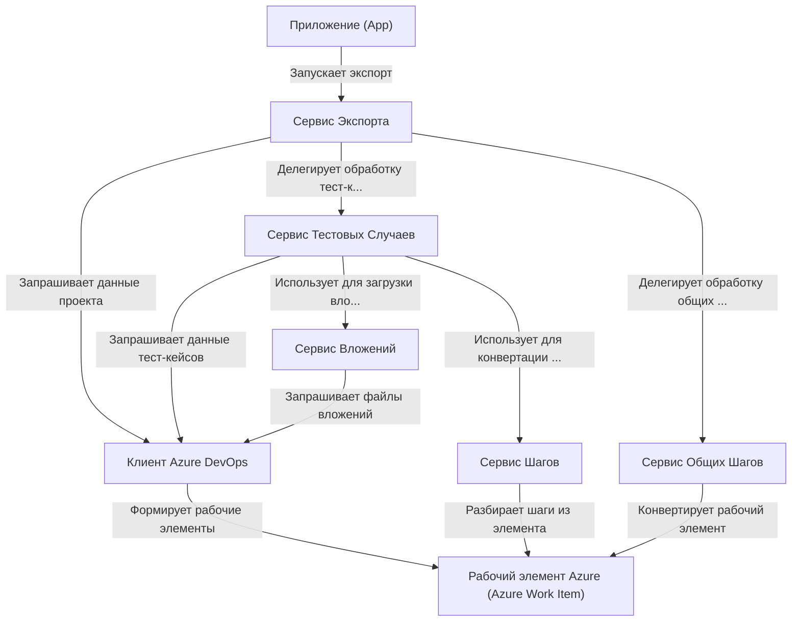

# Tutorial: AzureExporter

Проект **AzureExporter** предназначен для *экспорта* данных из **Azure DevOps**.
Он подключается к Azure, используя ваш *токен*, находит указанный проект и извлекает из него **тестовые случаи** и **общие шаги** вместе с их деталями (описание, шаги, вложения).
Затем он *преобразует* эти данные в формат, совместимый с системой **Test IT**, и сохраняет результат в виде файлов JSON.

## Chapters

1. [Приложение (App)
](01_приложение__app__.md)
2. [Сервис Экспорта
](02_сервис_экспорта_.md)
3. [Клиент Azure DevOps
](03_клиент_azure_devops_.md)
4. [Рабочий элемент Azure (Azure Work Item)
](04_рабочий_элемент_azure__azure_work_item__.md)
5. [Сервис Тестовых Случаев
](05_сервис_тестовых_случаев_.md)
6. [Сервис Общих Шагов
](06_сервис_общих_шагов_.md)
7. [Сервис Шагов
](07_сервис_шагов_.md)
8. [Сервис Вложений
](08_сервис_вложений_.md)

---

Generated by [AI Codebase Knowledge Builder](https://github.com/The-Pocket/Tutorial-Codebase-Knowledge)