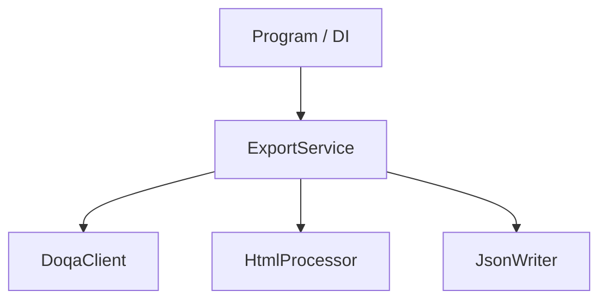

# Tutorial: DoqaExporter

*DoqaExporter* exports test cases and checklists from [DOQA TMS](https://doqa.app)
into the JSON format used by [Test IT project-importer](https://github.com/testit-tms/project-importer).

It authenticates against the DOQA API, walks folder trees, converts HTML content and attachments,
then writes `main.json` and per-case folders via the shared `JsonWriter` library.

## Chapters

1. [Integration changes](01_интеграция_и_доработки_.md)
