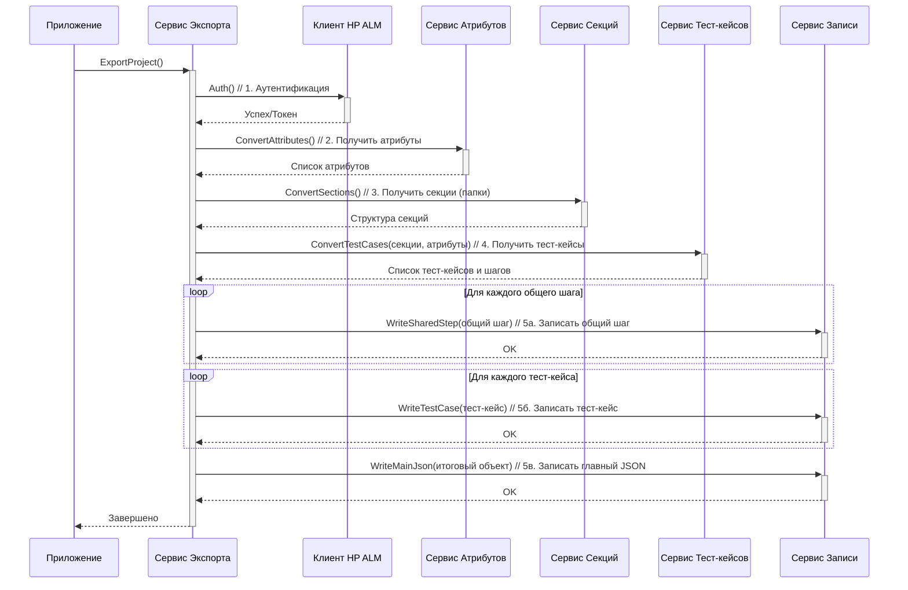

# Chapter 1: Сервис Экспорта


Добро пожаловать в руководство по `HPALMExporter`! Этот инструмент поможет вам перенести ваши данные из системы HP ALM (Application Lifecycle Management) в удобный формат файлов. В этой первой главе мы познакомимся с главным координатором всего процесса — **Сервисом Экспорта**.

Представьте, что вам нужно перевезти весь ваш офис в новое здание. Вы не будете сами носить каждый стул и стол. Скорее всего, вы наймете менеджера по переезду. Этот менеджер (наш **Сервис Экспорта**) не будет сам таскать мебель, но он:

1.  Разработает план переезда.
2.  Договорится с грузчиками (другими сервисами в нашей программе).
3.  Скажет им, что и куда нести (получит данные из HP ALM).
4.  Убедится, что все вещи доставлены и расставлены в новом офисе (запишет данные в файлы).

Именно эту роль "менеджера" или "дирижера" выполняет `ExportService` в `HPALMExporter`. Он запускает и координирует все шаги, необходимые для извлечения данных из HP ALM и их сохранения.

## Как это работает на высоком уровне?

Основная задача `ExportService` - выполнить полный цикл экспорта данных проекта. Он делает это, последовательно обращаясь к другим, более специализированным сервисам:

1.  **Аутентификация:** Сначала нужно "представиться" системе HP ALM, чтобы она разрешила доступ к данным. Этим занимается [Клиент HP ALM](02_клиент_hp_alm_.md). `ExportService` просит его выполнить вход.
2.  **Получение Атрибутов:** Узнаем, какие поля (атрибуты) есть у тест-кейсов в вашем проекте (например, "Статус", "Автор", "Приоритет"). За это отвечает [Сервис Атрибутов](06_сервис_атрибутов_.md).
3.  **Получение Структуры Папок (Секций):** Нужно понять, как организованы ваши тесты в HP ALM, то есть получить структуру папок. Этим занимается [Сервис Секций (Папок)](03_сервис_секций__папок__.md).
4.  **Получение Тест-кейсов:** Теперь, зная структуру папок и атрибуты, можно получить сами тест-кейсы со всеми их деталями (шаги, ожидаемые результаты и т.д.). Это работа для [Сервиса Тест-кейсов](04_сервис_тест_кейсов_.md). Возможно, также понадобятся данные от [Сервиса Вложений](05_сервис_вложений_.md), если к тестам прикреплены файлы.
5.  **Запись в Файлы:** Собрав все данные, `ExportService` передает их специальному сервису ([Конвертер Данных и Модели](07_конвертер_данных_и_модели_.md)), который знает, как правильно сохранить эту информацию в файлы на вашем компьютере.

Таким образом, `ExportService` сам не лезет в тонкости общения с HP ALM или форматирования файлов, а делегирует эти задачи другим компонентам.

## Как запустить экспорт?

Весь процесс экспорта запускается одной командой. Взглянем на точку входа нашего приложения — файл `App.cs`.

```csharp
// Файл: App.cs
using HPALMExporter.Services;
using Microsoft.Extensions.Logging;

namespace HPALMExporter;

public class App
{
    private readonly ILogger<App> _logger; // Для записи сообщений о ходе работы
    private readonly IExportService _service; // Наш главный сервис экспорта

    // Конструктор получает нужные сервисы автоматически
    public App(ILogger<App> logger, IExportService service)
    {
        _logger = logger;
        _service = service;
    }

    // Метод, который запускает всю работу
    public void Run(string[] args)
    {
        _logger.LogInformation("Запуск приложения"); // Сообщаем, что мы начали

        // Вот он, ключевой момент! Запускаем экспорт.
        _service.ExportProject().Wait(); // Ожидаем завершения экспорта

        _logger.LogInformation("Завершение приложения"); // Готово!
    }
}
```

**Объяснение:**

*   Класс `App` — это основное приложение.
*   Он получает `IExportService` (наш Сервис Экспорта) при создании. Это называется *внедрением зависимостей* — `App` не создает `ExportService` сам, а получает его готовым.
*   Метод `Run` — это то, что выполняется при запуске программы.
*   Самая важная строка здесь: `_service.ExportProject().Wait();`. Она вызывает метод `ExportProject` у нашего `ExportService` и ждет, пока он закончит свою работу (выполнит все шаги экспорта).

Как видите, с точки зрения запуска, все очень просто: получить `ExportService` и вызвать один его метод.

## Заглянем под капот: Внутренняя реализация

Давайте чуть подробнее разберемся, что происходит внутри `ExportService`, когда вызывается метод `ExportProject`.

### Последовательность действий (Диаграмма)

Представим взаимодействие `ExportService` с другими компонентами в виде диаграммы последовательности:



**Объяснение диаграммы:**

1.  `Приложение (App)` вызывает `ExportProject()` у `Сервиса Экспорта`.
2.  `Сервис Экспорта` просит `Клиент HP ALM` выполнить аутентификацию (`Auth()`).
3.  Затем он последовательно запрашивает данные у `Сервиса Атрибутов`, `Сервиса Секций` и `Сервиса Тест-кейсов`. Обратите внимание, что `Сервису Тест-кейсов` передаются результаты работы предыдущих сервисов (информация о секциях и атрибутах).
4.  Получив все данные, `Сервис Экспорта` передает их `Сервису Записи` (`WriteService`) для сохранения в файлы. Сначала записываются общие шаги, потом тест-кейсы, и в конце — главный файл `index.json` со всей структурой проекта.
5.  Когда все записано, `Сервис Экспорта` сообщает `Приложению`, что работа завершена.

### Реализация в коде

Теперь посмотрим на код самого `ExportService` (файл `Services/ExportService.cs`), который реализует эту логику.

**1. Конструктор и зависимости:**

```csharp
// Файл: Services/ExportService.cs
using HPALMExporter.Client;
using JsonWriter; // Используется для WriteService
using Microsoft.Extensions.Logging;
using Models; // Модели данных (Test Case, Section и т.д.)
using HPALMExporter.Services; // Другие наши сервисы

public class ExportService : IExportService
{
    // Хранилища для "помощников" - других сервисов
    private readonly ILogger<ExportService> _logger;
    private readonly IClient _client;
    private readonly IAttributeService _attributeService;
    private readonly ISectionService _sectionService;
    private readonly ITestCaseService _testCaseService;
    private readonly IWriteService _writeService;

    // Конструктор: Получает экземпляры всех необходимых сервисов
    public ExportService(ILogger<ExportService> logger, IClient client, IAttributeService attributeService,
        ISectionService sectionService, ITestCaseService testCaseService, IWriteService writeService)
    {
        _logger = logger; // Для логов
        _client = client; // Для аутентификации и базовых запросов к ALM
        _attributeService = attributeService; // Для работы с атрибутами
        _sectionService = sectionService; // Для работы с папками (секциями)
        _testCaseService = testCaseService; // Для работы с тест-кейсами
        _writeService = writeService; // Для записи данных в файлы
    }

    // ... (далее метод ExportProject) ...
}
```

**Объяснение:**

*   `ExportService` объявляет приватные поля для хранения ссылок на все сервисы, с которыми ему нужно взаимодействовать (`_client`, `_attributeService` и т.д.).
*   В конструкторе он эти сервисы получает. Опять же, это *внедрение зависимостей*. Система сама создает нужные объекты (например, `Client`, `AttributeService`) и передает их в `ExportService` при его создании. Это делает код более гибким и тестируемым. Где именно происходит это "волшебство"? В файле `Program.cs`.

**2. Настройка зависимостей в `Program.cs`:**

Давайте кратко взглянем, как система узнает, какой класс использовать для `IClient`, `IAttributeService` и т.д.

```csharp
// Файл: Program.cs (фрагмент)
// ...другой код...
.ConfigureServices((_, services) =>
{
    services.AddSingleton<App>(); // Регистрируем наше приложение
    services.AddSingleton(SetupConfiguration()); // Конфигурация
    services.AddSingleton<IClient, Client.Client>(); // Говорим: если нужен IClient, используй Client
    services.AddSingleton<ISectionService, SectionService>(); // Если нужен ISectionService, используй SectionService
    services.AddSingleton<IWriteService, WriteService>(); // ... и так далее для всех сервисов
    services.AddSingleton<IExportService, ExportService>(); // Регистрируем сам ExportService
    services.AddSingleton<ITestCaseService, TestCaseService>();
    services.AddSingleton<IAttachmentService, AttachmentService>();
    services.AddSingleton<IAttributeService, AttributeService>();
})
// ...другой код...
```

**Объяснение:**

*   Метод `ConfigureServices` используется для настройки *контейнера зависимостей*.
*   Строки вида `services.AddSingleton<IExportService, ExportService>();` "регистрируют" наши сервисы. `AddSingleton` означает, что будет создан только один экземпляр `ExportService` на все время работы приложения.
*   Эта настройка позволяет конструктору `ExportService` (и конструкторам других сервисов) автоматически получать нужные ему зависимости.

**3. Основной метод `ExportProject`:**

Теперь вернемся к главному методу в `Services/ExportService.cs`.

```csharp
// Файл: Services/ExportService.cs (продолжение)
public async Task ExportProject()
{
    _logger.LogInformation("Экспорт проекта из HP ALM");

    // Шаг 1: Аутентификация через IClient
    await _client.Auth();
    _logger.LogInformation("Аутентификация прошла успешно");

    // Шаг 2: Получение атрибутов через IAttributeService
    var attributes = await _attributeService.ConvertAttributes();
    _logger.LogInformation($"Получено {attributes.Count} атрибутов");

    // Шаг 3: Получение секций (папок) через ISectionService
    var sectionData = await _sectionService.ConvertSections();
    _logger.LogInformation("Структура секций получена");

    // Шаг 4: Получение тест-кейсов через ITestCaseService
    // Передаем ему ID секций и ID атрибутов, чтобы он знал, что искать
    var testCasesData = await _testCaseService.ConvertTestCases(
        sectionData.SectionMap, // Карта секций для быстрой навигации
        attributes.ToDictionary(a => a.Name, a => a.Id) // Словарь атрибутов (Имя -> ID)
    );
    _logger.LogInformation($"Получено {testCasesData.TestCases.Count} тест-кейсов и {testCasesData.SharedSteps.Count} общих шагов");

    // Шаг 5a: Запись общих шагов через IWriteService
    foreach (var sharedStep in testCasesData.SharedSteps)
    {
        await _writeService.WriteSharedStep(sharedStep);
    }
    _logger.LogInformation("Общие шаги записаны");

    // Шаг 5b: Запись тест-кейсов через IWriteService
    foreach (var testCase in testCasesData.TestCases)
    {
        await _writeService.WriteTestCase(testCase);
    }
    _logger.LogInformation("Тест-кейсы записаны");

    // Шаг 5c: Формирование и запись главного файла index.json
    var root = new Root // Создаем объект с общей информацией о проекте
    {
        ProjectName = _client.GetProjectName(), // Имя проекта берем у клиента
        Sections = sectionData.Sections, // Список корневых секций
        Attributes = attributes, // Список всех атрибутов
        SharedSteps = testCasesData.SharedSteps.Select(s => s.Id).ToList(), // ID общих шагов
        TestCases = testCasesData.TestCases.Select(t => t.Id).ToList() // ID тест-кейсов
    };
    await _writeService.WriteMainJson(root); // Записываем главный файл
    _logger.LogInformation("Главный файл index.json записан");

    _logger.LogInformation("Экспорт проекта из HP ALM успешно завершен");
}
```

**Объяснение:**

*   Метод `ExportProject` точно следует шагам, описанным ранее и показанным на диаграмме.
*   Он использует `await`, так как операции получения данных из HP ALM и записи файлов могут занимать время (это асинхронные операции). `await` позволяет программе не "зависать", ожидая завершения долгой операции.
*   Каждый шаг логируется с помощью `_logger.LogInformation`, чтобы пользователь видел прогресс в консоли или лог-файле.
*   Результаты работы одних сервисов (например, `attributes` и `sectionData`) передаются другим сервисам (`_testCaseService`).
*   В конце все собранные данные (тест-кейсы, шаги, атрибуты, секции) передаются `_writeService` для сохранения в файлы. Создается специальный объект `Root`, содержащий общую структуру проекта (имена, списки ID тестов и шагов), который записывается в `index.json`.

## Заключение

В этой главе мы познакомились с сердцем `HPALMExporter` — **Сервисом Экспорта** (`ExportService`). Мы узнали, что он действует как координатор (или дирижер), управляя всем процессом экспорта данных из HP ALM. Он не выполняет всю работу сам, а делегирует специализированные задачи другим сервисам: аутентификацию, получение папок, атрибутов, тест-кейсов и запись файлов. Запуск всего процесса сводится к вызову одного метода — `ExportProject()`.

Теперь, когда мы понимаем общую картину, самое время углубиться в детали. В следующей главе мы рассмотрим первый шаг любого взаимодействия с HP ALM — аутентификацию и базовое общение с сервером.

**Перейти к следующей главе:** [Глава 2: Клиент HP ALM](02_клиент_hp_alm_.md)

---

Generated by [AI Codebase Knowledge Builder](https://github.com/The-Pocket/Tutorial-Codebase-Knowledge)