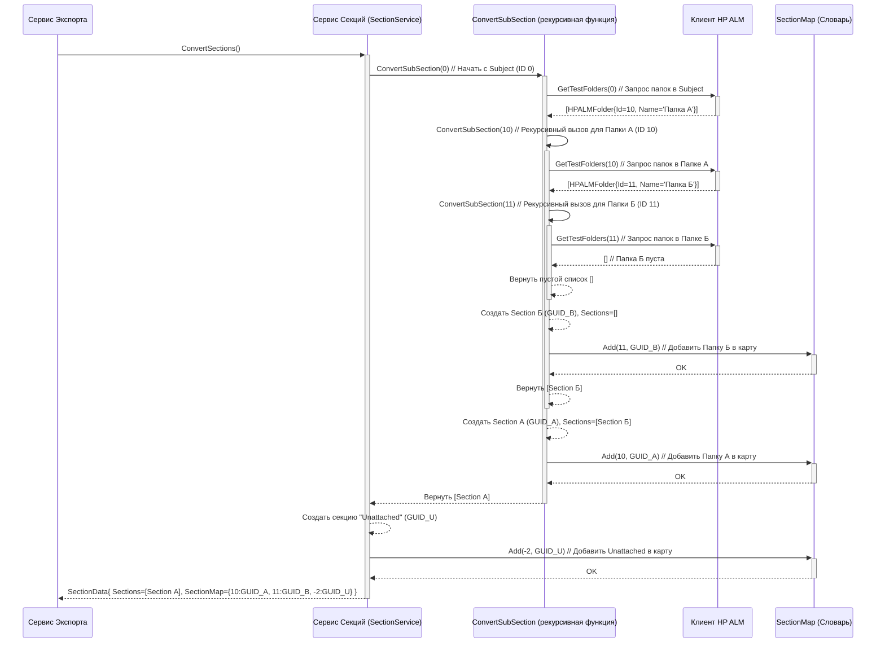

# Chapter 3: Сервис Секций (Папок)


В [предыдущей главе](02_клиент_hp_alm_.md) мы разобрались с [Клиентом HP ALM](02_клиент_hp_alm_.md), нашим "переводчиком", который умеет общаться с сервером HP ALM. Мы научились, *как* получать данные. Теперь пришло время узнать, *что именно* мы будем запрашивать в первую очередь, а именно — структуру папок, в которых хранятся наши тесты. Этим занимается **Сервис Секций (Папок)**.

Представьте, что тесты в HP ALM — это документы, аккуратно разложенные по папкам в большом офисном шкафу. Когда мы перевозим офис, нам важно не просто перевезти все документы, но и сохранить порядок, в котором они лежали. Мы хотим, чтобы папки в новом месте были устроены так же, как в старом.

**Сервис Секций (`SectionService`)** — это наш "архивариус". Его работа — заглянуть в "шкаф" HP ALM, посмотреть, какие там есть папки и как они расположены (какие папки лежат внутри других), а затем создать точно такую же структуру папок в нашей новой системе (в выходных файлах).

## Зачем нам структура папок?

В HP ALM тесты почти всегда организованы по папкам (иногда их называют "Тематики" или "Subject"). Эта структура помогает тестировщикам ориентироваться в проекте. Например, у вас могут быть папки "Авторизация", "Регистрация", "Профиль пользователя", а внутри "Профиля пользователя" — подпапки "Редактирование данных" и "Смена пароля".

`HPALMExporter` должен сохранить эту логическую организацию. Поэтому `SectionService` сначала получает всю иерархию папок из HP ALM.

## Секции: Новое имя для Папок

В нашей целевой системе (Test IT) и в наших выходных файлах папки для тестов называются **"Секции" (Sections)**. Поэтому `SectionService` берет информацию о папках из HP ALM и преобразует ее в формат `Section`. Это просто другое название для той же сущности — контейнера для тестов или других секций.

## Иерархия и Рекурсия: Как разобрать дерево папок

Папки в HP ALM (как и на вашем компьютере) образуют **иерархию** — дерево, где у каждой папки могут быть дочерние папки (подпапки), у тех свои подпапки и так далее.

```
Корень (Subject)
├── Папка А
│   ├── Папка Б
│   └── Папка В
├── Папка Г
└── Папка Д
    └── Папка Е
```

Чтобы получить всю эту структуру, `SectionService` работает как исследователь, идущий вглубь:

1.  Он начинает с самой верхней папки (обычно это "Subject" или корневая папка проекта).
2.  Спрашивает у [Клиента HP ALM](02_клиент_hp_alm_.md): "Какие папки лежат прямо внутри этой?"
3.  Получив список прямых дочерних папок (например, "Папка А", "Папка Г", "Папка Д"), он берет первую из них ("Папка А").
4.  Спрашивает у [Клиента HP ALM](02_клиент_hp_alm_.md): "А какие папки лежат внутри 'Папки А'?"
5.  Получает "Папка Б" и "Папка В". Он повторяет шаг 4 для "Папки Б" (узнает, что внутри пусто), затем для "Папки В" (тоже пусто).
6.  Вернувшись на уровень выше, он берет следующую папку из шага 3 ("Папка Г") и повторяет процесс.
7.  И так далее, пока не обойдет все ветви дерева.

Этот процесс, когда функция вызывает саму себя для обработки частей задачи (в нашем случае, для обработки подпапок), называется **рекурсией**.

## Как это работает на практике?

[Сервис Экспорта](01_сервис_экспорта_.md) вызывает `SectionService` после успешной аутентификации:

```csharp
// Фрагмент из ExportService.cs (см. Главу 1)
public async Task ExportProject()
{
    // ... (аутентификация и получение атрибутов)...

    _logger.LogInformation("Получение структуры секций");
    // Вот здесь вызывается наш Сервис Секций
    var sectionData = await _sectionService.ConvertSections();
    _logger.LogInformation("Структура секций получена");

    // Дальше эта информация (sectionData) будет использоваться
    // для получения тест-кейсов в нужных секциях...
     var testCasesData = await _testCaseService.ConvertTestCases(
        sectionData.SectionMap, // <--- Используем карту секций!
        attributesMap
     );

    // ... (запись данных) ...
}
```

**Входные данные:** `SectionService` неявно использует [Клиента HP ALM](02_клиент_hp_alm_.md), который уже аутентифицирован.
**Выходные данные:** Метод `ConvertSections()` возвращает объект `SectionData`.

## Что такое `SectionData`?

Результат работы `SectionService` — это объект `SectionData`, содержащий всю необходимую информацию о структуре папок.

```csharp
// Файл: Models/SectionData.cs
using Models; // Содержит определение класса Section

namespace HPALMExporter.Models;

// Контейнер для данных о секциях
public class SectionData
{
    // 1. Полное дерево секций, начиная с корневых
    public List<Section> Sections { get; set; }

    // 2. Карта соответствия: ID папки HP ALM -> ID новой секции
    public Dictionary<int, Guid> SectionMap { get; set; }
}
```

**Объяснение:**

1.  `List<Section> Sections`: Это само дерево папок (секций). Каждая `Section` содержит свое имя, ID и список дочерних `Section` (`List<Section> Sections` внутри `Section`). Так строится вся иерархия.
2.  `Dictionary<int, Guid> SectionMap`: Это очень важный "словарь-переводчик". Он хранит соответствие между оригинальным ID папки в HP ALM (это число, `int`) и новым, уникальным ID, который мы сгенерировали для этой секции в нашем выходном формате (это GUID, `Guid`). Зачем он нужен? Когда мы будем получать [тест-кейсы](04_сервис_тест_кейсов_.md), HP ALM скажет нам, в какой папке (по ее `int` ID) лежит каждый тест. С помощью `SectionMap` мы сможем быстро найти, какой `Guid` ID секции соответствует этому `int` ID, и правильно разместить тест в нашей новой структуре.

## Заглянем под капот `SectionService`

Как именно `SectionService` строит это дерево и карту?

### Шаги выполнения `ConvertSections`

1.  **Начало:** Метод `ConvertSections` запускает рекурсивный процесс `ConvertSubSection`, начиная с корневой папки HP ALM (у нее условный ID `0`, если мы говорим о "Subject", или специфический ID, если начинаем глубже).
2.  **Рекурсивный обход (`ConvertSubSection`):**
    *   Принимает ID родительской папки (`parentId`).
    *   Вызывает `_client.GetTestFolders(parentId)` ([Клиент HP ALM](02_клиент_hp_alm_.md)), чтобы получить список *прямых* дочерних папок.
    *   Для **каждой** полученной папки (`folder`):
        *   **Рекурсивный вызов:** Вызывает сам себя (`ConvertSubSection`) с ID этой папки (`folder.Id`), чтобы получить ее дочерние секции.
        *   **Создание Секции:** Создает новый объект `Section`.
            *   Генерирует для него **новый уникальный ID** (`Guid.NewGuid()`).
            *   Копирует имя из `folder.Name`.
            *   Помещает результат рекурсивного вызова (список дочерних секций) в поле `section.Sections`.
        *   **Запись в Карту:** Добавляет пару "ID папки HP ALM (`folder.Id`) -> Новый ID секции (`section.Id`)" в словарь `_sectionMap`.
        *   **Сбор Результата:** Добавляет созданную секцию в список секций текущего уровня.
    *   Возвращает список созданных секций.
3.  **Специальная секция "Unattached":** После завершения рекурсии `ConvertSections` создает дополнительную секцию "Unattached" ("Неприкрепленные"). Она может использоваться для тестов, которые по какой-то причине не были привязаны к папке в HP ALM, или как служебная секция. Ей присваивается специальный ID в `_sectionMap` (с ключом `-2`).
4.  **Формирование `SectionData`:** Упаковывает полученное дерево секций и заполненную карту `_sectionMap` в объект `SectionData` и возвращает его.

### Диаграмма последовательности (Рекурсивный обход)

Представим, что в HP ALM есть папка "Subject" (ID 0), в ней "Папка А" (ID 10), а в "Папке А" - "Папка Б" (ID 11).



### Код: Как это реализовано

Давайте посмотрим на ключевые части `Services/SectionService.cs`.

**1. Конструктор и зависимости:**
Сервису нужен `ILogger` для сообщений и `IClient` для запросов к HP ALM. Также он инициализирует пустой словарь `_sectionMap`.

```csharp
// Файл: Services/SectionService.cs (начало)
using HPALMExporter.Client; // Нужен IClient
using HPALMExporter.Models; // Нужен SectionData
using Microsoft.Extensions.Logging; // Для логов
using Models; // Нужен Section, Step

namespace HPALMExporter.Services;

public class SectionService : ISectionService
{
    private readonly ILogger<SectionService> _logger;
    private readonly IClient _client; // Наш клиент для общения с HP ALM
    private readonly Dictionary<int, Guid> _sectionMap; // Карта ID HP ALM -> ID Section

    private const int RootFolderId = 0; // Условный ID корневой папки "Subject"
    private const int UnattachedFolderId = -2; // Искусственный ID для "Unattached"

    public SectionService(ILogger<SectionService> logger, IClient client)
    {
        _logger = logger;
        _client = client;
        _sectionMap = new Dictionary<int, Guid>(); // Создаем пустую карту
    }

    // ... (далее методы ConvertSections и ConvertSubSection) ...
}
```

**2. Основной метод `ConvertSections`:**
Этот метод запускает рекурсию с `RootFolderId` и добавляет секцию "Unattached".

```csharp
// Файл: Services/SectionService.cs (метод ConvertSections)
public async Task<SectionData> ConvertSections()
{
    _logger.LogInformation("Получение секций из HP ALM");

    // Запускаем рекурсивное получение, начиная с корня (ID 0)
    var sections = await ConvertSubSection(RootFolderId);
    var subjectSection = sections.FirstOrDefault(); // Обычно корень один - "Subject"

    if (subjectSection != null)
    {
        // Создаем секцию "Unattached"
        var unattachedSection = new Section
        {
            Id = Guid.NewGuid(), // Новый ID
            Name = "Unattached",
            // ... (остальные поля пустые) ...
            Sections = new List<Section>() // Нет дочерних секций
        };

        // Добавляем ее в карту и в дочерние секции корня ("Subject")
        _sectionMap.Add(UnattachedFolderId, unattachedSection.Id);
        subjectSection.Sections.Add(unattachedSection);
    }

    // Возвращаем результат: дерево секций и карту ID
    return new SectionData
    {
        Sections = sections,
        SectionMap = _sectionMap
    };
}
```

**3. Рекурсивный метод `ConvertSubSection`:**
Это сердце сервиса, выполняющее обход дерева.

```csharp
// Файл: Services/SectionService.cs (метод ConvertSubSection)
private async Task<List<Section>> ConvertSubSection(int parentId)
{
    _logger.LogDebug("Конвертация подсекций из HP ALM для родителя {ParentId}", parentId);

    // 1. Получаем прямых потомков через Клиента HP ALM
    var folders = await _client.GetTestFolders(parentId);
    var sections = new List<Section>(folders.Count); // Готовим список для результата

    // 2. Обрабатываем каждую полученную папку
    foreach (var folder in folders)
    {
        // 3. Рекурсивный вызов для получения дочерних секций этой папки
        var subSections = await ConvertSubSection(folder.Id);

        // 4. Создаем новую секцию для текущей папки
        var section = new Section
        {
            Id = Guid.NewGuid(), // Генерируем уникальный ID
            Name = folder.Name,  // Копируем имя
            Sections = subSections // Добавляем найденные дочерние секции
            // ... (PreconditionSteps, PostconditionSteps пока пустые) ...
        };

        // 5. Добавляем созданную секцию в результат текущего уровня
        sections.Add(section);
        // 6. Запоминаем соответствие ID HP ALM -> наш новый ID
        _sectionMap.Add(folder.Id, section.Id);
    }

    // 7. Возвращаем список секций, найденных на этом уровне
    return sections;
}
```

## Заключение

В этой главе мы разобрались с **Сервисом Секций (Папок)**. Мы узнали, что он:

*   Отвечает за получение иерархии папок из HP ALM.
*   Использует [Клиента HP ALM](02_клиент_hp_alm_.md) для запроса папок.
*   Применяет **рекурсию** для обхода всего дерева папок.
*   Преобразует папки HP ALM в **Секции** (`Section`) для нашего выходного формата.
*   Создает важный словарь `SectionMap`, который связывает старые ID папок с новыми ID секций.

Теперь у нас есть "скелет" нашего проекта — структура папок. Самое время начать наполнять его "мясом" — тест-кейсами! В следующей главе мы узнаем, как `HPALMExporter` получает информацию о самих тестах.

**Перейти к следующей главе:** [Глава 4: Сервис Тест-кейсов](04_сервис_тест_кейсов_.md)

---

Generated by [AI Codebase Knowledge Builder](https://github.com/The-Pocket/Tutorial-Codebase-Knowledge)