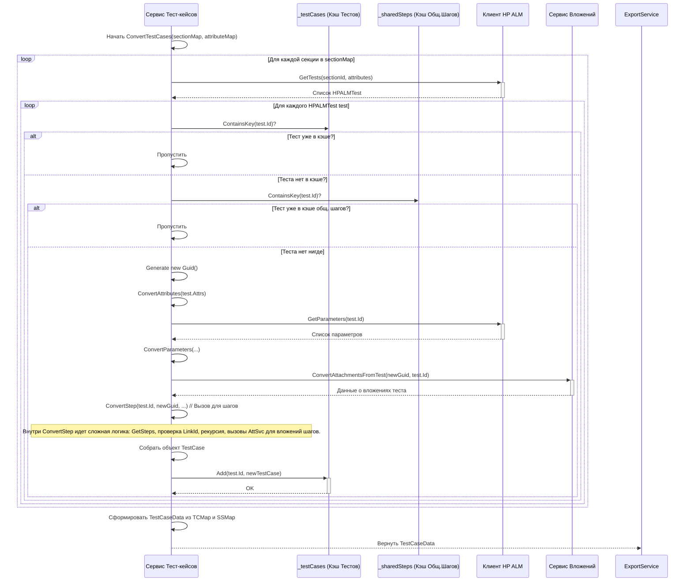

# Chapter 4: Сервис Тест-кейсов


В [предыдущей главе](03_сервис_секций__папок__.md) мы построили "скелет" нашего проекта, получив структуру папок (секций) из HP ALM с помощью [Сервиса Секций](03_сервис_секций__папок__.md). Теперь у нас есть аккуратно организованные "полки" и "ящики". Пришло время наполнить их содержанием — самими тест-кейсами! Этим занимается `Сервис Тест-кейсов`.

Представьте себе работу следователя. У него есть дело (тест-кейс), и ему нужно собрать все улики и показания:
*   Что произошло? (Описание теста)
*   В какой последовательности? (Шаги теста)
*   Какие переменные важны? (Параметры)
*   Какие вещественные доказательства есть? (Вложения к шагам)
*   Есть ли похожие типовые дела? (Общие шаги или шаблонные тесты)

**Сервис Тест-кейсов (`TestCaseService`)** — это и есть наш дотошный "следователь" в `HPALMExporter`. Он берет информацию о структуре папок и известных атрибутах, идет в HP ALM (через [Клиента HP ALM](02_клиент_hp_alm_.md)) и тщательно собирает всю информацию по каждому тест-кейсу, формируя полное "досье" в нашем новом формате.

## Зачем нужен Сервис Тест-кейсов?

Основная задача — получить из HP ALM детальную информацию о тест-кейсах и преобразовать ее в формат, понятный нашей целевой системе (Test IT) и записываемый в итоговые файлы. Он отвечает за:

1.  **Извлечение Тест-кейсов:** Получение списка тестов для каждой папки (секции), которую мы нашли ранее.
2.  **Сбор Деталей:** Для каждого теста он собирает его имя, описание, атрибуты, шаги, параметры и информацию о связанных тестах-"шаблонах".
3.  **Обработка Шагов:** Преобразует шаги теста (действия, ожидаемые результаты).
4.  **Обработка Параметров:** Извлекает параметры теста, если они есть (для тестов, управляемых данными).
5.  **Общие Шаги / Шаблоны:** Особым образом обрабатывает тесты, которые используются как шаблоны (в HP ALM это могут быть "Template" тесты или тесты типа "DESIGN-STEP", на которые ссылаются другие). Он превращает их в отдельные объекты `SharedStep`.
6.  **Взаимодействие с Вложениями:** Просит [Сервис Вложений](05_сервис_вложений_.md) найти и обработать файлы, прикрепленные к шагам или самим тестам.
7.  **Формирование Итоговых Объектов:** Собирает всю информацию в объекты `TestCase` или `SharedStep` нашего внутреннего формата ([Конвертер Данных и Модели](07_конвертер_данных_и_модели_.md)).

Без этого сервиса у нас были бы только пустые папки. Именно он наполняет их реальными тестами.

## Как его используют?

[Сервис Экспорта](01_сервис_экспорта_.md) вызывает `TestCaseService` после того, как получил структуру секций и список атрибутов:

```csharp
// Фрагмент из ExportService.cs (см. Главу 1)
public async Task ExportProject()
{
    // ... (аутентификация, получение атрибутов, получение секций) ...

    // Получаем карту секций (ID папки HP ALM -> наш GUID секции) от SectionService
    var sectionMap = sectionData.SectionMap;
    // Получаем карту атрибутов (Имя атрибута -> наш GUID атрибута) от AttributeService
    var attributeMap = attributes.ToDictionary(a => a.Name, a => a.Id);

    _logger.LogInformation("Получение тест-кейсов");
    // Вот здесь вызывается наш Сервис Тест-кейсов
    var testCasesData = await _testCaseService.ConvertTestCases(
        sectionMap, // Передаем карту секций
        attributeMap // Передаем карту атрибутов
    );
    _logger.LogInformation($"Получено {testCasesData.TestCases.Count} тест-кейсов и {testCasesData.SharedSteps.Count} общих шагов");

    // Дальше эти данные (testCasesData) будут записаны в файлы...
    // ... (запись общих шагов и тест-кейсов) ...
}
```

**Входные данные:**
*   `Dictionary<int, Guid> sectionMap`: Карта, полученная от [Сервиса Секций](03_сервис_секций__папок__.md). Помогает определить, в какую новую секцию положить тест.
*   `Dictionary<string, Guid> attributeMap`: Карта, связывающая имена атрибутов HP ALM с их новыми ID (она формируется [Сервисом Атрибутов](06_сервис_атрибутов_.md)). Помогает правильно сконвертировать пользовательские поля теста.

**Выходные данные:**
*   `Task<TestCaseData>`: Результат работы — объект `TestCaseData`, который содержит два списка: один с обычными тест-кейсами (`List<TestCase>`) и другой с общими шагами (`List<SharedStep>`).

Посмотрим на интерфейс `ITestCaseService` и модель `TestCaseData`.

```csharp
// Файл: Services/ITestCaseService.cs
using HPALMExporter.Models;

namespace HPALMExporter.Services;

// Контракт для сервиса, который конвертирует тест-кейсы
public interface ITestCaseService
{
    // Основной метод: получает карты секций и атрибутов,
    // возвращает объект с тест-кейсами и общими шагами
    Task<TestCaseData> ConvertTestCases(Dictionary<int, Guid> sectionMap,
        Dictionary<string, Guid> attributeMap);
}

```

```csharp
// Файл: Models/TestCaseData.cs
using Models; // Содержит определения TestCase и SharedStep

namespace HPALMExporter.Models;

// Контейнер для результатов конвертации тестов
public class TestCaseData
{
    // Список сконвертированных обычных тест-кейсов
    public List<TestCase> TestCases { get; set; }
    // Список сконвертированных общих шагов
    public List<SharedStep> SharedSteps { get; set; }
}
```

## Заглянем под капот: Реализация `TestCaseService`

Как "следователь" собирает все улики? Давайте разберем шаги внутри `TestCaseService`.

### Общая логика работы

1.  **Инициализация:** Сервис создает пустые словари для хранения уже обработанных тестов (`_testCases`) и общих шагов (`_sharedSteps`). Это нужно, чтобы не обрабатывать один и тот же тест (особенно шаблонный) несколько раз.
2.  **Перебор Секций:** Сервис берет `sectionMap` (карту секций, полученную в [Главе 3](03_сервис_секций__папок__.md)) и проходит по каждой паре "ID папки HP ALM -> ID нашей секции".
3.  **Запрос Тестов:** Для каждого ID папки HP ALM он просит [Клиента HP ALM](02_клиент_hp_alm_.md) (`_client.GetTests(...)`) дать список тестов, находящихся *именно в этой папке*. Он также передает список имен атрибутов, которые нужно получить для каждого теста.
4.  **Обработка Каждого Теста:** Для каждого полученного теста из HP ALM:
    *   **Проверка:** Смотрит, не обрабатывали ли мы уже этот тест (по его ID в HP ALM) как обычный тест или как общий шаг. Если да, переходит к следующему.
    *   **Создание ID:** Генерирует новый уникальный ID (`Guid`) для будущего объекта `TestCase` или `SharedStep`.
    *   **Конвертация Атрибутов:** Вызывает вспомогательный метод `ConvertAttributes`, чтобы преобразовать атрибуты теста из HP ALM в наш формат, используя `attributeMap`.
    *   **Конвертация Параметров:** Вызывает `ConvertParameters` (который внутри обращается к `_client.GetParameters`), чтобы получить и преобразовать параметры теста.
    *   **Запрос Вложений Теста:** Вызывает [Сервис Вложений](05_сервис_вложений_.md) (`_attachmentService.ConvertAttachmentsFromTest`), чтобы обработать вложения, прикрепленные к *самому тесту*.
    *   **Конвертация Шагов:** Вызывает **ключевой** метод `ConvertStep`. Этот метод:
        *   Запрашивает шаги теста у клиента (`_client.GetSteps`).
        *   Для каждого шага:
            *   Если это обычный шаг: Просто копирует описание и ожидаемый результат. Если у шага есть вложения (`step.HasAttachments == true`), вызывает [Сервис Вложений](05_сервис_вложений_.md) (`_attachmentService.ConvertAttachmentsFromStep`) для их обработки.
            *   Если это **ссылка на другой тест** (`step.LinkId != null`): Это означает, что здесь должен быть **общий шаг** (shared step). Логика усложняется:
                *   Проверяет, не обрабатывали ли мы уже этот `LinkId` как общий шаг (`_sharedSteps`). Если да, просто берет его ID.
                *   Проверяет, не обрабатывали ли мы `LinkId` *как обычный тест* (`_testCases`). Если да, это значит, что тест, который используется как шаблон, был найден раньше как обычный тест. Его нужно "переклассифицировать": перенести из `_testCases` в `_sharedSteps`, преобразовав его структуру в `SharedStep`, и потом использовать ID этого `SharedStep`.
                *   Если `LinkId` не найден ни там, ни там: Это новый общий шаг. Нужно запросить детали этого теста (`_client.GetTest(step.LinkId.Value)`), рекурсивно вызвать `ConvertStep` для *его* шагов, вызвать сервис вложений для *его* вложений, собрать все это в новый объект `SharedStep`, добавить его в `_sharedSteps` и использовать его ID.
    *   **Сборка Объекта:** Собирает всю полученную информацию (основные данные, атрибуты, параметры, шаги, вложения) в объект `TestCase`.
    *   **Сохранение:** Добавляет созданный `TestCase` в словарь `_testCases` (ключ - ID теста в HP ALM).
5.  **Возврат Результата:** После обхода всех секций и тестов, сервис формирует объект `TestCaseData`, копируя туда все значения из словарей `_testCases` и `_sharedSteps`, и возвращает его.

### Диаграмма Последовательности: Обработка одного теста



**Объяснение диаграммы:** Диаграмма показывает упрощенный процесс обработки тестов внутри `TestCaseService`. Она иллюстрирует:
*   Цикл по секциям и тестам.
*   Обращение к [Клиенту HP ALM](02_клиент_hp_alm_.md) за тестами и параметрами.
*   Проверку кэшей (`_testCases`, `_sharedSteps`).
*   Вызов [Сервиса Вложений](05_сервис_вложений_.md).
*   Основную работу по конвертации (`ConvertAttributes`, `ConvertParameters`, `ConvertStep`).
*   Добавление результата в кэш.

### Код: Ключевые моменты `TestCaseService.cs`

**1. Конструктор и кэши:**

```csharp
// Файл: Services/TestCaseService.cs (начало)
using HPALMExporter.Client;
using HPALMExporter.Models;
using Microsoft.Extensions.Logging;
using Models; // Модели TestCase, SharedStep, Step и т.д.

namespace HPALMExporter.Services;

public class TestCaseService : ITestCaseService
{
    private readonly ILogger<TestCaseService> _logger;
    private readonly IClient _client; // Клиент для доступа к HP ALM
    private readonly IAttachmentService _attachmentService; // Сервис для работы с вложениями
    // Словари для хранения уже обработанных тестов и общих шагов
    private readonly Dictionary<int, TestCase> _testCases;
    private readonly Dictionary<int, SharedStep> _sharedSteps;

    private const int DefaultDuration = 10000; // Значение по умолчанию для длительности

    public TestCaseService(ILogger<TestCaseService> logger, IClient client, IAttachmentService attachmentService)
    {
        _logger = logger;
        _client = client;
        _attachmentService = attachmentService;
        // Инициализируем пустые словари при создании сервиса
        _testCases = new Dictionary<int, TestCase>();
        _sharedSteps = new Dictionary<int, SharedStep>();
    }

    // ... (Далее основные методы) ...
}
```
*   Сервис получает `IClient` и `IAttachmentService`.
*   Создаются словари `_testCases` и `_sharedSteps`, которые будут действовать как кэш во время процесса конвертации.

**2. Основной метод `ConvertTestCases` (упрощенно):**

```csharp
// Файл: Services/TestCaseService.cs (метод ConvertTestCases)
public async Task<TestCaseData> ConvertTestCases(Dictionary<int, Guid> sectionMap,
    Dictionary<string, Guid> attributeMap)
{
    _logger.LogInformation("Конвертация тест-кейсов из HP ALM");

    // 1. Перебираем все секции, которые нашли ранее
    foreach (var section in sectionMap)
    {
        // 2. Для каждой секции запрашиваем тесты через клиента
        var tests = await _client.GetTests(section.Key, attributeMap.Keys.ToList()); // section.Key - это ID папки в HP ALM

        // 3. Перебираем тесты, найденные в этой секции
        foreach (var test in tests)
        {
            // 4. Проверяем, не обрабатывали ли мы уже этот тест (по ID из HP ALM)
            if (_testCases.ContainsKey(test.Id) || _sharedSteps.ContainsKey(test.Id))
            {
                continue; // Если да, пропускаем
            }

            // === Основная логика конвертации одного теста ===
            var testCaseId = Guid.NewGuid(); // Новый уникальный ID
            var attributes = ConvertAttributes(test.Attrubites, attributeMap); // Конвертируем атрибуты
            var iterations = await ConvertParameters(test.Id); // Конвертируем параметры
            // Получаем вложения, прикрепленные к самому тесту
            var attachmentData = await _attachmentService.ConvertAttachmentsFromTest(testCaseId, test.Id);
            // Конвертируем шаги (здесь происходит сложная логика с общими шагами)
            var steps = await ConvertStep(test.Id, testCaseId, attributeMap, sectionMap);

            // Добавляем вложения от шагов к общему списку вложений теста
            steps.ForEach(s => attachmentData.Attachments.AddRange(s.TestDataAttachments));

            // 5. Создаем объект TestCase с собранными данными
            var testCase = new TestCase
            {
                Id = testCaseId,
                Name = test.Name,
                Description = test.Description,
                SectionId = section.Value, // ID нашей секции из sectionMap
                // ... (другие поля: State, Priority, Tags и т.д.) ...
                Attributes = attributes,
                Iterations = iterations,
                Attachments = attachmentData.Attachments,
                Links = attachmentData.Links, // Ссылки (если есть)
                Steps = steps
            };

            // 6. Добавляем созданный TestCase в наш кэш
            _testCases.Add(test.Id, testCase);
        }
    }

    // 7. Формируем и возвращаем итоговый объект TestCaseData
    return new TestCaseData
    {
        TestCases = _testCases.Values.ToList(), // Все обычные тесты
        SharedSteps = _sharedSteps.Values.ToList() // Все общие шаги (которые могли быть созданы в ConvertStep)
    };
}
```
*   Этот метод оркестрирует процесс: обходит секции, получает тесты, проверяет кэш и вызывает вспомогательные методы для конвертации деталей (`ConvertAttributes`, `ConvertParameters`, `ConvertStep`).
*   Он также вызывает `IAttachmentService` для вложений самого теста.
*   Обратите внимание, как используются `sectionMap` и `attributeMap` для связи данных HP ALM с нашими новыми ID.

**3. Конвертация Атрибутов:**

```csharp
// Файл: Services/TestCaseService.cs (метод ConvertAttributes)
private static List<CaseAttribute> ConvertAttributes(
    Dictionary<string, string> attributesOfTest, // Атрибуты из HP ALM (Имя -> Значение)
    Dictionary<string, Guid> attributeMap)       // Наша карта (Имя -> GUID)
{
    var caseAttributes = new List<CaseAttribute>();

    // Проходим по нашей карте атрибутов (которые мы хотим экспортировать)
    foreach (var attribute in attributeMap)
    {
        // Ищем значение этого атрибута у данного теста
        var value = attributesOfTest.GetValueOrDefault(attribute.Key); // Ищем по имени

        // Создаем объект атрибута для нашего формата
        caseAttributes.Add(new CaseAttribute
        {
            Id = attribute.Value, // Используем наш GUID атрибута
            Value = value ?? string.Empty // Записываем значение (или пустую строку)
        });
    }
    return caseAttributes;
}
```
*   Этот метод просто сопоставляет атрибуты, полученные от HP ALM, с теми, что мы определили в `attributeMap` (из [Сервиса Атрибутов](06_сервис_атрибутов_.md)), и создает список атрибутов в нашем формате.

**4. Конвертация Параметров:**

```csharp
// Файл: Services/TestCaseService.cs (метод ConvertParameters)
private async Task<List<Iteration>> ConvertParameters(int testId)
{
    _logger.LogInformation("Конвертация параметров из HP ALM для теста {TestId}", testId);

    // 1. Запрашиваем параметры у клиента HP ALM
    var parameters = await _client.GetParameters(testId);
    var iterations = new List<Iteration>();

    // Если параметров нет, возвращаем пустой список итераций
    if (!parameters.Any())
    {
        return iterations;
    }

    // 2. Создаем одну итерацию со всеми параметрами
    // (Примечание: HP ALM может поддерживать несколько наборов данных,
    // но здесь мы упрощенно собираем все в одну итерацию)
    var iteration = new Iteration
    {
        Parameters = parameters.Select(p =>
                new Parameter
                {
                    Name = p.Name, // Имя параметра
                    Value = p.Value  // Значение (если есть)
                })
            .ToList()
    };

    iterations.Add(iteration);
    return iterations;
}
```
*   Запрашивает параметры через `IClient`.
*   Формирует список `Iteration`. В Test IT параметры группируются по итерациям. Здесь для простоты все параметры одного теста помещаются в одну итерацию.

**5. Конвертация Шагов (значительно упрощено):**

```csharp
// Файл: Services/TestCaseService.cs (метод ConvertStep - ключевая логика)
private async Task<List<Step>> ConvertStep(int testId, Guid testCaseId,
    Dictionary<string, Guid> attributeMap, Dictionary<int, Guid> sectionMap)
{
    _logger.LogInformation("Конвертация шагов из HP ALM для теста {TestId}", testId);
    // 1. Получаем шаги из HP ALM через клиента
    var steps = await _client.GetSteps(testId);
    var convertedSteps = new List<Step>(steps.Count); // Список для наших сконвертированных шагов

    foreach (var step in steps) // Обрабатываем каждый шаг из HP ALM
    {
        // 2. Проверяем, это ОБЫЧНЫЙ шаг или ССЫЛКА на общий шаг?
        if (step.LinkId == null) // Если LinkId пустой - это обычный шаг
        {
            var convertedStep = new Step // Создаем наш объект Step
            {
                Action = step.Description, // Действие берем из описания шага HP ALM
                Expected = step.Expected,  // Ожидаемый результат
                // ... (TestData пока пустое, если не считать вложения) ...
                ActionAttachments = new List<string>(), // Списки для ID вложений
                ExpectedAttachments = new List<string>(),
                TestDataAttachments = new List<string>()
            };

            // Если к шагу есть вложения, просим сервис вложений их обработать
            if (step.HasAttachments)
            {
                var attachmentData = await _attachmentService.ConvertAttachmentsFromStep(testCaseId, step.Id);
                convertedStep.TestDataAttachments = attachmentData.Attachments; // Добавляем ID вложений
                // Можно добавить ссылки в TestData, если необходимо
                attachmentData.Links.ForEach(l =>
                    convertedStep.TestData += $"<a href=\"{l.Url}\">{l.Title}</a>\n");
            }
            convertedSteps.Add(convertedStep);
        }
        else // Если LinkId НЕ пустой - это ссылка на ОБЩИЙ ШАГ
        {
            Guid sharedStepIdToUse; // ID общего шага, который мы в итоге используем

            // 3. Ищем этот LinkId в наших кэшах
            if (_sharedSteps.TryGetValue(step.LinkId.Value, out var existedSharedStep))
            {
                // Нашли готовый общий шаг в кэше _sharedSteps
                sharedStepIdToUse = existedSharedStep.Id;
            }
            else if (_testCases.TryGetValue(step.LinkId.Value, out var existedTestCase))
            {
                // Нашли этот ID в кэше ОБЫЧНЫХ тестов! Его надо переделать в общий шаг.
                _logger.LogWarning("Тест {TestId} используется как общий шаг, конвертируем его.", step.LinkId.Value);
                // Создаем SharedStep на основе TestCase
                var sharedStep = new SharedStep { /* ... копируем поля из existedTestCase ... */ Id = existedTestCase.Id, Name=existedTestCase.Name /* и т.д. */ };
                // Добавляем в кэш общих шагов
                _sharedSteps.Add(step.LinkId.Value, sharedStep);
                // Удаляем из кэша обычных тестов
                _testCases.Remove(step.LinkId.Value);
                sharedStepIdToUse = sharedStep.Id;
            }
            else
            {
                // Нигде не нашли - это НОВЫЙ общий шаг, который нужно получить из HP ALM
                _logger.LogInformation("Обнаружена ссылка на новый общий шаг: {LinkId}", step.LinkId.Value);
                // Запрашиваем детали этого теста-"шаблона"
                var test = await _client.GetTest(step.LinkId.Value, attributeMap.Keys.ToList());
                sharedStepIdToUse = Guid.NewGuid(); // Генерируем ID для нового общего шага
                // Рекурсивно получаем его шаги
                var childrenSteps = await ConvertStep(test.Id, sharedStepIdToUse, attributeMap, sectionMap);
                // Получаем его вложения
                var attachmentData = await _attachmentService.ConvertAttachmentsFromTest(sharedStepIdToUse, test.Id);
                // Создаем объект SharedStep
                var newSharedStep = new SharedStep
                {
                    Id = sharedStepIdToUse,
                    Name = test.Name,
                    Steps = childrenSteps,
                    Attachments = attachmentData.Attachments,
                    // ... другие поля ...
                    SectionId = sectionMap[test.ParentId] // Присваиваем секцию родительской папки
                };
                // Добавляем в кэш
                _sharedSteps.Add(step.LinkId.Value, newSharedStep);
            }

            // 4. Создаем шаг-ссылку в нашем формате
            var convertedStep = new Step
            {
                // Поля Action, Expected, TestData остаются пустыми
                Action = string.Empty,
                Expected = string.Empty,
                TestData = string.Empty,
                // Указываем ID общего шага, на который ссылаемся
                SharedStepId = sharedStepIdToUse
            };
            convertedSteps.Add(convertedStep);
        }
    }
    return convertedSteps; // Возвращаем список сконвертированных шагов
}
```
*   Это самый сложный метод. Он различает обычные шаги и ссылки (`step.LinkId`).
*   Для обычных шагов он копирует данные и вызывает `IAttachmentService` для вложений.
*   Для ссылок он реализует логику поиска в кэше (`_sharedSteps`, `_testCases`), переклассификации (`TestCase` -> `SharedStep`) или рекурсивного запроса и создания нового `SharedStep`.
*   В итоге для ссылки создается объект `Step`, у которого заполнено поле `SharedStepId`.

## Заключение

В этой главе мы подробно рассмотрели **Сервис Тест-кейсов (`TestCaseService`)** — нашего "следователя", который тщательно собирает всю информацию о тест-кейсах из HP ALM. Мы узнали, что он:

*   Получает тесты для каждой секции, используя [Клиента HP ALM](02_клиент_hp_alm_.md).
*   Собирает детали: атрибуты, параметры, шаги.
*   Умеет обрабатывать **общие шаги** (ссылки на другие тесты), создавая объекты `SharedStep` и используя кэширование для эффективности.
*   Тесно взаимодействует с [Сервисом Вложений](05_сервис_вложений_.md) для получения информации о прикрепленных файлах.
*   Формирует итоговые объекты `TestCase` и `SharedStep` для записи.

Теперь у нас есть не только структура папок, но и полное описание каждого теста с его шагами и параметрами. Однако остался один важный кусочек пазла — сами файлы, прикрепленные к тестам и шагам. Как `HPALMExporter` скачивает и сохраняет их? Об этом мы узнаем в следующей главе.

**Перейти к следующей главе:** [Глава 5: Сервис Вложений](05_сервис_вложений_.md)

---

Generated by [AI Codebase Knowledge Builder](https://github.com/The-Pocket/Tutorial-Codebase-Knowledge)