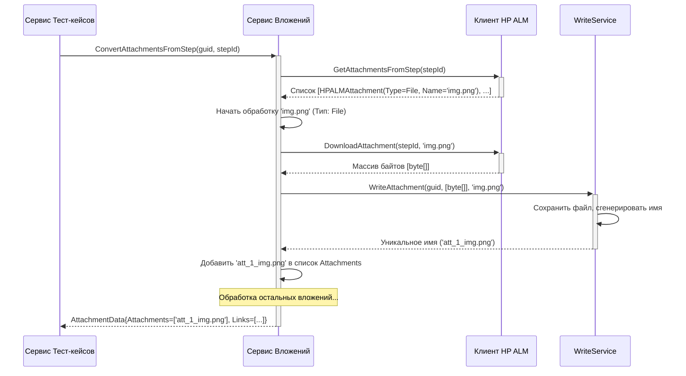

# Chapter 5: Сервис Вложений


В [предыдущей главе](04_сервис_тест_кейсов_.md) мы погрузились в работу [Сервиса Тест-кейсов](04_сервис_тест_кейсов_.md) — нашего "следователя", который собирал все детали о тестах: шаги, параметры, атрибуты. Мы также видели, что он замечал, если к тесту или его шагу были прикреплены какие-то файлы или ссылки. Но сам он их не обрабатывал, он лишь передавал эстафету дальше. Кому? Нашему сегодняшнему герою — **Сервису Вложений**.

Представьте, что [Сервис Тест-кейсов](04_сервис_тест_кейсов_.md) составил опись всего имущества в "деле" (тест-кейсе), включая список "вещдоков" (вложений). Но чтобы эти вещдоки оказались в новом архиве (нашем экспорте), нужен кто-то, кто их физически заберет из старого хранилища (HP ALM) и доставит по адресу.

**Сервис Вложений (`AttachmentService`)** — это такая "курьерская служба" в `HPALMExporter`. Его задача — взять информацию о вложениях, связанных с тест-кейсами или их шагами, определить, что это — файл или просто ссылка, — а затем либо скачать этот файл и подготовить его к записи, либо просто извлечь URL-адрес ссылки.

## Зачем нужен Сервис Вложений?

В HP ALM к тестам и шагам можно прикреплять различные материалы:
*   **Файлы:** Изображения (скриншоты), документы (инструкции, спецификации), таблицы, архивы и т.д.
*   **Ссылки (URL):** Адреса веб-страниц, ведущие на внешние ресурсы, документацию или другие системы.

`HPALMExporter` должен уметь обрабатывать оба типа вложений, чтобы при импорте в новую систему (например, Test IT) пользователи имели доступ к тем же материалам.

**Сервис Вложений отвечает за:**

1.  **Получение списка вложений:** Используя [Клиент HP ALM](02_клиент_hp_alm_.md), он запрашивает список всех вложений для конкретного теста или шага.
2.  **Распознавание типа:** Для каждого вложения он определяет, это файл (`File`) или ссылка (`Url`).
3.  **Обработка файлов:** Если это файл, он:
    *   Запрашивает его содержимое у [Клиента HP ALM](02_клиент_hp_alm_.md) (`DownloadAttachment`), получая массив байтов.
    *   Передает эти байты и имя файла специальному сервису `WriteService` (часть [Конвертера Данных и Моделей](07_конвертер_данных_и_модели_.md)), который отвечает за запись файлов на диск. `WriteService` сохраняет файл и возвращает его уникальное имя в папке с экспортом.
4.  **Обработка ссылок:** Если это ссылка, он просто извлекает ее URL-адрес и название.
5.  **Возврат результата:** Собирает информацию о скачанных файлах (их новые имена) и извлеченных ссылках в специальный объект `AttachmentData`.

**Аналогия с курьером:**
*   **Заявка:** [Сервис Тест-кейсов](04_сервис_тест_кейсов_.md) говорит: "Для шага №5 нужно забрать вложения".
*   **Получение информации:** Курьер (`AttachmentService`) связывается с HP ALM (через [Клиента HP ALM](02_клиент_hp_alm_.md)) и получает список: "Одна посылка (файл 'screenshot.png') и одно письмо (ссылка на 'http://docs.example.com')".
*   **Доставка:**
    *   Курьер забирает посылку (скачивает `screenshot.png`).
    *   Передает посылку на склад (`WriteService`), который присваивает ей уникальный номер (`аттачмент_123_screenshot.png`) и кладет на полку.
    *   Курьер записывает адрес из письма (URL и название).
*   **Отчет:** Курьер возвращает [Сервису Тест-кейсов](04_сервис_тест_кейсов_.md) отчет (`AttachmentData`): "Доставлен файл с именем 'аттачмент_123_screenshot.png', и есть ссылка 'Документация' на 'http://docs.example.com'".

## Как его используют?

[Сервис Тест-кейсов](04_сервис_тест_кейсов_.md) вызывает `AttachmentService` в двух случаях:
1.  При обработке самого тест-кейса (если к нему напрямую прикреплены файлы).
2.  При обработке шага тест-кейса или общего шага (если к шагу прикреплены файлы).

Посмотрим на интерфейс `IAttachmentService`:

```csharp
// Файл: Services/IAttachmentService.cs
using HPALMExporter.Models; // Нужно для AttachmentData

namespace HPALMExporter.Services;

// Контракт для Сервиса Вложений
public interface IAttachmentService
{
    // Получить и обработать вложения для конкретного тест-кейса
    // testCaseId - наш новый Guid тест-кейса (для именования файлов)
    // testId - ID тест-кейса в HP ALM (для запроса к клиенту)
    Task<AttachmentData> ConvertAttachmentsFromTest(Guid testCaseId, int testId);

    // Получить и обработать вложения для конкретного шага
    // testCaseId - наш новый Guid тест-кейса (для именования файлов)
    // stepId - ID шага в HP ALM (для запроса к клиенту)
    Task<AttachmentData> ConvertAttachmentsFromStep(Guid testCaseId, int stepId);
}
```

**Объяснение:**

*   Интерфейс определяет два метода: один для вложений теста, другой для вложений шага.
*   Оба метода принимают `testCaseId` (наш внутренний ID, полезен для `WriteService` при сохранении файла, чтобы сгруппировать вложения по тестам) и `entityId` (ID теста или шага в HP ALM, нужен для запроса через [Клиент HP ALM](02_клиент_hp_alm_.md)).
*   Оба метода возвращают `Task<AttachmentData>`, то есть результат их работы — это объект `AttachmentData`, который будет готов не сразу (асинхронная операция).

## Модели данных: `AttachmentData`, `HPALMAttachment`, `Link`

Чтобы понять, что возвращает `IAttachmentService`, посмотрим на связанные модели.

**1. `AttachmentData` (Результат работы сервиса):**

```csharp
// Файл: Models\AttachmentData.cs
using Models; // Содержит определение модели Link

namespace HPALMExporter.Models;

// Контейнер для информации об обработанных вложениях
public class AttachmentData
{
    // Список имен файлов, которые были скачаны и сохранены
    // WriteService гарантирует, что эти имена уникальны
    public List<string> Attachments { get; set; }

    // Список ссылок, извлеченных из вложений типа URL
    public List<Link> Links { get; set; }
}
```

*   `Attachments`: Содержит имена файлов (строки), которые были успешно скачаны и сохранены сервисом `WriteService`. Эти имена потом можно использовать для ссылки на файл в экспортированных данных.
*   `Links`: Содержит список объектов `Link`.

**2. `Link` (Модель для ссылки):**

```csharp
// Файл: Models\Link.cs (из библиотеки Models)
namespace Models;

public class Link
{
    public string Title { get; set; } // Название ссылки (как она отображалась в HP ALM)
    public string Url { get; set; }   // Сам URL-адрес
    // ... могут быть и другие поля ...
}
```

*   Простая модель для хранения URL и его названия.

**3. `HPALMAttachment` (Сырые данные от клиента):**

Когда `AttachmentService` запрашивает список вложений у [Клиента HP ALM](02_клиент_hp_alm_.md), клиент возвращает список объектов типа `HPALMAttachment`.

```csharp
// Файл: Models\HPALMAttachment.cs
namespace HPALMExporter.Models;

// Представление вложения, как его возвращает Клиент HP ALM
public class HPALMAttachment
{
    public uint Id { get; set; } // ID вложения в HP ALM
    public string Name { get; set; } // Оригинальное имя файла или название ссылки
    public uint ParentId { get; set; } // ID родителя (теста или шага)
    public string Description { get; set; } // Описание (для ссылок здесь хранится URL!)
    public HPALMAttachmentType Type { get; set; } // Тип вложения (файл или URL)
}

// Файл: Models\HPALMAttachmentType.cs
namespace HPALMExporter.Models;

// Перечисление возможных типов вложений
public enum HPALMAttachmentType
{
    File, // Обычный файл
    Url   // Ссылка
}
```

*   `HPALMAttachment` содержит всю информацию, которую [Клиент HP ALM](02_клиент_hp_alm_.md) смог получить о вложении.
*   Ключевые поля: `Name`, `Type` (файл или URL) и `Description` (которое для URL содержит сам адрес).

## Заглянем под капот: Как `AttachmentService` обрабатывает вложения

Давайте проследим шаги, когда, например, вызывается `ConvertAttachmentsFromStep`.

1.  **Запрос списка:** `AttachmentService` вызывает `_client.GetAttachmentsFromStep(stepId)`, чтобы получить список объектов `HPALMAttachment`.
2.  **Инициализация результата:** Создается пустой объект `AttachmentData` (с пустыми списками `Attachments` и `Links`).
3.  **Перебор вложений:** Сервис проходит по каждому полученному `HPALMAttachment`.
4.  **Проверка типа:**
    *   **Если `attachment.Type == HPALMAttachmentType.Url`:**
        *   Создается новый объект `Link`.
        *   `link.Title` устанавливается из `attachment.Name`.
        *   `link.Url` устанавливается из `attachment.Description` (где HP ALM хранит URL).
        *   Этот объект `Link` добавляется в список `attachmentData.Links`.
    *   **Если `attachment.Type == HPALMAttachmentType.File`:**
        *   Вызывается `_client.DownloadAttachment(stepId, attachment.Name)` для скачивания файла. Этот метод возвращает содержимое файла как массив байтов (`byte[]`).
        *   Вызывается `_writeService.WriteAttachment(testCaseId, bytes, attachment.Name)` для сохранения файла. `WriteService` сохраняет байты в файл (например, в папку `attachments/testCaseId/`), дает ему уникальное имя (например, `f4a2_screenshot.png`) и возвращает это имя.
        *   Полученное имя файла (строка) добавляется в список `attachmentData.Attachments`.
5.  **Возврат:** После обработки всех вложений из списка, заполненный объект `AttachmentData` возвращается вызывающей стороне ([Сервису Тест-кейсов](04_сервис_тест_кейсов_.md)).

### Диаграмма Последовательности (Обработка файла)



**Объяснение диаграммы:**

1.  [Сервис Тест-кейсов](04_сервис_тест_кейсов_.md) просит `Сервис Вложений` обработать вложения для шага `stepId`.
2.  `Сервис Вложений` запрашивает список у [Клиента HP ALM](02_клиент_hp_alm_.md).
3.  Получив список, он видит файл `img.png`.
4.  Он запрашивает содержимое файла у [Клиента HP ALM](02_клиент_hp_alm_.md).
5.  Получив байты, он передает их `WriteService` для сохранения.
6.  `WriteService` сохраняет файл и возвращает его новое имя (`att_1_img.png`).
7.  `Сервис Вложений` добавляет это имя в результат.
8.  После обработки всех вложений, он возвращает итоговый `AttachmentData`.

### Код: Реализация `AttachmentService`

Теперь посмотрим на сам код.

**1. Конструктор:**
Сервису нужны логгер, клиент для общения с HP ALM и `WriteService` для сохранения файлов.

```csharp
// Файл: Services/AttachmentService.cs (начало)
using HPALMExporter.Client; // Нужен IClient
using HPALMExporter.Models; // Нужны AttachmentData, HPALMAttachment и т.д.
using JsonWriter;          // Нужен IWriteService
using Microsoft.Extensions.Logging;
using Models;              // Нужна модель Link

namespace HPALMExporter.Services;

public class AttachmentService : IAttachmentService
{
    private readonly ILogger<AttachmentService> _logger;
    private readonly IClient _client;             // Для запросов к HP ALM
    private readonly IWriteService _writeService; // Для записи файлов

    // Конструктор получает нужные сервисы через внедрение зависимостей
    public AttachmentService(ILogger<AttachmentService> logger, IClient client, IWriteService writeService)
    {
        _logger = logger;
        _client = client;
        _writeService = writeService;
    }

    // ... (далее методы интерфейса и приватный метод) ...
}
```

**2. Публичные методы интерфейса:**
Эти методы просто вызывают приватный метод `ConvertAttachments`, передавая ему нужный ID сущности (теста или шага).

```csharp
// Файл: Services/AttachmentService.cs (продолжение)

// Обработка вложений для теста
public async Task<AttachmentData> ConvertAttachmentsFromTest(Guid testCaseId, int testId)
{
    _logger.LogInformation("Конвертация вложений из HP ALM для теста {TestId}", testId);
    // Получаем список от клиента
    var attachments = await _client.GetAttachmentsFromTest(testId);
    // Вызываем общий метод для обработки
    var attachmentData = await ConvertAttachments(testCaseId, testId, attachments);
    return attachmentData;
}

// Обработка вложений для шага
public async Task<AttachmentData> ConvertAttachmentsFromStep(Guid testCaseId, int stepId)
{
    _logger.LogInformation("Конвертация вложений из HP ALM для шага {StepId}", stepId);
    // Получаем список от клиента
    var attachments = await _client.GetAttachmentsFromStep(stepId);
    // Вызываем общий метод для обработки
    var attachmentData = await ConvertAttachments(testCaseId, stepId, attachments);
    return attachmentData;
}
```

**3. Приватный метод `ConvertAttachments` (основная логика):**

```csharp
// Файл: Services/AttachmentService.cs (приватный метод)
private async Task<AttachmentData> ConvertAttachments(Guid testCaseId, int entityId,
    IEnumerable<HPALMAttachment> attachments) // Принимает список вложений от клиента
{
    // 1. Создаем пустой контейнер для результатов
    var attachmentData = new AttachmentData
    {
        Attachments = new List<string>(), // Список для имен файлов
        Links = new List<Link>()          // Список для ссылок
    };

    // 2. Перебираем все вложения, полученные от клиента
    foreach (var attachment in attachments)
    {
        // 3. Проверяем тип вложения
        if (attachment.Type == HPALMAttachmentType.Url) // Если это ссылка
        {
            // Создаем объект Link и добавляем его в список ссылок
            attachmentData.Links.Add(new Link
            {
                Url = attachment.Description, // URL берем из описания
                Title = attachment.Name       // Название берем из имени
            });
            _logger.LogDebug("Найдена ссылка: {Name} -> {Url}", attachment.Name, attachment.Description);
        }
        else // Если это файл
        {
            _logger.LogDebug("Найден файл для скачивания: {Name} (для сущности {EntityId})", attachment.Name, entityId);
            // Скачиваем файл через клиента (получаем байты)
            var bytes = await _client.DownloadAttachment(entityId, attachment.Name);
            // Передаем байты в WriteService для сохранения
            var name = await _writeService.WriteAttachment(testCaseId, bytes, attachment.Name);
            // Добавляем полученное имя файла в список вложений
            attachmentData.Attachments.Add(name);
            _logger.LogDebug("Файл сохранен как: {SavedName}", name);
        }
    }

    // 4. Возвращаем объект с результатами
    return attachmentData;
}
```

**Объяснение:**

*   Этот метод реализует всю логику, описанную ранее: получает список`HPALMAttachment`, обходит его, проверяет тип, и либо создает `Link`, либо скачивает файл (`_client.DownloadAttachment`), сохраняет его (`_writeService.WriteAttachment`) и добавляет результат в `AttachmentData`.
*   Логирование (`_logger.LogDebug`) помогает отслеживать процесс обработки каждого вложения.

## Заключение

В этой главе мы познакомились с **Сервисом Вложений (`AttachmentService`)** — незаменимым "курьером" нашего `HPALMExporter`. Мы узнали, что он:

*   Отвечает за обработку файлов и ссылок, прикрепленных к тестам и шагам в HP ALM.
*   Взаимодействует с [Клиентом HP ALM](02_клиент_hp_alm_.md) для получения списка вложений и скачивания файлов.
*   Различает тип вложения: для ссылок извлекает URL, для файлов скачивает содержимое.
*   Делегирует задачу сохранения файлов сервису `WriteService`.
*   Возвращает результат в виде объекта `AttachmentData`, содержащего список сохраненных имен файлов и список объектов `Link`.

Теперь, когда мы разобрались, как получать структуру папок, детали тестов (включая шаги и параметры) и связанные с ними вложения, нам осталось рассмотреть еще один важный аспект данных из HP ALM — пользовательские атрибуты (поля) тестов. Об этом мы поговорим в следующей главе.

**Перейти к следующей главе:** [Глава 6: Сервис Атрибутов](06_сервис_атрибутов_.md)

---

Generated by [AI Codebase Knowledge Builder](https://github.com/The-Pocket/Tutorial-Codebase-Knowledge)