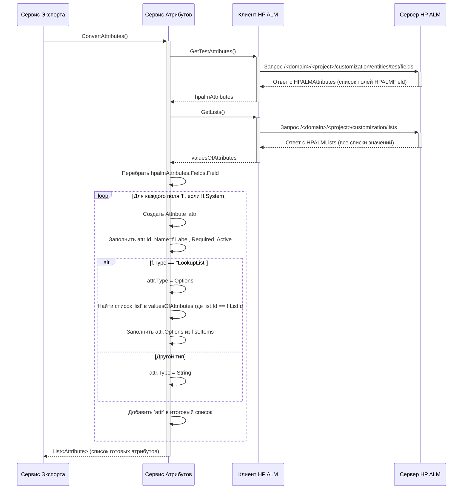

# Chapter 6: Сервис Атрибутов


В [предыдущей главе](05_сервис_вложений_.md) мы разобрались с "курьерской службой" — [Сервисом Вложений](05_сервис_вложений_.md), который скачивает и обрабатывает файлы и ссылки, прикрепленные к нашим тест-кейсам. Мы собрали структуру папок, сами тесты с шагами и параметры, а также все прикрепленные материалы. Но что, если в вашем проекте HP ALM используются дополнительные, **пользовательские поля** для тест-кейсов? Например, вы могли добавить поля "Приоритет выполнения", "Ответственный за тест" или "Компонент системы". Эту информацию тоже важно перенести.

Именно для работы с такими пользовательскими полями (атрибутами) и существует **Сервис Атрибутов**.

Представьте себе отдел кадров на большом предприятии. У каждого сотрудника (тест-кейса) есть стандартные данные (имя, описание, шаги). Но отделу кадров может понадобиться дополнительная информация: уровень квалификации, знание языков, пройденные курсы. Они создают специальные анкеты (пользовательские поля) и собирают эти сведения.

**Сервис Атрибутов (`AttributeService`)** в `HPALMExporter` — это наш специалист из "отдела кадров". Он связывается с HP ALM, чтобы узнать:
*   Какие вообще **дополнительные поля (атрибуты)** существуют для тест-кейсов в вашем проекте?
*   Какого **типа** каждое поле (текст, число, список)?
*   Если поле — это **список**, то какие **значения** в нем возможны?
*   Является ли поле **обязательным**?

Затем он преобразует эту информацию в унифицированный формат, который будет понятен нашей целевой системе и сможет быть использован при экспорте данных тест-кейсов.

## Зачем нужен Сервис Атрибутов?

В HP ALM вы можете очень гибко настраивать проект, добавляя поля, специфичные для ваших процессов. Например:

*   `TS_USER_01` (Физическое имя) -> `Приоритет` (Метка) - Список ["Высокий", "Средний", "Низкий"]
*   `TS_USER_02` -> `Компонент` - Текстовое поле
*   `TS_USER_03` -> `Интеграционный тест?` - Список ["Да", "Нет"]

Когда [Сервис Тест-кейсов](04_сервис_тест_кейсов_.md) получает данные о конкретном тесте, HP ALM возвращает значения этих полей, используя их *физические имена* (типа `TS_USER_01`). Чтобы правильно интерпретировать и записать эти значения в итоговые файлы, нам нужно знать:

1.  Какое *понятное имя* (`Приоритет`) соответствует `TS_USER_01`.
2.  Какого *типа* это поле (чтобы знать, как обрабатывать значение).
3.  Какие *возможные значения* есть у списков (для валидации или создания аналогичного списка в целевой системе).

`AttributeService` получает всю эту **метаинформацию** (информацию об информации) о пользовательских полях.

## Как его используют?

[Сервис Экспорта](01_сервис_экспорта_.md) вызывает `AttributeService` на раннем этапе, сразу после аутентификации, чтобы получить описание всех атрибутов *до* того, как начнется получение самих тест-кейсов.

```csharp
// Фрагмент из ExportService.cs (см. Главу 1)
public async Task ExportProject()
{
    _logger.LogInformation("Экспорт проекта из HP ALM");

    // Шаг 1: Аутентификация через IClient
    await _client.Auth();
    _logger.LogInformation("Аутентификация прошла успешно");

    // Шаг 2: Получение определений атрибутов через IAttributeService
    var attributes = await _attributeService.ConvertAttributes();
    _logger.LogInformation($"Получено {attributes.Count} пользовательских атрибутов");

    // Теперь у нас есть список 'attributes', который содержит описание всех
    // пользовательских полей (их ID, имена, типы, возможные значения).
    // Этот список будет передан дальше, например, в Сервис Тест-кейсов,
    // чтобы он знал, как интерпретировать значения типа 'TS_USER_01'.

    // Шаг 3: Получение секций (папок) через ISectionService
    var sectionData = await _sectionService.ConvertSections();
    _logger.LogInformation("Структура секций получена");

    // Шаг 4: Получение тест-кейсов через ITestCaseService
    var testCasesData = await _testCaseService.ConvertTestCases(
        sectionData.SectionMap,
        attributes.ToDictionary(a => a.Name, a => a.Id) // <-- Вот здесь используется результат!
    );
    // ... (дальше запись данных) ...
}
```

**Входные данные:** Сервису не нужны явные параметры, он использует уже настроенный [Клиент HP ALM](02_клиент_hp_alm_.md) для запросов.
**Выходные данные:** `Task<List<Attribute>>`. Результат — это *список* объектов `Attribute`, описывающих каждое пользовательское поле.

## Что такое `Attribute`?

Результат работы `AttributeService` — это список объектов `Attribute`. Этот класс определен в общей библиотеке `Models` и представляет атрибут в нашем внутреннем, унифицированном формате.

```csharp
// Файл: Models/Attribute.cs (упрощенно)
namespace Models;

// Описание атрибута (пользовательского поля)
public class Attribute
{
    public Guid Id { get; set; } // Уникальный ID, который мы генерируем
    public string Name { get; set; } // Имя атрибута (как видит пользователь, например, "Приоритет")
    public bool IsRequired { get; set; } // Обязательный ли атрибут?
    public AttributeType Type { get; set; } // Тип атрибута (см. ниже)
    public List<string> Options { get; set; } // Возможные значения (только для типа Options)
    public bool IsActive { get; set; } // Используется ли атрибут?
}

// Файл: Models/AttributeType.cs
namespace Models;

// Возможные типы атрибутов в нашей системе
public enum AttributeType
{
    String,  // Текстовое поле
    Options, // Поле с выбором из списка
    // (В будущем могут быть добавлены другие типы: Date, Number и т.д.)
}
```

**Объяснение:**
*   `Id`: Мы генерируем новый уникальный ID для каждого атрибута. Это полезно для целевой системы.
*   `Name`: "Человеческое" имя поля (например, "Приоритет", а не `TS_USER_01`).
*   `IsRequired`: `true`, если поле должно быть обязательно заполнено.
*   `Type`: Указывает, какой тип данных хранится в поле. Пока мы поддерживаем `String` (обычный текст) и `Options` (выбор из списка).
*   `Options`: Если `Type` равен `AttributeType.Options`, этот список содержит все допустимые значения для этого поля (например, `["Высокий", "Средний", "Низкий"]`).
*   `IsActive`: Активно ли поле в HP ALM.

`AttributeService` получает информацию из HP ALM и "переводит" ее в эту структуру `Attribute`.

## Заглянем под капот: Реализация `AttributeService`

Как "специалист по кадрам" собирает информацию об анкетах?

### Шаги выполнения `ConvertAttributes`

1.  **Запрос Полей:** `AttributeService` вызывает метод `_client.GetTestAttributes()`. [Клиент HP ALM](02_клиент_hp_alm_.md) обращается к HP ALM и получает список всех полей, определенных для сущности "Тест-кейс". Ответ приходит в виде структуры `HPALMAttributes`, содержащей список объектов `HPALMField`.

    *(Коротко о `HPALMField`)*: Этот класс (из `HPALMExporter.Models`) содержит свойства, которые HP ALM отдает о поле: `Name` (физическое имя, типа `TS_USER_01`), `Label` (имя для пользователя, "Приоритет"), `Type` (тип данных в HP ALM, например, "LookupList"), `System` (`true` для системных полей, `false` для пользовательских), `Required`, `Active`, и `ListId` (если это поле типа "список", здесь будет ID этого списка).

2.  **Запрос Списков:** Одновременно (или сразу после) `AttributeService` вызывает `_client.GetLists()`. Это нужно, потому что если поле имеет тип "LookupList" в HP ALM, нам нужно знать его возможные значения. Этот вызов возвращает *все* списки значений, определенные в проекте HP ALM, в виде структуры `HPALMLists`, содержащей объекты `HPALMList`.

    *(Коротко о `HPALMList`)*: Содержит `Id` списка, его `Name` и `Items` - список объектов `HPALMItem`, где каждый `HPALMItem` имеет `Value` (само значение из списка, например, "Высокий").

3.  **Фильтрация и Преобразование:** Сервис перебирает все поля (`HPALMField`), полученные на шаге 1.
    *   **Пропускает системные:** Он игнорирует поля, у которых `System == true`. Нас интересуют только пользовательские.
    *   **Создает `Attribute`:** Для каждого *пользовательского* поля создается новый объект `Attribute` (нашей модели).
    *   **Заполняет основные поля:** `Id` (новый `Guid`), `Name` (из `field.Label`), `IsRequired` (из `field.Required`), `IsActive` (из `field.Active`).
    *   **Определяет тип:** Смотрит на `field.Type`.
        *   Если `field.Type == "LookupList"`:
            *   Устанавливает `attribute.Type = AttributeType.Options`.
            *   Ищет в данных, полученных на шаге 2 (`valuesOfAttributes`), список `HPALMList`, у которого `Id` совпадает с `field.ListId`.
            *   Если список найден, извлекает все `item.Value` из него и заполняет `attribute.Options`.
        *   Иначе (для любого другого типа):
            *   Устанавливает `attribute.Type = AttributeType.String` (пока для простоты все остальные типы считаем строковыми).
            *   `attribute.Options` остается пустым.
    *   **Добавляет в результат:** Добавляет созданный и настроенный объект `Attribute` в итоговый список.
4.  **Возврат:** Возвращает список созданных объектов `Attribute`.

### Диаграмма Последовательности



**Объяснение диаграммы:**

1.  [Сервис Экспорта](01_сервис_экспорта_.md) вызывает `Сервис Атрибутов`.
2.  `Сервис Атрибутов` делает два запроса через [Клиента HP ALM](02_клиент_hp_alm_.md): один для получения определений полей (`GetTestAttributes`), другой для получения всех списков значений (`GetLists`).
3.  [Клиент HP ALM](02_клиент_hp_alm_.md) отправляет соответствующие HTTP-запросы серверу HP ALM.
4.  Сервер возвращает данные.
5.  `Сервис Атрибутов` обрабатывает полученные данные: фильтрует системные поля, создает объекты `Attribute`, определяет тип и, если нужно, находит и добавляет опции из списков.
6.  Готовый список `Attribute` возвращается [Сервису Экспорта](01_сервис_экспорта_.md).

### Код: `AttributeService.cs`

Теперь взглянем на код, реализующий эту логику.

**1. Конструктор:**
Сервису нужны только логгер и клиент HP ALM.

```csharp
// Файл: Services/AttributeService.cs (начало)
using HPALMExporter.Client;
using Microsoft.Extensions.Logging;
using Models; // Содержит определения Attribute и AttributeType
// Нам также нужны модели HPALMAttributes и HPALMLists из HPALMExporter.Models
using HPALMExporter.Models;
// Явно указываем, что используем Models.Attribute, чтобы не было конфликта имен
using Attribute = Models.Attribute;

namespace HPALMExporter.Services;

public class AttributeService : IAttributeService
{
    private readonly ILogger<AttributeService> _logger; // Для записи логов
    private readonly IClient _client; // Для общения с HP ALM

    // Конструктор получает зависимости
    public AttributeService(ILogger<AttributeService> logger, IClient client)
    {
        _logger = logger;
        _client = client;
    }

    // Дальше идет основной метод ConvertAttributes
}
```

**2. Основной метод `ConvertAttributes`:**

```csharp
// Файл: Services/AttributeService.cs (метод ConvertAttributes)
public async Task<List<Attribute>> ConvertAttributes()
{
    _logger.LogInformation("Конвертация атрибутов из HP ALM");

    // 1. Запрашиваем определения полей у клиента
    var hpalmAttributes = await _client.GetTestAttributes();
    // 2. Запрашиваем все списки значений у клиента
    var valuesOfAttributes = await _client.GetLists();

    var attributes = new List<Attribute>(); // Готовим список для результата

    // 3. Перебираем поля, полученные из HP ALM
    // Используем .Where() для фильтрации - берем только НЕ системные
    foreach (var hpalmAttribute in hpalmAttributes.Fields.Field.Where(a => !a.System))
    {
        // 4. Создаем наш объект Attribute
        var attribute = new Attribute
        {
            Id = Guid.NewGuid(),      // Генерируем новый ID
            Name = hpalmAttribute.Label, // Берем "человеческое" имя
            IsActive = hpalmAttribute.Active,
            IsRequired = hpalmAttribute.Required,
            Type = AttributeType.String, // По умолчанию ставим String
            Options = new List<string>() // Пустой список опций по умолчанию
        };

        // 5. Проверяем тип поля в HP ALM
        if (hpalmAttribute.Type == "LookupList")
        {
            attribute.Type = AttributeType.Options; // Меняем тип на Options

            // Ищем нужный список в данных, полученных на шаге 2
            // Сравниваем Id списка (a.Id) с ListId, указанным в поле (hpalmAttribute.ListId)
            var values = valuesOfAttributes.Root.FirstOrDefault(a => a.Id == hpalmAttribute.ListId);
            if (values != null) // Если список нашелся
            {
                // Извлекаем все значения (v.Value) из элементов списка (v)
                // и добавляем их в поле Options нашего атрибута
                attribute.Options = values.Items.Select(v => v.Value).ToList();
            }
            else
            {
                _logger.LogWarning("Не найден список значений для атрибута {AttributeName} (ListId: {ListId})",
                    attribute.Name, hpalmAttribute.ListId);
            }
        }
        // (Здесь можно было бы добавить обработку других типов HP ALM,
        // например, "Number", "Date", если бы мы их поддерживали)

        // 6. Добавляем созданный атрибут в общий список
        attributes.Add(attribute);
    }

    // 7. Возвращаем итоговый список атрибутов
    return attributes;
}
```

**Объяснение кода:**

*   Код точно следует шагам, описанным ранее.
*   Он делает два асинхронных вызова (`await _client...`) для получения данных из HP ALM.
*   Использует LINQ (`.Where()`, `.FirstOrDefault()`, `.Select()`) для удобной фильтрации и преобразования данных.
*   Обрабатывает основной случай для списков (`LookupList`) и по умолчанию считает остальные типы строками (`String`).
*   Добавлено логирование предупреждения (`_logger.LogWarning`), если для поля-списка не удалось найти соответствующие значения.

## Заключение

В этой главе мы изучили **Сервис Атрибутов (`AttributeService`)**. Он играет важную, хотя и менее заметную роль, чем другие сервисы. Его задача — получить из HP ALM "справочник" по всем пользовательским полям, которые вы настроили для тест-кейсов. Он выясняет их имена, типы и возможные значения (для списков), а затем преобразует эту информацию в стандартизированный формат `Attribute`.

Эта информация критически важна для [Сервиса Тест-кейсов](04_сервис_тест_кейсов_.md), чтобы он мог правильно интерпретировать и сохранить значения этих пользовательских полей для каждого экспортируемого теста.

Мы собрали все части головоломки:
*   Структуру папок ([Сервис Секций](03_сервис_секций__папок__.md))
*   Сами тесты с шагами и параметрами ([Сервис Тест-кейсов](04_сервис_тест_кейсов_.md))
*   Прикрепленные файлы и ссылки ([Сервис Вложений](05_сервис_вложений_.md))
*   Определения пользовательских полей (эта глава)

Остался последний шаг: как все эти собранные и преобразованные данные объединяются и записываются в итоговые файлы на вашем компьютере? Об этом расскажет следующая глава, посвященная моделям данных и финальному этапу — записи.

**Перейти к следующей главе:** [Глава 7: Конвертер Данных и Модели](07_конвертер_данных_и_модели_.md)

---

Generated by [AI Codebase Knowledge Builder](https://github.com/The-Pocket/Tutorial-Codebase-Knowledge)