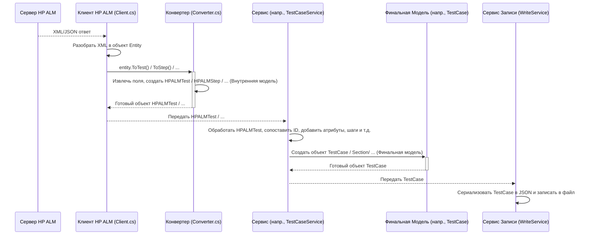

# Chapter 7: Конвертер Данных и Модели


В [предыдущей главе](06_сервис_атрибутов_.md) мы узнали, как [Сервис Атрибутов](06_сервис_атрибутов_.md) собирает информацию о пользовательских полях в HP ALM. Теперь у нас есть все основные "ингредиенты": структура папок ([Сервис Секций](03_сервис_секций__папок__.md)), детали тестов ([Сервис Тест-кейсов](04_сервис_тест_кейсов_.md)), вложенные файлы ([Сервис Вложений](05_сервис_вложений_.md)) и описание атрибутов ([Сервис Атрибутов](06_сервис_атрибутов_.md)).

Но есть одна проблема: данные, которые мы получаем напрямую от сервера HP ALM через [Клиент HP ALM](02_клиент_hp_alm_.md), часто приходят в специфическом формате, например, XML. Это похоже на получение запчастей россыпью — они пока бесполезны сами по себе. Нам нужно:

1.  **Рассортировать** эти "запчасти" и понять, что к чему относится.
2.  **Собрать** из них законченные узлы (например, объект, описывающий тест-кейс).
3.  **Упаковать** эти узлы в финальный формат, готовый для экспорта (JSON-файлы).

Для решения этих задач в `HPALMExporter` используются **Модели** и статический класс **Конвертер (`Converter`)**.

Представьте себе сборочный цех:
*   **Модели** — это чертежи. Они описывают, как должен выглядеть каждый готовый узел (например, какие поля должны быть у объекта "тест-кейс").
*   **`Converter`** — это сам сборочный конвейер и инструменты. Он берет сырые "запчасти" (данные из XML HP ALM) и, следуя чертежам (моделям), собирает из них конкретные детали и узлы (объекты C#).

Давайте разберемся подробнее.

## Что такое Модели?

Модели — это C#-классы, которые служат шаблонами или "чертежами" для наших данных. Они определяют, какую структуру должна иметь информация. В `HPALMExporter` используется два основных типа моделей:

1.  **Внутренние Модели HP ALM (`Models/HPALM*.cs`)**: Эти модели описывают данные *так, как они приходят из HP ALM*. Они создаются на основе структуры ответов API HP ALM. Например, `HPALMFolder` описывает папку из HP ALM.

    ```csharp
    // Файл: Models/HPALMFolder.cs (или ImportHPALMToTestIT.Models.HPALM/HPALMFolder.cs)
    // (Это упрощенный пример из контекста, фактический код может отличаться)
    namespace ImportHPALMToTestIT.Models.HPALM; // Пространство имен может отличаться

    // Чертеж для папки из HP ALM
    public class HPALMFolder
    {
        public int Id { get; set; } // ID папки в HP ALM
        public string Name { get; set; } // Имя папки
        public int ParentId { get; set; } // ID родительской папки в HP ALM
    }
    ```
    *   **Объяснение:** Этот класс говорит: "Объект `HPALMFolder` должен иметь три поля: `Id` (число), `Name` (текст) и `ParentId` (число)".

2.  **Модели для Экспорта (`Models` библиотека)**: Это модели, которые описывают данные *в том формате, в котором мы хотим их экспортировать* (например, для Test IT). Эти модели используются такими сервисами, как [Сервис Секций](03_сервис_секций__папок__.md) и [Сервис Тест-кейсов](04_сервис_тест_кейсов_.md), при подготовке итоговых данных. Примеры: `Section`, `TestCase`, `Attribute`, `SharedStep`. Мы уже встречали их в предыдущих главах.

Модели помогают нам работать с данными структурированно и предсказуемо.

## Что такое `Converter`?

`Converter` (находится в файле `Models/Converter.cs`) — это статический класс. "Статический" означает, что нам не нужно создавать его экземпляр; его методы доступны напрямую, как инструменты из универсального ящика.

**Главная задача `Converter` — преобразовывать "сырые" данные, полученные от HP ALM (часто в виде XML-объектов `Entity`), в наши внутренние C#-модели (типа `HPALMFolder`, `HPALMTest`, `HPALMStep`).**

Он содержит логику *маппинга* (сопоставления). `Converter` знает, что XML-элемент `<Field Name="parent-id">` в ответе HP ALM соответствует свойству `ParentId` в нашем C#-классе `HPALMFolder`.

Возвращаясь к аналогии с цехом: `Converter` берет неупорядоченные детали (`Entity` из XML) и аккуратно собирает их в готовые компоненты (`HPALMFolder`, `HPALMTest`), используя соответствующие чертежи (модели).

## Как используется `Converter`? Пример

Класс `Converter` содержит так называемые *методы расширения*. Это специальные методы, которые как бы "добавляют" функциональность к существующим классам. В нашем случае, `Converter` добавляет методы к классу `Entity` (который представляет собой распарсенный XML-узел ответа HP ALM).

Давайте посмотрим, как [Клиент HP ALM](02_клиент_hp_alm_.md) использует `Converter` при получении папок (мы видели это в [Главе 2](02_клиент_hp_alm_.md), метод `GetTestFolders`).

```csharp
// Фрагмент из Client/Client.cs (упрощенно)
using HPALMExporter.Models; // Для доступа к Converter и моделям Entity, HPALMFolder

// ... внутри метода GetTestFolders ...

// 3. Разбор (парсинг) XML-ответа
var serializer = new XmlSerializer(typeof(Entities)); // Инструмент для чтения XML
Entities entities;
using (var sr = new StringReader(responseString))
{
    entities = (Entities)serializer.Deserialize(sr); // Преобразуем XML в объекты Entities/Entity
}

// 4. Преобразование в наши внутренние объекты HPALMFolder
// Вот здесь используется Converter!
var folders = entities.Entity // Берем список Entity
                  .Select(e => e.ToTestFolder()) // Для каждого 'e' (типа Entity) вызываем метод расширения ToTestFolder()
                  .ToList(); // Собираем результат в список

// ... (Возвращаем список folders) ...
```

**Объяснение:**
*   Сначала XML-ответ разбирается на объекты `Entity`.
*   Затем строка `e.ToTestFolder()` вызывает метод `ToTestFolder`, определенный в `Converter.cs`, для каждого объекта `Entity` (`e`). Этот вызов преобразует `Entity` в `HPALMFolder`.

Теперь заглянем внутрь самого метода `ToTestFolder` в `Converter.cs`.

```csharp
// Файл: Models/Converter.cs (метод ToTestFolder)
using ImportHPALMToTestIT.Models.HPALM; // Для HPALMFolder
// using HPALMExporter.Models; // Для Entity (если он там)

namespace HPALMExporter.Models; // Пространство имен может отличаться

public static class Converter
{
    // Метод расширения для класса Entity
    public static HPALMFolder ToTestFolder(this Entity folderXml) // 'this Entity' указывает, что это метод расширения
    {
        // Извлекаем значение поля "name" из XML-данных (folderXml)
        var name = folderXml.Fields.Field.SingleOrDefault(f => f.Name == "name").Value;
        // Извлекаем значение поля "id"
        var id = folderXml.Fields.Field.SingleOrDefault(f => f.Name == "id").Value;
        // Извлекаем значение поля "parent-id"
        var parentId = folderXml.Fields.Field.SingleOrDefault(f => f.Name == "parent-id").Value;

        // Создаем новый объект HPALMFolder по нашему "чертежу"
        return new HPALMFolder
        {
            Name = name, // Присваиваем имя
            Id = int.Parse(id), // Преобразуем строку ID в число и присваиваем
            ParentId = int.Parse(parentId) // Преобразуем строку ParentId в число и присваиваем
        };
    }

    // ... другие методы конвертации (ToTest, ToStep и т.д.) ...
}
```
**Объяснение:**
*   `this Entity folderXml` в параметрах метода говорит, что это метод расширения для класса `Entity`. Мы можем вызывать его так: `переменная_типа_Entity.ToTestFolder()`.
*   Метод использует LINQ (`SingleOrDefault`) для поиска нужных полей (`Field`) внутри переданного объекта `folderXml` по их атрибуту `Name`.
*   Он извлекает значения (`Value`) этих полей.
*   Затем он создает новый объект `HPALMFolder` и заполняет его свойства (`Name`, `Id`, `ParentId`), используя извлеченные значения. Обратите внимание на `int.Parse()` — строковые значения из XML преобразуются в числа.
*   Этот готовый объект `HPALMFolder` возвращается туда, где был вызван метод (в нашем примере — в `Client.cs`).

Использование `Converter` позволяет вынести всю "грязную" работу по разбору XML и сопоставлению полей в одно место, делая код [Клиента HP ALM](02_клиент_hp_alm_.md) и других сервисов чище и проще.

## Внутренняя структура `Converter.cs`

Класс `Converter` содержит набор подобных статических методов расширения:
*   `ToTestFolder(this Entity entity)`: Конвертирует `Entity` в `HPALMFolder`.
*   `ToTest(this Entity entity, ...)`: Конвертирует `Entity` в `HPALMTest`.
*   `ToStep(this Entity entity)`: Конвертирует `Entity` в `HPALMStep`.
*   `ToAttachment(this Entity entity)`: Конвертирует `Entity` в `HPALMAttachment`.
*   `ToParameter(this Entity entity)`: Конвертирует `Entity` в `HPALMParameter`.

Кроме того, он может содержать вспомогательные приватные методы для общих задач, таких как очистка HTML-тегов из текстовых полей HP ALM:

```csharp
// Файл: Models/Converter.cs (пример вспомогательного метода)
using System.Text.RegularExpressions;

public static class Converter
{
    // Регулярное выражение для удаления HTML тегов
    private static readonly Regex RemoveHTMLtagsRegex = new("<(?:\"[^\"]*\"['\"]*|'[^']*'['\"]*|[^'\">])+>");

    // ... методы ToTestFolder, ToTest и т.д. ...

    // Вспомогательный метод для очистки строки от HTML
    private static string removeHtmlTags(string value)
    {
        // Простая замена стандартных тегов HTML Body
        return value.Replace("<html><body>", "")
            .Replace("</body></html>", "")
            .TrimStart() // Убрать пробелы в начале
            .TrimEnd(); // Убрать пробелы в конце
    }

    // Другой метод для очистки, использующий Regex
    private static string formatDescription(string value)
    {
        // Использует Regex для удаления всех тегов
        return RemoveHTMLtagsRegex.Replace(value, "");
    }
}
```
**Объяснение:**
*   Методы `removeHtmlTags` и `formatDescription` используются внутри методов `ToTest`, `ToStep` и т.д., чтобы убедиться, что текстовые поля (например, описание или ожидаемый результат) не содержат лишних HTML-разметки перед сохранением в наши C# модели.

## Общая картина: От HP ALM до JSON-файла

Давайте еще раз посмотрим на весь путь данных, уделяя внимание роли Моделей и Конвертера:



**Объяснение диаграммы:**

1.  **HP ALM -> Клиент:** Сервер отправляет ответ (XML).
2.  **Клиент:** Разбирает XML в объект `Entity`.
3.  **Клиент -> Конвертер:** Вызывает метод расширения (например, `ToTest()`).
4.  **Конвертер:** Создает внутреннюю модель (например, `HPALMTest`), заполняя ее данными из `Entity`.
5.  **Конвертер -> Клиент:** Возвращает созданную внутреннюю модель.
6.  **Клиент -> Сервис:** Передает внутреннюю модель соответствующему сервису (например, `TestCaseService`).
7.  **Сервис:** Использует данные из внутренней модели (`HPALMTest`), а также данные из других источников (карты ID, атрибуты), чтобы создать финальную модель для экспорта (`TestCase`).
8.  **Сервис -> Сервис Записи:** Передает финальную модель (`TestCase`) в `WriteService`.
9.  **Сервис Записи:** Преобразует объект `TestCase` в JSON и сохраняет его в файл.

Таким образом, **Модели** определяют структуру данных на разных этапах, а **`Converter`** выполняет первичную, рутинную работу по преобразованию данных из формата HP ALM (XML `Entity`) в удобные для использования внутренние C# объекты (`HPALM*`).

## Заключение

В этой главе мы рассмотрели важные вспомогательные компоненты `HPALMExporter`: **Модели** и **Конвертер**. Мы узнали, что:

*   **Модели** — это C# классы, описывающие структуру данных. Они бывают двух видов: для внутреннего представления данных HP ALM (`HPALM*`) и для финального экспорта (`TestCase`, `Section` и т.д.).
*   **`Converter`** — это статический класс с методами расширения, который преобразует "сырые" данные из ответа HP ALM (объекты `Entity`) во внутренние модели (`HPALM*`), выполняя сопоставление полей и базовую очистку данных.
*   Этот подход разделяет ответственности: [Клиент HP ALM](02_клиент_hp_alm_.md) отвечает за получение данных, `Converter` — за их первичную "сборку" по чертежам (моделям), а специализированные сервисы ([Сервис Секций](03_сервис_секций__папок__.md), [Сервис Тест-кейсов](04_сервис_тест_кейсов_.md) и др.) используют эти собранные компоненты для создания финальных объектов экспорта, добавляя более сложную логику.

На этом мы завершаем обзор основных технических компонентов `HPALMExporter`. Вы познакомились с главным координатором ([Сервисом Экспорта](01_сервис_экспорта_.md)), "переводчиком" ([Клиентом HP ALM](02_клиент_hp_alm_.md)), "архивариусом" ([Сервисом Секций](03_сервис_секций__папок__.md)), "следователем" ([Сервисом Тест-кейсов](04_сервис_тест_кейсов_.md)), "курьером" ([Сервисом Вложений](05_сервис_вложений_.md)), "специалистом по кадрам" ([Сервисом Атрибутов](06_сервис_атрибутов_.md)) и, наконец, со "сборочным цехом" (`Converter` и Модели). Надеемся, это руководство помогло вам понять, как устроен `HPALMExporter` и как он выполняет свою задачу по переносу данных из HP ALM.

---

Generated by [AI Codebase Knowledge Builder](https://github.com/The-Pocket/Tutorial-Codebase-Knowledge)