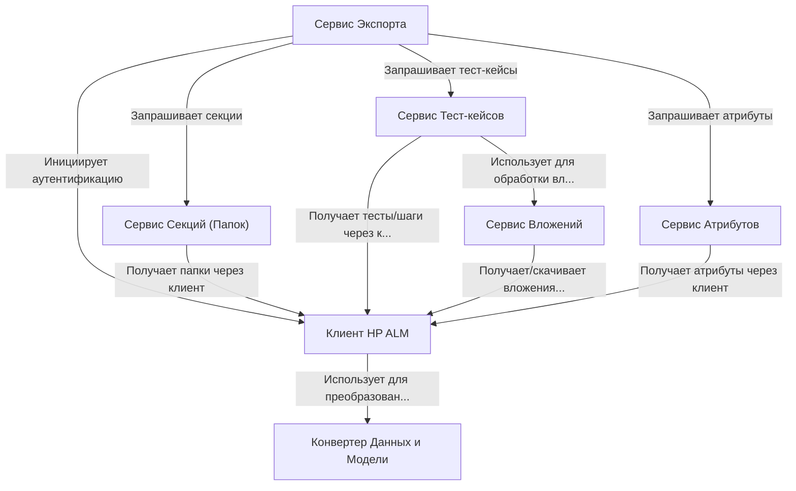

# Tutorial: HPALMExporter

Проект **HPALMExporter** предназначен для *экспорта* данных из системы управления тестированием **HP ALM**.
Он позволяет выгрузить структуру *папок* (секций), *тест-кейсы* с их шагами и параметрами, *пользовательские атрибуты* и связанные *вложения* (файлы и ссылки).
Центральный **Сервис Экспорта** координирует работу других сервисов, каждый из которых отвечает за свою часть данных (папки, тесты, атрибуты, вложения), взаимодействуя с HP ALM через специальный **Клиент**.
Данные преобразуются из формата HP ALM в промежуточные модели и затем подготавливаются для записи в итоговые файлы.

## Chapters

1. [Сервис Экспорта
](01_сервис_экспорта_.md)
2. [Клиент HP ALM
](02_клиент_hp_alm_.md)
3. [Сервис Секций (Папок)
](03_сервис_секций__папок__.md)
4. [Сервис Тест-кейсов
](04_сервис_тест_кейсов_.md)
5. [Сервис Вложений
](05_сервис_вложений_.md)
6. [Сервис Атрибутов
](06_сервис_атрибутов_.md)
7. [Конвертер Данных и Модели
](07_конвертер_данных_и_модели_.md)

---

Generated by [AI Codebase Knowledge Builder](https://github.com/The-Pocket/Tutorial-Codebase-Knowledge)