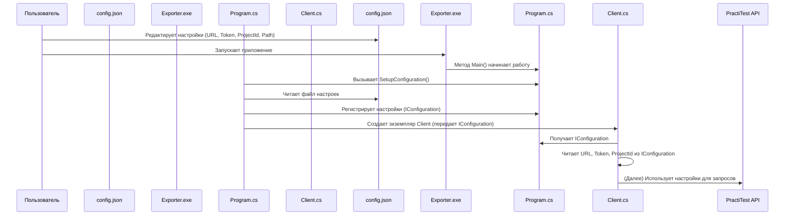

# Chapter 1: Настройка Приложения


Добро пожаловать в руководство по `PractiTestExporter`! В этой первой главе мы разберемся, как "настроить" наше приложение, чтобы оно знало, куда подключаться и что делать.

Представьте, что `PractiTestExporter` — это ваш личный помощник, который должен сходить в систему PractiTest и принести оттуда ваши тест-кейсы. Но чтобы он смог это сделать, ему нужно дать точные инструкции:

*   По какому адресу находится PractiTest?
*   Как ему "представиться", чтобы его пустили (секретный ключ)?
*   В каком именно проекте искать тест-кейсы?
*   Куда сложить то, что он найдет?

Вот для этого и нужна настройка! Без нее наш помощник просто не будет знать, с чего начать.

## Файл Конфигурации: `practitest.config.json`

Основной способ дать инструкции нашему помощнику — это специальный файл `practitest.config.json`. Думайте об этом файле как о **пульте управления** для `PractiTestExporter`. Все важные параметры задаются именно здесь.

Вот как выглядит этот файл:

```json
{
  "resultPath": "/Users/user01/Documents/importer",
  "practiTest": {
    "url": "https://prod-api.practitest.app",
    "token": "a7b9bea53f1e7a6ef7d3052969b55926680bc13b",
    "projectId": "15467"
  }
}
```

Давайте разберем каждую строчку:

*   `"resultPath"`: Это путь к папке на вашем компьютере, куда приложение сохранит все экспортированные данные (тест-кейсы, вложения и т.д.). Укажите здесь реальный путь к существующей папке.
*   `"practiTest"`: Этот блок содержит все настройки для подключения к PractiTest.
    *   `"url"`: Адрес (URL), по которому находится API PractiTest. Обычно это `https://prod-api.practitest.app`.
    *   `"token"`: Ваш секретный API токен. Его можно найти в настройках вашего аккаунта PractiTest. Это как пароль для приложения, чтобы PractiTest понял, что это именно вы делаете запрос. **Никому не показывайте свой токен!**
    *   `"projectId"`: Уникальный номер (ID) вашего проекта в PractiTest, из которого нужно экспортировать данные.

**Важно:** Перед запуском `PractiTestExporter` убедитесь, что вы создали файл `practitest.config.json`, заполнили его своими данными и сохранили в той же папке, где находится само приложение (`PractiTestExporter.exe` или исполняемый файл для вашей системы).

## Как Приложение Читает Настройки?

Когда вы запускаете `PractiTestExporter`, первым делом он ищет файл `practitest.config.json`. За чтение этого файла отвечает код в файле `Program.cs`.

Давайте посмотрим на ключевую часть этого процесса:

```csharp
// Файл: Program.cs

// ...другой код...

        private static IConfiguration SetupConfiguration()
        {
            // Создаем "строителя" конфигурации
            return new ConfigurationBuilder()
                // Говорим, что искать файлы нужно в текущей папке
                .SetBasePath(Directory.GetCurrentDirectory())
                // Добавляем наш JSON файл как источник настроек
                .AddJsonFile("practitest.config.json")
                // Позволяем переопределять настройки через переменные окружения (для продвинутых сценариев)
                .AddEnvironmentVariables()
                // "Собираем" все настройки вместе
                .Build();
        }

        static IHostBuilder CreateHostBuilder(string[] strings)
        {
            // ...другой код...
            return Host.CreateDefaultBuilder()
                // ...настройка логирования...
                .ConfigureServices((_, services) =>
                {
                    // ...регистрация других сервисов...
                    // Регистрируем прочитанные настройки, чтобы они были доступны всему приложению
                    services.AddSingleton(SetupConfiguration());
                    // ...регистрация других сервисов...
                });
        }
// ...другой код...
```

Что здесь происходит простыми словами:

1.  Метод `SetupConfiguration` использует `ConfigurationBuilder`, чтобы найти (`SetBasePath`, `AddJsonFile`) и прочитать наш файл `practitest.config.json`.
2.  Результат чтения (все наши настройки) "собирается" (`Build`) в специальный объект `IConfiguration`.
3.  В методе `CreateHostBuilder` этот объект `IConfiguration` регистрируется (`services.AddSingleton`) как "одиночка" (singleton). Это значит, что одни и те же настройки будут использоваться всеми частями приложения во время его работы.

Теперь другие компоненты, например, клиент для общения с API PractiTest ([Взаимодействие с PractiTest API](03_взаимодействие_с_practitest_api_.md)), могут легко получить эти настройки.

Вот как `Client` получает нужные ему `url`, `token` и `projectId`:

```csharp
// Файл: Client/Client.cs

public class Client : IClient
{
    // ...другие поля...
    private readonly string _projectId;
    private readonly HttpClient _httpClient;

    // Конструктор получает доступ к конфигурации благодаря регистрации в Program.cs
    public Client(ILogger<Client> logger, IConfiguration configuration)
    {
        // Получаем секцию настроек "practiTest" из общего объекта конфигурации
        var section = configuration.GetSection("practiTest");
        // Читаем конкретные значения
        var url = section["url"];
        var token = section["token"];
        var projectId = section["projectId"];

        // Проверяем, что значения указаны
        if (string.IsNullOrEmpty(url)) { /* ... обработка ошибки ... */ }
        if (string.IsNullOrEmpty(token)) { /* ... обработка ошибки ... */ }
        if (string.IsNullOrEmpty(projectId)) { /* ... обработка ошибки ... */ }

        _projectId = projectId; // Сохраняем ID проекта для дальнейшего использования
        _httpClient = new HttpClient(); // Создаем HTTP клиент
        _httpClient.BaseAddress = new Uri(url); // Устанавливаем базовый адрес API
        _httpClient.DefaultRequestHeaders.Add("PTToken", token); // Добавляем токен для авторизации
    }

    // ...остальной код клиента...
}
```

Видите? `Client` просто "просит" объект `IConfiguration` и берет из него нужные ему параметры, которые мы задали в `practitest.config.json`.

## Упаковка Конфигурации Вместе с Приложением

Чтобы приложение всегда могло найти свой файл конфигурации, используется специальная настройка в файле проекта `PractiTestExporter.csproj`:

```xml
<!-- Файл: PractiTestExporter.csproj -->
<Project Sdk="Microsoft.NET.Sdk">
    <!-- ...другие настройки проекта... -->
    <ItemGroup>
        <None Update="practitest.config.json">
            <!-- Говорим системе сборки всегда копировать этот файл -->
            <CopyToOutputDirectory>Always</CopyToOutputDirectory>
        </None>
    </ItemGroup>
    <!-- ...другие настройки... -->
</Project>
```

Эта секция `<None Update="..."` гарантирует, что при сборке проекта файл `practitest.config.json` будет скопирован в ту же папку, где будет находиться исполняемый файл `PractiTestExporter`. Поэтому вам нужно просто положить ваш заполненный `practitest.config.json` рядом с приложением перед запуском.

## Схема Процесса Настройки

Давайте визуализируем, как все это работает:



Эта простая схема показывает, как ваши инструкции из файла `practitest.config.json` передаются через `Program.cs` к компоненту `Client.cs`, который будет использовать их для связи с PractiTest.

## Заключение

В этой главе мы узнали, насколько важна настройка для `PractiTestExporter`. Мы разобрались, что:

*   Приложение настраивается через файл `practitest.config.json`.
*   В этом файле мы указываем ключевые параметры: путь для результатов, URL API PractiTest, токен доступа и ID проекта.
*   Код в `Program.cs` читает этот файл при запуске и делает настройки доступными для всего приложения.
*   Другие части приложения, как `Client`, используют эти настройки для своей работы.

Теперь, когда наш "помощник" знает, куда идти и как представиться, мы готовы посмотреть, как именно он выполняет свою работу.

В следующей главе мы подробно рассмотрим сам [Процесс Экспорта](02_процесс_экспорта_.md).

---

Generated by [AI Codebase Knowledge Builder](https://github.com/The-Pocket/Tutorial-Codebase-Knowledge)