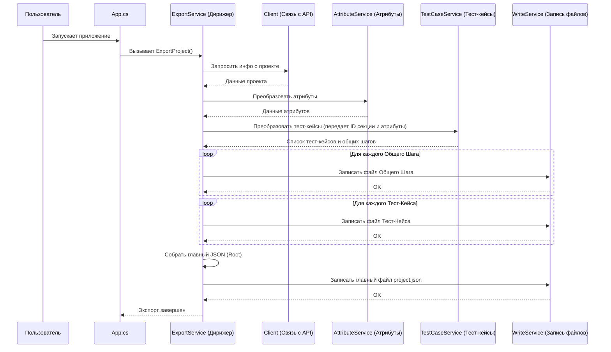

# Chapter 2: Процесс Экспорта


В предыдущей главе, [Настройка Приложения](01_настройка_приложения_.md), мы подготовили нашего "помощника" `PractiTestExporter`, дав ему все необходимые инструкции: куда идти (URL PractiTest), как представиться (токен), что искать (ID проекта) и куда складывать результаты (`resultPath`). Теперь, когда он готов к работе, давайте разберемся, как именно он выполняет свою главную задачу — экспорт данных.

Представьте, что вам нужно перевезти много вещей из одного дома (PractiTest) в другой (папка на вашем компьютере). Просто знать адреса недостаточно. Нужен кто-то, кто будет руководить процессом: скажет грузчикам (компонентам приложения), что и когда нести, проследит, чтобы ничего не потерялось, и убедится, что все вещи доставлены и расставлены по местам.

Именно эту роль "руководителя переезда" в `PractiTestExporter` выполняет **Процесс Экспорта**. Он не выгружает данные сам и не форматирует их напрямую, но он знает, кого и в какой последовательности попросить это сделать.

## Главный Дирижер: `ExportService`

Центральным компонентом, отвечающим за весь процесс экспорта, является `ExportService`. Думайте о нем как о дирижере оркестра:

*   У него есть "партитура" (логика экспорта) — он знает, какие шаги нужно выполнить и в каком порядке.
*   У него есть "музыканты" (другие сервисы), каждый из которых отвечает за свой инструмент (свою часть работы):
    *   `Client` ([Взаимодействие с PractiTest API](03_взаимодействие_с_practitest_api_.md)): Общается с PractiTest, запрашивает информацию.
    *   `AttributeService` ([Преобразование Атрибутов](05_преобразование_атрибутов_.md)): Обрабатывает пользовательские поля (атрибуты).
    *   `TestCaseService` ([Преобразование Тест-кейсов](04_преобразование_тест_кейсов_.md)): Обрабатывает сами тест-кейсы и их шаги. Сюда же входит работа с вложениями ([Обработка Вложений](06_обработка_вложений_.md)).
    *   `WriteService`: Записывает готовые данные в файлы.
*   `ExportService` дает команды этим "музыкантам" в нужный момент, чтобы получилась слаженная "мелодия" экспорта.

## Запуск Процесса

Как же начинается этот "концерт"? Все начинается с самого запуска приложения. Вспомним файл `Program.cs` из первой главы — он настраивает и запускает главный класс приложения `App`. А что делает `App`?

```csharp
// Файл: App.cs

public class App
{
    private readonly ILogger<App> _logger;
    // Получаем "дирижера" - ExportService
    private readonly IExportService _service; // Это и есть наш ExportService

    public App(ILogger<App> logger, IExportService service)
    {
        _logger = logger;
        _service = service; // Запоминаем его
    }

    public void Run(string[] args)
    {
        _logger.LogInformation("Начинаем работу приложения"); // Записываем в лог о начале

        // Даем команду "дирижеру" начать экспорт!
        _service.ExportProject().Wait(); // <-- Вот здесь все и начинается!

        _logger.LogInformation("Завершаем работу приложения"); // Записываем в лог о конце
    }
}
```

Как видите, все очень просто:

1.  При запуске `App` получает готовый экземпляр `IExportService` (наш `ExportService`). Откуда он берется? Его создает система настройки зависимостей, которую мы настроили в `Program.cs` (помните `services.AddSingleton<IExportService, ExportService>();`?).
2.  В методе `Run` вызывается единственный метод нашего "дирижера" — `ExportProject()`.
3.  `Wait()` просто ждет, пока весь процесс экспорта не завершится.

Именно вызов `_service.ExportProject()` запускает всю цепочку действий по выгрузке данных.

## Шаги Экспорта: Что Происходит "Под Капотом"?

Когда `ExportService` получает команду `ExportProject()`, он начинает координировать работу других сервисов в строгой последовательности. Давайте посмотрим на основные шаги этого процесса:

1.  **Получение информации о проекте:** Сначала нужно узнать базовую информацию о проекте, например, его имя. `ExportService` просит `Client` ([Взаимодействие с PractiTest API](03_взаимодействие_с_practitest_api_.md)) сходить в PractiTest и принести эти данные.
2.  **Создание корневой структуры:** Готовится основа для будущих файлов – так называемая "корневая секция".
3.  **Преобразование атрибутов:** `ExportService` обращается к `AttributeService` ([Преобразование Атрибутов](05_преобразование_атрибутов_.md)), чтобы получить и подготовить информацию о пользовательских полях (атрибутах), которые используются в проекте.
4.  **Преобразование тест-кейсов:** Это самый объемный шаг. `ExportService` просит `TestCaseService` ([Преобразование Тест-кейсов](04_преобразование_тест_кейсов_.md)) выгрузить *все* тест-кейсы из PractiTest, преобразовать их в нужный формат, включая обработку шагов и вложений ([Обработка Вложений](06_обработка_вложений_.md)). `TestCaseService` использует информацию об атрибутах, полученную на предыдущем шаге.
5.  **Запись промежуточных файлов:** Результаты работы `TestCaseService` (готовые тест-кейсы и общие шаги) нужно сохранить. `ExportService` передает эти данные `WriteService`, который записывает их в отдельные JSON-файлы в указанную папку (`resultPath` из конфигурации).
6.  **Формирование и запись главного файла:** Наконец, `ExportService` собирает всю общую информацию (имя проекта, список всех созданных файлов тест-кейсов и общих шагов, информацию об атрибутах) в одну главную структуру ([Модели Данных](07_модели_данных_.md)) и просит `WriteService` записать ее в основной файл `project.json`.

Давайте представим это в виде схемы:



Эта схема наглядно показывает, как `ExportService` руководит процессом, последовательно обращаясь к другим сервисам для выполнения конкретных задач.

## Взгляд на Код `ExportService`

Теперь давайте посмотрим на фрагменты кода `ExportService.cs`, чтобы увидеть, как эти шаги реализованы.

Сначала конструктор — место, где "дирижер" получает свои "инструменты" (другие сервисы):

```csharp
// Файл: Services/ExportService.cs

public class ExportService : IExportService
{
    private readonly ILogger<ExportService> _logger;
    private readonly IClient _client; // Для общения с API
    private readonly IWriteService _writeService; // Для записи файлов
    private readonly ITestCaseService _testCaseService; // Для обработки тест-кейсов
    private readonly IAttributeService _attributeService; // Для обработки атрибутов
    // ... другие поля ...

    // Конструктор: Сюда передаются все нужные сервисы
    public ExportService(ILogger<ExportService> logger, IClient client,
        IWriteService writeService, ITestCaseService testCaseService, IAttributeService attributeService)
    {
        _logger = logger;
        _client = client; // Сохраняем ссылку на Client
        _writeService = writeService; // Сохраняем ссылку на WriteService
        _testCaseService = testCaseService; // Сохраняем ссылку на TestCaseService
        _attributeService = attributeService; // Сохраняем ссылку на AttributeService
    }

    // ... метод ExportProject() ниже ...
}
```

Благодаря настройке в `Program.cs`, когда создается `ExportService`, ему автоматически предоставляются уже готовые экземпляры `Client`, `WriteService`, `TestCaseService` и `AttributeService`.

А вот и сам метод `ExportProject`, выполняющий экспорт:

```csharp
// Файл: Services/ExportService.cs (продолжение)

public async Task ExportProject()
{
    _logger.LogInformation("Начинаем экспорт");

    // Шаг 1: Получаем информацию о проекте от Client
    var project = await _client.GetProject();
    _logger.LogInformation("Получена информация о проекте: {ProjectName}", project.Data.Attributes.Name);

    // Шаг 2: Готовим базовую структуру (пропустим детали)
    var section = new Section { /* ... настройки ... */ };

    // Шаг 3: Просим AttributeService обработать атрибуты
    var attributeData = await _attributeService.ConvertCustomAttributes();
    _logger.LogInformation("Атрибуты обработаны");

    // Шаг 4: Просим TestCaseService обработать тест-кейсы, передаем ему нужные данные
    var testCaseData = await _testCaseService.ConvertTestCases(
        section.Id, // ID корневой секции
        attributeData.AttributeMap // Карта преобразованных атрибутов
    );
    _logger.LogInformation("Тест-кейсы обработаны. Получено: {TestCaseCount} тест-кейсов, {SharedStepCount} общих шагов",
        testCaseData.TestCases.Count, testCaseData.SharedSteps.Count);

    // Шаг 5: Просим WriteService записать общие шаги
    foreach (var sharedStep in testCaseData.SharedSteps)
    {
        await _writeService.WriteSharedStep(sharedStep);
    }
    _logger.LogInformation("Файлы общих шагов записаны");

    // Шаг 5 (продолжение): Просим WriteService записать тест-кейсы
    foreach (var testCase in testCaseData.TestCases)
    {
        await _writeService.WriteTestCase(testCase);
    }
    _logger.LogInformation("Файлы тест-кейсов записаны");

    // Шаг 6: Собираем финальный JSON (главный файл)
    var mainJson = new Root
    {
        ProjectName = project.Data.Attributes.Name, // Имя проекта
        Sections = new List<Section> { section },   // Корневая секция
        TestCases = testCaseData.TestCases.Select(t => t.Id).ToList(), // Список ID файлов тест-кейсов
        SharedSteps = testCaseData.SharedSteps.Select(s => s.Id).ToList(), // Список ID файлов общих шагов
        Attributes = attributeData.Attributes, // Список атрибутов
    };

    // Шаг 6 (продолжение): Просим WriteService записать главный файл
    await _writeService.WriteMainJson(mainJson);
    _logger.LogInformation("Главный файл project.json записан");

    _logger.LogInformation("Экспорт завершен");
}
```

Этот код точно следует шагам, которые мы описали ранее: запрашивает данные у одних сервисов, передает их другим для обработки, и наконец, просит `WriteService` сохранить результаты. `ExportService` сам не знает деталей того, *как* получить данные из PractiTest или *как* преобразовать тест-кейс, он просто знает, *кого* об этом попросить.

## Заключение

В этой главе мы познакомились с сердцем `PractiTestExporter` — процессом экспорта, которым руководит `ExportService`. Мы увидели, что:

*   `ExportService` действует как "дирижер", координируя работу других специализированных сервисов (`Client`, `TestCaseService`, `AttributeService`, `WriteService`).
*   Весь процесс запускается одним вызовом метода `ExportProject()` из класса `App`.
*   Экспорт состоит из четкой последовательности шагов: получение информации о проекте, обработка атрибутов, обработка тест-кейсов и запись результатов в файлы.
*   `ExportService` связывает все компоненты вместе, обеспечивая плавное выполнение экспорта от начала до конца.

Теперь, когда мы понимаем общую картину процесса, самое время углубиться в детали работы его "музыкантов".

В следующей главе мы подробно рассмотрим, как приложение взаимодействует с внешним миром, а именно с PractiTest API: [Взаимодействие с PractiTest API](03_взаимодействие_с_practitest_api_.md).

---

Generated by [AI Codebase Knowledge Builder](https://github.com/The-Pocket/Tutorial-Codebase-Knowledge)