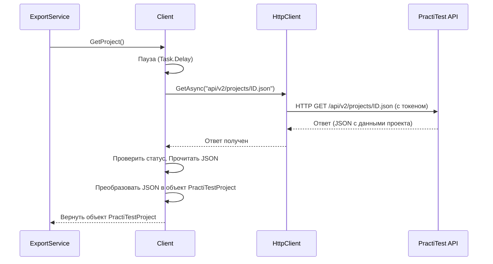

# Chapter 3: Взаимодействие с PractiTest API


В предыдущей главе, [Процесс Экспорта](02_процесс_экспорта_.md), мы увидели, как `ExportService` дирижирует всем процессом выгрузки данных, словно руководитель оркестра. Он знает, *кого* попросить выполнить каждую часть работы, но сам не занимается деталями. Одним из важнейших "музыкантов" в этом оркестре является тот, кто непосредственно общается с внешним миром — с системой PractiTest.

Представьте, что `PractiTestExporter` — это офис, а PractiTest — это другой город. Нам нужен специальный сотрудник — почтальон — который умеет ездить в этот город (по правильному адресу), имеет пропуск (токен доступа) и знает, какие именно документы (данные о проекте, тест-кейсах, шагах) нужно забрать и привезти обратно в офис для дальнейшей обработки.

Именно эту роль "почтальона" выполняет компонент, отвечающий за **Взаимодействие с PractiTest API**. Он инкапсулирует (скрывает внутри себя) все детали общения с PractiTest, предоставляя другим частям программы простой способ запросить нужную информацию.

## Главный "Переговорщик": Класс `Client`

За все общение с API PractiTest в нашем приложении отвечает класс `Client` (файл `Client/Client.cs`). Давайте посмотрим, что он умеет:

1.  **Знает адрес:** Он хранит URL API PractiTest, полученный из файла конфигурации ([Настройка Приложения](01_настройка_приложения_.md)).
2.  **Имеет "пропуск":** Он использует ваш API токен для аутентификации каждого запроса к PractiTest, доказывая, что у него есть право на доступ к данным.
3.  **Знает, что запрашивать:** Он содержит методы для запроса конкретных видов информации:
    *   Общая информация о проекте (`GetProject`).
    *   Список всех тест-кейсов в проекте (`GetTestCases`).
    *   Детали конкретного тест-кейса по его ID (`GetTestCaseById`).
    *   Шаги для конкретного тест-кейса (`GetStepsByTestCaseId`).
    *   Информация о пользовательских полях ([Преобразование Атрибутов](05_преобразование_атрибутов_.md)) (`GetCustomFields`).
    *   Список вложений для тест-кейса или шага ([Обработка Вложений](06_обработка_вложений_.md)) (`GetAttachmentsByEntityId`).
    *   Загрузка самих файлов вложений (`DownloadAttachmentById`).
4.  **Соблюдает "вежливость":** Он автоматически делает небольшие паузы между запросами (`requestDelay`), чтобы не создавать чрезмерную нагрузку на сервер PractiTest.

По сути, любой другой компонент, которому нужна информация из PractiTest (например, `ExportService` или `TestCaseService`), обращается к `Client` и говорит: "Принеси мне, пожалуйста, вот это". А `Client` уже сам разбирается, как это сделать.

## Как `ExportService` Использует `Client`?

Давайте вспомним `ExportService` из предыдущей главы. В самом начале процесса экспорта ему нужна информация о проекте. Он не пытается сам формировать HTTP-запрос, он просто просит об этом `Client`:

```csharp
// Файл: Services/ExportService.cs (фрагмент)

public class ExportService : IExportService
{
    private readonly IClient _client; // Получает "почтальона" при создании
    // ... другие сервисы ...

    public ExportService(..., IClient client, ...) // Конструктор
    {
        _client = client; // Запоминает "почтальона"
        // ...
    }

    public async Task ExportProject()
    {
        _logger.LogInformation("Начинаем экспорт");

        // Шаг 1: Просим Client принести информацию о проекте
        var project = await _client.GetProject(); // <-- Вот оно! Простой вызов метода
        _logger.LogInformation("Получена информация о проекте: {ProjectName}", project.Data.Attributes.Name);

        // ... остальные шаги экспорта ...
    }
}
```

Как видите, `ExportService` просто вызывает метод `_client.GetProject()`. Ему не нужно знать URL, как передать токен или как обработать ответ. Всю эту "грязную" работу делает `Client`. Он получает от `Client` уже готовый объект `project` с нужными данными (модель `PractiTestProject` из [Модели Данных](07_модели_данных_.md)).

## Под Капотом: Как `Client` Работает?

Давайте заглянем внутрь `Client` и посмотрим, что происходит, когда вызывается, например, метод `GetProject()`.

**Шаг за Шагом (без кода):**

1.  **Получение вызова:** Метод `GetProject()` в `Client` получает управление.
2.  **"Вежливая" пауза:** Сначала он ждет заданное время (`requestDelay`), чтобы не отправлять запросы слишком часто.
3.  **Формирование адреса:** Он берет базовый URL API (например, `https://prod-api.practitest.app`) и добавляет к нему специфичный путь для получения информации о проекте, используя ID проекта (`_projectId`), который он получил при запуске из конфигурации. Получается что-то вроде `api/v2/projects/15467.json`.
4.  **Отправка запроса:** Он использует встроенный в .NET объект `HttpClient` (который уже настроен с базовым URL и вашим токеном в заголовке `PTToken`) для отправки GET-запроса по сформированному адресу.
5.  **Ожидание ответа:** Он ждет, пока сервер PractiTest обработает запрос и пришлет ответ.
6.  **Проверка успеха:** Он проверяет код состояния ответа. Если это не код успеха (например, 200 OK), он сообщает об ошибке.
7.  **Чтение данных:** Если все хорошо, он читает тело ответа, которое содержит данные о проекте в формате JSON.
8.  **Преобразование (Десериализация):** Он преобразует текст JSON в понятный для C# объект типа `PractiTestProject`.
9.  **Возврат результата:** Он возвращает этот объект тому, кто его вызвал (в нашем примере — `ExportService`).

**Схема Взаимодействия:**



Эта схема показывает, как `Client` выступает посредником между `ExportService` и `PractiTest API`, используя `HttpClient` для фактической отправки запроса.

## Ныряем в Код `Client`

**1. Настройка в Конструкторе:**

Когда приложение запускается, создается экземпляр `Client`. В конструкторе он получает доступ к настройкам (благодаря [Настройка Приложения](01_настройка_приложения_.md)) и настраивает `HttpClient`:

```csharp
// Файл: Client/Client.cs

public class Client : IClient
{
    // ... _logger ...
    private readonly HttpClient _httpClient; // Клиент для отправки HTTP-запросов
    private readonly string _projectId;     // ID проекта из конфигурации
    private const int requestDelay = 2;     // Пауза между запросами в секундах

    public Client(ILogger<Client> logger, IConfiguration configuration)
    {
        // ... _logger = logger; ...

        // Получаем настройки PractiTest из конфигурации
        var section = configuration.GetSection("practiTest");
        var url = section["url"];         // Читаем URL
        var token = section["token"];       // Читаем Токен
        var projectId = section["projectId"]; // Читаем ID проекта

        // Проверяем, что все настройки заданы (пропущено для краткости)
        // ...

        _projectId = projectId; // Сохраняем ID проекта

        // Создаем и настраиваем HttpClient
        _httpClient = new HttpClient();
        _httpClient.BaseAddress = new Uri(url); // Устанавливаем базовый адрес API
        // Добавляем заголовок с токеном для КАЖДОГО запроса
        _httpClient.DefaultRequestHeaders.Add("PTToken", token);
    }
    // ... методы для запросов ...
}
```

Здесь мы видим, как читаются настройки `url`, `token`, `projectId`, и как настраивается `_httpClient`, чтобы он всегда обращался к нужному серверу (`BaseAddress`) и всегда представлялся с помощью токена (`PTToken`).

**2. Пример Метода: `GetProject()`**

А вот как выглядит реализация самого метода `GetProject`, который мы обсуждали:

```csharp
// Файл: Client/Client.cs (продолжение)

public async Task<PractiTestProject> GetProject()
{
    // Шаг 2: "Вежливая" пауза
    await Task.Delay(TimeSpan.FromSeconds(requestDelay));

    _logger.LogInformation("Запрашиваем проект с id {Id}", _projectId);

    // Шаги 3 и 4: Формируем URL и отправляем GET-запрос
    var response = await _httpClient.GetAsync($"api/v2/projects/{_projectId}.json");

    // Шаг 6: Проверка успеха
    if (!response.IsSuccessStatusCode)
    {
        _logger.LogError("Не удалось получить проект. Статус: {StatusCode}", response.StatusCode);
        // Выбрасываем исключение, чтобы остановить процесс
        throw new Exception($"Не удалось получить проект. Статус: {response.StatusCode}");
    }

    // Шаг 7: Чтение ответа
    var content = await response.Content.ReadAsStringAsync();
    // Шаг 8: Преобразование JSON в объект PractiTestProject
    var project = JsonSerializer.Deserialize<PractiTestProject>(content);

    // Шаг 9: Возврат результата (с дополнительной проверкой)
    if (project != null) return project;

    _logger.LogError("Проект не найден (ошибка десериализации?)");
    throw new Exception("Проект не найден");
}
```

Этот код точно следует описанным шагам: делает паузу, формирует URL запроса (`$"api/v2/projects/{_projectId}.json"`), отправляет его с помощью `_httpClient.GetAsync`, проверяет ответ и преобразует результат из JSON в объект C# (`JsonSerializer.Deserialize`).

**3. Другие Методы Запросов**

Остальные методы в `Client.cs` (`GetTestCases`, `GetTestCaseById`, `GetStepsByTestCaseId`, `GetAttachmentsByEntityId`, `DownloadAttachmentById`, `GetCustomFields`) работают по очень похожему принципу:

*   Делают паузу (`Task.Delay`).
*   Формируют правильный URL для конкретного запроса к API PractiTest (например, для получения шагов это будет что-то вроде `api/v2/projects/{_projectId}/steps.json?test-ids={testCaseId}`).
*   Используют `_httpClient.GetAsync` (или `_httpClient.GetByteArrayAsync` для скачивания файлов).
*   Проверяют ответ.
*   Десериализуют JSON в соответствующие C# модели (например, `PractiTestTestCases`, `PractiTestSteps`, `PractiTestAttachments` - см. [Модели Данных](07_модели_данных_.md)).
*   Возвращают результат.

Таким образом, `Client` является единой точкой входа для получения *любых* данных из PractiTest.

## Заключение

В этой главе мы разобрались, как `PractiTestExporter` общается с внешним миром — системой PractiTest. Мы узнали, что:

*   За все взаимодействие с API PractiTest отвечает класс `Client`.
*   Он использует URL и Токен из конфигурации для отправки запросов.
*   Он предоставляет другим компонентам простые методы для получения нужных данных (информации о проекте, тест-кейсах, шагах, вложениях, атрибутах).
*   Он использует `HttpClient` для выполнения реальных HTTP-запросов.
*   Он включает задержки между запросами для стабильной работы.
*   Он скрывает всю сложность сетевого взаимодействия, действуя как "почтальон" для остальных частей приложения.

Теперь, когда мы знаем, *как* получить "сырые" данные из PractiTest, пора посмотреть, как приложение преобразует их в формат, нужный для конечной системы Test IT.

В следующей главе мы погрузимся в процесс обработки самих тест-кейсов: [Преобразование Тест-кейсов](04_преобразование_тест_кейсов_.md).

---

Generated by [AI Codebase Knowledge Builder](https://github.com/The-Pocket/Tutorial-Codebase-Knowledge)