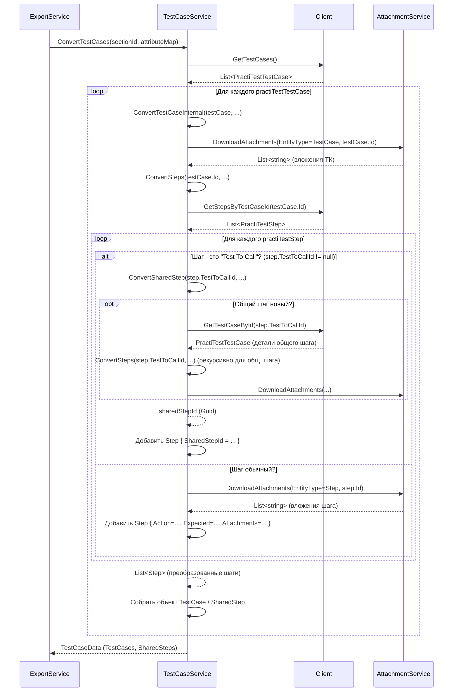

# Chapter 4: Преобразование Тест-кейсов


В предыдущей главе, [Взаимодействие с PractiTest API](03_взаимодействие_с_practitest_api_.md), мы узнали, как наш "почтальон" `Client` доставляет "сырые" данные из системы PractiTest. Он приносит нам информацию о тест-кейсах, их шагах, пользовательских полях и так далее. Но эти данные приходят в том формате, в котором их отдает PractiTest, который может сильно отличаться от того, что нам нужно для конечной системы импорта (например, Test IT).

Представьте, что вы получили инструкцию на одном языке (формат PractiTest), а вам нужно выполнить ее на другом (внутренний формат нашего приложения). Просто иметь текст инструкции недостаточно, нужен **переводчик**, который точно и аккуратно преобразует каждую деталь, сохраняя смысл.

Именно эту роль переводчика выполняет **Сервис Преобразования Тест-кейсов**. Он берет "сырые" данные, полученные от `Client`, и переводит их во внутреннюю структуру, понятную остальным частям `PractiTestExporter`. Это один из самых важных этапов, ведь именно здесь информация о ваших тестах обретает нужную форму.

## Главный "Переводчик": `TestCaseService`

За всю работу по "переводу" тест-кейсов отвечает компонент `TestCaseService` (файл `Services/TestCaseService.cs`). Думайте о нем как о специалисте, который знает оба "языка":

*   **Язык PractiTest:** Он понимает структуру данных, которую возвращает [Client](03_взаимодействие_с_practitest_api_.md) (объекты `PractiTestTestCase`, `PractiTestStep`).
*   **Внутренний Язык:** Он знает, как должна выглядеть информация в формате нашего приложения (объекты `TestCase`, `SharedStep`, `Step` из [Модели Данных](07_модели_данных_.md)).

Его основная задача — взять каждый тест-кейс из PractiTest и тщательно преобразовать его атрибуты, описание, предусловия, шаги и даже особые "общие шаги" во внутренний формат.

## Процесс Преобразования: Шаг за Шагом

Когда `ExportService` ([Процесс Экспорта](02_процесс_экспорта_.md)) решает, что пора обрабатывать тест-кейсы, он обращается к `TestCaseService`. Вот что происходит дальше:

1.  **Получение списка всех Тест-кейсов:** `TestCaseService` сначала просит `Client` принести список *всех* тест-кейсов из проекта PractiTest.
2.  **Перебор Тест-кейсов:** Сервис начинает проходить по этому списку один за другим.
3.  **Преобразование Основных Данных:** Для каждого тест-кейса из PractiTest он берет основные поля (имя, описание, теги) и переносит их в соответствующие поля нашего внутреннего объекта `TestCase`.
4.  **Преобразование Предусловий:** Текст предусловий (`preconditions`) из PractiTest превращается в специальный первый шаг во внутреннем формате.
5.  **Получение и Преобразование Шагов:** `TestCaseService` снова обращается к `Client`, но теперь просит принести шаги (`PractiTestStep`) *конкретно для этого* тест-кейса. Затем он преобразует каждый шаг PractiTest (действие `name`, ожидаемый результат `expected-results`) в наш внутренний формат `Step` (поля `Action`, `Expected`).
6.  **Обработка "Общих Шагов" (Test To Call):** Если сервис встречает шаг, который является ссылкой на другой тест-кейс ("Test To Call" в PractiTest, поле `test-to-call-id`), он обрабатывает его особым образом. Он создает (или находит уже созданный) отдельный объект `SharedStep` для этого общего шага. В основном тест-кейсе вместо обычного шага появляется ссылка (`SharedStepId`) на этот `SharedStep`. Это позволяет избежать дублирования общих последовательностей действий.
7.  **Обработка Атрибутов:** Пользовательские поля (`custom-fields`) из PractiTest преобразуются с использованием карты атрибутов, полученной от [AttributeService](05_преобразование_атрибутов_.md). Мы подробнее разберем это в следующей главе.
8.  **Обработка Вложений:** Во время преобразования тест-кейса и его шагов, `TestCaseService` обращается к `AttachmentService` ([Обработка Вложений](06_обработка_вложений_.md)), чтобы скачать связанные файлы и добавить ссылки на них в результирующую структуру.
9.  **Сборка Результата:** Преобразованный `TestCase` (или `SharedStep`) добавляется в общий список.
10. **Возврат Данных:** После обработки всех тест-кейсов, `TestCaseService` возвращает `ExportService` два списка: один с преобразованными `TestCase`, другой — с `SharedStep`.

## Как Начинается Преобразование

Все начинается с вызова метода `ConvertTestCases` в `TestCaseService` из `ExportService`. `TestCaseService` получает ID корневой секции и карту атрибутов.

```csharp
// Файл: Services/TestCaseService.cs

public class TestCaseService : ITestCaseService
{
    private readonly ILogger<TestCaseService> _logger;
    private readonly IClient _client; // Наш "почтальон" для данных из PractiTest
    private readonly IAttachmentService _attachmentService; // Сервис для работы с вложениями
    // Словари для хранения уже обработанных шагов и кейсов, чтобы не дублировать работу
    private readonly Dictionary<string, SharedStep> _sharedSteps;
    private readonly Dictionary<string, TestCase> _testCases;
    // ... конструктор ...

    public async Task<TestCaseData> ConvertTestCases(Guid sectionId, Dictionary<string, Guid> attributeMap)
    {
        _logger.LogInformation("Начинаем преобразование тест-кейсов");

        // 1. Получаем список ВСЕХ тест-кейсов от Client
        var practiTestTestCases = await _client.GetTestCases();
        _logger.LogDebug("Найдено {Count} тест-кейсов", practiTestTestCases.Count);

        // 2. Перебираем каждый тест-кейс из PractiTest
        foreach (var practiTestTestCase in practiTestTestCases)
        {
            // Проверяем, не обработали ли мы его уже как общий шаг
            if (_sharedSteps.ContainsKey(practiTestTestCase.Id))
            {
                // Если да, просто обновляем ID секции и идем дальше
                _sharedSteps[practiTestTestCase.Id].SectionId = sectionId;
                continue;
            }

            // Если это новый тест-кейс, вызываем метод для его детального преобразования
            var convertedTestCase = await ConvertTestCaseInternal( // Назовем его Internal для ясности
                practiTestTestCase,
                sectionId,
                attributeMap
            );
            // Добавляем результат в словарь обработанных тест-кейсов
            _testCases.Add(practiTestTestCase.Id, convertedTestCase);
        }

        _logger.LogInformation("Тест-кейсы преобразованы");

        // 10. Возвращаем результат: списки TestCases и SharedSteps
        return new TestCaseData
        {
            TestCases = _testCases.Values.ToList(),
            SharedSteps = _sharedSteps.Values.ToList()
        };
    }
    // ... другие методы ...
}
```

Этот код показывает основной цикл работы: получаем список, проходим по нему, и для каждого элемента либо пропускаем (если уже видели как общий шаг), либо вызываем внутренний метод для "глубокого" преобразования.

## Преобразование Отдельного Тест-кейса

Метод `ConvertTestCaseInternal` (в реальном коде он называется `ConvertTestCases`, но мы переименовали для ясности) выполняет основную работу по "переводу" одного тест-кейса.

```csharp
// Файл: Services/TestCaseService.cs (продолжение)

private async Task<TestCase> ConvertTestCaseInternal(
    PractiTestTestCase practiTestTestCase, // Данные из PractiTest
    Guid sectionId,                       // ID секции для нашего формата
    Dictionary<string, Guid> attributeMap) // Карта атрибутов
{
    // Создаем уникальный ID для нашего внутреннего тест-кейса
    var testCaseId = Guid.NewGuid();

    // 7. Преобразуем пользовательские атрибуты (детали в следующей главе)
    var attributes = ConvertAttributes(practiTestTestCase.Attributes.CustomFields, attributeMap);

    // 8. Скачиваем вложения, относящиеся к самому ТЕСТ-КЕЙСУ
    var attachments = await _attachmentService.DownloadAttachments(
        Constants.TestCaseEntityType, // Указываем, что ищем вложения для тест-кейса
        practiTestTestCase.Id,        // ID тест-кейса в PractiTest
        testCaseId                    // Наш новый ID для сохранения файлов
    );

    // 5. Получаем и преобразуем шаги (самый сложный этап, см. ниже)
    var steps = await ConvertSteps(practiTestTestCase.Id, testCaseId, attributeMap);

    // 8 (продолжение). Добавляем вложения из ШАГОВ к общим вложениям тест-кейса
    steps.ForEach(step => attachments.AddRange(step.ActionAttachments));

    // 9. Собираем итоговый объект TestCase в нашем формате
    return new TestCase
    {
        Id = testCaseId, // Наш ID
        Name = practiTestTestCase.Attributes.Name, // Имя
        Description = practiTestTestCase.Attributes.Description, // Описание
        SectionId = sectionId, // ID секции
        State = StateType.NotReady, // Статус (по умолчанию)
        Priority = PriorityType.Medium, // Приоритет (по умолчанию)
        Tags = practiTestTestCase.Attributes.Tags, // Теги
        // 4. Преобразуем предусловия
        PreconditionSteps = ConvertPreconditionSteps(practiTestTestCase.Attributes.Preconditions),
        Steps = steps, // Преобразованные шаги
        Attachments = attachments, // Все вложения (из тест-кейса и шагов)
        Attributes = attributes, // Преобразованные атрибуты
        // ... другие поля по умолчанию ...
        Duration = _duration, // Примерная длительность
        PostconditionSteps = new List<Step>(),
        Iterations = new List<Iteration>(),
        Links = new List<Link>(),
    };
}

// ... ConvertAttributes, ConvertPreconditionSteps, ConvertSteps ...
```

Этот фрагмент показывает "скелет" преобразования: создается новый ID, вызываются другие методы для обработки атрибутов, вложений и шагов, а затем все собирается в объект `TestCase`.

## Преобразование Шагов и Общих Шагов

Самая интересная часть происходит при преобразовании шагов (`ConvertSteps`).

```csharp
// Файл: Services/TestCaseService.cs (продолжение)

private async Task<List<Step>> ConvertSteps(
    string practiTestCaseId,   // ID тест-кейса в PractiTest
    Guid internalTestCaseId, // Наш внутренний ID
    Dictionary<string, Guid> attributeMap)
{
    // Запрашиваем шаги для этого тест-кейса у Client
    var practiTestSteps = await _client.GetStepsByTestCaseId(practiTestCaseId);
    _logger.LogDebug("Найдено шагов: {Count} для тест-кейса {Id}", practiTestSteps.Count, practiTestCaseId);

    var steps = new List<Step>(); // Список для наших преобразованных шагов

    foreach (var practiTestStep in practiTestSteps)
    {
        // 6. Проверяем, является ли шаг ссылкой на "Общий Шаг"
        if (practiTestStep.Attributes.TestToCallId != null)
        {
            // Да, это "Test To Call"!
            _logger.LogDebug("Шаг {Pos} ссылается на общий шаг ID: {CallId}",
                practiTestStep.Attributes.Position, practiTestStep.Attributes.TestToCallId);

            // Вызываем специальный метод для обработки/создания SharedStep
            var sharedStepId = await ConvertSharedStep(
                practiTestStep.Attributes.TestToCallId.ToString(),
                attributeMap
            );

            // Добавляем в список не обычный шаг, а ССЫЛКУ на SharedStep
            steps.Add(new Step { SharedStepId = sharedStepId });
        }
        else
        {
            // Нет, это обычный шаг
            // 8. Скачиваем вложения для этого КОНКРЕТНОГО шага
            var stepAttachments = await _attachmentService.DownloadAttachments(
                Constants.StepEntityType, // Тип сущности - Шаг
                practiTestStep.Id,        // ID шага в PractiTest
                internalTestCaseId);      // Наш ID тест-кейса (для папки)

            // Преобразуем данные шага PractiTest в нашу структуру Step
            var newStep = new Step
            {
                Action = practiTestStep.Attributes.Name, // Действие
                Expected = practiTestStep.Attributes.ExpectedResults, // Ожидаемый результат
                TestData = string.Empty, // Поле "Тестовые данные" не используется в PractiTest
                ActionAttachments = stepAttachments, // Вложения шага
                // ... другие списки вложений пусты ...
            };

            // Добавляем ссылку на вложение прямо в текст шага (если есть)
            foreach (var attachmentName in stepAttachments)
            {
                newStep.Action += $"<br><p><<<{attachmentName}>>></p>";
            }

            steps.Add(newStep); // Добавляем обычный шаг в список
        }
    }
    _logger.LogDebug("Шаги преобразованы для тест-кейса {Id}", practiTestCaseId);
    return steps;
}
// ... ConvertSharedStep ...
```

Здесь мы видим ключевую логику: если `TestToCallId` не пустой, вызываем `ConvertSharedStep` и добавляем шаг-ссылку. Если шаг обычный, то преобразуем его поля (`Name` -> `Action`, `ExpectedResults` -> `Expected`), скачиваем его вложения с помощью `AttachmentService` и добавляем в список.

### Обработка "Test To Call" (`ConvertSharedStep`)

Метод `ConvertSharedStep` немного хитрее. Он должен:
1.  Проверить, не обрабатывали ли мы уже этот "общий шаг" ранее (по его ID из PractiTest). Если да, просто вернуть его существующий внутренний ID.
2.  Проверить, не обработали ли мы его *уже как обычный тест-кейс*. Такое может быть, если общий шаг встретился нам позже, чем сам тест-кейс, на который он ссылается. Если да, нужно "переместить" этот тест-кейс из списка обычных (`_testCases`) в список общих (`_sharedSteps`) и вернуть его ID.
3.  Если это совершенно новый для нас общий шаг, нужно запросить его детали у `Client` (`GetTestCaseById`), преобразовать его так же, как обычный тест-кейс (вызвав `ConvertSteps`, `ConvertAttributes`, `DownloadAttachments`), но сохранить результат в словарь `_sharedSteps`, и затем вернуть новый ID.

```csharp
// Файл: Services/TestCaseService.cs (фрагмент ConvertSharedStep)

private async Task<Guid> ConvertSharedStep(string practiTestId, // ID общего шага (он же ID тест-кейса в PractiTest)
                                           Dictionary<string, Guid> attributeMap)
{
    // 1. Проверяем, нет ли его уже в _sharedSteps
    if (_sharedSteps.TryGetValue(practiTestId, out var existingSharedStep))
    {
        _logger.LogDebug("Общий шаг {Id} уже обработан, возвращаем существующий Guid", practiTestId);
        return existingSharedStep.Id; // Нашли! Просто возвращаем ID
    }

    // 2. Проверяем, нет ли его в _testCases (как обычного кейса)
    if (_testCases.TryGetValue(practiTestId, out var existingTestCase))
    {
        _logger.LogDebug("Тест-кейс {Id} используется как общий шаг. Конвертируем его в SharedStep.", practiTestId);
        // Нашли! Превращаем TestCase в SharedStep
        var convertedSharedStep = new SharedStep { /* ... копируем поля из existingTestCase ... */ };
        convertedSharedStep.Id = existingTestCase.Id; // Используем тот же ID
        // ... копирование Name, Description, Steps, Attributes, Attachments ...

        _testCases.Remove(practiTestId); // Удаляем из обычных тест-кейсов
        _sharedSteps.Add(practiTestId, convertedSharedStep); // Добавляем в общие шаги
        return convertedSharedStep.Id; // Возвращаем ID
    }

    // 3. Не нашли ни там, ни там. Значит, это новый общий шаг.
    _logger.LogDebug("Общий шаг {Id} встретился впервые. Запрашиваем детали...", practiTestId);
    // Запрашиваем детали этого "тест-кейса", который используется как общий шаг
    var practiTestTestCase = await _client.GetTestCaseById(practiTestId);
    // ... создаем новый Guid, преобразуем шаги, атрибуты, вложения ...
    // ... точно так же, как в ConvertTestCaseInternal, но создаем объект SharedStep ...
    var newSharedStep = new SharedStep { /* ... заполняем поля ... */ };
    _sharedSteps.Add(practiTestId, newSharedStep); // Сохраняем в словаре общих шагов
    _logger.LogDebug("Новый общий шаг {Id} создан с Guid {Guid}", practiTestId, newSharedStep.Id);
    return newSharedStep.Id; // Возвращаем новый ID
}
```

Эта логика гарантирует, что каждый "общий шаг" из PractiTest будет представлен ровно одним объектом `SharedStep` в нашем внутреннем формате, даже если он встречается в разных тест-кейсах или если мы сначала обработали его как обычный тест-кейс.

## Визуализация Процесса

Давайте посмотрим на схему взаимодействия при преобразовании одного тест-кейса, который содержит и обычные шаги, и общий шаг:



Эта схема показывает, как `TestCaseService` координирует работу: запрашивает данные у `Client`, скачивает файлы через `AttachmentService` и рекурсивно обрабатывает шаги, включая вложенные общие шаги.

## Заключение

В этой главе мы погрузились в процесс "перевода" тест-кейсов из формата PractiTest во внутренний формат приложения. Мы узнали, что:

*   За этот перевод отвечает `TestCaseService`.
*   Он преобразует основные поля тест-кейса, предусловия и шаги.
*   Он умеет распознавать и обрабатывать "общие шаги" (`Test To Call`), превращая их в отдельные сущности `SharedStep` и используя ссылки на них.
*   Он активно взаимодействует с `Client` для получения данных и с `AttachmentService` для скачивания вложений.
*   Результатом его работы являются списки готовых к записи `TestCase` и `SharedStep`.

Мы также коснулись преобразования пользовательских полей (атрибутов), но не углублялись в детали. Именно этому посвящен следующий этап.

В следующей главе мы подробно разберем, как `PractiTestExporter` работает с пользовательскими полями: [Преобразование Атрибутов](05_преобразование_атрибутов_.md).

---

Generated by [AI Codebase Knowledge Builder](https://github.com/The-Pocket/Tutorial-Codebase-Knowledge)