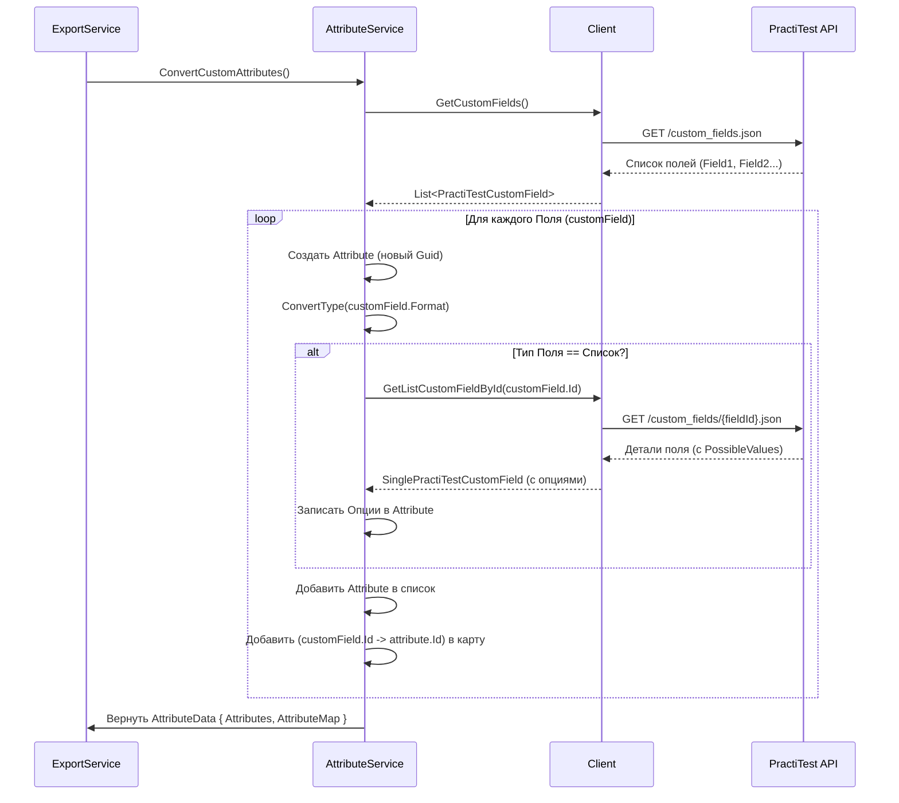

# Chapter 5: Преобразование Атрибутов


В предыдущей главе, [Преобразование Тест-кейсов](04_преобразование_тест_кейсов_.md), мы увидели, как `TestCaseService` переводит основную информацию о тест-кейсах из формата PractiTest в наш внутренний формат. Но кроме стандартных полей, таких как имя, описание и шаги, в PractiTest часто используются **пользовательские поля** (Custom Fields). Это могут быть поля вроде "Приоритет Разработки", "Команда", "Тип Теста" (например, Регрессионный, Смоук, Функциональный) и так далее.

Эти поля очень важны, так как содержат ключевую информацию о тест-кейсах. Но вот проблема:

1.  **Разные "Языки":** PractiTest описывает эти поля по-своему (у него свои типы: `list`, `date`, `numeric`, `text field` и т.д.). Нам же нужно привести их к единому формату, понятному нашей системе и, в конечном итоге, системе, куда мы импортируем данные (например, Test IT, которая использует типы `Options`, `Datetime`, `String`).
2.  **Разные ID:** Каждое пользовательское поле в PractiTest имеет свой уникальный ID. При импорте в другую систему, эти поля получат *новые* ID. Нам нужно где-то сохранить соответствие между старыми и новыми ID.

Представьте, что у вас есть карта старого города (PractiTest) с его названиями улиц и их типами (проспект, бульвар, переулок). Вы хотите создать новую карту для современного путеводителя (наша внутренняя система), используя стандартизированные обозначения (например, всё называть "улица") и присваивая каждой улице новый уникальный номер в вашем путеводителе. Вам нужен кто-то, кто изучит старую карту, создаст новую и запишет, какой номер на старой карте соответствует какому номеру на новой.

Вот именно эту работу и выполняет модуль **Преобразования Атрибутов**.

## "Картограф" Пользовательских Полей: `AttributeService`

За всю работу с пользовательскими полями отвечает компонент `AttributeService` (файл `Services/AttributeService.cs`). Он действует как тот самый "картограф":

1.  **Запрашивает Информацию:** Он обращается к "почтальону" `Client` ([Взаимодействие с PractiTest API](03_взаимодействие_с_practitest_api_.md)) и просит его принести список *всех* пользовательских полей, определенных для нашего проекта в PractiTest.
2.  **Изучает "Старую Карту":** Для каждого поля он смотрит на его имя (например, "Приоритет Теста") и, что важнее, на его тип в PractiTest (`field-format`, например, `list`).
3.  **Создает "Новую Карту":** Он создает внутреннее представление этого поля (объект `Attribute` из [Модели Данных](07_модели_данных_.md)). При этом он:
    *   Присваивает полю *новый*, уникальный внутренний ID (типа `Guid`).
    *   **Переводит Тип:** Преобразует тип PractiTest в наш внутренний тип (`AttributeType`). Например, `list` или `multi-list` из PractiTest становятся `AttributeType.Options`. `date` становится `AttributeType.Datetime`. Все остальные (текст, число и т.д.) для простоты становятся `AttributeType.String`.
    *   **Запрашивает Детали (для списков):** Если поле в PractiTest было списком (`list` или `multi-list`), `AttributeService` делает *дополнительный* запрос через `Client`, чтобы узнать, какие именно значения (`possible-values`) были в этом списке (например, "Высокий", "Средний", "Низкий"). Эти значения он сохраняет в поле `Options` нашего внутреннего `Attribute`.
4.  **Запоминает Соответствие:** Он создает специальный словарь (`AttributeMap`), где записывает: "Пользовательское поле с ID `12345` из PractiTest теперь соответствует нашему внутреннему атрибуту с ID `f47ac10b-58cc-4372-a567-0e02b2c3d479`".

## Как и Когда Это Используется?

`AttributeService` вызывается *до* начала преобразования тест-кейсов. Вспомним `ExportService` из главы [Процесс Экспорта](02_процесс_экспорта_.md):

```csharp
// Файл: Services/ExportService.cs (фрагмент)

public async Task ExportProject()
{
    // ... получить инфо о проекте ...
    // ... подготовить секцию ...

    // Шаг 3: СНАЧАЛА просим AttributeService обработать атрибуты
    var attributeData = await _attributeService.ConvertCustomAttributes(); // <-- Вот здесь!
    _logger.LogInformation("Атрибуты обработаны");

    // Шаг 4: ПОТОМ просим TestCaseService обработать тест-кейсы,
    // ПЕРЕДАВАЯ ему результат работы AttributeService
    var testCaseData = await _testCaseService.ConvertTestCases(
        section.Id,
        attributeData.AttributeMap // <-- Передаем карту соответствия ID
    );

    // ... запись файлов ...

    // Шаг 6: В главный файл project.json записываем список преобразованных атрибутов
    var mainJson = new Root
    {
        // ...
        Attributes = attributeData.Attributes, // <-- Список наших внутренних Attribute
        // ...
    };

    // ... запись главного файла ...
}
```

Как видите:
1.  `ExportService` вызывает `_attributeService.ConvertCustomAttributes()`.
2.  `AttributeService` возвращает объект `AttributeData`, который содержит:
    *   `Attributes`: Список всех пользовательских полей, преобразованных в наш внутренний формат (`List<Attribute>`). Этот список потом запишется в главный файл `project.json`.
    *   `AttributeMap`: Тот самый словарь (`Dictionary<string, Guid>`), который хранит соответствие ID PractiTest -> наш внутренний ID.
3.  Затем `ExportService` вызывает `_testCaseService.ConvertTestCases`, передавая ему эту `AttributeMap`. Зачем? Чтобы `TestCaseService`, когда он будет разбирать конкретный тест-кейс и найдет там пользовательское поле с каким-то значением, смог по ID поля из PractiTest найти наш внутренний ID атрибута и правильно записать значение в итоговый объект `TestCase` ([Преобразование Тест-кейсов](04_преобразование_тест_кейсов_.md)).

## Под Капотом: Шаги Преобразования

Давайте проследим, что делает `AttributeService` внутри метода `ConvertCustomAttributes()`:

1.  **Начало:** Метод вызывается. Создаются пустой список `attributes` и пустой словарь `attributeMap`.
2.  **Запрос к API:** Вызывается `_client.GetCustomFields()`. `Client` отправляет запрос в PractiTest API (что-то вроде `GET /api/v2/projects/{projectId}/custom_fields.json`).
3.  **Получение Ответа:** PractiTest возвращает список своих пользовательских полей (массив объектов `PractiTestCustomField`).
4.  **Цикл по Полям:** `AttributeService` начинает перебирать каждое полученное поле.
5.  **Создание Атрибута:** Для поля из PractiTest создается новый объект `Attribute` нашего формата.
    *   Генерируется новый `Id` (Guid).
    *   Копируется имя (`Name`).
    *   Устанавливаются флаги `IsActive` (true) и `IsRequired` (false) по умолчанию.
    *   Вызывается внутренняя функция `ConvertType` для определения нашего типа (`AttributeType`) на основе `field-format` из PractiTest.
6.  **Проверка на Список:** Если `ConvertType` вернул `AttributeType.Options`:
    *   `AttributeService` снова обращается к `Client`, вызывая `_client.GetListCustomFieldById(customField.Id)`.
    *   `Client` делает еще один запрос к API (например, `GET /api/v2/projects/{projectId}/custom_fields/{fieldId}.json`), чтобы получить детали этого поля, включая список `possible-values`.
    *   Полученный список строк (`PossibleValues`) записывается в поле `Options` нашего `Attribute`.
7.  **Сохранение Результатов:**
    *   Готовый объект `Attribute` добавляется в список `attributes`.
    *   В словарь `attributeMap` добавляется запись: `ключ = customField.Id` (ID из PractiTest), `значение = attribute.Id` (наш новый Guid).
8.  **Конец Цикла:** Переходим к следующему полю из PractiTest (шаг 4). Если полей больше нет, цикл завершается.
9.  **Возврат Данных:** Создается объект `AttributeData`, в него помещаются собранный список `attributes` и словарь `attributeMap`. Этот объект возвращается тому, кто вызвал метод (т.е. `ExportService`).

## Визуализация Процесса



Эта схема показывает, как `AttributeService` сначала получает общий список полей, а затем, при необходимости, делает дополнительные запросы для полей-списков, чтобы собрать всю нужную информацию и создать нашу внутреннюю "карту" атрибутов.

## Ныряем в Код `AttributeService`

**1. Конструктор:**
Как и другие сервисы, `AttributeService` получает "почтальона" `Client` при создании.

```csharp
// Файл: Services/AttributeService.cs

public class AttributeService : IAttributeService
{
    private readonly ILogger<AttributeService> _logger;
    // Получаем "почтальона" для общения с PractiTest
    private readonly IClient _client;

    public AttributeService(ILogger<AttributeService> logger, IClient client)
    {
        _logger = logger;
        _client = client; // Сохраняем его для использования в методах
    }

    // ... метод ConvertCustomAttributes() ниже ...
}
```

**2. Основной Метод `ConvertCustomAttributes`:**
Этот метод реализует описанную выше логику.

```csharp
// Файл: Services/AttributeService.cs (продолжение)

public async Task<AttributeData> ConvertCustomAttributes()
{
    _logger.LogInformation("Получаем пользовательские атрибуты");

    // 1. Готовим списки для результатов
    var attributes = new List<Attribute>();           // Список для наших Attribute
    var attributeMap = new Dictionary<string, Guid>(); // Карта ID PractiTest -> наш ID

    // 2. Запрашиваем у Client список полей из PractiTest
    var customFields = await _client.GetCustomFields();

    // 4. Цикл по полученным полям
    foreach (var customField in customFields)
    {
        // 5. Создаем наш объект Attribute
        var attribute = new Attribute
        {
            Id = Guid.NewGuid(),                       // Генерируем новый ID
            Name = customField.Attributes.Name,        // Копируем имя
            IsActive = true,
            IsRequired = false,
            Type = ConvertType(customField.Attributes.FieldFormat), // Определяем наш тип
            Options = new List<string>()             // Готовим пустой список опций
        };

        // 6. Если тип - список...
        if (attribute.Type == AttributeType.Options)
        {
            // ... запрашиваем детали поля (включая значения списка) у Client
            var listCustomField = await _client.GetListCustomFieldById(customField.Id);
            // Записываем полученные значения в наше поле Options
            attribute.Options = listCustomField.Attributes.PossibleValues;
        }

        // 7. Сохраняем результат
        attributes.Add(attribute);                   // Добавляем в список
        attributeMap.Add(customField.Id, attribute.Id); // Добавляем в карту соответствия
    }

    // 9. Возвращаем контейнер с результатами
    return new AttributeData
    {
        Attributes = attributes,
        AttributeMap = attributeMap,
    };
}

// ... метод ConvertType() ниже ...
```

**3. Вспомогательный Метод `ConvertType`:**
Этот маленький метод отвечает за "перевод" типа поля из формата PractiTest в наш внутренний `AttributeType`.

```csharp
// Файл: Services/AttributeService.cs (продолжение)

// Преобразует строковое имя типа из PractiTest в наш внутренний Enum AttributeType
private static AttributeType ConvertType(string type)
{
    // Используем константы для типов PractiTest для надежности
    // Constants.ListCustomFieldType это "list"
    // Constants.MultiListCustomFieldType это "multi-list"
    // Constants.DateCustomFieldType это "date"
    return type switch
    {
        // Если тип list или multi-list, то наш тип Options
        Constants.ListCustomFieldType or Constants.MultiListCustomFieldType
            => AttributeType.Options,
        // Если тип date, то наш тип Datetime
        Constants.DateCustomFieldType
            => AttributeType.Datetime,
        // Все остальные типы PractiTest (text, numeric, etc.)
        // для простоты преобразуем в наш тип String
        _ => AttributeType.String
    };
}
```

**4. Модель `AttributeData`:**
Это простой класс-контейнер, который `AttributeService` использует для возврата результатов своей работы.

```csharp
// Файл: Models/AttributeData.cs
using Attribute = Models.Attribute; // Используем псевдоним, чтобы не путать с системным Attribute

namespace PractiTestExporter.Models;

// Класс для передачи данных об атрибутах между сервисами
public class AttributeData
{
    // Список преобразованных атрибутов в нашем формате
    public List<Attribute> Attributes { get; set; }
    // Карта для связи ID PractiTest с нашими ID
    public Dictionary<string, Guid> AttributeMap { get; set; }
}
```

## Заключение

В этой главе мы разобрались, как `PractiTestExporter` работает с пользовательскими полями PractiTest. Мы узнали, что:

*   За преобразование пользовательских полей отвечает `AttributeService`.
*   Он действует как "картограф": получает список полей из PractiTest, переводит их типы в наш внутренний формат ([Модели Данных](07_модели_данных_.md)), присваивает новые ID и запоминает соответствие между старыми и новыми ID.
*   Для полей-списков он делает дополнительные запросы, чтобы получить возможные значения.
*   Результат его работы (`AttributeData`, содержащий список `Attribute` и карту `AttributeMap`) используется дальше в процессе:
    *   Список `Attribute` записывается в главный файл `project.json`.
    *   Карта `AttributeMap` передается в `TestCaseService` ([Преобразование Тест-кейсов](04_преобразование_тест_кейсов_.md)), чтобы он мог правильно сопоставить значения пользовательских полей при обработке тест-кейсов.

Теперь, когда мы умеем обрабатывать и основные данные тест-кейсов, и их пользовательские атрибуты, остался еще один важный аспект — файлы, прикрепленные к тестам и шагам.

В следующей главе мы рассмотрим, как приложение работает с вложениями: [Обработка Вложений](06_обработка_вложений_.md).

---

Generated by [AI Codebase Knowledge Builder](https://github.com/The-Pocket/Tutorial-Codebase-Knowledge)