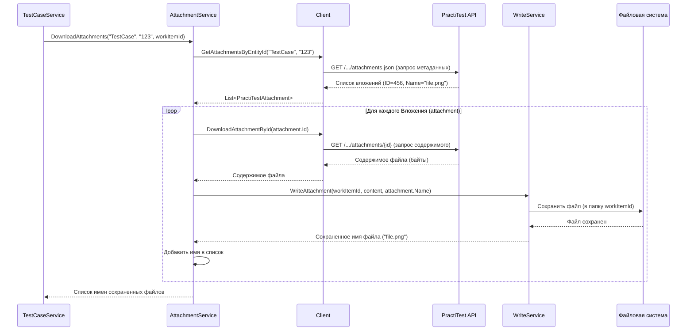

# Chapter 6: Обработка Вложений


В предыдущих главах мы разобрались, как получать данные из PractiTest ([Взаимодействие с PractiTest API](03_взаимодействие_с_practitest_api_.md)), как преобразовывать тест-кейсы и их шаги ([Преобразование Тест-кейсов](04_преобразование_тест_кейсов_.md)), и как работать с пользовательскими полями ([Преобразование Атрибутов](05_преобразование_атрибутов_.md)). Но часто к тест-кейсам или их шагам прикреплены важные файлы: скриншоты ошибок, логи, примеры данных или другие документы. Нам нужен способ не только перенести текстовую информацию, но и сохранить эти связанные файлы.

Представьте себе библиотекаря-архивариуса. Когда вы просите его найти информацию по определенному делу (тест-кейсу), он не только приносит вам папку с описанием, но и находит все прикрепленные к ней документы (фотографии, письма, заметки), копирует их и складывает в отдельную коробку, подписывая каждый документ.

Именно такую роль "архивариуса" для файлов выполняет **Сервис Обработки Вложений**. Его задача — найти, скачать и сохранить все файлы, прикрепленные к определенной сущности в PractiTest (будь то сам тест-кейс или конкретный шаг).

## Главный "Архивариус": `AttachmentService`

За всю работу с файлами отвечает компонент `AttachmentService` (файл `Services/AttachmentService.cs`). Вот что он делает:

1.  **Получает Запрос:** Ему говорят: "Найди все вложения для сущности типа X (например, `Тест-кейс`) с ID `123` из PractiTest, и сохрани их так, чтобы они относились к нашему внутреннему объекту с ID `guid-abc`".
2.  **Ищет Метаданные:** Он обращается к "почтальону" `Client` ([Взаимодействие с PractiTest API](03_взаимодействие_с_practitest_api_.md)) и просит: "Дай мне список имен и ID всех файлов, прикрепленных к сущности X с ID `123`".
3.  **Скачивает Каждый Файл:** Получив список, он для каждого файла из списка снова просит `Client`: "А теперь скачай содержимое файла с ID `456`".
4.  **Передает на Сохранение:** Скачав содержимое файла, он передает его `WriteService` (сервису записи, который мы упоминали в [Процесс Экспорта](02_процесс_экспорта_.md)) вместе с оригинальным именем файла и ID внутреннего объекта (`guid-abc`). Он говорит: "Сохрани этот файл так, чтобы он был связан с `guid-abc`, и дай мне его новое имя". `WriteService` сохраняет файл в специальную папку (обычно `attachments` внутри папки результатов), возможно, немного изменив имя для уникальности (например, добавив префикс).
5.  **Сообщает Результат:** `AttachmentService` собирает *новые* имена всех сохраненных файлов и возвращает их список тому, кто его вызвал (обычно это `TestCaseService`).

## Как Используется `AttachmentService`?

Сервис обработки вложений не работает сам по себе. Его вызывают другие сервисы, когда им нужно обработать сущность, к которой могут быть прикреплены файлы. Чаще всего это `TestCaseService` ([Преобразование Тест-кейсов](04_преобразование_тест_кейсов_.md)).

Вспомним, как `TestCaseService` преобразует отдельный тест-кейс:

```csharp
// Файл: Services/TestCaseService.cs (фрагмент метода ConvertTestCaseInternal)

private async Task<TestCase> ConvertTestCaseInternal(
    PractiTestTestCase practiTestTestCase, // Данные из PractiTest
    Guid sectionId,                       // ID секции для нашего формата
    Dictionary<string, Guid> attributeMap) // Карта атрибутов
{
    // Создаем уникальный ID для нашего внутреннего тест-кейса
    var testCaseId = Guid.NewGuid();

    // ... преобразование атрибутов ...

    // Запрашиваем у AttachmentService скачать вложения,
    // относящиеся к самому ТЕСТ-КЕЙСУ
    var attachments = await _attachmentService.DownloadAttachments( // <-- Вызов Архивариуса!
        Constants.TestCaseEntityType, // Говорим, что ищем вложения для Тест-Кейса
        practiTestTestCase.Id,        // ID тест-кейса в PractiTest
        testCaseId                    // Наш новый ID (для организации папок)
    );

    // ... преобразование шагов (которое тоже может вызвать _attachmentService) ..

    // ... собираем итоговый объект TestCase ...
    return new TestCase
    {
        // ... другие поля ...
        Attachments = attachments, // Список имен сохраненных файлов
        // ...
    };
}
```

И похожий вызов происходит внутри метода `ConvertSteps` для каждого *конкретного* шага:

```csharp
// Файл: Services/TestCaseService.cs (фрагмент метода ConvertSteps)

private async Task<List<Step>> ConvertSteps(
    string practiTestCaseId,
    Guid internalTestCaseId,
    Dictionary<string, Guid> attributeMap)
{
    // ... получаем шаги из PractiTest ...
    var steps = new List<Step>();

    foreach (var practiTestStep in practiTestSteps)
    {
        if (practiTestStep.Attributes.TestToCallId != null) { /* ... обработка общего шага ... */ }
        else
        {
            // Это обычный шаг. Скачиваем вложения ДЛЯ ЭТОГО ШАГА.
            var stepAttachments = await _attachmentService.DownloadAttachments( // <-- Снова вызов!
                Constants.StepEntityType, // Теперь ищем вложения для Шага
                practiTestStep.Id,        // ID шага в PractiTest
                internalTestCaseId);      // ID родительского тест-кейса (для папки)

            var newStep = new Step
            {
                // ... Action, Expected ...
                ActionAttachments = stepAttachments, // Имена файлов, сохраненных для этого шага
                // ...
            };

            // Добавляем ссылки на вложения прямо в текст шага (если нужно)
            // ...

            steps.Add(newStep);
        }
    }
    return steps;
}

```

Как видите, `TestCaseService` просто вызывает метод `DownloadAttachments`, сообщая тип сущности (тест-кейс или шаг), ее ID в PractiTest и внутренний ID рабочего элемента (чтобы `WriteService` знал, куда сохранять). В ответ он получает список имен файлов, которые можно прикрепить к нашему объекту `TestCase` или `Step`.

## Под Капотом: Как Работает `AttachmentService`?

Давайте пошагово разберем, что происходит, когда `TestCaseService` вызывает `_attachmentService.DownloadAttachments("TestCase", "123", newGuid)`:

1.  **Начало:** Метод `DownloadAttachments` в `AttachmentService` получает параметры `entityType="TestCase"`, `id="123"`, `workItemId=newGuid`. Создается пустой список `names` для хранения итоговых имен файлов.
2.  **Запрос Метаданных:** `AttachmentService` вызывает `_client.GetAttachmentsByEntityId("TestCase", "123")`.
3.  **Ответ от Клиента:** `Client` обращается к PractiTest API (`GET /api/v2/projects/{projId}/testcases/123/attachments.json`), получает список вложений (объекты `PractiTestAttachment` с полями `Id` и `Attributes.Name`) и возвращает его `AttachmentService`.
4.  **Цикл по Вложениям:** `AttachmentService` начинает перебирать полученный список. Допустим, первое вложение имеет `Id="456"` и `Name="screenshot.png"`.
5.  **Запрос на Скачивание:** `AttachmentService` вызывает `_client.DownloadAttachmentById("456")`.
6.  **Ответ от Клиента:** `Client` обращается к PractiTest API (`GET /api/v2/projects/{projId}/attachments/456`), скачивает содержимое файла (например, как массив байт) и возвращает его `AttachmentService`.
7.  **Запрос на Запись:** `AttachmentService` вызывает `_writeService.WriteAttachment(newGuid, content, "screenshot.png")`.
8.  **Запись Файла:** `WriteService` берет содержимое файла, создает папку (если ее нет), например, `results/attachments/newGuid/`, и сохраняет файл под уникальным именем (например, `screenshot.png` или `screenshot_1.png`, если имя уже занято). Он возвращает использованное имя файла ("screenshot.png") сервису `AttachmentService`.
9.  **Сохранение Имени:** `AttachmentService` добавляет полученное имя ("screenshot.png") в свой список `names`.
10. **Следующий Файл:** Цикл продолжается для следующего вложения из списка (шаг 4).
11. **Завершение:** Когда все вложения из списка обработаны, `AttachmentService` возвращает заполненный список `names` (например, `["screenshot.png", "log.txt"]`) обратно в `TestCaseService`.

## Визуализация Процесса



Эта схема показывает полный цикл: получение списка вложений, затем скачивание и сохранение каждого из них по очереди.

## Ныряем в Код `AttachmentService`

**1. Конструктор:**
`AttachmentService` при создании получает доступ к "почтальону" `Client` для скачивания и к `WriteService` для сохранения файлов.

```csharp
// Файл: Services/AttachmentService.cs

public class AttachmentService : IAttachmentService
{
    private readonly ILogger<AttachmentService> _logger;
    // Нужен для получения данных из PractiTest
    private readonly IClient _client;
    // Нужен для сохранения файлов на диск
    private readonly IWriteService _writeService;

    // Конструктор получает нужные сервисы
    public AttachmentService(ILogger<AttachmentService> logger, IClient client, IWriteService writeService)
    {
        _logger = logger;
        _client = client;       // Сохраняем Client
        _writeService = writeService; // Сохраняем WriteService
    }

    // ... метод DownloadAttachments ниже ...
}
```

**2. Метод `DownloadAttachments`:**
Этот метод реализует всю логику, описанную выше.

```csharp
// Файл: Services/AttachmentService.cs (продолжение)

// Скачивает все вложения для сущности (тест-кейса или шага)
// и возвращает список имен сохраненных файлов.
public async Task<List<string>> DownloadAttachments(
    string entityType,      // Тип сущности ("TestCase" или "Step")
    string id,              // ID сущности в PractiTest
    Guid workItemId)        // Наш внутренний ID (для папки сохранения)
{
    _logger.LogInformation("Получаем вложения для {EntityType} id {Id}", entityType, id);

    // 1. Список для хранения имен сохраненных файлов
    var names = new List<string>();

    // 2. Запрашиваем список метаданных вложений у Client
    var practiTestAttachments = await _client.GetAttachmentsByEntityId(entityType, id);

    // 4. Цикл по каждому вложению из списка
    foreach (var practiTestAttachment in practiTestAttachments)
    {
        _logger.LogInformation("Скачиваем вложение {Name} по id: {Id}",
            practiTestAttachment.Attributes.Name, practiTestAttachment.Id);

        // 5. Запрашиваем содержимое файла у Client
        var fileContent = await _client.DownloadAttachmentById(practiTestAttachment.Id);

        // 7. Передаем содержимое и имя файла в WriteService для сохранения
        // WriteService вернет имя, под которым файл был реально сохранен
        var savedName = await _writeService.WriteAttachment(workItemId, fileContent, practiTestAttachment.Attributes.Name);

        // 9. Добавляем сохраненное имя в наш список
        names.Add(savedName);
    }

    _logger.LogDebug("Завершено скачивание вложений: {@Names}", names);

    // 11. Возвращаем список имен вызывающей стороне (TestCaseService)
    return names;
}
```

Код довольно точно следует шагам, которые мы описали. Он сначала получает список файлов, а потом в цикле скачивает и сохраняет каждый из них, собирая итоговые имена.

## Модели Данных для Вложений

Для работы с вложениями используются простые модели:

```csharp
// Файл: Models\PractiTestAttachment.cs

using System.Text.Json.Serialization;

namespace PractiTestExporter.Models;

// Атрибуты вложения (пока только имя)
public class AttachmentAttributes
{
    [JsonPropertyName("name")] // Как поле называется в JSON от PractiTest
    public string Name { get; set; }
}

// Описание одного вложения из PractiTest (метаданные)
public class PractiTestAttachment
{
    [JsonPropertyName("id")]
    public string Id { get; set; } // ID вложения в PractiTest

    [JsonPropertyName("type")]
    public string Type { get; set; } // Тип сущности ("attachments")

    [JsonPropertyName("attributes")]
    public AttachmentAttributes Attributes { get; set; } // Имя файла
}

// Контейнер для списка вложений, как его возвращает API PractiTest
public class PractiTestAttachments
{
    [JsonPropertyName("data")] // Список обычно находится в поле "data"
    public List<PractiTestAttachment> Data { get; set; }
}
```

Эти классы используются `Client` для преобразования JSON-ответа от PractiTest API в объекты C#, с которыми может работать `AttachmentService`.

## Заключение

В этой главе мы рассмотрели, как `PractiTestExporter` обрабатывает файлы, прикрепленные к тест-кейсам и шагам. Мы узнали, что:

*   За эту задачу отвечает `AttachmentService` — наш "архивариус".
*   Он получает запрос на обработку вложений для определенной сущности PractiTest.
*   Он использует `Client` ([Взаимодействие с PractiTest API](03_взаимодействие_с_practitest_api_.md)), чтобы сначала получить список вложений (их ID и имена), а затем скачать содержимое каждого файла.
*   Он использует `WriteService` для сохранения скачанных файлов на диск под уникальными именами в специальной папке.
*   Он возвращает список имен сохраненных файлов, которые потом привязываются к соответствующим тест-кейсам или шагам в нашем внутреннем формате.
*   Этот сервис активно используется `TestCaseService` ([Преобразование Тест-кейсов](04_преобразование_тест_кейсов_.md)) при обработке тестов и их шагов.

Теперь, когда мы разобрали все основные сервисы, отвечающие за получение, преобразование и сохранение данных (включая тест-кейсы, атрибуты и вложения), самое время взглянуть на структуры данных, которые эти сервисы используют для обмена информацией между собой и для формирования итоговых файлов.

В следующей главе мы подробно изучим [Модели Данных](07_модели_данных_.md), используемые в `PractiTestExporter`.

---

Generated by [AI Codebase Knowledge Builder](https://github.com/The-Pocket/Tutorial-Codebase-Knowledge)