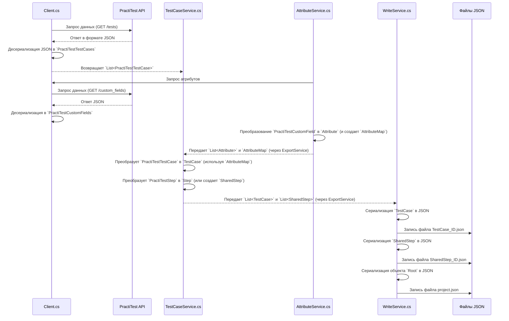

# Chapter 7: Модели Данных


В предыдущей главе, [Обработка Вложений](06_обработка_вложений_.md), мы увидели, как наше приложение работает с файлами, прикрепленными к тестам. Мы разобрали практически все этапы процесса экспорта: настройку, общение с API, преобразование тест-кейсов, атрибутов и обработку вложений. Но как все эти компоненты "договариваются" между собой? Как они понимают, в каком виде передавать друг другу информацию?

Представьте, что вы строите дом из конструктора Lego. У вас есть разные детали: кубики, пластины, колеса. Чтобы они соединялись, у них должны быть стандартные "пупырышки" и отверстия. Если бы у каждой детали была своя уникальная форма крепления, собрать что-то было бы невозможно.

В программировании роль таких "стандартных форм" играют **Модели Данных**. Это своего рода "чертежи" или "шаблоны", которые описывают, как должна выглядеть информация, передаваемая между разными частями программы. Без них компоненты не смогли бы понять друг друга, и все приложение превратилось бы в хаос.

В `PractiTestExporter` модели данных выполняют две ключевые функции:

1.  **Описание Данных из PractiTest:** Они определяют, в каком виде мы ожидаем получить данные от API PractiTest. Когда наш [Client](03_взаимодействие_с_practitest_api_.md) получает ответ от сервера, он использует эти модели, чтобы "разобрать" JSON и превратить его в понятные для программы объекты.
2.  **Описание Целевого Формата:** Они определяют, в каком виде данные должны быть сохранены в итоговые JSON-файлы, которые потом можно будет импортировать в другую систему (например, Test IT). Сервисы преобразования ([Преобразование Тест-кейсов](04_преобразование_тест_кейсов_.md), [Преобразование Атрибутов](05_преобразование_атрибутов_.md)) создают объекты на основе этих моделей.

Давайте подробнее рассмотрим оба типа моделей.

## Модели Данных PractiTest API

Эти модели находятся в папке `Models` проекта и часто имеют префикс `PractiTest`. Они точно повторяют структуру данных, которую возвращает API PractiTest.

**Зачем они нужны?** Когда `Client` отправляет запрос к PractiTest (например, для получения тест-кейса), PractiTest возвращает ответ в формате JSON. Этот JSON — просто текст. Чтобы программа могла с ним работать (например, прочитать имя тест-кейса или его шаги), этот текст нужно преобразовать в объект C#. Модели данных как раз и служат "шаблоном" для этого преобразования (процесс называется *десериализация*).

**Пример: Модель Тест-кейса из PractiTest (`PractiTestTestCase.cs`)**

```csharp
// Файл: Models/PractiTestTestCase.cs
using System.Text.Json.Serialization; // Необходимо для [JsonPropertyName]

namespace PractiTestExporter.Models;

// Описывает 'attributes' тест-кейса, как они приходят из API
public class TestCaseAttributes
{
    // Атрибут [JsonPropertyName] указывает, какое имя имеет это поле в JSON'е PractiTest
    [JsonPropertyName("name")]
    public string Name { get; set; } // Имя тест-кейса

    [JsonPropertyName("description")]
    public string Description { get; set; } // Описание

    [JsonPropertyName("preconditions")]
    public string Preconditions { get; set; } // Предусловия

    [JsonPropertyName("custom-fields")] // Пользовательские поля приходят как словарь
    public Dictionary<string, string> CustomFields { get; set; }

    // ... другие поля, соответствующие JSON'у PractiTest ...
    [JsonPropertyName("tags")]
    public List<string> Tags { get; set; }
}

// Описывает сам тест-кейс (обертка вокруг 'attributes')
public class PractiTestTestCase
{
    [JsonPropertyName("id")]
    public string Id { get; set; } // ID тест-кейса в PractiTest

    [JsonPropertyName("type")]
    public string Type { get; set; } // Тип сущности (обычно "tests")

    [JsonPropertyName("attributes")] // Ссылка на атрибуты выше
    public TestCaseAttributes Attributes { get; set; }
}

// Используется, когда API возвращает список тест-кейсов
public class PractiTestTestCases
{
    [JsonPropertyName("data")] // Список обычно находится в поле "data"
    public List<PractiTestTestCase> Data { get; set; }
}
```

**Объяснение:**

*   Класс `PractiTestTestCase` описывает структуру одного тест-кейса, как его видит PractiTest.
*   Класс `TestCaseAttributes` описывает вложенный блок `attributes`.
*   `[JsonPropertyName("...")]` — это специальная метка (атрибут), которая связывает поле в нашем C# коде (например, `Name`) с его именем в JSON-файле, который присылает PractiTest (например, `"name"`). Это очень важно, так как имена в JSON могут содержать дефисы или отличаться регистром от принятых в C# соглашений.
*   `PractiTestTestCases` используется, когда API возвращает *список* тест-кейсов (обычно внутри поля `"data"`).

Похожие модели существуют и для других сущностей PractiTest:

*   `PractiTestStep.cs`: Описывает шаг тест-кейса.
*   `PractiTestCustomField.cs`: Описывает пользовательское поле.
*   `PractiTestAttachment.cs`: Описывает метаданные вложения.
*   `PractiTestProject.cs`: Описывает информацию о проекте.

Когда `Client` получает JSON, библиотека `System.Text.Json` использует эти классы-модели, чтобы автоматически создать соответствующие объекты C#.

```csharp
// Пример использования в Client.cs (упрощенно)
// var jsonResponse = await response.Content.ReadAsStringAsync(); // Получили JSON как текст
// var testCases = JsonSerializer.Deserialize<PractiTestTestCases>(jsonResponse); // Превратили JSON в C# объект
// Теперь можно работать с testCases.Data[0].Attributes.Name и т.д.
```

## Модели Целевого Формата (Внутренние Модели)

Эти модели также находятся в папке `Models`, но не имеют префикса `PractiTest`. Они описывают структуру данных так, как она должна быть представлена *внутри* нашего приложения и *в итоговых файлах*. Этот формат разработан с прицелом на импорт в систему Test IT.

**Зачем они нужны?** Формат данных PractiTest не всегда напрямую подходит для импорта. Например, названия полей могут быть другими, структура шагов может отличаться, типы пользовательских полей нужно стандартизировать. Внутренние модели предоставляют эту стандартную структуру. Сервисы-преобразователи (например, `TestCaseService`) берут данные из моделей PractiTest и "перекладывают" их в эти целевые модели. Затем `WriteService` берет объекты этих целевых моделей и превращает их обратно в JSON (*сериализация*), но уже в нашем, нужном нам формате.

**Пример: Целевая Модель Тест-кейса (`TestCase.cs` из проекта `Models`)**

```csharp
// Файл: Models/TestCase.cs (из библиотеки Models)
namespace Models; // Находится в отдельном проекте Models

public class TestCase
{
    public Guid Id { get; set; } // Наш внутренний уникальный ID
    public string Name { get; set; } // Имя тест-кейса
    public Guid SectionId { get; set; } // ID секции, к которой он принадлежит
    public List<Step> PreconditionSteps { get; set; } // Предусловия (как шаги)
    public List<Step> Steps { get; set; } // Шаги выполнения
    public List<Step> PostconditionSteps { get; set; } // Постусловия
    public List<string> Tags { get; set; } // Теги
    public List<Link> Links { get; set; } // Ссылки
    public string Description { get; set; } // Описание
    public Dictionary<Guid, string> Attributes { get; set; } // Атрибуты (ID атрибута -> значение)
    public List<string> Attachments { get; set; } // Имена прикрепленных файлов
    public StateType State { get; set; } // Статус (например, NotReady, Ready)
    public PriorityType Priority { get; set; } // Приоритет (например, Low, Medium, High)
    public int Duration { get; set; } // Длительность

    // ... другие поля, нужные для целевого формата ...
    public TestCase() // Конструктор для инициализации списков
    {
        PreconditionSteps = new List<Step>();
        Steps = new List<Step>();
        PostconditionSteps = new List<Step>();
        Tags = new List<string>();
        Links = new List<Link>();
        Attributes = new Dictionary<Guid, string>();
        Attachments = new List<string>();
    }
}
```

Сравните эту модель с `PractiTestTestCase`:

*   ID теперь типа `Guid`, а не `string`.
*   Поле `Preconditions` из PractiTest превратилось в список `PreconditionSteps`.
*   Пользовательские поля (`CustomFields`) хранятся в словаре `Attributes`, где ключ - это *наш внутренний* ID атрибута (`Guid`), а не ID из PractiTest.
*   Появились новые поля, которых не было напрямую в PractiTest (например, `SectionId`, `PostconditionSteps`, `Links`).
*   Используются внутренние типы `Step`, `Link`, `StateType`, `PriorityType`.

**Другие Ключевые Внутренние Модели:**

*   `Step.cs`: Описывает шаг в нашем формате (поля `Action`, `Expected`, `TestData`, `ActionAttachments` и т.д., а также `SharedStepId` для ссылки на общий шаг).
*   `SharedStep.cs`: Описывает "общий шаг" (похож на `TestCase`, но является переиспользуемым блоком шагов).
*   `Attribute.cs`: Описывает пользовательский атрибут в нашем формате (поля `Id`, `Name`, `Type`, `Options`, `IsRequired` и т.д.).
*   `Root.cs`: Главная модель, описывающая структуру корневого файла `project.json`. Она содержит имя проекта, список секций, списки ID всех тест-кейсов и общих шагов, а также список всех атрибутов.

```csharp
// Файл: Models/Root.cs (из библиотеки Models)
namespace Models;

public class Root
{
    public string ProjectName { get; set; }
    public List<Section> Sections { get; set; } // Секции проекта (у нас одна)
    public List<Guid> TestCases { get; set; } // Список ID файлов тест-кейсов
    public List<Guid> SharedSteps { get; set; } // Список ID файлов общих шагов
    public List<Attribute> Attributes { get; set; } // Список всех атрибутов
}
```

## Как Модели Используются Вместе?

Давайте посмотрим на поток данных с точки зрения моделей:



Эта схема показывает:

1.  `Client` получает JSON и использует модели `PractiTest*` для **десериализации**.
2.  Сервисы преобразования (`AttributeService`, `TestCaseService`) получают объекты моделей `PractiTest*`, выполняют логику и создают объекты **внутренних моделей** (`Attribute`, `TestCase`, `SharedStep`, `Step`).
3.  `WriteService` получает объекты **внутренних моделей** и использует их для **сериализации** в итоговые JSON-файлы.

Модели данных — это "клей", который связывает все части приложения, обеспечивая стандартизированный обмен информацией. Они определяют структуру данных на каждом этапе: от получения из внешнего API до записи в финальный результат.

## Заключение

В этой заключительной главе мы рассмотрели важную, хотя и менее заметную, часть `PractiTestExporter` — Модели Данных. Мы узнали, что:

*   Модели данных — это "чертежи", описывающие структуру информации, с которой работает приложение.
*   Существуют модели для описания данных, приходящих из PractiTest API (например, `PractiTestTestCase`, `PractiTestStep`), которые используются для десериализации JSON.
*   Существуют модели для описания целевого формата данных (например, `TestCase`, `SharedStep`, `Attribute`, `Root`), которые используются для внутреннего представления и для сериализации в итоговые JSON-файлы.
*   Эти модели обеспечивают согласованность и позволяют разным компонентам приложения понимать друг друга.
*   Атрибуты `[JsonPropertyName]` помогают связать поля C#-классов с именами полей в JSON.

Понимание моделей данных помогает лучше понять, как информация течет через приложение от PractiTest к итоговым файлам. Это завершает наше знакомство с основными компонентами и процессами в `PractiTestExporter`. Надеемся, это руководство помогло вам разобраться в работе приложения!

---

Generated by [AI Codebase Knowledge Builder](https://github.com/The-Pocket/Tutorial-Codebase-Knowledge)