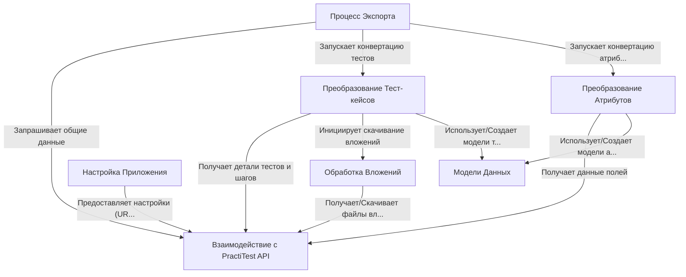

# Tutorial: PractiTestExporter

Этот проект, *PractiTestExporter*, помогает **выгружать** тесты из системы управления тестированием *PractiTest*.
Он подключается к PractiTest через **API**, забирает информацию о тест-кейсах, их шагах, пользовательских полях и вложениях.
Затем он **преобразует** эти данные в структурированный формат (JSON файлы) для *дальнейшего использования*, например, для импорта в другую систему.

## Chapters

1. [Настройка Приложения
](01_настройка_приложения_.md)
2. [Процесс Экспорта
](02_процесс_экспорта_.md)
3. [Взаимодействие с PractiTest API
](03_взаимодействие_с_practitest_api_.md)
4. [Преобразование Тест-кейсов
](04_преобразование_тест_кейсов_.md)
5. [Преобразование Атрибутов
](05_преобразование_атрибутов_.md)
6. [Обработка Вложений
](06_обработка_вложений_.md)
7. [Модели Данных
](07_модели_данных_.md)

---

Generated by [AI Codebase Knowledge Builder](https://github.com/The-Pocket/Tutorial-Codebase-Knowledge)