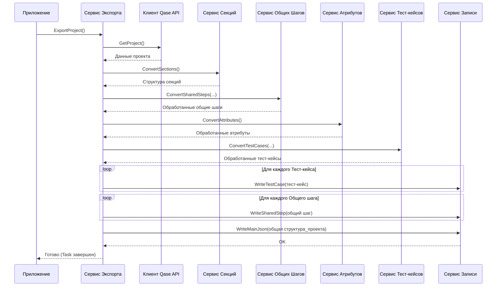

# Chapter 1: Сервис Экспорта


Добро пожаловать в руководство по `QaseExporter`! Эта утилита поможет вам экспортировать ваши тест-кейсы, секции и другие данные из системы управления тестированием Qase в локальные файлы.

В этой первой главе мы познакомимся с сердцем всего процесса экспорта – **Сервисом Экспорта** (`ExportService`).

Представьте, что вы снимаете фильм. У вас есть сценарий, актеры, операторы, декораторы... Но кто-то должен всем этим управлять, следить, чтобы всё шло по плану, и в итоге собрать готовый фильм. В нашем проекте эту роль выполняет `Сервис Экспорта`.

## Зачем нужен Сервис Экспорта?

Основная задача `QaseExporter` – взять данные из Qase (тест-кейсы, их структуру, шаги и т.д.) и сохранить их в понятном формате на вашем компьютере. Этот процесс состоит из множества шагов:

1.  Получить информацию о проекте из Qase.
2.  Получить и обработать структуру разделов (секций).
3.  Найти и обработать общие шаги (shared steps).
4.  Получить и обработать пользовательские поля (атрибуты).
5.  Получить и преобразовать все тест-кейсы.
6.  Записать все эти данные в файлы.

Выполнять все эти действия по отдельности было бы сложно и запутанно. `Сервис Экспорта` (`ExportService`) решает эту проблему, выступая **главным координатором** или **дирижером**. Он знает, в каком порядке нужно выполнять задачи и какие другие компоненты (сервисы) для этого привлекать.

Он как режиссер на съемочной площадке:

*   Сначала он получает "сценарий" – общую информацию о проекте из Qase, используя [Клиент Qase API](03_клиент_qase_api%20.md).
*   Затем он дает команды разным "цехам":
    *   Просит сервис секций (`ISectionService`) построить структуру папок.
    *   Просит сервис общих шагов (`ISharedStepService`) найти и подготовить переиспользуемые шаги.
    *   Просит сервис атрибутов (`IAttributeService`, см. [Сервис Обработки Атрибутов](05_сервис_обработки_атрибутов%20.md)) подготовить пользовательские поля.
    *   Просит [Сервис Обработки Тест-кейсов](04_сервис_обработки_тест_кейсов%20.md) конвертировать сами тест-кейсы.
*   В конце он передает готовые "фильмы" (обработанные данные) "монтажеру" – [Сервис Записи Результатов](07_сервис_записи_результатов%20.md), чтобы тот записал все в файлы.

## Как это работает?

Давайте посмотрим, как `Сервис Экспорта` используется в приложении. Основная логика приложения находится в файле `App.cs`.

```csharp
// Файл: App.cs
using Microsoft.Extensions.Logging;
using QaseExporter.Services;

namespace QaseExporter;

public class App
{
    private readonly ILogger<App> _logger;
    private readonly IExportService _service; // <-- Наш Сервис Экспорта

    // Сервис Экспорта "внедряется" сюда при запуске
    public App(ILogger<App> logger, IExportService service)
    {
        _logger = logger;
        _service = service;
    }

    public void Run(string[] args)
    {
        _logger.LogInformation("Запуск приложения");

        // Вот здесь мы запускаем весь процесс экспорта!
        _service.ExportProject().Wait(); // <-- Вызов главного метода Сервиса Экспорта

        _logger.LogInformation("Остановка приложения");
    }
}
```

В этом коде:

1.  Мы видим поле `_service` типа `IExportService`. `IExportService` – это "контракт" или интерфейс, который описывает, *что* должен уметь делать Сервис Экспорта (в нашем случае – метод `ExportProject`). Конкретная реализация этого интерфейса – класс `ExportService`.
2.  В конструкторе `App` мы получаем экземпляр `IExportService`. Не беспокойтесь пока о том, *как* он туда попадает – это называется "Внедрение Зависимостей" (Dependency Injection), и мы подробнее разберем это в главе [Точка входа и настройка приложения](02_точка_входа_и_настройка_приложения%20.md). Главное – у нас есть готовый к работе сервис.
3.  В методе `Run` мы вызываем единственный метод нашего сервиса: `_service.ExportProject()`. Именно этот вызов запускает всю цепочку действий по экспорту данных из Qase. `.Wait()` просто ждет завершения асинхронной операции экспорта.

Итак, для использования `Сервиса Экспорта` нужно просто получить его экземпляр и вызвать метод `ExportProject()`. Всю сложную работу он сделает сам, дергая за ниточки другие сервисы.

## Заглянем под капот: Внутренняя реализация

Как же `ExportService` координирует работу? Давайте посмотрим на его внутреннее устройство.

**Шаг 1: Получение зависимостей**

`ExportService` не работает в одиночку. Ему нужны помощники – другие сервисы. Он получает их так же, как `App` получал `IExportService` – через конструктор.

```csharp
// Файл: Services/ExportService.cs
using QaseExporter.Client;
using Microsoft.Extensions.Logging;
using Models; // Модели данных (Project, TestCase, etc.)
using JsonWriter; // Сервис записи в JSON

namespace QaseExporter.Services;

public class ExportService : IExportService // Реализуем интерфейс IExportService
{
    // Логгер для записи сообщений о ходе работы
    private readonly ILogger<ExportService> _logger;
    // Клиент для общения с Qase API
    private readonly IClient _client;
    // Сервис для записи данных в файлы
    private readonly IWriteService _writeService;
    // Сервисы для обработки разных частей данных
    private readonly ISectionService _sectionService;
    private readonly ITestCaseService _testCaseService;
    private readonly ISharedStepService _sharedStepService;
    private readonly IAttributeService _attributeService;

    // Конструктор, куда "внедряются" все необходимые сервисы-помощники
    public ExportService(ILogger<ExportService> logger, IClient client, IWriteService writeService,
        ISectionService sectionService, ITestCaseService testCaseService, ISharedStepService sharedStepService,
        IAttributeService attributeService)
    {
        _logger = logger;
        _client = client; // Клиент Qase
        _writeService = writeService; // Запись файлов
        _sectionService = sectionService; // Обработка секций
        _testCaseService = testCaseService; // Обработка тест-кейсов
        _sharedStepService = sharedStepService; // Обработка общих шагов
        _attributeService = attributeService; // Обработка атрибутов
    }

    // ... остальная часть класса ...
}
```

Здесь мы видим, что `ExportService` зависит от множества других интерфейсов (`IClient`, `IWriteService`, `ISectionService` и т.д.). Это позволяет ему делегировать конкретные задачи специализированным компонентам.

**Шаг 2: Метод `ExportProject` – Оркестровка**

Теперь рассмотрим главный метод – `ExportProject`. Он определяет последовательность шагов экспорта.

```csharp
// Файл: Services/ExportService.cs (продолжение)

    public async Task ExportProject() // Асинхронный метод
    {
        _logger.LogInformation("Начинаем экспорт");

        // 1. Получаем основную информацию о проекте из Qase
        var project = await _client.GetProject();
        _logger.LogInformation($"Получили проект: {project.Name}");

        // 2. Обрабатываем секции (папки)
        var sectionData = await _sectionService.ConvertSections();
        _logger.LogInformation("Обработали структуру секций");

        // 3. Обрабатываем общие шаги
        var sharedSteps = await _sharedStepService.ConvertSharedSteps(sectionData.MainSection.Id);
        _logger.LogInformation($"Обработали {sharedSteps.Count} общих шагов");

        // 4. Обрабатываем атрибуты (пользовательские поля)
        var attributes = await _attributeService.ConvertAttributes();
        _logger.LogInformation($"Обработали {attributes.Attributes.Count} атрибутов");

        // 5. Обрабатываем тест-кейсы, используя данные о секциях, общих шагах и атрибутах
        var testCases = await _testCaseService.ConvertTestCases(
                                sectionData.SectionMap, sharedSteps, attributes);
        _logger.LogInformation($"Обработали {testCases.Count} тест-кейсов");

        // 6. Записываем каждый тест-кейс в отдельный файл
        foreach (var testCase in testCases)
        {
            await _writeService.WriteTestCase(testCase);
        }
        _logger.LogInformation("Записали тест-кейсы в файлы");

        // 7. Записываем каждый общий шаг в отдельный файл
        foreach (var sharedStep in sharedSteps)
        {
            await _writeService.WriteSharedStep(sharedStep.Value);
        }
         _logger.LogInformation("Записали общие шаги в файлы");

        // 8. Формируем главный JSON файл с общей структурой проекта
        var mainJson = new Root
        {
            ProjectName = project.Name,
            Sections = new List<Section> { sectionData.MainSection }, // Структура секций
            TestCases = testCases.Select(t => t.Id).ToList(), // Список ID тест-кейсов
            SharedSteps = sharedSteps.Values.Select(s => s.Id).ToList(), // Список ID общих шагов
            Attributes = attributes.Attributes, // Список атрибутов
        };

        // 9. Записываем главный JSON файл
        await _writeService.WriteMainJson(mainJson);
        _logger.LogInformation("Записали главный JSON файл `main.json`");

        _logger.LogInformation("Завершаем экспорт");
    }
```

Этот метод шаг за шагом выполняет всю работу:

1.  Вызывает `_client` ([Клиент Qase API](03_клиент_qase_api%20.md)) для получения информации о проекте.
2.  Вызывает `_sectionService` для построения дерева секций.
3.  Вызывает `_sharedStepService` для обработки общих шагов.
4.  Вызывает `_attributeService` ([Сервис Обработки Атрибутов](05_сервис_обработки_атрибутов%20.md)) для получения атрибутов.
5.  Вызывает `_testCaseService` ([Сервис Обработки Тест-кейсов](04_сервис_обработки_тест_кейсов%20.md)), передавая ему уже обработанные секции, шаги и атрибуты, чтобы он мог правильно преобразовать тест-кейсы.
6.  Использует `_writeService` ([Сервис Записи Результатов](07_сервис_записи_результатов%20.md)) для сохранения каждого тест-кейса и общего шага в отдельный файл.
7.  Собирает финальный объект `Root`, содержащий общую структуру проекта (имя, дерево секций, списки ID тест-кейсов и общих шагов, атрибуты).
8.  Снова использует `_writeService` для записи этого `Root` объекта в главный файл `main.json`.

**Визуализация процесса**

Представим взаимодействие компонентов в виде диаграммы последовательности:



Эта диаграмма наглядно показывает, как `Сервис Экспорта` дирижирует процессом, вызывая другие сервисы в нужной последовательности для достижения конечной цели – экспорта проекта.

## Заключение

`Сервис Экспорта` (`ExportService`) – это ключевой компонент `QaseExporter`, отвечающий за общую координацию процесса экспорта. Он действует как "режиссер", вызывая другие специализированные сервисы для получения данных из Qase, их обработки и последующей записи в файлы. Понимание его роли помогает увидеть общую картину работы приложения.

В следующей главе, [Точка входа и настройка приложения](02_точка_входа_и_настройка_приложения%20.md), мы подробнее рассмотрим, как приложение запускается, как настраивается окружение и как все эти сервисы (включая `ExportService`) создаются и связываются друг с другом с помощью механизма внедрения зависимостей.

---

Generated by [AI Codebase Knowledge Builder](https://github.com/The-Pocket/Tutorial-Codebase-Knowledge)