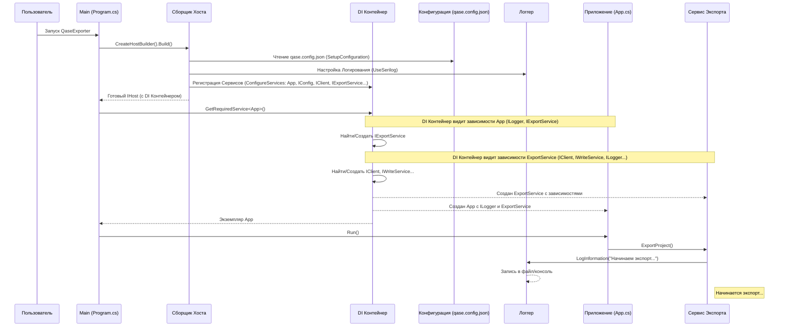

# Chapter 2: Точка входа и настройка приложения


В [предыдущей главе](01_сервис_экспорта_.md) мы познакомились с `Сервисом Экспорта` — главным дирижером процесса экспорта данных из Qase. Мы увидели, как он координирует работу других компонентов. Но как само приложение `QaseExporter` узнает, что нужно запустить именно `Сервис Экспорта`? Как оно получает настройки, например, ваш API-токен для Qase или путь, куда сохранять файлы? И как все эти разные сервисы-помощники находят друг друга?

На эти вопросы отвечает эта глава. Мы разберем **точку входа** и **механизм настройки** приложения — файл `Program.cs`.

Представьте, что вы собираетесь в путешествие (`Сервис Экспорта` — это само путешествие). Прежде чем отправиться в путь, вам нужно:

1.  Проверить карту и маршрут (прочитать настройки из файла `qase.config.json`).
2.  Собрать рюкзак со всем необходимым: компас, вода, еда (создать и подготовить все нужные сервисы: `IClient`, `IExportService`, `IWriteService` и т.д.).
3.  Настроить рацию или спутниковый телефон для связи (настроить логирование, чтобы видеть, что происходит).
4.  Сесть в машину и повернуть ключ зажигания (запустить основной класс `App`).

Вот этим всем — подготовкой к путешествию — и занимается `Program.cs`. Это самый первый код, который выполняется при запуске `QaseExporter`. Он как организатор поездки, который все подготавливает перед стартом.

## Зачем нужна предварительная настройка?

Может показаться, зачем усложнять? Почему бы просто не создать `ExportService` и запустить его? Причин несколько:

*   **Конфигурация:** Приложению нужны внешние данные, которые не должны быть "зашиты" в код: ваш персональный API-токен от Qase, код проекта, папка для сохранения результатов. Эти данные хранятся в файле `qase.config.json`, и их нужно прочитать при старте.
*   **Управление компонентами:** Приложение состоит из множества частей (сервисов). `ExportService` зависит от `IClient`, `IWriteService` и других. Эти сервисы, в свою очередь, могут зависеть от других. Создавать и связывать их вручную было бы очень сложно и запутано. Нужен механизм, который автоматически соберет эту "команду".
*   **Логирование:** Во время работы приложению полезно записывать информацию о своих действиях: "Начинаю экспорт", "Получил 50 тест-кейсов", "Произошла ошибка при доступе к файлу". Это помогает понять, что происходит, и найти проблемы. Настройку системы логирования тоже нужно выполнить при старте.

`Program.cs` решает все эти задачи, используя стандартные механизмы платформы .NET.

## С чего все начинается: Файл `Program.cs`

Давайте заглянем в код `Program.cs`. Он может показаться немного сложным на первый взгляд, но мы разберем его по частям.

```csharp
// Файл: Program.cs
using JsonWriter; // Нужен для IWriteService
using Microsoft.Extensions.Configuration; // Для работы с конфигурацией
using Microsoft.Extensions.DependencyInjection; // Для внедрения зависимостей
using Microsoft.Extensions.Hosting; // Для создания "хоста" приложения
using Serilog; // Для логирования
// ... другие using ...
using QaseExporter.Client; // Нужен для IClient
using QaseExporter.Services; // Нужен для IExportService и других

namespace QaseExporter
{
    internal class Program
    {
        // <<< ТОЧКА ВХОДА >>>
        static void Main(string[] args)
        {
            // 1. Создаем и настраиваем "хост" приложения
            using var host = CreateHostBuilder(args).Build();
            // 2. Получаем доступ к контейнеру сервисов
            using var scope = host.Services.CreateScope();
            var services = scope.ServiceProvider;

            try
            {
                // 3. Получаем главный класс App и запускаем его
                services.GetRequiredService<App>().Run(args);
            }
            catch (Exception e)
            {
                // Если что-то пошло не так при запуске
                Console.WriteLine($"Произошла ошибка: {e.Message}");
            }
        }

        // ... остальная часть класса ...
    }
}
```

*   **`static void Main(string[] args)`:** Это и есть та самая **точка входа**. Операционная система запускает именно этот метод, когда вы выполняете `.\QaseExporter`.
*   **`CreateHostBuilder(args).Build()`:** Эта строка создает и настраивает "хост" приложения. Представьте это как сборку двигателя и шасси автомобиля перед поездкой. Метод `CreateHostBuilder` (мы посмотрим на него ниже) содержит всю логику настройки. `.Build()` завершает сборку.
*   **`host.Services.CreateScope()` и `scope.ServiceProvider`:** Хост содержит "контейнер сервисов" — это как раз тот самый "рюкзак" или "ящик с инструментами", где лежат все подготовленные компоненты нашего приложения. Мы получаем доступ к этому ящику.
*   **`services.GetRequiredService<App>().Run(args)`:** Здесь происходит самое интересное. Мы просим у контейнера: "Дай мне экземпляр класса `App`". Контейнер находит `App`, видит, что для его создания нужен `IExportService` (помните конструктор `App` из прошлой главы?), создает `IExportService` (и все его зависимости!), а затем создает `App`, передавая ему готовый сервис. После этого мы вызываем метод `Run()` у полученного `App`, запуская основной процесс экспорта. Это называется **Внедрение Зависимостей (Dependency Injection - DI)**.
*   **`try...catch`:** Обертка для отлова возможных ошибок во время выполнения `Run()`.

Итак, `Main` — это короткий метод, который делегирует всю сложную работу по настройке методу `CreateHostBuilder`, а затем просит у настроенной системы главный компонент (`App`) и запускает его.

## План поездки: Чтение конфигурации (`qase.config.json`)

Как приложение узнает ваш API-токен и другие настройки? Для этого используется файл `qase.config.json`.

```json
// Файл: qase.config.json (Пример)
{
  "resultPath": "C:/qase_export", // Куда сохранять результаты
  "qase": {
    "url": "https://api.qase.io/v1", // Адрес Qase API
    "token": "ВАШ_СЕКРЕТНЫЙ_API_ТОКЕН", // Ваш токен доступа
    "projectKey": "PROJECT_CODE"      // Код вашего проекта в Qase
  },
  // Можно добавить настройки для логирования Serilog сюда же
  "Serilog": {
    "MinimumLevel": {
      "Default": "Information" // Уровень логирования по умолчанию
    }
  }
}

```

Перед запуском `QaseExporter` вам нужно отредактировать этот файл, указав свои данные.

Как `Program.cs` читает этот файл? Это происходит внутри `CreateHostBuilder`, с помощью вспомогательного метода `SetupConfiguration`:

```csharp
// Файл: Program.cs (часть)

        // Метод для настройки чтения конфигурации
        private static IConfiguration SetupConfiguration()
        {
            return new ConfigurationBuilder()
                // Указываем, где искать файлы конфигурации (в папке с программой)
                .SetBasePath(Directory.GetCurrentDirectory())
                // Добавляем наш JSON-файл
                .AddJsonFile("qase.config.json")
                // Позволяет переопределять настройки через переменные окружения
                .AddEnvironmentVariables()
                // Собираем конфигурацию
                .Build();
        }

        static IHostBuilder CreateHostBuilder(string[] strings)
        {
            // ... (другие настройки) ...

            return Host.CreateDefaultBuilder()
                .ConfigureServices((hostContext, services) => // <-- Настройка сервисов
                {
                    // Здесь мы регистрируем конфигурацию как сервис,
                    // чтобы другие части приложения могли ее получить
                    services.AddSingleton(SetupConfiguration()); // <-- Используем наш метод
                    // ... (регистрация других сервисов) ...
                });
                // ... (другие настройки) ...
        }

```

1.  Метод `SetupConfiguration` создает объект `ConfigurationBuilder`.
2.  `.SetBasePath(...)` указывает, что искать файлы нужно в текущей директории.
3.  `.AddJsonFile("qase.config.json")` говорит: "Прочитай настройки из этого файла".
4.  `.AddEnvironmentVariables()` позволяет использовать переменные окружения (более продвинутый способ).
5.  `.Build()` создает объект `IConfiguration`, содержащий все прочитанные настройки.
6.  В методе `CreateHostBuilder` мы вызываем `SetupConfiguration()` и результат (объект `IConfiguration`) регистрируем как сервис с помощью `services.AddSingleton()`. Теперь любой другой сервис, которому нужны настройки (например, [Клиент Qase API](03_клиент_qase_api_.md)), сможет их получить через DI.

## Сборка команды: Внедрение Зависимостей (`ConfigureServices`)

Это сердце настройки. Здесь мы "объясняем" приложению, какие компоненты (сервисы) у нас есть и как их создавать. Это делается внутри `CreateHostBuilder` с помощью метода `.ConfigureServices()`.

```csharp
// Файл: Program.cs (часть)

        static IHostBuilder CreateHostBuilder(string[] strings)
        {
            // ... (Настройка Serilog, которую мы рассмотрим позже) ...

            return Host.CreateDefaultBuilder()
                .UseSerilog(/* ... настройки логгера ... */) // Подключаем логирование
                .ConfigureServices((hostContext, services) => // <-- Вот он!
                {
                    // Регистрируем главный класс приложения
                    services.AddSingleton<App>();

                    // Регистрируем прочитанную конфигурацию (см. выше)
                    services.AddSingleton(SetupConfiguration());

                    // --- Регистрируем все наши сервисы ---
                    // "Если кто-то попросит IClient, дай ему Client"
                    services.AddSingleton<IClient, Client.Client>();
                    // "Если кто-то попросит IWriteService, дай ему WriteService"
                    services.AddSingleton<IWriteService, WriteService>(); // Из JsonWriter
                    // "Если кто-то попросит IExportService, дай ему ExportService"
                    services.AddSingleton<IExportService, ExportService>();

                    // Регистрируем остальные сервисы-помощники
                    services.AddSingleton<ISectionService, SectionService>();
                    services.AddSingleton<ITestCaseService, TestCaseService>();
                    services.AddSingleton<ISharedStepService, SharedStepService>();
                    services.AddSingleton<IStepService, StepService>();
                    services.AddSingleton<IAttachmentService, AttachmentService>();
                    services.AddSingleton<IAttributeService, AttributeService>();
                    services.AddSingleton<IParameterService, ParameterService>();
                    // ... и так далее для всех сервисов ...
                });
        }
```

*   **`ConfigureServices((hostContext, services) => { ... })`**: Этот метод предоставляет нам "коллекцию сервисов" (`services`), куда мы можем добавлять информацию о наших компонентах.
*   **`services.AddSingleton<Интерфейс, Класс>()`**: Это самый частый способ регистрации. Он говорит DI контейнеру:
    *   "Я знаю о сервисе, который соответствует 'контракту' `Интерфейс`."
    *   "Когда кому-то понадобится `Интерфейс`, создай экземпляр класса `Класс`."
    *   "`Singleton`" означает: "Создай только *один* экземпляр `Класс` и используй его для всех, кто попросит `Интерфейс` в течение всей жизни приложения". (Есть и другие "времена жизни", но `Singleton` здесь подходит).
*   **`services.AddSingleton<App>()`**: Регистрируем основной класс `App`.
*   **`services.AddSingleton(SetupConfiguration())`**: Регистрируем уже созданный объект конфигурации.

**Зачем это нужно?** Когда мы в `Main` вызываем `services.GetRequiredService<App>()`, DI контейнер смотрит на конструктор `App`:

```csharp
// Напоминание из App.cs
public App(ILogger<App> logger, IExportService service)
{
    // ...
}
```

Он видит, что `App` требует `ILogger<App>` (логирование настраивается отдельно в `UseSerilog`) и `IExportService`. Контейнер проверяет свои записи: "Ага, у меня зарегистрирован `IExportService`, и для него нужно создать `ExportService`". Затем он смотрит на конструктор `ExportService`:

```csharp
// Напоминание из ExportService.cs
public ExportService(ILogger<ExportService> logger, IClient client, IWriteService writeService, /*...другие сервисы...*/)
{
    // ...
}
```

Контейнер видит, что `ExportService` требует `ILogger<ExportService>`, `IClient`, `IWriteService` и другие. Он снова смотрит в свои записи: "Отлично, `IClient` - это `Client`, `IWriteService` - это `WriteService`..." Он рекурсивно находит и создает *все* необходимые зависимости, собирая всю цепочку компонентов, и только потом создает `ExportService`, а затем `App`.

Вам не нужно вручную писать `new Client()`, `new WriteService()`, `new ExportService(logger, client, writeService, ...)` и т.д. Контейнер делает это за вас! Это сильно упрощает код и делает компоненты независимыми друг от друга (они зависят только от "контрактов"-интерфейсов).

## Корабельный журнал: Настройка Логирования (Serilog)

Чтобы понимать, что делает приложение во время работы, используется логирование. В `QaseExporter` для этого применяется популярная библиотека Serilog. Настройка происходит тоже в `CreateHostBuilder`:

```csharp
// Файл: Program.cs (часть)

        static IHostBuilder CreateHostBuilder(string[] strings)
        {
            // ...

            return Host.CreateDefaultBuilder()
                // ----- Настройка Serilog -----
                .UseSerilog((context, services, configuration) => configuration
                    // Читаем часть настроек из appsettings.json или qase.config.json (раздел "Serilog")
                    .ReadFrom.Configuration(context.Configuration)
                    // Позволяет использовать сервисы при настройке (не используется здесь)
                    .ReadFrom.Services(services)
                    // Обогащает логи контекстной информацией (не сильно важно для нас)
                    .Enrich.FromLogContext()
                    // Минимальный уровень сообщений для ВСЕХ логгеров (можно переопределить)
                    .MinimumLevel.Debug()
                    // --- Куда писать логи ---
                    // 1. В файл:
                    .WriteTo.File("logs/export-log.txt", // Имя файла
                        restrictedToMinimumLevel: LogEventLevel.Debug, // Писать сообщения уровня Debug и выше
                        outputTemplate: // Формат записи сообщения
                        "{Timestamp:yyyy-MM-dd HH:mm:ss.fff zzz} [{Level:u3}] {Message:lj}{NewLine}{Exception}"
                    )
                    // 2. В консоль:
                    .WriteTo.Console(LogEventLevel.Information) // Писать сообщения уровня Information и выше
                )
                // ------------------------------
                .ConfigureServices((_, services) =>
                {
                    // ... (регистрация сервисов, как мы видели ранее) ...
                });
        }
```

*   `.UseSerilog(...)`: Подключает Serilog к системе логирования .NET.
*   `.ReadFrom.Configuration(context.Configuration)`: Позволяет настроить часть параметров логирования через файл `qase.config.json` (например, минимальный уровень по умолчанию).
*   `.MinimumLevel.Debug()`: Устанавливает глобальный минимальный уровень сообщений, которые будут обрабатываться. `Debug` — самый подробный уровень.
*   `.WriteTo.File(...)`: Настраивает запись логов в файл `logs/export-log.txt`. Указывается минимальный уровень для файла (`Debug`) и формат сообщения (`outputTemplate`).
*   `.WriteTo.Console(...)`: Настраивает вывод логов в консоль, где вы запускаете приложение. Здесь уровень выше (`Information`), чтобы не засорять консоль слишком подробными сообщениями, но видеть основные этапы работы.

Теперь, когда любой сервис (например, `ExportService`) использует `ILogger` для записи сообщений (`_logger.LogInformation("Начинаем экспорт");`), Serilog автоматически направит это сообщение в файл и/или консоль в соответствии с этими настройками.

## Как все это работает вместе: Шаг за шагом

Давайте еще раз проследим весь путь запуска:

1.  Вы запускаете `QaseExporter.exe` (или `./QaseExporter` в Linux/macOS).
2.  Выполняется метод `Main` в `Program.cs`.
3.  Вызывается `CreateHostBuilder`.
4.  Создается стандартный "Сборщик Хоста" (`Host.CreateDefaultBuilder`).
5.  Вызывается `SetupConfiguration` для чтения настроек из `qase.config.json`. Результат (`IConfiguration`) запоминается.
6.  Настраивается логирование Serilog (`UseSerilog`) с выводом в файл и консоль.
7.  Вызывается `ConfigureServices`:
    *   `IConfiguration` регистрируется как сервис.
    *   `App`, `IClient`, `IExportService`, `IWriteService` и все остальные интерфейсы и их реализации регистрируются в DI контейнере (`services.AddSingleton`).
8.  `CreateHostBuilder` завершает работу и метод `.Build()` создает готовый `IHost` (хост).
9.  `Main` получает доступ к DI контейнеру хоста (`host.Services`).
10. `Main` запрашивает у контейнера `App` (`services.GetRequiredService<App>()`).
11. DI контейнер видит запрос `App`. Он смотрит на конструктор `App`, видит зависимость `IExportService`.
12. DI контейнер ищет регистрацию `IExportService`, находит `ExportService`. Он смотрит на конструктор `ExportService`, видит зависимости `IClient`, `IWriteService`, `ILogger` и т.д.
13. DI контейнер рекурсивно находит и создает экземпляры `Client`, `WriteService` и всех остальных зависимостей (используя зарегистрированные реализации). Настройки (`IConfiguration`) и логгеры (`ILogger`) также внедряются автоматически.
14. Наконец, DI контейнер создает экземпляр `ExportService`, передав ему созданные зависимости.
15. Затем DI контейнер создает экземпляр `App`, передав ему логгер и созданный `ExportService`.
16. Готовый экземпляр `App` возвращается в `Main`.
17. `Main` вызывает `app.Run()`.
18. `App.Run()` вызывает `_service.ExportProject()`, и начинается процесс экспорта, описанный в [Главе 1](01_сервис_экспорта_.md).

**Визуализация процесса настройки:**



Эта диаграмма показывает, как `Program.cs` через `HostBuilder` и `DI Container` подготавливает и собирает все части приложения перед тем, как передать управление классу `App`.

## Заключение

Файл `Program.cs` — это командный центр запуска `QaseExporter`. Он выполняет критически важную подготовительную работу:

*   Определяет **точку входа** (`Main`).
*   Читает **конфигурацию** из `qase.config.json`.
*   Настраивает **логирование** с помощью Serilog.
*   Регистрирует все компоненты (сервисы) приложения в **DI контейнере**.
*   Использует DI контейнер для автоматического создания и **внедрения зависимостей**, собирая все приложение воедино.
*   Запускает основной класс `App`.

Понимание того, как происходит эта настройка, помогает увидеть, как приложение оживает и как его различные части связаны между собой еще до начала реальной работы по экспорту. Механизм Внедрения Зависимостей (DI) является ключевым для создания гибкого и управляемого приложения.

Теперь, когда мы знаем, как приложение запускается и получает настройки (включая URL и токен Qase), в следующей главе мы подробно рассмотрим компонент, который непосредственно общается с Qase: [Клиент Qase API](03_клиент_qase_api_.md).

---

Generated by [AI Codebase Knowledge Builder](https://github.com/The-Pocket/Tutorial-Codebase-Knowledge)