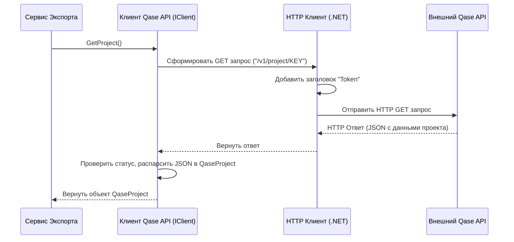

# Chapter 3: Клиент Qase API


В [предыдущей главе](02_точка_входа_и_настройка_приложения_.md) мы разобрались, как `QaseExporter` запускается, читает настройки (включая адрес и токен Qase) и собирает все свои компоненты с помощью Внедрения Зависимостей. Мы узнали, что у приложения есть все необходимое для начала работы.

Но откуда берется сама информация, которую мы экспортируем? Тест-кейсы, описания, шаги, структура папок – все это хранится во внешнем сервисе Qase. Чтобы получить эти данные, `QaseExporter` нужен специальный "посредник", который умеет общаться с Qase через интернет. Этот посредник – **Клиент Qase API**.

Представьте, что Qase – это большая библиотека с вашими тест-кейсами. Вы не можете просто зайти туда и взять все, что нужно. Вам нужен библиотекарь, который знает, как найти нужные книги (данные) по вашему запросу. Клиент Qase API (`Client`) – это и есть наш "цифровой библиотекарь".

## Зачем нужен Клиент Qase API?

Основная задача `QaseExporter` – получить данные *из* Qase. Но как программа может "поговорить" с другим сервисом, работающим где-то в интернете? Для этого Qase предоставляет специальный интерфейс – **API** (Application Programming Interface, интерфейс прикладного программирования).

**Что такое API?**

Думайте об API как о меню в ресторане. Меню описывает, какие блюда (данные или действия) вы можете заказать, и как сделать заказ (какой "адрес" использовать и какие параметры передать). Qase API – это "меню", которое Qase предлагает другим программам, чтобы они могли взаимодействовать с ним.

Клиент Qase API (`Client` в нашем коде) – это компонент, который умеет "читать" это "меню" и делать "заказы":

1.  **Знает адрес:** Он берет адрес API Qase (`qase.url`) из файла настроек `qase.config.json`. Это как знать адрес ресторана.
2.  **Имеет пропуск:** Он использует ваш API-токен (`qase.token`) для аутентификации. Это как показать пропуск или удостоверение личности, чтобы вас пустили внутрь.
3.  **Знает, что спросить:** Он умеет формировать правильные запросы к API, чтобы получить конкретную информацию:
    *   Данные о вашем проекте (используя `qase.projectKey`).
    *   Списки тест-кейсов.
    *   Структуру папок (наборы тестов или "сьюты").
    *   Общие (переиспользуемые) шаги.
    *   Пользовательские поля (атрибуты).
4.  **Умеет скачивать файлы:** Если к тест-кейсам прикреплены файлы (вложения), клиент может скачать их по предоставленным ссылкам.

Без этого клиента наше приложение было бы "слепым" – оно не смогло бы увидеть и получить данные из Qase.

## Как используется Клиент Qase API?

Вы, как пользователь `QaseExporter`, напрямую не взаимодействуете с `Client`. Он работает "за кулисами". Другие сервисы, такие как [Сервис Экспорта](01_сервис_экспорта_.md) или [Сервис Обработки Тест-кейсов](04_сервис_обработки_тест_кейсов_.md), используют его для получения нужных данных.

Вспомним, как `ExportService` получает зависимости (из [Главы 1](01_сервис_экспорта_.md)):

```csharp
// Файл: Services/ExportService.cs (Фрагмент)
public class ExportService : IExportService
{
    // ... другие поля ...
    private readonly IClient _client; // <-- Наш Клиент Qase API!
    // ... другие сервисы ...

    // Клиент "внедряется" сюда через конструктор
    public ExportService(..., IClient client, ...)
    {
        // ...
        _client = client; // Сохраняем полученный клиент
        // ...
    }

    public async Task ExportProject()
    {
        _logger.LogInformation("Начинаем экспорт");

        // Используем клиент для получения данных о проекте
        var project = await _client.GetProject();
        _logger.LogInformation($"Получили проект: {project.Name}");

        // Клиент также используется внутри других сервисов,
        // например, _sectionService будет использовать _client.GetSuites()
        // а _testCaseService будет использовать _client.GetTestCasesBySuiteId(...)

        // ... остальная логика экспорта ...
    }
}
```

Как видите, `ExportService` не создает `Client` сам. Он получает уже готовый экземпляр `IClient` через конструктор благодаря механизму Внедрения Зависимостей, настроенному в `Program.cs` (см. [Главу 2](02_точка_входа_и_настройка_приложения_.md)).

`IClient` – это интерфейс (контракт), который определяет, *что* клиент должен *уметь* делать (какие методы предоставлять), например:

```csharp
// Файл: Client/IClient.cs (Упрощенный пример)
using QaseExporter.Models; // Содержит описания моделей данных Qase

namespace QaseExporter.Client;

public interface IClient
{
    // Получить информацию о проекте
    Task<QaseProject> GetProject();
    // Получить список наборов тестов (сьютов/папок)
    Task<List<QaseSuite>> GetSuites();
    // Получить список тест-кейсов для конкретного набора
    Task<List<QaseTestCase>> GetTestCasesBySuiteId(int suiteId);
    // Получить список общих шагов
    Task<List<QaseSharedStep>> GetSharedSteps();
    // Получить список пользовательских полей
    Task<List<QaseCustomField>> GetCustomFields();
    // Получить список системных полей
    Task<List<QaseSystemField>> GetSystemFields();
    // Скачать вложение по URL
    Task<byte[]> DownloadAttachment(string url);
    // Получить ключ проекта (из настроек)
    string GetProjectKey();
}
```

Этот интерфейс – "обещание", что любой класс, реализующий `IClient` (в нашем случае это класс `Client`), предоставит эти методы. Другие сервисы зависят только от этого "обещания" (`IClient`), а не от конкретной реализации (`Client`), что делает систему более гибкой.

## Как это работает "под капотом"?

Давайте представим, что [Сервис Экспорта](01_сервис_экспорта_.md) хочет получить информацию о проекте и вызывает `_client.GetProject()`. Что происходит внутри клиента?

**Шаг за шагом (Аналогия с курьером):**

1.  **Получение задания:** Клиент (`Client`) получает команду `GetProject()`.
2.  **Проверка адреса и пропуска:** Клиент уже знает адрес Qase API (`BaseAddress`) и имеет "пропуск" (`Token`), так как они были заданы при его создании (в конструкторе, при чтении `qase.config.json`).
3.  **Формирование запроса:** Клиент формирует конкретный запрос для получения информации о проекте. Он знает, что для этого нужно обратиться по адресу `/v1/project/{_projectKey}` (где `_projectKey` – код вашего проекта из конфига). Это как заполнить бланк заказа в библиотеке, указав нужный отдел.
4.  **Отправка запроса:** Клиент отправляет этот запрос по сети в Qase API. Это как курьер отправляется по адресу с бланком заказа.
5.  **Ожидание ответа:** Клиент ждет, пока Qase API обработает запрос и пришлет ответ.
6.  **Получение ответа:** Qase API присылает ответ в формате JSON (стандартный текстовый формат для обмена данными). Ответ содержит информацию о проекте или сообщение об ошибке. Курьер получает ответ (например, запрошенную книгу или уведомление, что ее нет).
7.  **Обработка ответа:** Клиент проверяет, успешен ли ответ (например, код состояния HTTP 200 OK). Если да, он "распаковывает" JSON и преобразует его в понятный для C# объект (`QaseProject`). Если произошла ошибка, он записывает ее в лог и может выбросить исключение.
8.  **Возврат результата:** Клиент возвращает полученный объект `QaseProject` тому, кто его вызвал (в нашем примере – `ExportService`).

**Визуализация процесса:**



**Погружение в код:**

1.  **Конструктор – Подготовка к работе:**
    При создании клиента (что делает DI контейнер при запуске, см. [Главу 2](02_точка_входа_и_настройка_приложения_.md)) читаются настройки и настраивается `HttpClient`.

    ```csharp
    // Файл: Client/Client.cs (Фрагмент конструктора)
    public class Client : IClient
    {
        private readonly ILogger<Client> _logger;
        private readonly HttpClient _httpClient; // Используется для отправки HTTP запросов
        private readonly string _projectKey;

        public Client(ILogger<Client> logger, IConfiguration configuration)
        {
            _logger = logger;

            // Читаем секцию "qase" из конфигурации (qase.config.json)
            var section = configuration.GetSection("qase");
            var url = section["url"]; // Адрес API
            var projectKey = section["projectKey"]; // Ключ проекта
            var token = section["token"]; // Токен доступа

            // Проверяем, что все настройки указаны (упрощено)
            if (string.IsNullOrEmpty(url) || string.IsNullOrEmpty(projectKey) || string.IsNullOrEmpty(token))
            {
                throw new ArgumentException("Не все настройки Qase указаны в qase.config.json");
            }

            _projectKey = projectKey;

            _httpClient = new HttpClient(); // Создаем HTTP клиент
            _httpClient.BaseAddress = new Uri(url); // Устанавливаем базовый адрес API
            // Добавляем токен в заголовки по умолчанию для КАЖДОГО запроса
            _httpClient.DefaultRequestHeaders.Add("Token", token);
        }
        // ... остальные методы ...
    }
    ```
    Этот код выполняется один раз при старте приложения. Клиент готов к работе.

2.  **Получение данных проекта (`GetProject`):**
    Метод, реализующий описанный выше процесс.

    ```csharp
    // Файл: Client/Client.cs (Метод GetProject)
    public async Task<QaseProject> GetProject()
    {
        _logger.LogInformation("Получаем проект по ключу {ProjectKey}", _projectKey);

        // Формируем URL: базовый адрес + "/v1/project/" + ключ проекта
        // Используем _httpClient, который уже настроен (адрес, токен)
        var response = await _httpClient.GetAsync($"/v1/project/{_projectKey}");

        // Проверяем, успешен ли запрос (код 2xx)
        if (!response.IsSuccessStatusCode)
        {
            // Если ошибка, логируем и выбрасываем исключение
            _logger.LogError("Ошибка получения проекта {ProjectKey}. Статус: {StatusCode}. Ответ: {Response}",
                _projectKey, response.StatusCode, await response.Content.ReadAsStringAsync());
            throw new Exception($"Ошибка получения проекта {_projectKey}. Статус: {response.StatusCode}");
        }

        // Читаем тело ответа как строку
        var content = await response.Content.ReadAsStringAsync();
        // Десериализуем JSON в объект C# (QaseProjectData содержит поле Project)
        var projectData = JsonSerializer.Deserialize<QaseProjectData>(content)!;

        _logger.LogDebug("Найден проект {@Project}", projectData.Project);

        // Возвращаем данные проекта
        return projectData.Project;
    }
    ```

3.  **Обработка списков и пагинация (Пример: `GetSuites`):**
    Qase API часто возвращает большие списки (например, тест-кейсы) не целиком, а порциями (страницами). Это называется **пагинация**. Клиент должен уметь запрашивать данные страница за страницей, пока не получит всё.

    ```csharp
    // Файл: Client/Client.cs (Упрощенный GetSuites)
    public async Task<List<QaseSuite>> GetSuites()
    {
        _logger.LogInformation("Получаем сьюты для проекта {Key}", _projectKey);
        var allSuites = new List<QaseSuite>(); // Список для всех сьютов
        var offset = 0; // Смещение (с какой записи начать)
        var limit = 100; // Сколько записей запросить за раз (размер страницы)
        var total = 0; // Общее количество сьютов (узнаем из первого ответа)

        do
        {
            // Формируем URL с параметрами limit и offset
            var url = $"/v1/suite/{_projectKey}?limit={limit}&offset={offset}";
            _logger.LogDebug("Запрос сьютов: {Url}", url);
            var response = await _httpClient.GetAsync(url);
            // ... (проверка на ошибку, как в GetProject) ...
            var content = await response.Content.ReadAsStringAsync();
            var suitesData = JsonSerializer.Deserialize<QaseSuitesData>(content)!;

            // Если на этой странице есть данные
            if (suitesData.SuitesData.Count > 0)
            {
                allSuites.AddRange(suitesData.SuitesData.Suites); // Добавляем их в общий список
                total = suitesData.SuitesData.Filtered;          // Узнаем общее количество
                offset += suitesData.SuitesData.Count;         // Сдвигаем смещение для следующей страницы
            }
            else
            {
                offset = -1; // Сигнал, что данных больше нет
            }

            _logger.LogInformation("Получено {Count} из {Total} сьютов", allSuites.Count, total);
        // Продолжаем, пока не скачали все (allSuites.Count < total) и есть еще страницы (offset >= 0)
        } while (allSuites.Count < total && offset >= 0);

        return allSuites;
    }
    ```
    Методы `GetTestCasesBySuiteId`, `GetSharedSteps`, `GetCustomFields` работают похожим образом, используя цикл для обработки пагинации.

4.  **Скачивание вложений (`DownloadAttachment`):**
    Если в тест-кейсе есть ссылка на файл, клиент может скачать его содержимое в виде массива байт.

    ```csharp
    // Файл: Client/Client.cs (Метод DownloadAttachment)
    public async Task<byte[]> DownloadAttachment(string url)
    {
        _logger.LogDebug("Скачивание вложения по URL: {Url}", url);
        // HttpClient сам обработает запрос по полному URL
        // В этом случае токен Qase не нужен, т.к. ссылки на вложения обычно публичные или временные
        return await _httpClient.GetByteArrayAsync(url);
    }
    ```
    Этот метод используется [Сервисом Обработки Вложений](06_сервис_обработки_вложений_.md) для сохранения файлов на диск.

## Заключение

Клиент Qase API (`Client` и его интерфейс `IClient`) – это незаменимый компонент `QaseExporter`. Он выступает в роли "курьера" или "библиотекаря", который берет на себя всю сложную работу по общению с внешним сервисом Qase:

*   Использует настройки (`url`, `token`, `projectKey`) для подключения.
*   Формирует и отправляет HTTP-запросы к Qase API.
*   Обрабатывает ответы, включая пагинацию (получение данных по частям).
*   Преобразует JSON-ответы в удобные для использования C#-объекты.
*   Скачивает файлы вложений.

Благодаря клиенту, остальные части приложения, такие как [Сервис Экспорта](01_сервис_экспорта_.md), могут просто попросить нужные данные (`_client.GetProject()`, `_client.GetTestCasesBySuiteId(...)`), не беспокоясь о деталях сетевого взаимодействия и формате данных Qase.

Теперь, когда мы знаем, как получить "сырые" данные из Qase, нам нужно их обработать и преобразовать в формат, удобный для сохранения и последующего импорта. В следующей главе мы рассмотрим, как именно обрабатываются самые главные сущности – тест-кейсы, в [Главе 4: Сервис Обработки Тест-кейсов](04_сервис_обработки_тест_кейсов_.md).

---

Generated by [AI Codebase Knowledge Builder](https://github.com/The-Pocket/Tutorial-Codebase-Knowledge)