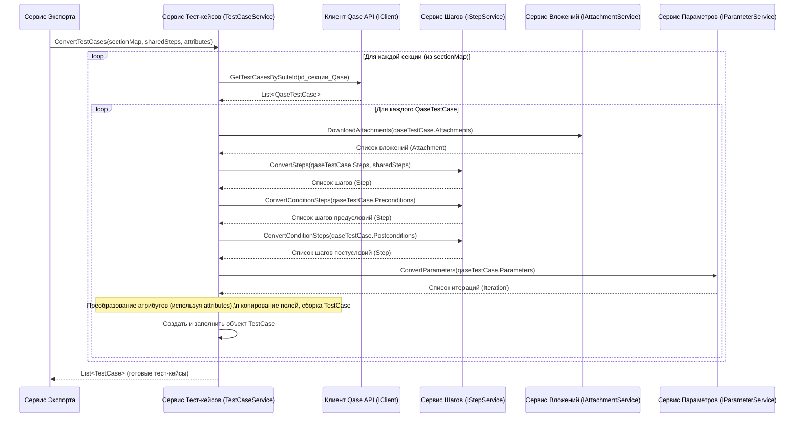

# Chapter 4: Сервис Обработки Тест-кейсов


В [предыдущей главе](03_клиент_qase_api_.md) мы узнали о [Клиенте Qase API](03_клиент_qase_api_.md) — нашем «цифровом библиотекаре», который получает необработанные данные (тест-кейсы, секции и т.д.) непосредственно из Qase. Но эти данные похожи на рукопись на иностранном языке – чтобы правильно их использовать и сохранить, нам нужно их «перевести» и привести в нужный формат.

Именно здесь на сцену выходит **Сервис Обработки Тест-кейсов (`TestCaseService`)**. Это наш главный «переводчик» для самой важной части данных — тест-кейсов.

## Зачем нужен этот сервис?

Представьте, что [Клиент Qase API](03_клиент_qase_api_.md) принес нам стопку карточек с описанием тест-кейсов из Qase (объекты `QaseTestCase`). Каждая карточка содержит информацию о названии, описании, шагах, ожидаемых результатах, прикрепленных файлах, пользовательских полях и т.д., но все это записано в формате, специфичном для Qase.

Нам же нужно сохранить эти данные в нашем собственном, унифицированном формате — в виде объекта `TestCase`, который затем будет записан в JSON-файл [Сервисом Записи Результатов](07_сервис_записи_результатов_.md).

**Сервис Обработки Тест-кейсов (`TestCaseService`) решает эту задачу:**

*   Он берет «сырой» тест-кейс из Qase (`QaseTestCase`).
*   Преобразует каждое его поле в соответствующее поле нашего целевого формата `TestCase`.
*   Для сложных частей (шаги, вложения, атрибуты) он обращается к другим специализированным сервисам-помощникам.
*   На выходе он отдает полностью готовый к записи объект `TestCase`.

Он как переводчик книги: берет оригинальный текст (данные Qase) и главу за главой (поля, шаги, атрибуты) переводит на другой язык (формат `TestCase`), сохраняя смысл и структуру.

## Как он используется?

Вы не будете вызывать `TestCaseService` напрямую. Его использует главный координатор — [Сервис Экспорта](01_сервис_экспорта_.md), когда приходит время обрабатывать сами тест-кейсы. Вспомним фрагмент из `ExportService`:

```csharp
// Файл: Services/ExportService.cs (Фрагмент)
// ... другие сервисы ...
private readonly ITestCaseService _testCaseService; // <-- Наш сервис обработки тест-кейсов
// ...

public ExportService(..., ITestCaseService testCaseService, ...)
{
    // ...
    _testCaseService = testCaseService; // Получаем его через DI
    // ...
}

public async Task ExportProject()
{
    // ... Шаги 1-4: Получение проекта, секций, общих шагов, атрибутов ...
    var sectionData = await _sectionService.ConvertSections();
    var sharedSteps = await _sharedStepService.ConvertSharedSteps(...);
    var attributes = await _attributeService.ConvertAttributes();

    // 5. Обрабатываем тест-кейсы, используя данные о секциях, общих шагах и атрибутах
    //    Вызываем наш сервис!
    var testCases = await _testCaseService.ConvertTestCases(
                            sectionData.SectionMap, // Карта секций (ID Qase -> наш ID)
                            sharedSteps,          // Обработанные общие шаги
                            attributes);          // Обработанные атрибуты
    _logger.LogInformation($"Обработали {testCases.Count} тест-кейсов");

    // 6. Записываем каждый тест-кейс...
    // ...
}
```

Как видите, `ExportService` вызывает метод `ConvertTestCases`, передавая ему необходимую информацию:

*   `sectionMap`: Соответствие между ID секций в Qase и нашими внутренними ID (чтобы знать, в какую "папку" положить тест-кейс).
*   `sharedSteps`: Словарь с уже обработанными [общими шагами](https://help.qase.io/en/articles/5416887-shared-steps) ( reused steps ).
*   `attributes`: Данные об атрибутах (пользовательских и системных полях), полученные от [Сервиса Обработки Атрибутов](05_сервис_обработки_атрибутов_.md).

`TestCaseService` использует эти данные, чтобы корректно преобразовать каждый тест-кейс, полученный от [Клиента Qase API](03_клиент_qase_api_.md).

## Команда переводчиков: Зависимости сервиса

`TestCaseService` не выполняет всю работу в одиночку. Для перевода сложных частей тест-кейса он делегирует задачи другим "специалистам":

*   **`IStepService`**: Переводит шаги тест-кейса (обычные шаги, предусловия, постусловия), включая обработку ссылок на общие шаги.
*   **`IAttachmentService`**: Находит ссылки на вложения в тексте шагов и описаниях, скачивает их с помощью [Клиента Qase API](03_клиент_qase_api_.md) и подготавливает информацию для сохранения. Подробнее в главе [Сервис Обработки Вложений](06_сервис_обработки_вложений_.md).
*   **`IAttributeService`** (неявно, через полученные данные `attributes`): Помогает правильно сопоставить системные поля (статус, приоритет и т. д.) и пользовательские поля из Qase с нашими внутренними атрибутами. Мы рассмотрим это подробнее в главе [Сервис Обработки Атрибутов](05_сервис_обработки_атрибутов_.md).
*   **`IParameterService`**: Обрабатывает параметры тест-кейса, если они используются для создания итераций (вариантов выполнения с разными данными).
*   **`IClient`**: Используется для получения списка тест-кейсов для каждой секции (`GetTestCasesBySuiteId`) и для получения ключа проекта (`GetProjectKey`), который нужен для формирования уникального атрибута с ID тест-кейса из Qase (например, `PROJECT-123`).

Эти зависимости сервис получает так же, как и другие — через конструктор с помощью Внедрения Зависимостей (DI), настроенного в [Главе 2](02_точка_входа_и_настройка_приложения_.md).

```csharp
// Файл: Services/TestCaseService.cs (Фрагмент конструктора)
public class TestCaseService : ITestCaseService
{
    private readonly ILogger<TestCaseService> _logger;
    private readonly IClient _client; // Для получения тест-кейсов и ключа проекта
    private readonly IStepService _stepService; // Для конвертации шагов
    private readonly IAttachmentService _attachmentService; // Для обработки вложений
    private readonly IParameterService _parameterService; // Для обработки параметров/итераций
    // ... другие поля ...

    public TestCaseService(ILogger<TestCaseService> logger, IClient client, IStepService stepService,
        IAttachmentService attachmentService, IParameterService parameterService)
    {
        _logger = logger;
        _client = client;
        _stepService = stepService;
        _attachmentService = attachmentService;
        _parameterService = parameterService;
    }
    // ... остальная часть класса ...
}
```

## Как происходит "перевод"? Пошаговый разбор

Давайте представим, что `ExportService` вызвал `ConvertTestCases`. Что происходит внутри `TestCaseService`?

1.  **Цикл по секциям:** Сервис получает `sectionMap` (словарь `ID секции Qase -> наш Guid секции`). Он проходит по каждой секции в этом словаре.
2.  **Запрос тест-кейсов:** Для текущего ID секции Qase он просит [Клиента Qase API](03_клиент_qase_api_.md) (`_client.GetTestCasesBySuiteId`) прислать список "сырых" тест-кейсов (`List<QaseTestCase>`) из этой секции.
3.  **Цикл по тест-кейсам:** Теперь сервис проходит по каждому полученному `QaseTestCase`.
4.  **"Сборка" нового TestCase:** Для каждого `QaseTestCase` он выполняет следующие шаги:
    *   Создает новый, пустой объект `TestCase` и присваивает ему уникальный ID (`Guid.NewGuid()`).
    *   **Вложения:** Вызывает `_attachmentService.DownloadAttachments`, передавая список вложений из `QaseTestCase`, чтобы скачать их и подготовить метаданные.
    *   **Шаги (Steps):** Вызывает `_stepService.ConvertSteps`, передавая список шагов из `QaseTestCase` и словарь `sharedSteps`. `IStepService` вернет список шагов в нашем формате `Step`.
    *   **Предусловия (Preconditions):** Вызывает `_stepService.ConvertConditionSteps`, передавая текст предусловий из `QaseTestCase`. `IStepService` преобразует текст в шаги формата `Step`.
    *   **Постусловия (Postconditions):** Аналогично предусловиям, вызывает `_stepService.ConvertConditionSteps` для постусловий.
    *   **Сбор вложений из шагов:** Собирает информацию о вложениях, которые могли быть найдены и обработаны `_stepService` внутри шагов, и добавляет их к общему списку вложений тест-кейса.
    *   **Атрибуты (Attributes):** Преобразует системные и пользовательские поля из `QaseTestCase` в список `CaseAttribute`. Для этого он использует данные `attributes` (полученные от [Сервиса Обработки Атрибутов](05_сервис_обработки_атрибутов_.md)), которые содержат необходимые сопоставления (mapping) между полями Qase и нашими атрибутами. Также создает специальный атрибут `Qase ID` со значением вида `PROJECT-123`, используя `_client.GetProjectKey()`.
    *   **Параметры/Итерации (Iterations):** Если у тест-кейса есть параметры, вызывает `_parameterService.ConvertParameters` для их преобразования в список `Iteration`.
    *   **Простые поля:** Копирует или преобразует простые поля:
        *   `Name`: Название тест-кейса.
        *   `Description`: Описание (может применяться очистка с помощью утилит из [Вспомогательные Утилиты (Работа с текстом)](08_вспомогательные_утилиты__работа_с_текстом__.md)).
        *   `State`: Преобразует статус Qase (число) в наш тип `StateType` (например, `Ready`, `NotReady`).
        *   `Priority`: Преобразует приоритет Qase (число) в наш тип `PriorityType` (например, `High`, `Medium`).
        *   `Tags`: Копирует список тегов.
        *   `SectionId`: Устанавливает наш внутренний ID секции (из `sectionMap`).
        *   Устанавливает другие поля, такие как `Duration` (длительность по умолчанию), `Links` (пока пустой список).
    *   **Добавление в результат:** Добавляет полностью собранный объект `TestCase` в общий список результатов.
5.  **Возврат результата:** После обработки всех тест-кейсов во всех секциях, сервис возвращает полный список `List<TestCase>` обратно [Сервису Экспорта](01_сервис_экспорта_.md).

**Визуализация процесса:**



Эта диаграмма показывает, как `TestCaseService` оркеструет работу, получая сырые данные (`QaseTestCase`) от клиента и делегируя преобразование шагов, вложений и параметров специализированным сервисам, прежде чем собрать финальный `TestCase`.

## Заглянем в код

Давайте посмотрим на ключевые фрагменты кода `TestCaseService`.

**1. Основной метод `ConvertTestCases`:**

```csharp
// Файл: Services/TestCaseService.cs
public async Task<List<TestCase>> ConvertTestCases(
    Dictionary<int, Guid> sectionMap, // Карта ID секций Qase -> наш Guid
    Dictionary<string, SharedStep> sharedSteps, // Обработанные общие шаги
    AttributeData attributes) // Данные для конвертации атрибутов
{
    _logger.LogInformation("Начинаем конвертацию тест-кейсов");
    var allTestCases = new List<TestCase>(); // Сюда соберем все результаты

    // Проходим по каждой секции, о которой мы знаем
    foreach (var sectionPair in sectionMap)
    {
        var qaseSectionId = sectionPair.Key; // ID секции в Qase
        var ourSectionId = sectionPair.Value; // Наш внутренний ID секции

        // Получаем "сырые" тест-кейсы для этой секции из Qase
        var qaseTestCases = await _client.GetTestCasesBySuiteId(qaseSectionId);
        _logger.LogDebug($"Найдено {qaseTestCases.Count} тест-кейсов в секции {qaseSectionId}");

        // Вызываем приватный метод для конвертации списка тест-кейсов
        var convertedCases = await ConvertTestCasesInternal(
            qaseTestCases,
            ourSectionId,
            sharedSteps,
            attributes);

        allTestCases.AddRange(convertedCases); // Добавляем результат в общий список
    }

    _logger.LogInformation("Завершена конвертация тест-кейсов");
    return allTestCases;
}
```

Этот метод организует процесс: получает тест-кейсы для каждой секции и вызывает внутренний метод для их обработки.

**2. Внутренний метод `ConvertTestCasesInternal` (упрощенный фрагмент):**

Этот метод обрабатывает список `QaseTestCase` для *одной* секции.

```csharp
// Файл: Services/TestCaseService.cs (упрощенный фрагмент)
private async Task<List<TestCase>> ConvertTestCasesInternal(
    List<QaseTestCase> qaseTestCases, Guid sectionId,
    Dictionary<string, SharedStep> sharedSteps, AttributeData attributes)
{
    var testCases = new List<TestCase>();

    foreach (var qaseTestCase in qaseTestCases) // Обрабатываем каждый тест-кейс
    {
        _logger.LogInformation($"Конвертируем тест-кейс: {qaseTestCase.Name} (ID Qase: {qaseTestCase.Id})");

        // --- Шаг 1: Подготовка данных ---
        var testCaseId = Guid.NewGuid(); // Наш уникальный ID для TestCase
        var projectKey = _client.GetProjectKey(); // Ключ проекта (e.g., "PROJECT")

        // --- Шаг 2: Вызов других сервисов ---
        var attachments = await _attachmentService.DownloadAttachments(
                                  qaseTestCase.Attachments, testCaseId);
        var steps = await _stepService.ConvertSteps(
                            qaseTestCase.Steps, sharedSteps, testCaseId);
        var preconditionSteps = await _stepService.ConvertConditionSteps(
                                        qaseTestCase.Preconditions, testCaseId);
        var postconditionSteps = await _stepService.ConvertConditionSteps(
                                         qaseTestCase.Postconditions, testCaseId);
        var iterations = qaseTestCase.Parameters.ToString() != "[]"
            ? _parameterService.ConvertParameters(...) // Обработка параметров
            : new List<Iteration>();

        // --- Шаг 3: Преобразование атрибутов ---
        var systemAttributes = ConvertSystemAttributes(attributes.SystemAttributeMap, qaseTestCase);
        var customAttributes = ConvertCustomAttributes(attributes.CustomAttributeMap, qaseTestCase.CustomFields);
        var testCaseAttributes = systemAttributes.Concat(customAttributes).ToList();
        // Добавляем атрибут с оригинальным Qase ID
        testCaseAttributes.Add(new CaseAttribute {
            Id = attributes.AttributeMap[Constants.IdQaseAttribute].Id, // ID атрибута "Qase ID"
            Value = $"{projectKey}-{qaseTestCase.Id}"                   // Значение "PROJECT-123"
        });

        // --- Шаг 4: Сборка объекта TestCase ---
        var testCase = new TestCase
        {
            Id = testCaseId, // Наш ID
            Name = qaseTestCase.Name,
            Description = ConvertingDescription(qaseTestCase.Description), // Очистка описания
            State = ConvertStatus(qaseTestCase.Status), // Конвертация статуса
            Priority = ConvertPriority(qaseTestCase.Priority), // Конвертация приоритета
            Steps = steps,
            PreconditionSteps = preconditionSteps,
            PostconditionSteps = postconditionSteps,
            Attributes = testCaseAttributes,
            Tags = qaseTestCase.Tags.Select(t => t.Title).ToList(),
            Attachments = attachments, // Добавляем вложения (позже добавим из шагов)
            Iterations = iterations,
            Links = new List<Link>(), // Пока не реализовано
            SectionId = sectionId, // Наш ID секции
            Duration = 10000 // Значение по умолчанию
        };

        // (Здесь еще код для сбора вложений из шагов - пропущено для простоты)

        testCases.Add(testCase); // Добавляем готовый TestCase
    }
    return testCases;
}
```

Этот фрагмент показывает основную логику: вызов сервисов-помощников, преобразование атрибутов и сборку финального объекта `TestCase` из частей.

**3. Пример преобразования поля (Приоритет):**

Простые преобразования выполняются небольшими вспомогательными методами.

```csharp
// Файл: Services/TestCaseService.cs
private static PriorityType ConvertPriority(int priority)
{
    // Преобразуем числовой код приоритета из Qase в наш тип PriorityType
    return priority switch
    {
        1 => PriorityType.High,   // 1 в Qase -> High у нас
        2 => PriorityType.Medium, // 2 в Qase -> Medium у нас
        3 => PriorityType.Low,    // 3 в Qase -> Low у нас
        _ => PriorityType.Medium // Если пришло что-то неизвестное, ставим Medium
    };
}
```

Подобные методы (`ConvertStatus`, `ConvertingDescription`) используются для перевода других полей в нужный формат.

## Заключение

Сервис Обработки Тест-кейсов (`TestCaseService`) — это ключевой компонент конвейера экспорта в `QaseExporter`. Он выполняет важную работу по преобразованию «сырых» данных о тест-кейсах, полученных из Qase, в структурированный формат `TestCase`, готовый для записи.

Он действует как умный «переводчик» и «сборщик»:

*   Понимает структуру данных Qase (`QaseTestCase`).
*   Знает целевой формат (`TestCase`).
*   Использует специализированные сервисы (`IStepService`, `IAttachmentService`, `IParameterService`) для обработки сложных частей (шагов, вложений, параметров).
*   Корректно сопоставляет атрибуты (системные и пользовательские поля), используя информацию от [Сервиса Обработки Атрибутов](05_сервис_обработки_атрибутов_.md).
*   Собирает все части воедино, создавая финальный объект `TestCase`.

Понимание работы этого сервиса помогает увидеть, как разрозненные данные из Qase превращаются в цельные, готовые к сохранению тест-кейсы.

В следующей главе мы подробнее рассмотрим одного из важных помощников этого сервиса — [Сервис Обработки Атрибутов](05_сервис_обработки_атрибутов_.md), который отвечает за подготовку информации о системных и пользовательских полях, необходимых для корректного преобразования тест-кейсов.

---

Generated by [AI Codebase Knowledge Builder](https://github.com/The-Pocket/Tutorial-Codebase-Knowledge)