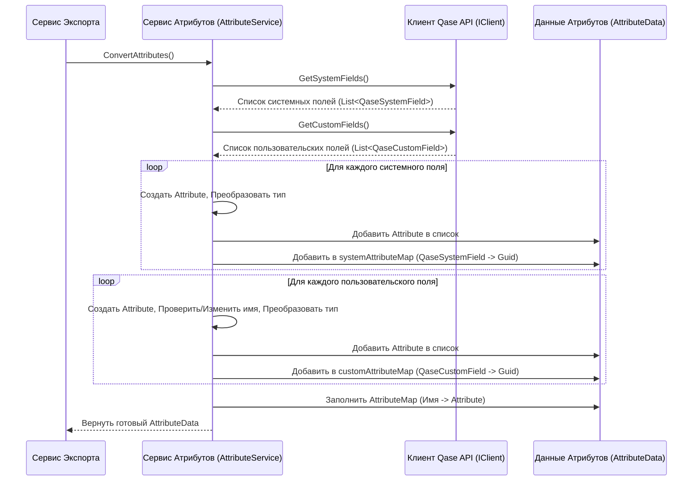

# Chapter 5: Сервис Обработки Атрибутов


В [предыдущей главе](04_сервис_обработки_тест_кейсов_.md) мы разобрались, как [Сервис Обработки Тест-кейсов](04_сервис_обработки_тест_кейсов_.md) преобразует "сырые" данные из Qase в наш внутренний формат `TestCase`. Мы упоминали, что для правильной обработки полей (статус, приоритет, пользовательские поля) ему нужна информация об *атрибутах*, подготовленная другим сервисом. Именно этот сервис мы и рассмотрим сейчас – **Сервис Обработки Атрибутов (`AttributeService`)**.

Представьте, что вы переезжаете и нужно упаковать вещи. У вас есть коробки от разных производителей (данные из Qase) с их собственными маркировками (системные и пользовательские поля Qase). Чтобы на новом месте было легко разобраться, вы решаете на каждую коробку наклеить свою, унифицированную этикетку (наш формат `Attribute`) и составить список: "коробка с маркировкой 'Посуда Кухня' -> 'Этикетка №1: Посуда'", "коробка 'Инструменты Балкон' -> 'Этикетка №2: Инструменты'".

Сервис Обработки Атрибутов делает именно это: он "инвентаризирует" все возможные характеристики (поля), которые могут быть у ваших тест-кейсов в Qase, создает для них стандартные "этикетки" и запоминает, какая характеристика из Qase какой "этикетке" соответствует.

## Зачем нужен этот сервис?

В Qase у тест-кейсов есть два типа полей (атрибутов):

1.  **Системные поля:** Стандартные характеристики, присущие всем тест-кейсам в Qase (например, `Status`, `Severity`, `Priority`, `Behavior`).
2.  **Пользовательские поля (Custom Fields):** Уникальные характеристики, которые вы сами создаете для своего проекта (например, `Тестовая среда`, `Компонент системы`, `Ответственный QA`).

Когда мы экспортируем тест-кейс, нам нужно сохранить значения *всех* этих полей. Но как [Сервис Обработки Тест-кейсов](04_сервис_обработки_тест_кейсов_.md) узнает, что полю "Severity" из Qase соответствует наш атрибут "Серьезность", а пользовательскому полю "Тестовая среда" – наш атрибут "Тестовая среда"?

`AttributeService` решает эту проблему, выполняя подготовительную работу:

1.  **Запрашивает списки:** Он обращается к [Клиенту Qase API](03_клиент_qase_api_.md), чтобы получить полный список *всех* системных и *всех* пользовательских полей, определенных в вашем проекте Qase.
2.  **Создает унифицированные атрибуты:** Для каждого поля из Qase он создает объект `Attribute` в нашем внутреннем формате. Этот объект содержит:
    *   Уникальный ID (Guid)
    *   Имя (старается сохранить оригинальное, но может изменить при конфликтах)
    *   Тип (Строка, Список опций, Чекбокс и т.д.)
    *   Возможные значения (для списков опций)
    *   Другие метаданные (обязательность, активность)
3.  **Строит "карты соответствия" (Mapping):** Самое важное! Он создает специальные словари (карты), которые связывают оригинальное поле из Qase с ID созданного им объекта `Attribute`. Это позволяет потом легко находить нужный ID атрибута при обработке конкретного тест-кейса.
4.  **Добавляет специальные атрибуты:** Он также создает один дополнительный атрибут, которого нет в Qase – `Qase ID`. Этот атрибут будет хранить оригинальный идентификатор тест-кейса из Qase (например, `PROJECT-123`) для возможности обратной связи или поиска.

Результат работы этого сервиса – объект `AttributeData`, который содержит полный список всех унифицированных атрибутов (`List<Attribute>`) и те самые "карты соответствия" (`CustomAttributeMap`, `SystemAttributeMap`, `AttributeMap`). Этот `AttributeData` затем передается в [Сервис Обработки Тест-кейсов](04_сервис_обработки_тест_кейсов_.md).

## Как он используется?

Этот сервис, как и многие другие, работает "за кулисами". Его вызывает [Сервис Экспорта](01_сервис_экспорта_.md) на одном из начальных этапов, *до* начала обработки самих тест-кейсов.

Вспомним снова фрагмент из `ExportService`:

```csharp
// Файл: Services/ExportService.cs (Фрагмент)
// ... другие сервисы ...
private readonly IAttributeService _attributeService; // <-- Наш сервис атрибутов
// ...

public ExportService(..., IAttributeService attributeService, ...)
{
    // ...
    _attributeService = attributeService; // Получаем его через DI
    // ...
}

public async Task ExportProject()
{
    // ... Шаги 1-3: Получение проекта, секций, общих шагов ...

    // 4. Обрабатываем атрибуты (пользовательские и системные поля)
    //    !!! Вызываем наш сервис !!!
    var attributes = await _attributeService.ConvertAttributes();
    _logger.LogInformation($"Обработали {attributes.Attributes.Count} атрибутов");

    // 5. Обрабатываем тест-кейсы, ПЕРЕДАВАЯ ему результат работы AttributeService
    var testCases = await _testCaseService.ConvertTestCases(
                            sectionData.SectionMap,
                            sharedSteps,
                            attributes); // <-- Вот здесь используются данные от AttributeService
    _logger.LogInformation($"Обработали {testCases.Count} тест-кейсов");

    // ... остальная часть экспорта ...

    // 8. Формируем главный JSON файл, добавляя туда список атрибутов
    var mainJson = new Root
    {
        // ... другие поля ...
        Attributes = attributes.Attributes, // Список всех атрибутов
    };
    // ...
}
```

Как видно, `ExportService` вызывает `_attributeService.ConvertAttributes()`. Этот метод выполняет всю описанную выше работу (запрос полей из Qase, создание `Attribute`, построение карт) и возвращает объект `AttributeData`. Затем этот объект `attributes` передается в `_testCaseService.ConvertTestCases()` и используется для записи в финальный `main.json`.

## Как устроен "переводчик этикеток"?

`AttributeService` довольно прост. Его основная зависимость – это [Клиент Qase API](03_клиент_qase_api_.md) (`IClient`), который нужен для получения списков полей из Qase.

**Шаг за шагом:**

1.  **Запуск:** Метод `ConvertAttributes()` вызывается.
2.  **Создание базового атрибута:** Сразу создается специальный атрибут `Qase ID`.
3.  **Запрос полей Qase:** Вызываются `_client.GetCustomFields()` и `_client.GetSystemFields()` для получения "сырых" списков полей.
4.  **Обработка системных полей:** Сервис проходит по списку системных полей (`QaseSystemField`). Для каждого поля:
    *   Пропускает некоторые ненужные системные поля (вроде Description, Pre-conditions и т.д.).
    *   Создает новый объект `Attribute`, преобразуя тип поля Qase (число) в наш тип `AttributeType` (например, `Options`, `String`).
    *   Если тип – список опций, копирует эти опции.
    *   Добавляет созданный `Attribute` в общий список.
    *   **Запоминает соответствие:** Добавляет запись в `systemAttributeMap`: `оригинальное QaseSystemField` -> `ID нового Attribute`.
5.  **Обработка пользовательских полей:** Аналогично проходит по списку пользовательских полей (`QaseCustomField`). Для каждого поля:
    *   Создает новый объект `Attribute`, преобразуя тип поля Qase (строка) в наш `AttributeType`.
    *   **Проверяет имя:** Использует хитрый метод `ConvertAttributeName`, чтобы избежать дубликатов имен (если у вас есть пользовательское поле с таким же именем, как у системного или другого пользовательского, к имени добавится суффикс типа `(1)`).
    *   Если тип – список опций, извлекает опции из поля `Value` (в Qase API они хранятся как JSON-строка).
    *   Добавляет созданный `Attribute` в общий список.
    *   **Запоминает соответствие:** Добавляет запись в `customAttributeMap`: `оригинальное QaseCustomField` -> `ID нового Attribute`.
6.  **Создание карты по имени:** Создает дополнительный словарь `AttributeMap`, где ключом является *имя* атрибута, а значением – сам объект `Attribute`. Это удобно для быстрого поиска атрибута по имени (например, для `Qase ID`).
7.  **Возврат результата:** Возвращает объект `AttributeData`, содержащий список всех `Attribute` и все карты (`systemAttributeMap`, `customAttributeMap`, `AttributeMap`).

**Визуализация процесса:**



## Заглянем в код

**1. Основной метод `ConvertAttributes`:**

```csharp
// Файл: Services/AttributeService.cs
public async Task<AttributeData> ConvertAttributes()
{
    _logger.LogInformation("Конвертация атрибутов");

    // Подготовка структур для результата
    var attributes = new List<Attribute>(); // Список наших унифицированных атрибутов
    var customAttributeMap = new Dictionary<QaseCustomField, Guid>(); // Карта: Qase Custom -> наш ID
    var systemAttributeMap = new Dictionary<QaseSystemField, Guid>(); // Карта: Qase System -> наш ID

    // Добавляем специальный атрибут "Qase ID"
    attributes.Add(new()
    {
        Id = Guid.NewGuid(),
        Name = Constants.IdQaseAttribute, // "Qase ID"
        Type = AttributeType.String,
        // ... другие поля ...
    });

    // Получаем поля из Qase
    var customFields = await _client.GetCustomFields();
    var systemFields = await _client.GetSystemFields();

    // Обрабатываем системные поля
    foreach (var systemField in systemFields)
    {
        // Пропускаем некоторые поля по названию
        if (_ignoredAttributeTitles.Contains(systemField.Title)) continue;

        var attribute = new Attribute() // Создаем наш объект Attribute
        {
            Id = Guid.NewGuid(),
            Name = systemField.Title, // Используем имя из Qase
            Type = ConvertSystemAttributeType(systemField.Type), // Конвертируем тип
            // ... другие поля ...
            Options = new List<string>(),
        };

        // Если есть опции, копируем их (упрощено)
        if (attribute.Type == AttributeType.Options)
        {
            attribute.Options.AddRange(systemField.Options.Select(x => x.Title).ToList());
        }

        attributes.Add(attribute); // Добавляем в общий список
        systemAttributeMap.Add(systemField, attribute.Id); // Запоминаем соответствие
    }

    // Обрабатываем пользовательские поля (очень похоже)
    foreach (var customField in customFields)
    {
        var attribute = new Attribute() // Создаем наш объект Attribute
        {
            Id = Guid.NewGuid(),
            // Проверяем и при необходимости изменяем имя, чтобы избежать дубликатов
            Name = ConvertAttributeName(customField, attributes),
            Type = ConvertCustomAttributeType(customField.Type), // Конвертируем тип
            // ... другие поля ...
            Options = new List<string>(),
        };

        // Если тип - список опций, парсим JSON из Value и добавляем опции (упрощено)
        if (attribute.Type == AttributeType.Options || attribute.Type == AttributeType.MultipleOptions)
        {
            // ... код для десериализации и добавления опций ...
        }

        attributes.Add(attribute); // Добавляем в общий список
        customAttributeMap.Add(customField, attribute.Id); // Запоминаем соответствие
    }

    _logger.LogDebug("Атрибуты: {@Attribute}", attributes);

    // Собираем финальный объект AttributeData
    return new AttributeData
    {
        Attributes = attributes, // Список всех наших атрибутов
        CustomAttributeMap = customAttributeMap, // Карта для пользовательских полей
        SystemAttributeMap = systemAttributeMap, // Карта для системных полей
        // Создаем карту Имя -> Атрибут для быстрого доступа
        AttributeMap = attributes.ToDictionary(x => x.Name, x => x),
    };
}
```

Этот метод показывает весь процесс: получение данных, циклы обработки системных и пользовательских полей, создание объектов `Attribute` и заполнение карт соответствия.

**2. Вспомогательные методы (Пример `ConvertCustomAttributeType`):**

Методы для конвертации типов довольно просты. Они используют конструкцию `switch` для сопоставления типов Qase с нашими типами `AttributeType`.

```csharp
// Файл: Services/AttributeService.cs
private AttributeType ConvertCustomAttributeType(string qaseAttributeType)
{
    // Определяет наш тип AttributeType на основе типа пользовательского поля Qase (строка)
    switch (qaseAttributeType)
    {
        case "select": // Тип "select" в Qase
            return AttributeType.Options; // -> наш тип Выбор из списка
        case "multiselect": // Тип "multiselect" в Qase
            return AttributeType.MultipleOptions; // -> наш тип Множественный выбор
        case "datetime": // Тип "datetime" в Qase
            return AttributeType.Datetime; // -> наш тип Дата и время
        case "checkbox": // Тип "checkbox" в Qase
            return AttributeType.Checkbox; // -> наш тип Флажок (Чекбокс)
        default: // Все остальные типы (text, textarea, number, url, user)
            return AttributeType.String; // -> наш тип Строка
    }
}

// Аналогичный метод ConvertSystemAttributeType существует для системных полей,
// но он принимает числовой код типа из Qase API.
```

**3. Уникализация имен (`ConvertAttributeName`):**

Этот метод гарантирует, что у всех наших атрибутов будут уникальные имена.

```csharp
// Файл: Services/AttributeService.cs
private static string ConvertAttributeName(QaseCustomField attribute, List<Attribute> attributes)
{
    var newName = attribute.Title; // Берем оригинальное имя
    var i = 1;

    // Проверяем, существует ли уже атрибут с таким именем в нашем списке 'attributes'
    while (attributes.Any(x => x.Name == newName))
    {
        // Если существует, добавляем суффикс "(i)" и проверяем снова
        newName = $"{attribute.Title} ({i})";
        i++;
    }
    // Возвращаем уникальное имя
    return newName;
}
```

## Заключение

Сервис Обработки Атрибутов (`AttributeService`) играет важную, хоть и подготовительную, роль в процессе экспорта. Он выступает в роли "оформителя" или "кладовщика", который:

*   Собирает информацию обо всех системных и пользовательских полях из Qase.
*   Преобразует их в единый внутренний формат `Attribute`.
*   Создает "карты соответствия", которые связывают поля Qase с нашими атрибутами.
*   Гарантирует уникальность имен атрибутов.
*   Подготавливает данные (`AttributeData`), необходимые [Сервису Обработки Тест-кейсов](04_сервис_обработки_тест_кейсов_.md) для корректной конвертации значений полей.

Понимание работы этого сервиса проясняет, откуда [Сервис Обработки Тест-кейсов](04_сервис_обработки_тест_кейсов_.md) знает, как интерпретировать различные поля, приходящие из Qase API.

В следующей главе мы погрузимся в детали обработки еще одного важного элемента тест-кейсов – вложений (прикрепленных файлов), рассмотрев [Сервис Обработки Вложений](06_сервис_обработки_вложений_.md).

---

Generated by [AI Codebase Knowledge Builder](https://github.com/The-Pocket/Tutorial-Codebase-Knowledge)