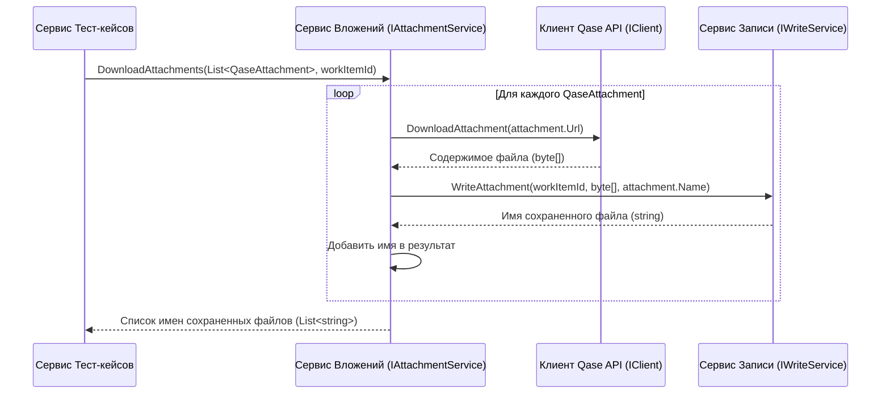

# Chapter 6: Сервис Обработки Вложений


В [предыдущей главе](05_сервис_обработки_атрибутов_.md) мы разобрались, как [Сервис Обработки Атрибутов](05_сервис_обработки_атрибутов_.md) подготавливает информацию о системных и пользовательских полях. Теперь пришло время обратить внимание на еще одну важную деталь тест-кейсов и их шагов – прикрепленные файлы или **вложения**. Часто бывает необходимо приложить скриншоты, логи, или другие файлы к тестам. Как `QaseExporter` справляется с ними? За это отвечает **Сервис Обработки Вложений (`AttachmentService`)**.

Представьте себе архивариуса в большой библиотеке. Его работа — не только каталогизировать книги, но и обрабатывать дополнительные материалы, которые к ним прилагаются: карты, схемы, фотографии. Если ему дают список документов с указанием, где их найти (ссылки), он аккуратно находит каждый документ, делает копию (скачивает файл) и подшивает ее в нужную папку.

Наш `Сервис Обработки Вложений` работает точно так же:

*   Он получает список "описаний" файлов, прикрепленных к тест-кейсу или шагу в Qase (объекты `QaseAttachment`, содержащие имя файла и URL для его скачивания).
*   Для каждого файла он обращается к [Клиенту Qase API](03_клиент_qase_api_.md), чтобы скачать его содержимое по URL.
*   Затем он передает скачанное содержимое и имя файла [Сервису Записи Результатов](07_сервис_записи_результатов_.md), который сохраняет файл в специальную папку рядом с экспортированным тест-кейсом.
*   В конце он возвращает список имен файлов *в том виде, как они были сохранены*, чтобы эти имена можно было добавить в итоговый JSON-файл тест-кейса или шага.

## Зачем нужен этот сервис?

Тест-кейсы и их шаги в Qase могут содержать ссылки на прикрепленные файлы. Когда мы экспортируем тест-кейс, мы хотим не просто сохранить текстовое описание, но и иметь локальные копии этих файлов.

**Проблема:** Информация о вложении в Qase API – это просто метаданные (имя, тип, размер) и URL-адрес, по которому файл можно скачать. Само содержимое файла нужно загрузить отдельно.

**Решение:** `AttachmentService` берет на себя эту задачу:

1.  **Скачивание:** Он использует [Клиент Qase API](03_клиент_qase_api_.md) для загрузки фактического содержимого файла по URL.
2.  **Сохранение:** Он координирует сохранение файла на диск, используя [Сервис Записи Результатов](07_сервис_записи_результатов_.md).
3.  **Учет:** Он возвращает имена сохраненных файлов, которые потом будут включены в JSON.

Без этого сервиса наши экспортированные тест-кейсы потеряли бы важную часть информации – прикрепленные файлы.

## Как он используется?

`AttachmentService` — это помощник для других сервисов, прежде всего для [Сервиса Обработки Тест-кейсов](04_сервис_обработки_тест_кейсов_.md) и `StepService` (сервиса, который обрабатывает шаги, включая поиск ссылок на вложения в тексте шагов).

Давайте вспомним, как `TestCaseService` собирает объект `TestCase` (из [Главы 4](04_сервис_обработки_тест_кейсов_.md)):

```csharp
// Файл: Services/TestCaseService.cs (Упрощенный фрагмент)
private async Task<List<TestCase>> ConvertTestCasesInternal(...)
{
    // ...
    foreach (var qaseTestCase in qaseTestCases)
    {
        var testCaseId = Guid.NewGuid();
        // ...

        // !!! Вызов AttachmentService !!!
        // Передаем список вложений из Qase и ID нашего TestCase
        var savedAttachmentNames = await _attachmentService.DownloadAttachments(
                                           qaseTestCase.Attachments, testCaseId);

        // ... обработка шагов, атрибутов и т.д. ...

        var testCase = new TestCase
        {
            // ... другие поля ...
            // Сохраняем список имен скачанных файлов
            Attachments = savedAttachmentNames,
            // ...
        };
        // ...
    }
    // ...
}
```

Здесь `TestCaseService` получает из Qase список объектов `QaseAttachment` для текущего тест-кейса. Он передает этот список и только что сгенерированный `testCaseId` (уникальный идентификатор нашего `TestCase`) в метод `_attachmentService.DownloadAttachments`. Сервис вложений делает свою работу и возвращает список строк — реальные имена файлов, сохраненных на диске. Эти имена затем записываются в поле `Attachments` нашего объекта `TestCase`.

Точно так же `StepService` может использовать `AttachmentService` для обработки вложений, найденных внутри описаний шагов.

## Команда для работы с файлами: Зависимости

Для выполнения своей задачи `AttachmentService` нуждается в двух ключевых помощниках:

*   **`IClient` ([Клиент Qase API](03_клиент_qase_api_.md))**: Нужен, чтобы получить фактическое содержимое файла по URL-адресу, предоставленному Qase. Он выступает в роли "доставщика", который привозит файл из Qase.
*   **`IWriteService` ([Сервис Записи Результатов](07_сервис_записи_результатов_.md))**: Нужен, чтобы аккуратно сохранить полученное содержимое файла на локальный диск в нужную папку (обычно это подпапка `attachments` рядом с JSON-файлом тест-кейса). Он также отвечает за то, чтобы имя файла было корректным и уникальным в этой папке, и возвращает это финальное имя. Он — "архивариус", который размещает файл на полке.

Эти зависимости сервис получает стандартным способом — через конструктор с помощью Внедрения Зависимостей (DI).

```csharp
// Файл: Services/AttachmentService.cs (Конструктор)
using JsonWriter; // Для IWriteService
using Microsoft.Extensions.Logging;
using QaseExporter.Client; // Для IClient
using QaseExporter.Models;

namespace QaseExporter.Services;

public class AttachmentService : IAttachmentService
{
    private readonly ILogger<AttachmentService> _logger;
    private readonly IClient _client;           // "Доставщик" файлов
    private readonly IWriteService _writeService; // "Архивариус" для сохранения

    // Получаем зависимости через конструктор
    public AttachmentService(ILogger<AttachmentService> logger, IClient client, IWriteService writeService)
    {
        _logger = logger;
        _client = client;
        _writeService = writeService;
    }

    // ... остальная часть класса ...
}
```

## Как работает "Архивариус Вложений"? Пошаговый разбор

Представим, что `TestCaseService` вызвал `DownloadAttachments` со списком вложений.

1.  **Получение задания:** `AttachmentService` получает список объектов `QaseAttachment` и `workItemId` (ID тест-кейса или шага).
2.  **Подготовка списка:** Создается пустой список для хранения имен сохраненных файлов.
3.  **Цикл по вложениям:** Сервис начинает перебирать каждый объект `QaseAttachment` из полученного списка.
4.  **Запрос на скачивание:** Для текущего `QaseAttachment` он берет его поле `Url` и вызывает метод `_client.DownloadAttachment(url)`.
5.  **Получение содержимого:** [Клиент Qase API](03_клиент_qase_api_.md) скачивает файл по этому URL и возвращает его содержимое в виде массива байт (`byte[]`).
6.  **Запрос на сохранение:** `AttachmentService` вызывает метод `_writeService.WriteAttachment`, передавая ему:
    *   `workItemId` (чтобы [Сервис Записи Результатов](07_сервис_записи_результатов_.md) знал, к какому тест-кейсу/шагу относится файл и мог положить его в соответствующую подпапку).
    *   Скачанное содержимое (`byte[]`).
    *   Оригинальное имя файла из `QaseAttachment.Name`.
7.  **Сохранение и получение имени:** [Сервис Записи Результатов](07_сервис_записи_результатов_.md) создает нужную папку (если ее нет), сохраняет байты в файл (возможно, изменив имя для избежания конфликтов, например, `image.png` -> `image_(1).png`) и возвращает *фактическое* имя сохраненного файла.
8.  **Добавление в список:** `AttachmentService` добавляет полученное от `_writeService` имя файла в свой список результатов.
9.  **Обработка ошибок:** Если на этапе скачивания или сохранения произошла ошибка, она логируется, и обработка этого конкретного вложения пропускается (чтобы не останавливать весь экспорт из-за одного недоступного файла).
10. **Возврат результата:** После обработки всех вложений из списка, сервис возвращает собранный список имен сохраненных файлов (`List<string>`) тому, кто его вызвал (`TestCaseService` или `StepService`).

**Визуализация процесса:**



Эта диаграмма четко показывает, как `AttachmentService` координирует работу `IClient` (скачивание) и `IWriteService` (сохранение) для каждого вложения.

## Заглянем в код

**1. Интерфейс `IAttachmentService`:**

Интерфейс очень прост, он описывает единственный метод, который должен предоставлять сервис.

```csharp
// Файл: Services/IAttachmentService.cs
using QaseExporter.Models;

namespace QaseExporter.Services;

// "Контракт", описывающий, что должен уметь сервис вложений
public interface IAttachmentService
{
    // Метод для скачивания и сохранения вложений
    Task<List<string>> DownloadAttachments(List<QaseAttachment> qaseAttachments, Guid workItemId);
}
```

**2. Реализация `DownloadAttachments`:**

Основной метод сервиса, реализующий описанную выше логику.

```csharp
// Файл: Services/AttachmentService.cs (Метод DownloadAttachments)
public async Task<List<string>> DownloadAttachments(List<QaseAttachment> qaseAttachments, Guid workItemId)
{
    // Список для хранения имен сохраненных файлов
    var names = new List<string>();

    // Перебираем все вложения, переданные из Qase
    foreach (var qaseAttachment in qaseAttachments)
    {
        _logger.LogDebug("Скачивание вложения: {Name}", qaseAttachment.Name);

        try // Обертка для перехвата ошибок при скачивании/сохранении
        {
            // 1. Скачиваем файл с помощью клиента
            var content = await _client.DownloadAttachment(qaseAttachment.Url);

            // 2. Сохраняем файл с помощью сервиса записи, передавая ID элемента,
            //    содержимое и оригинальное имя. Получаем реальное имя сохраненного файла.
            var name = await _writeService.WriteAttachment(workItemId, content, qaseAttachment.Name);

            // 3. Добавляем полученное имя в список результатов
            names.Add(name);
        }
        catch (Exception ex)
        {
            // Если что-то пошло не так, логируем ошибку и продолжаем со следующим файлом
            _logger.LogError("Не удалось скачать/сохранить вложение {@Attachment}. Ошибка: {Ex}", qaseAttachment, ex);
        }
    }

    // Логируем результат (список имен)
    _logger.LogDebug("Завершено скачивание вложений: {@Names}", names);

    // Возвращаем список имен сохраненных файлов
    return names;
}
```

Этот код показывает основной цикл работы: для каждого вложения вызываются `_client` для скачивания и `_writeService` для сохранения, а результат (имя файла) добавляется в итоговый список. Обработка ошибок позволяет продолжить работу, даже если одно из вложений недоступно.

## Заключение

Сервис Обработки Вложений (`AttachmentService`) — это специализированный компонент `QaseExporter`, который отвечает за важную задачу: перенос файлов, прикрепленных к тест-кейсам и шагам в Qase, на ваш локальный диск.

Он действует как координатор между:

*   [Клиентом Qase API](03_клиент_qase_api_.md), который получает содержимое файла по URL.
*   [Сервисом Записи Результатов](07_сервис_записи_результатов_.md), который сохраняет файл в нужную папку и возвращает его финальное имя.

Благодаря этому сервису, экспортированные данные содержат не только текст, но и связанные с ним файлы, что делает экспорт полным и полезным.

В следующей главе мы подробно рассмотрим [Сервис Записи Результатов](07_сервис_записи_результатов_.md), который не только сохраняет вложения, но и записывает все остальные экспортированные данные (тест-кейсы, общие шаги, главный JSON-файл) в файловую систему.

---

Generated by [AI Codebase Knowledge Builder](https://github.com/The-Pocket/Tutorial-Codebase-Knowledge)