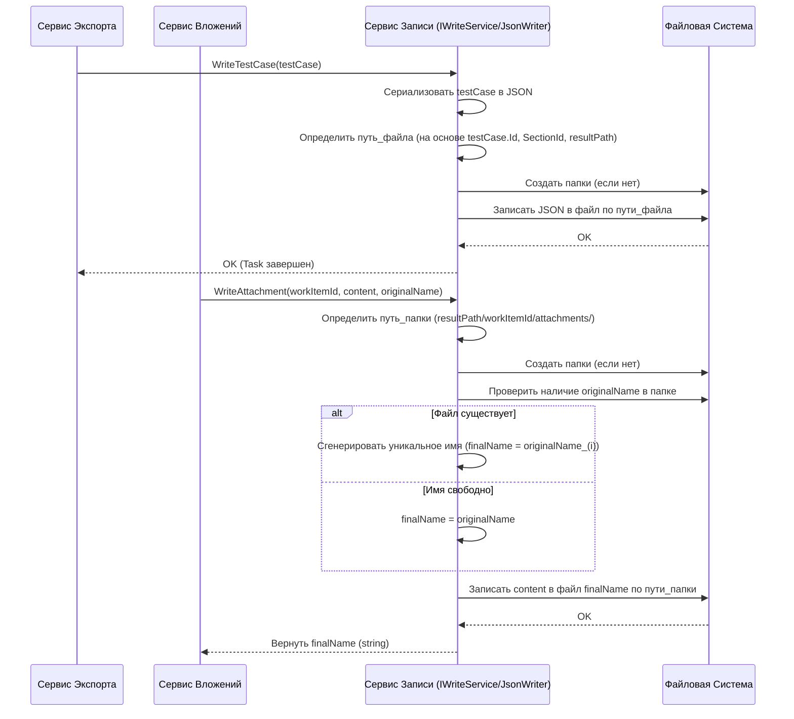

# Chapter 7: Сервис Записи Результатов


В [предыдущей главе](06_сервис_обработки_вложений_.md) мы узнали, как [Сервис Обработки Вложений](06_сервис_обработки_вложений_.md) скачивает файлы, прикрепленные к тест-кейсам. Но как этот сервис, да и все остальные части `QaseExporter`, на самом деле сохраняют результаты своей работы (JSON-файлы, скачанные вложения) на ваш компьютер? Этим занимается **Сервис Записи Результатов (`IWriteService`)**.

Представьте, что весь процесс экспорта – это большая сортировка и подготовка документов. Данные из Qase получены, преобразованы, тест-кейсы обрели нужный формат, атрибуты подготовлены, вложения скачаны. Теперь нужен кто-то, кто аккуратно разложит все эти готовые документы по папкам на вашем диске. Этот "кто-то" – наш Сервис Записи Результатов. Он как ответственный секретарь или архивариус: получает готовые данные и точно знает, куда и как их положить.

## Зачем нужен этот сервис?

После того как [Сервис Экспорта](01_сервис_экспорта_.md) и его помощники ([Сервис Обработки Тест-кейсов](04_сервис_обработки_тест_кейсов_.md), [Сервис Обработки Вложений](06_сервис_обработки_вложений_.md) и др.) подготовили данные, их нужно сохранить. Просто хранить их в памяти программы недостаточно – цель `QaseExporter` именно в создании локальных файлов.

**Проблема:** Работа с файловой системой может быть нетривиальной:
*   Нужно знать, в какую папку сохранять (она указана в `qase.config.json` как `resultPath`).
*   Нужно правильно создавать подпапки для тест-кейсов и общих шагов.
*   Нужно создавать отдельные подпапки `attachments` для вложений каждого элемента.
*   Нужно преобразовывать объекты C# (такие как `TestCase`, `SharedStep`, `Root`) в текстовый формат JSON перед записью.
*   Нужно аккуратно записывать файлы, обрабатывать возможные ошибки доступа, следить за уникальностью имен вложений.

**Решение:** Сервис Записи Результатов (`IWriteService`) инкапсулирует (скрывает) всю эту сложность. Он предоставляет простые методы, которым другие сервисы передают готовые объекты или данные, а сервис записи сам заботится обо всех деталях сохранения.

## Как он используется?

Сервис Записи Результатов — это «рабочая лошадка», которой пользуются другие компоненты, чтобы выполнить финальный шаг – запись данных на диск.

*   **[Сервис Экспорта](01_сервис_экспорта_.md)** использует его для записи каждого `TestCase`, каждого `SharedStep` и финального файла `index.json` (или `main.json`).
*   **[Сервис Обработки Вложений](06_сервис_обработки_вложений_.md)** использует его для сохранения скачанных файлов вложений.

В коде `ExportService` это выглядит так:

```csharp
// Файл: Services/ExportService.cs (Фрагмент)
using JsonWriter; // Нужен для IWriteService
// ...

public class ExportService : IExportService
{
    // ... другие сервисы ...
    private readonly IWriteService _writeService; // <-- Наш сервис записи!

    public ExportService(..., IWriteService writeService, ...)
    {
        // ...
        _writeService = writeService; // Получаем его через DI
        // ...
    }

    public async Task ExportProject()
    {
        // ... получаем и обрабатываем testCases, sharedSteps, mainJson ...

        // Записываем каждый Тест-кейс
        foreach (var testCase in testCases)
        {
            await _writeService.WriteTestCase(testCase); // <-- Использование сервиса записи
        }

        // Записываем каждый Общий шаг
        foreach (var sharedStep in sharedSteps)
        {
            await _writeService.WriteSharedStep(sharedStep.Value); // <-- Использование сервиса записи
        }

        // ... формируем mainJson ...

        // Записываем главный файл index.json (или main.json)
        await _writeService.WriteMainJson(mainJson); // <-- Использование сервиса записи

        _logger.LogInformation("Завершаем экспорт");
    }
}
```

Аналогично, в `AttachmentService`:

```csharp
// Файл: Services/AttachmentService.cs (Фрагмент)
using JsonWriter; // Нужен для IWriteService
// ...

public class AttachmentService : IAttachmentService
{
    // ...
    private readonly IWriteService _writeService; // <-- Наш сервис записи!

    public AttachmentService(..., IWriteService writeService)
    {
        // ...
        _writeService = writeService; // Получаем его через DI
        // ...
    }

     public async Task<List<string>> DownloadAttachments(List<QaseAttachment> qaseAttachments, Guid workItemId)
    {
        // ...
        foreach (var qaseAttachment in qaseAttachments)
        {
            // ... скачиваем content ...
            try
            {
                var content = await _client.DownloadAttachment(qaseAttachment.Url);

                // Сохраняем вложение и получаем его финальное имя
                var name = await _writeService.WriteAttachment(workItemId, content, qaseAttachment.Name); // <-- Использование!

                names.Add(name);
            }
            // ... обработка ошибок ...
        }
        // ...
        return names;
    }
}

```

Как видите, другие сервисы просто вызывают нужный метод `IWriteService`, передавая ему данные. Вся остальная работа по сохранению происходит внутри.

## "Контракт" на запись: Интерфейс `IWriteService`

Сердцем является интерфейс `IWriteService`. Он определяет, какие операции записи доступны. Важно отметить, что **реализация этого интерфейса (`WriteService`) находится во внешней библиотеке `JsonWriter`**. `QaseExporter` использует эту библиотеку как готовый инструмент для записи файлов.

```csharp
// Пример интерфейса IWriteService (из библиотеки JsonWriter, может немного отличаться)
using Models; // Содержит определения TestCase, SharedStep, Root

namespace JsonWriter;

public interface IWriteService
{
    // Записать объект TestCase в JSON-файл
    // (сам решит, в какую подпапку положить, на основе testCase.SectionId)
    Task WriteTestCase(TestCase testCase);

    // Записать объект SharedStep в JSON-файл
    // (создаст папку shared_steps, если нет)
    Task WriteSharedStep(SharedStep sharedStep);

    // Записать главный объект Root в файл index.json
    Task WriteMainJson(Root root);

    // Записать содержимое файла (вложение)
    // workItemId - ID тест-кейса или шага, к которому относится файл
    // content - содержимое файла (массив байт)
    // originalName - имя файла из Qase
    // Возвращает реальное имя, под которым файл был сохранен (может отличаться от originalName)
    Task<string> WriteAttachment(Guid workItemId, byte[] content, string originalName);
}
```

Этот интерфейс — "меню" услуг, которые предоставляет сервис записи. Любой класс, реализующий `IWriteService` (в данном случае `WriteService` из `JsonWriter`), обязуется выполнить эти операции.

## Как работает "Секретарь"? Под капотом

Давайте посмотрим, что происходит, когда вызывается один из методов `IWriteService`. Помните, что конкретная реализация находится в `JsonWriter`.

**Шаг за шагом (Пример: `WriteTestCase(testCase)`):**

1.  **Получение объекта:** Метод `WriteTestCase` получает объект `testCase`.
2.  **Определение пути:** Сервис (используя `resultPath` из конфигурации и `testCase.SectionId`) определяет полный путь к файлу. Это может быть что-то вроде `C:/qase_export/папка_секции_Х/{testCase.Id}.json`. (Логика определения пути на основе `SectionId` реализована внутри `JsonWriter`).
3.  **Создание папок:** Сервис проверяет, существует ли нужная папка (`C:/qase_export/папка_секции_Х/`). Если нет, он ее создает.
4.  **Сериализация в JSON:** Сервис преобразует объект `testCase` (который находится в памяти) в строку текста в формате JSON. Это похоже на перевод структурированных данных в универсальный текстовый язык.
    ```json
    // Примерный JSON для TestCase
    {
      "Id": "a1b2c3d4-...",
      "Name": "Проверить вход пользователя",
      "SectionId": "e5f6a7b8-...",
      "Steps": [ /* ... шаги ... */ ],
      "Attributes": [ /* ... атрибуты ... */ ],
      // ... другие поля ...
    }
    ```
5.  **Запись файла:** Сервис записывает полученную JSON-строку в файл по вычисленному пути (`{testCase.Id}.json`).
6.  **Завершение:** Операция завершена.

**Шаг за шагом (Пример: `WriteAttachment(workItemId, content, originalName)`):**

1.  **Получение данных:** Метод получает `workItemId`, `content` (байты файла) и `originalName`.
2.  **Определение пути:** Сервис формирует путь к папке вложений: `resultPath / {workItemId} / attachments /`. Например: `C:/qase_export/{workItemId}/attachments/`.
3.  **Создание папок:** Сервис создает папки `{workItemId}` и `attachments` внутри нее, если они не существуют.
4.  **Определение имени файла:** Сервис берет `originalName`. Он проверяет, существует ли уже файл с таким именем в папке `attachments`.
    *   Если имя свободно, оно используется как есть.
    *   Если файл с таким именем уже есть, сервис добавляет к имени суффикс, например, `_(1)`, `_(2)`, и т.д. (`image.png` -> `image_(1).png`), пока не найдет уникальное имя. Пусть это будет `finalName`.
5.  **Запись файла:** Сервис записывает `content` (массив байт) в файл по пути `resultPath / {workItemId} / attachments / finalName`.
6.  **Возврат имени:** Сервис возвращает `finalName` (имя, под которым файл был фактически сохранен) вызывающей стороне ([Сервису Обработки Вложений](06_сервис_обработки_вложений_.md)).

**Визуализация процесса:**



Эта диаграмма показывает, как сервис записи взаимодействует с файловой системой для сохранения JSON и вложений.

## Заглянем в код (Концептуально)

Поскольку реализация находится в библиотеке `JsonWriter`, мы не будем приводить ее точный код, но покажем, как *примерно* могли бы выглядеть ключевые операции.

**Зависимость от конфигурации:**
Сервис `WriteService` (реализация `IWriteService`) при своем создании (через DI) получает доступ к `IConfiguration` (настроенному в [Главе 2](02_точка_входа_и_настройка_приложения_.md)), чтобы прочитать значение `resultPath` из `qase.config.json`.

```csharp
// Внутри WriteService (упрощенно, концептуально)
public class WriteService : IWriteService
{
    private readonly string _resultPath;
    private readonly JsonSerializerOptions _options; // Настройки для сериализации JSON

    public WriteService(IConfiguration configuration)
    {
        _resultPath = configuration["resultPath"] ?? throw new Exception("resultPath не найден в конфигурации!");
        // Настройка опций JSON для красивого вывода
        _options = new JsonSerializerOptions { WriteIndented = true };
        // ... возможно, другие инициализации ...
    }
    // ... методы интерфейса ...
}
```

**Примерная реализация `WriteTestCase`:**

```csharp
// Внутри WriteService (упрощенно, концептуально)
public async Task WriteTestCase(TestCase testCase)
{
    // 1. Определить путь к файлу (реальная логика сложнее)
    string directoryPath = Path.Combine(_resultPath, /*... путь на основе testCase.SectionId ...*/);
    string filePath = Path.Combine(directoryPath, $"{testCase.Id}.json");

    // 2. Создать папку, если ее нет
    Directory.CreateDirectory(directoryPath);

    // 3. Сериализовать объект в JSON
    string jsonContent = JsonSerializer.Serialize(testCase, _options);

    // 4. Асинхронно записать JSON в файл
    await File.WriteAllTextAsync(filePath, jsonContent, Encoding.UTF8);
}
```
Здесь используются стандартные классы .NET для работы с путями (`Path`), директориями (`Directory`), сериализацией (`JsonSerializer`) и асинхронной записью файла (`File.WriteAllTextAsync`).

**Примерная реализация `WriteAttachment`:**

```csharp
// Внутри WriteService (упрощенно, концептуально)
public async Task<string> WriteAttachment(Guid workItemId, byte[] content, string originalName)
{
    // 1. Определить путь к папке вложений
    string attachmentsPath = Path.Combine(_resultPath, workItemId.ToString(), "attachments");

    // 2. Создать папки, если их нет
    Directory.CreateDirectory(attachmentsPath);

    // 3. Определить финальное имя файла (проверка на уникальность)
    string finalName = originalName;
    string filePath = Path.Combine(attachmentsPath, finalName);
    int counter = 1;
    while (File.Exists(filePath))
    {
        string nameWithoutExt = Path.GetFileNameWithoutExtension(originalName);
        string extension = Path.GetExtension(originalName);
        finalName = $"{nameWithoutExt}_({counter}){extension}";
        filePath = Path.Combine(attachmentsPath, finalName);
        counter++;
    }

    // 4. Асинхронно записать байты файла
    await File.WriteAllBytesAsync(filePath, content);

    // 5. Вернуть финальное имя файла
    return finalName;
}
```
Этот пример показывает создание подпапок, логику проверки уникальности имени и асинхронную запись бинарных данных (`File.WriteAllBytesAsync`).

## Заключение

Сервис Записи Результатов (`IWriteService`, реализованный в библиотеке `JsonWriter`) – это незаменимый компонент `QaseExporter`, который выполняет финальную и очень важную задачу: сохранение всех обработанных данных на ваш локальный диск.

Он действует как надежный «секретарь», который:

*   Знает, куда сохранять результаты (читает `resultPath` из конфигурации).
*   Скрывает сложности работы с файловой системой (создание папок, проверка имен).
*   Преобразует объекты C# (`TestCase`, `SharedStep`, `Root`) в формат JSON перед записью.
*   Сохраняет как JSON-файлы, так и бинарные вложения (`byte[]`).
*   Предоставляет простой интерфейс (`WriteTestCase`, `WriteAttachment` и др.) для других сервисов.

Благодаря ему, [Сервис Экспорта](01_сервис_экспорта_.md), [Сервис Обработки Вложений](06_сервис_обработки_вложений_.md) и другие компоненты могут не беспокоиться о деталях сохранения файлов, а просто передать готовые данные сервису записи.

В следующей, заключительной главе, мы рассмотрим некоторые [Вспомогательные Утилиты (Работа с текстом)](08_вспомогательные_утилиты__работа_с_текстом__.md), которые используются в разных частях приложения для небольших, но полезных операций, например, для очистки текста перед сохранением.

---

Generated by [AI Codebase Knowledge Builder](https://github.com/The-Pocket/Tutorial-Codebase-Knowledge)