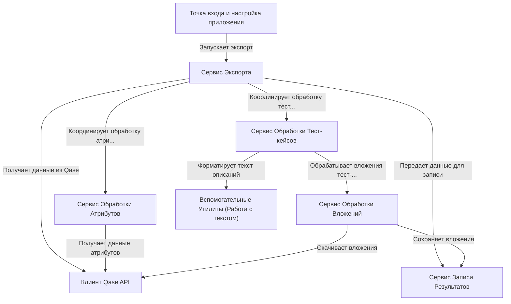

# Tutorial: QaseExporter

Проект **Qase Exporter** предназначен для *экспорта* данных о тест-кейсах из системы управления тестированием **Qase**.
Он читает настройки подключения из файла `qase.config.json`, затем использует **API Qase** для получения информации о проекте, тест-кейсах, шагах, атрибутах и вложениях.
Полученные данные *преобразуются* в промежуточный JSON-формат и сохраняются в указанную папку (`resultPath`), подготавливая их для импорта в другую систему (например, Test IT).

**Source Repository:** [None](None)

## Chapters

1. [Сервис Экспорта
](01_сервис_экспорта_.md)
2. [Точка входа и настройка приложения
](02_точка_входа_и_настройка_приложения_.md)
3. [Клиент Qase API
](03_клиент_qase_api_.md)
4. [Сервис Обработки Тест-кейсов
](04_сервис_обработки_тест_кейсов_.md)
5. [Сервис Обработки Атрибутов
](05_сервис_обработки_атрибутов_.md)
6. [Сервис Обработки Вложений
](06_сервис_обработки_вложений_.md)
7. [Сервис Записи Результатов
](07_сервис_записи_результатов_.md)
8. [Вспомогательные Утилиты (Работа с текстом)
](08_вспомогательные_утилиты__работа_с_текстом__.md)

---

Generated by [AI Codebase Knowledge Builder](https://github.com/The-Pocket/Tutorial-Codebase-Knowledge)