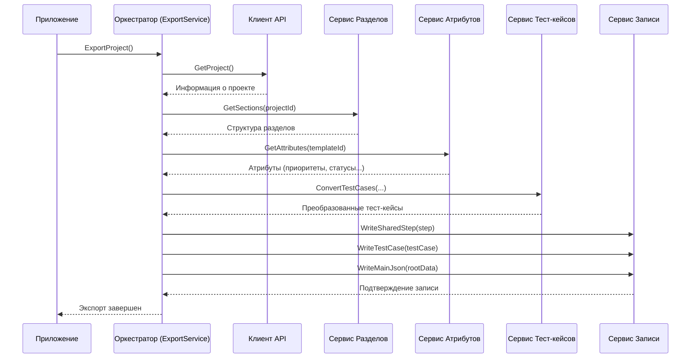

# Chapter 1: Оркестратор Экспорта


Добро пожаловать в руководство по `SpiraTestExporter`! В этой первой главе мы познакомимся с сердцем всего процесса экспорта — **Оркестратором Экспорта**.

Представьте, что вам нужно перенести все ваши тест-кейсы из системы SpiraTest в другой формат, например, для резервного копирования или миграции. Этот процесс включает в себя несколько этапов: нужно получить информацию о проекте, узнать структуру папок, загрузить списки статусов и приоритетов, преобразовать сами тест-кейсы и их шаги, а затем сохранить все это в файлы. Делать все это вручную или координировать разные скрипты для каждого шага было бы сложно и неудобно.

Именно здесь на помощь приходит **Оркестратор Экспорта**. Его главная задача — управлять всем процессом экспорта от начала до конца, гарантируя, что все шаги выполняются в правильном порядке и с нужными данными.

Думайте об Оркестраторе как о **дирижере оркестра**. У нас есть разные "музыканты" — специализированные сервисы, каждый из которых отвечает за свою часть работы:
*   Один сервис общается со SpiraTest ([Клиент SpiraTest API](02_клиент_spiratest_api_.md)).
*   Другой разбирается в структуре папок ([Сервис Работы с Разделами](03_сервис_работы_с_разделами_.md)).
*   Третий знает все об атрибутах вроде приоритетов и статусов ([Сервис Работы с Атрибутами](04_сервис_работы_с_атрибутами_.md)).
*   Четвертый преобразует тест-кейсы в нужный нам формат ([Сервис Конвертации Тест-кейсов](05_сервис_конвертации_тест_кейсов_.md)).
*   И так далее...

**Оркестратор (дирижер)** знает, в какой момент какому сервису (музыканту) нужно "вступить" и что именно сделать, чтобы в результате получился полный и корректный экспорт данных (законченное музыкальное произведение).

## Как это работает?

С точки зрения пользователя, все очень просто. Весь сложный процесс экспорта запускается одной командой. Оркестратор спрятан внутри основного приложения, но его работа видна по логам в консоли и по создаваемым файлам.

В коде за Оркестратора отвечает класс `ExportService`, который реализует интерфейс `IExportService`. Давайте посмотрим, как он запускается.

Главная точка входа приложения (`Program.cs`) создает и настраивает все необходимые сервисы, включая наш `ExportService`, и запускает основной класс приложения `App`.

```csharp
// Program.cs (Упрощенный фрагмент)
// Создаем и настраиваем хост приложения
using var host = CreateHostBuilder(args).Build();
using var scope = host.Services.CreateScope();

var services = scope.ServiceProvider;

try
{
    // Получаем главный класс приложения и запускаем его
    services.GetRequiredService<App>().Run(args);
}
catch (Exception e)
{
    Console.WriteLine(e.Message);
}
```
*   Этот код отвечает за "сборку" нашего приложения. Он создает все нужные компоненты (сервисы) и передает управление классу `App`. `GetRequiredService<App>()` находит и предоставляет готовый к работе экземпляр `App`.

Класс `App`, в свою очередь, получает `ExportService` и вызывает его главный метод `ExportProject`.

```csharp
// App.cs
public class App
{
    private readonly ILogger<App> _logger;
    private readonly IExportService _exportService; // Наш Оркестратор

    // Сервис экспорта передается сюда автоматически при создании App
    public App(ILogger<App> logger,  IExportService exportService)
    {
        _logger = logger;
        _exportService = exportService;
    }

    public void Run(string[] args)
    {
        _logger.LogInformation("Starting application"); // Начинаем работу

        // Запускаем процесс экспорта через Оркестратор
        _exportService.ExportProject().Wait();

        _logger.LogInformation("Ending application"); // Завершаем работу
    }
}
```
*   Как видите, класс `App` не знает *как* именно происходит экспорт. Он просто просит `_exportService` (наш Оркестратор) начать работу, вызвав метод `ExportProject()`. Вся координация скрыта внутри `ExportService`.

Интерфейс `IExportService` очень прост:

```csharp
// Services/IExportService.cs
namespace SpiraTestExporter.Services;

// Описание контракта для Оркестратора
public interface IExportService
{
    // Единственный метод, запускающий весь процесс
    Task ExportProject();
}

```
*   Этот интерфейс определяет, что любой класс, который хочет быть Оркестратором Экспорта, должен уметь выполнять одну основную задачу — `ExportProject`.

## Заглянем под капот: Внутреннее устройство

Как же Оркестратор (`ExportService`) выполняет свою работу? Он делает это шаг за шагом, обращаясь к другим специализированным сервисам.

1.  **Получить информацию о проекте:** Сначала Оркестратор просит [Клиент SpiraTest API](02_клиент_spiratest_api_.md) предоставить базовую информацию о проекте (например, его ID, имя, ID шаблона).
2.  **Получить структуру разделов:** Затем он обращается к [Сервису Работы с Разделами](03_сервис_работы_с_разделами_.md), чтобы загрузить иерархию папок проекта.
3.  **Получить атрибуты:** Далее он запрашивает у [Сервиса Работы с Атрибутами](04_сервис_работы_с_атрибутами_.md) списки возможных приоритетов, статусов и других пользовательских полей.
4.  **Преобразовать тест-кейсы:** Используя всю собранную информацию, Оркестратор просит [Сервис Конвертации Тест-кейсов](05_сервис_конвертации_тест_кейсов_.md) получить и преобразовать все тест-кейсы из SpiraTest в нужный нам формат. На этом же этапе могут обрабатываться и вложения ([Сервис Обработки Вложений](06_сервис_обработки_вложений_.md)).
5.  **Сохранить результаты:** Наконец, Оркестратор передает преобразованные данные Сервису Записи (`WriteService`), который сохраняет их в файлы на диске.

Этот процесс можно изобразить с помощью диаграммы последовательности:



### Код Оркестратора (`ExportService`)

Давайте посмотрим на реализацию `ExportService`. Сначала его конструктор:

```csharp
// Services/ExportService.cs (Конструктор)
public class ExportService : IExportService
{
    // Поля для хранения ссылок на другие сервисы
    private readonly ILogger<ExportService> _logger;
    private readonly IClient _client;
    private readonly ISectionService _sectionService;
    private readonly IAttributeService _attributeService;
    private readonly ITestCaseService _testCaseService;
    private readonly IWriteService _writeService;

    // Конструктор, принимающий все необходимые сервисы
    public ExportService(ILogger<ExportService> logger, IClient client, ISectionService sectionService,
        IAttributeService attributeService, ITestCaseService testCaseService, IWriteService writeService)
    {
        // Сохраняем полученные сервисы для дальнейшего использования
        _logger = logger;
        _client = client;
        _sectionService = sectionService;
        _attributeService = attributeService;
        _testCaseService = testCaseService;
        _writeService = writeService;
    }

    // ... Метод ExportProject() ниже ...
}
```
*   Обратите внимание, что `ExportService` не создает эти сервисы сам. Они передаются ему извне (через конструктор). Этот механизм называется **Внедрение Зависимостей (Dependency Injection)** и помогает делать код более гибким и тестируемым. `ExportService` просто получает готовых "музыкантов" и использует их.

А вот и главный метод `ExportProject`, реализующий описанную выше логику:

```csharp
// Services/ExportService.cs (Метод ExportProject)
public async Task ExportProject()
{
    _logger.LogInformation("Exporting project"); // Лог: Начинаем экспорт

    // Шаг 1: Получаем информацию о проекте
    var project = await _client.GetProject();
    _logger.LogDebug($"Получен проект: {project.Name}"); // (Детальный лог)

    // Шаг 2: Получаем разделы (папки)
    var sectionData = await _sectionService.GetSections(project.Id);
    _logger.LogDebug("Получены разделы");

    // Шаг 3: Получаем атрибуты (статусы, приоритеты и т.д.)
    var attributeData = await _attributeService.GetAttributes(project.TemplateId);
    _logger.LogDebug("Получены атрибуты");

    // Шаг 4: Получаем и конвертируем тест-кейсы
    var testCaseData = await _testCaseService.ConvertTestCases(project.Id, sectionData.SectionMap,
        attributeData.PrioritiesMap, attributeData.StatusesMap, attributeData.AttributesMap);
    _logger.LogDebug($"Получено {testCaseData.TestCases.Count} тест-кейсов");

    // Шаг 5: Сохраняем результаты
    // Сначала сохраняем общие шаги (Shared Steps)
    foreach (var sharedStep in testCaseData.SharedSteps)
    {
        await _writeService.WriteSharedStep(sharedStep);
    }
    // Затем сохраняем тест-кейсы
    foreach (var testCase in testCaseData.TestCases)
    {
        await _writeService.WriteTestCase(testCase);
    }

    // Формируем корневой JSON-файл с общей информацией
    var root = new Root { /* ... данные ... */ };
    await _writeService.WriteMainJson(root);

    _logger.LogInformation("Export completed"); // Лог: Экспорт завершен
}
```
*   Этот метод четко следует шагам, которые мы описали. Он вызывает методы других сервисов (`_client`, `_sectionService`, `_attributeService`, `_testCaseService`, `_writeService`) в нужной последовательности, передавая им необходимые данные от предыдущих шагов. `async` и `await` используются для асинхронной работы, чтобы приложение не "зависало" во время ожидания ответа от SpiraTest или при записи файлов.

## Заключение

В этой главе мы познакомились с **Оркестратором Экспорта (`ExportService`)** — главным координатором процесса выгрузки данных из SpiraTest. Мы увидели, что он работает как дирижер, управляя специализированными сервисами для выполнения отдельных задач: получения информации о проекте, разделах, атрибутах, конвертации тест-кейсов и сохранения результатов. Оркестратор обеспечивает правильную последовательность этих действий, скрывая сложность от пользователя.

Теперь, когда мы понимаем, кто руководит процессом, давайте подробнее рассмотрим первого "музыканта" в нашем оркестре. В следующей главе мы погрузимся в работу [Клиента SpiraTest API](02_клиент_spiratest_api_.md), который отвечает за все взаимодействие с сервером SpiraTest.

---

Generated by [AI Codebase Knowledge Builder](https://github.com/The-Pocket/Tutorial-Codebase-Knowledge)