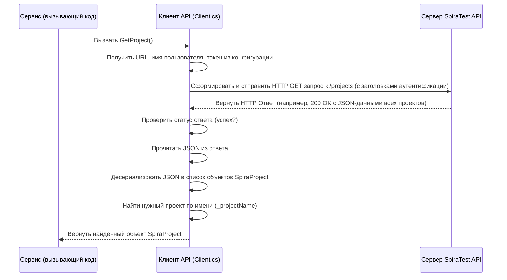

# Chapter 2: Клиент SpiraTest API


В [предыдущей главе](01_оркестратор_экспорта_.md) мы познакомились с [Оркестратором Экспорта](01_оркестратор_экспорта_.md) — дирижером нашего процесса. Мы узнали, что он координирует работу других специализированных компонентов (сервисов). Теперь пришло время познакомиться с первым и одним из самых важных "музыкантов" в этом оркестре — **Клиентом SpiraTest API**.

## Зачем нужен Клиент API?

Представьте, что наш Оркестратор решил начать экспорт. Первое, что ему нужно — это узнать базовую информацию о проекте в SpiraTest: как он называется, какой у него идентификатор (ID)? А затем ему понадобится список папок, список тест-кейсов в каждой папке, детали каждого тест-кейса (шаги, статус, приоритет) и даже вложения. Откуда взять всю эту информацию?

Именно для этого и существует **Клиент SpiraTest API**. Его единственная задача — **общаться с сервером SpiraTest**. Он знает, как правильно "попросить" SpiraTest предоставить нужные данные и как "прочитать" ответ сервера.

## Знакомьтесь, "Библиотекарь" SpiraTest

Можно сравнить Клиент SpiraTest API с **библиотекарем**.

*   **Библиотека (Сервер SpiraTest):** Хранит огромное количество информации (книг) — проекты, папки, тест-кейсы, статусы, приоритеты и т.д.
*   **Читатели (Другие сервисы, например, Оркестратор):** Им нужна конкретная информация (книги) для их работы.
*   **Библиотекарь (Клиент SpiraTest API):** Знает, как устроен каталог библиотеки (как устроен SpiraTest API), как найти нужную книгу (данные) по запросу читателя, и как выдать ее читателю в понятном виде.

+выдает+Книги+(Данные+Spira)+Читателю+(Сервису))

*Рисунок: Клиент API (библиотекарь) предоставляет данные из SpiraTest (библиотеки) другим частям программы.*

Таким образом, Клиент API **инкапсулирует** (прячет внутри себя) все сложности взаимодействия с сервером SpiraTest. Другим частям программы не нужно знать, какие именно адреса (URL) использовать, какие заголовки добавлять к запросам, или в каком формате SpiraTest возвращает данные. Они просто говорят "библиотекарю": "Дай мне, пожалуйста, информацию о проекте X", и получают результат.

## Как использовать Клиента API? Контракт `IClient`

Чтобы другие сервисы знали, какие запросы можно делать "библиотекарю", существует "список услуг" — интерфейс `IClient`. Этот интерфейс определяет все методы, которые Клиент API умеет выполнять.

Вот очень упрощенный пример того, как может выглядеть часть этого интерфейса:

```csharp
// Файл: Client/IClient.cs (Упрощено)
using SpiraTestExporter.Models; // Используем модели для описания данных SpiraTest

namespace SpiraTestExporter.Client;

// Интерфейс ("список услуг") для Клиента SpiraTest API
public interface IClient
{
    // Запрос: Получить информацию об основном проекте
    Task<SpiraProject> GetProject();

    // Запрос: Получить список папок для указанного проекта
    Task<List<SpiraFolder>> GetFolders(int projectId);

    // Запрос: Получить список тест-кейсов из конкретной папки
    Task<List<SpiraTest>> GetTestFromFolder(int projectId, int folderId);

    // Запрос: Получить детали конкретного тест-кейса по его ID
    Task<SpiraTest> GetTestById(int projectId, int id);

    // Запрос: Получить список шагов для тест-кейса
    Task<List<SpiraStep>> GetTestSteps(int projectId, int testCaseId);

    // Запрос: Получить список вложений для артефакта (например, тест-кейса)
    Task<List<SpiraAttachment>> GetAttachments(int projectId, int artifactTypeId, int artifactId);

    // Запрос: Скачать конкретное вложение по его ID
    Task<byte[]> DownloadAttachment(int projectId, int attachmentId);

    // ... и другие методы для получения приоритетов, статусов и т.д.
}
```

*   `Task<T>` означает, что метод асинхронный (он может занять какое-то время, например, на сетевой запрос) и вернет результат типа `T`, когда будет готов.
*   `SpiraProject`, `SpiraFolder`, `SpiraTest`, `SpiraStep`, `SpiraAttachment` — это так называемые **модели** (классы в C#), которые описывают структуру данных, получаемых от SpiraTest. Например, `SpiraProject` будет содержать поля `Id`, `Name`, `TemplateId` и т.д. (см. файлы в папке `Models`).
*   Методы принимают параметры, необходимые для запроса (например, `projectId`, `folderId`).

Другие сервисы, как наш [Оркестратор Экспорта](01_оркестратор_экспорта_.md), получают экземпляр класса, реализующего этот интерфейс (`IClient`), и вызывают его методы.

```csharp
// Пример использования Клиента внутри другого сервиса
public class ExampleService
{
    private readonly IClient _spiraClient; // "Наш библиотекарь"

    // Получаем клиента при создании сервиса
    public ExampleService(IClient client)
    {
        _spiraClient = client;
    }

    public async Task ProcessProject()
    {
        Console.WriteLine("Запрашиваем информацию о проекте...");
        // Просим "библиотекаря" найти информацию о проекте
        SpiraProject project = await _spiraClient.GetProject();
        Console.WriteLine($"Проект получен: ID={project.Id}, Имя='{project.Name}'");

        Console.WriteLine("Запрашиваем папки проекта...");
        // Просим найти папки в этом проекте
        List<SpiraFolder> folders = await _spiraClient.GetFolders(project.Id);
        Console.WriteLine($"Найдено папок: {folders.Count}");

        // Можно продолжить и запросить тест-кейсы из первой папки...
        if (folders.Count > 0)
        {
           Console.WriteLine($"Запрашиваем тесты из папки ID={folders[0].Id}...");
           List<SpiraTest> tests = await _spiraClient.GetTestFromFolder(project.Id, folders[0].Id);
           Console.WriteLine($"Найдено тестов: {tests.Count}");
        }
    }
}
```

*   Этот код показывает, как легко использовать Клиента: просто вызвать нужный метод (`GetProject`, `GetFolders`, `GetTestFromFolder`) и дождаться (`await`) результата. Вся сложность общения со SpiraTest скрыта внутри этих методов.

## Как это работает под капотом?

Когда какой-либо сервис вызывает метод Клиента (например, `GetProject()`), что происходит внутри?

1.  **Конфигурация:** Клиент берет необходимые данные для подключения из конфигурации приложения:
    *   URL сервера SpiraTest (`url`).
    *   Имя пользователя (`username`).
    *   API-ключ (токен) для аутентификации (`token`).
    *   Имя проекта, который нужно экспортировать (`projectName`).
2.  **Формирование Запроса:** Клиент формирует HTTP-запрос к SpiraTest API. Это включает:
    *   **Адрес (URL):** Определенный адрес на сервере SpiraTest для получения нужной информации (например, `/Services/v7_0/RestService.svc/projects` для списка проектов).
    *   **Метод:** Обычно `GET` для получения данных.
    *   **Заголовки:** Специальные метаданные, включая `username`, `api-key` для аутентификации и `Accept` для указания формата ответа.
3.  **Отправка Запроса:** Клиент отправляет этот запрос на сервер SpiraTest через сеть.
4.  **Ожидание Ответа:** Клиент ждет, пока сервер SpiraTest обработает запрос и пришлет ответ.
5.  **Обработка Ответа:**
    *   Клиент проверяет, был ли запрос успешным (например, код ответа HTTP 200 OK). Если нет — сообщает об ошибке.
    *   Если успешно, Клиент читает тело ответа. SpiraTest обычно возвращает данные в формате **JSON**.
    *   Клиент **десериализует** (преобразует) JSON-строку в объекты C# (те самые `SpiraProject`, `SpiraFolder` и т.д.).
6.  **Возврат Результата:** Клиент возвращает полученные и преобразованные данные вызвавшему его сервису.

Диаграмма последовательности для запроса `GetProject`:



### Заглянем в код (`Client.cs`)

Давайте посмотрим на несколько ключевых частей реального кода Клиента.

**1. Конструктор (`Client(...)`)**:

```csharp
// Файл: Client/Client.cs (Конструктор)
public class Client : IClient
{
    private readonly ILogger<Client> _logger; // Для записи логов
    private readonly HttpClient _httpClient; // Объект для отправки HTTP-запросов
    private readonly string _projectName; // Имя проекта для поиска

    // Конструктор получает логгер и конфигурацию
    public Client(ILogger<Client> logger, IConfiguration configuration)
    {
        _logger = logger;

        // Читаем настройки SpiraTest из конфигурации
        var section = configuration.GetSection("spiraTest");
        var url = section["url"]; // Адрес сервера SpiraTest
        var username = section["username"]; // Имя пользователя
        var token = section["token"]; // API-ключ
        var projectName = section["projectName"]; // Имя нужного проекта

        // Проверяем, что все настройки указаны (упрощено)
        if (string.IsNullOrEmpty(url) || /* ... другие проверки ... */ )
        {
            throw new ArgumentException("Не все настройки SpiraTest указаны!");
        }
        _projectName = projectName;

        // Создаем и настраиваем HttpClient один раз
        _httpClient = new HttpClient();
        _httpClient.BaseAddress = new Uri(url); // Базовый адрес API
        _httpClient.DefaultRequestHeaders.Add("Accept", "*/*"); // Хотим любой формат ответа
        _httpClient.DefaultRequestHeaders.Add("username", username); // Заголовок для логина
        _httpClient.DefaultRequestHeaders.Add("api-key", token);       // Заголовок для токена
    }

    // ... Методы для выполнения запросов ...
}
```

*   Этот код выполняется один раз при создании Клиента. Он читает настройки из файла конфигурации (например, `appsettings.json`) и настраивает `HttpClient` — основной инструмент для отправки запросов по сети. Заголовки (`username`, `api-key`), добавленные здесь, будут автоматически прикрепляться ко всем последующим запросам.

**2. Метод `GetProject()`**:

```csharp
// Файл: Client/Client.cs (Часть метода GetProject)
public async Task<SpiraProject> GetProject()
{
    _logger.LogInformation("Получение проекта {ProjectName}", _projectName);

    // Создаем запрос: GET на адрес для получения списка проектов
    var request = new HttpRequestMessage(HttpMethod.Get, "Services/v7_0/RestService.svc/projects");
    // Тело запроса пустое для GET
    request.Content = new StringContent(string.Empty, Encoding.UTF8, "application/json");

    // Отправляем запрос и ждем ответ
    var response = await _httpClient.SendAsync(request);

    // Проверяем, успешен ли ответ (например, код 200)
    if (!response.IsSuccessStatusCode)
    {
        _logger.LogError("Не удалось получить проект. Код: {StatusCode}", response.StatusCode);
        // В реальном коде здесь будет более детальная обработка ошибки
        throw new Exception($"Не удалось получить проект. Код: {response.StatusCode}");
    }

    // Читаем тело ответа (JSON) как строку
    var content = await response.Content.ReadAsStringAsync();
    // Преобразуем (десериализуем) JSON в список объектов SpiraProject
    var projects = JsonSerializer.Deserialize<List<SpiraProject>>(content);

    // Ищем наш проект в списке по имени (игнорируя регистр букв)
    var project = projects!.FirstOrDefault(p =>
        string.Equals(p.Name, _projectName, StringComparison.InvariantCultureIgnoreCase));

    if (project == null)
    {
        throw new Exception($"Проект {_projectName} не найден");
    }

    _logger.LogDebug("Проект найден: {@Project}", project); // Лог с деталями проекта
    return project; // Возвращаем найденный проект
}
```

*   Этот метод реализует шаги, описанные ранее: создает `HttpRequestMessage`, отправляет его с помощью `_httpClient`, проверяет `response.IsSuccessStatusCode`, читает `content` и использует `JsonSerializer.Deserialize` для преобразования JSON в C#-объекты. Затем он находит нужный проект по имени.

**3. Метод `GetFolders(int projectId)`**:

```csharp
// Файл: Client/Client.cs (Метод GetFolders)
public async Task<List<SpiraFolder>> GetFolders(int projectId)
{
    _logger.LogInformation("Получение папок для проекта {ProjectId}", projectId);

    // Создаем запрос: GET к адресу для получения папок ТЕСТ-КЕЙСОВ конкретного проекта
    // Обратите внимание на использование projectId в URL
    var requestUrl = $"Services/v7_0/RestService.svc/projects/{projectId}/test-folders";
    var request = new HttpRequestMessage(HttpMethod.Get, requestUrl);
    request.Content = new StringContent(string.Empty, Encoding.UTF8, "application/json");

    // Отправляем запрос и получаем ответ
    var response = await _httpClient.SendAsync(request);

    // Проверяем статус ответа (как в GetProject)
    if (!response.IsSuccessStatusCode)
    {
        _logger.LogError("Не удалось получить папки. Код: {StatusCode}", response.StatusCode);
        throw new Exception($"Не удалось получить папки. Код: {response.StatusCode}");
    }

    // Читаем и десериализуем JSON в список SpiraFolder
    var content = await response.Content.ReadAsStringAsync();
    var folders = JsonSerializer.Deserialize<List<SpiraFolder>>(content);

    _logger.LogDebug("Получено {Count} папок", folders?.Count);
    return folders!; // Возвращаем список папок
}
```

*   Этот метод очень похож на `GetProject`, но отличается URL запроса (`requestUrl`), который теперь включает `projectId`, и типом возвращаемых данных (`List<SpiraFolder>`). Это показывает общую структуру методов клиента: подготовить запрос -> отправить -> проверить ответ -> десериализовать -> вернуть.

Весь остальной код в `Client.cs` следует этому же паттерну для получения других типов данных (тест-кейсов, шагов, статусов, приоритетов, вложений и т.д.), используя разные URL в соответствии с документацией SpiraTest API.

## Заключение

В этой главе мы подробно рассмотрели **Клиент SpiraTest API (`Client`)**. Мы поняли, что это незаменимый компонент, который действует как "библиотекарь", обрабатывая все запросы к серверу SpiraTest и предоставляя полученные данные другим частям приложения в удобном формате. Он скрывает от остальной системы детали сетевого взаимодействия и специфику SpiraTest API. Мы увидели, как он определяется через интерфейс `IClient` и как реализованы его основные методы с использованием `HttpClient` для отправки запросов и `JsonSerializer` для обработки ответов.

Теперь, когда у нас есть "библиотекарь", способный получать необработанные данные из SpiraTest, нам нужен кто-то, кто сможет разобраться в этих данных. Например, как понять структуру папок проекта? Этим займется следующий компонент.

В следующей главе мы изучим [Сервис Работы с Разделами](03_сервис_работы_с_разделами_.md), который использует Клиент API для получения списка папок и строит из них иерархическое дерево.

---

Generated by [AI Codebase Knowledge Builder](https://github.com/The-Pocket/Tutorial-Codebase-Knowledge)