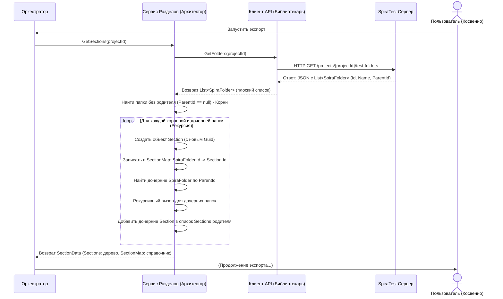

# Chapter 3: Сервис Работы с Разделами


В [предыдущей главе](02_клиент_spiratest_api_.md) мы познакомились с [Клиентом SpiraTest API](02_клиент_spiratest_api_.md) — нашим условным "библиотекарем", который умеет получать различную информацию напрямую из SpiraTest. Мы узнали, что он может принести нам список всех папок (или "разделов") из нашего проекта. Однако есть одна проблема: клиент API возвращает этот список "плоским", без явной структуры. Это как если бы вам дали список всех комнат в здании, но не сказали, какие комнаты на каком этаже и какая над какой.

Представьте, что вы смотрите на структуру ваших тест-кейсов в SpiraTest. Они аккуратно разложены по папкам, и эти папки могут быть вложены друг в друга, создавая понятную иерархию:

```
Проект "МойМагазин"
├── Функциональные Тесты
│   ├── Авторизация
│   │   ├── Вход пользователя
│   │   └── Регистрация
│   ├── Корзина
│   │   ├── Добавление товара
│   │   └── Оформление заказа
│   └── ...
└── Тесты Производительности
    └── ...
```

Когда [Клиент SpiraTest API](02_клиент_spiratest_api_.md) запрашивает папки (`test-folders`), он получает примерно такой список:

*   Папка: "Функциональные Тесты", ID: 10, Родитель: (нет)
*   Папка: "Авторизация", ID: 11, Родитель: 10
*   Папка: "Вход пользователя", ID: 12, Родитель: 11
*   Папка: "Регистрация", ID: 13, Родитель: 11
*   Папка: "Корзина", ID: 14, Родитель: 10
*   Папка: "Добавление товара", ID: 15, Родитель: 14
*   Папка: "Оформление заказа", ID: 16, Родитель: 14
*   Папка: "Тесты Производительности", ID: 20, Родитель: (нет)
*   ... и так далее.

Этот список содержит всю нужную информацию (ID папки, ее имя и ID родительской папки), но сама структура дерева потеряна. Для того чтобы наш экспорт был организован так же логично, как и в SpiraTest, нам нужен кто-то, кто сможет восстановить эту иерархию.

Именно для этого и предназначен **Сервис Работы с Разделами (`SectionService`)**.

## Знакомьтесь, "Архитектор" Структуры

Этот сервис работает как **архитектор**, который получает набор разрозненных чертежей комнат (плоский список папок от Клиента API) и по ним строит точную модель всего здания (иерархическую структуру разделов).

*   **Чертежи (Плоский список `SpiraFolder`):** Данные от Клиента API, где у каждой "комнаты" (папки) указан ее номер (ID) и номер "комнаты" на этаже ниже (ParentId).
*   **Архитектор (`SectionService`):** Изучает эти чертежи, находит "комнаты" первого этажа (папки без родителя), затем для каждой из них находит "комнаты" прямо над ними (дочерние папки), и так далее, пока вся структура "здания" не будет воссоздана.
*   **Модель Здания (Иерархия `Section`):** Результат работы — структурированное представление, где каждая "комната" (теперь называемая `Section`) знает, какие "комнаты" находятся внутри нее (дочерние `Section`).

Главная задача **Сервиса Работы с Разделами** — взять плоский список папок из SpiraTest и превратить его в древовидную структуру `Section`, которая будет использоваться для организации экспортированных тест-кейсов.

## Как это использовать? Контракт `ISectionService`

Чтобы другие части программы, такие как [Оркестратор Экспорта](01_оркестратор_экспорта_.md), могли попросить "архитектора" построить модель, существует интерфейс `ISectionService`. Он очень простой и содержит всего один метод:

```csharp
// Файл: Services/ISectionService.cs
using SpiraTestExporter.Models; // Используем модели для описания данных

namespace SpiraTestExporter.Services;

// Интерфейс ("задание") для Сервиса Работы с Разделами
public interface ISectionService
{
    // Метод, который получает ID проекта SpiraTest
    // и возвращает построенную структуру разделов
    Task<SectionData> GetSections(int projectId);
}

```

*   `Task<SectionData>`: Метод асинхронный (может занять время на обработку) и вернет объект `SectionData`, когда закончит.
*   `int projectId`: Входной параметр — ID проекта в SpiraTest, для которого нужно построить структуру папок.

### Что возвращает `GetSections`? Модель `SectionData`

Метод `GetSections` возвращает не просто список, а специальный объект `SectionData`, который содержит две важные вещи:

1.  `List<Section> Sections`: Список **корневых** разделов (тех, что находятся на самом верхнем уровне иерархии). Каждый объект `Section` внутри этого списка может содержать свои дочерние `Section`.
2.  `Dictionary<int, Guid> SectionMap`: Очень полезный "справочник" (словарь). Он позволяет быстро найти уникальный идентификатор (`Guid`) нашего созданного раздела `Section`, зная исходный ID папки (`int`) из SpiraTest. Это нужно для того, чтобы позже связать тест-кейсы с правильными разделами.

```csharp
// Файл: Models/SectionData.cs
using Models; // Предполагаем, что Section определен в Models

namespace SpiraTestExporter.Models;

// Контейнер для результата работы Сервиса Разделов
public class SectionData
{
    // 1. Список корневых разделов (каждый содержит своих детей)
    public List<Section> Sections { get; set; }
    // 2. Карта для связи ID папки Spira с ID нашего Section
    public Dictionary<int, Guid> SectionMap { get; set; }
}
```

А как выглядит сам `Section`? Это объект, представляющий одну папку из SpiraTest в нашей новой структуре:

```csharp
// Файл: Models/Section.cs (Упрощенная структура)
// Обратите внимание: В реальном коде этот класс находится в проекте Models
using System.Collections.Generic;
using System;

namespace Models // Предполагаемое пространство имен
{
    public class Section
    {
        // Уникальный ID, который мы генерируем сами
        public Guid Id { get; set; }
        // Имя раздела (берется из имени папки Spira)
        public string Name { get; set; }
        // Список дочерних разделов (если папка имела вложенные папки)
        public List<Section> Sections { get; set; }
        // Другие поля, которые могут понадобиться, например:
        // public List<Step> PreconditionSteps { get; set; }
        // public List<Step> PostconditionSteps { get; set; }
    }
}
```

*   `Guid Id`: Мы присваиваем каждому разделу новый, уникальный ID. Это помогает избежать путаницы, если в SpiraTest ID могли бы пересекаться для разных типов объектов.
*   `string Name`: Имя раздела, такое же, как у папки в SpiraTest.
*   `List<Section> Sections`: Самое важное — это список дочерних разделов. Если у папки не было вложенных папок, этот список будет пустым. Именно через это поле и строится дерево.

### Пример использования

[Оркестратор Экспорта](01_оркестратор_экспорта_.md) использует `SectionService` на одном из первых шагов, сразу после получения информации о проекте от [Клиента SpiraTest API](02_клиент_spiratest_api_.md):

```csharp
// Фрагмент из Services/ExportService.cs (Оркестратор)
public async Task ExportProject()
{
    _logger.LogInformation("Exporting project");

    // Шаг 1: Получаем информацию о проекте
    var project = await _client.GetProject();
    _logger.LogDebug($"Получен проект: {project.Name}");

    // Шаг 2: Обращаемся к Сервису Разделов для построения иерархии
    _logger.LogInformation("Построение структуры разделов...");
    // Вот здесь мы вызываем нашего "архитектора"
    SectionData sectionData = await _sectionService.GetSections(project.Id);
    _logger.LogDebug("Структура разделов построена.");

    // Теперь у нас есть:
    // - sectionData.Sections: Готовое дерево разделов
    // - sectionData.SectionMap: Карта для связи Spira ID папок с нашими ID

    // ... (дальнейшие шаги: получение атрибутов, тест-кейсов и т.д.)
    // Информация из sectionData будет передана другим сервисам, чтобы они
    // знали, в какой раздел поместить каждый тест-кейс.
}
```

## Как это работает под капотом?

Давайте снова представим нашего архитектора (`SectionService`) с пачкой чертежей (плоский список `SpiraFolder` от `Client`). Что он делает шаг за шагом?

1.  **Запрос Чертежей:** Сначала архитектор просит "библиотекаря" ([Клиент SpiraTest API](02_клиент_spiratest_api_.md)) принести все чертежи тестовых папок (`test-folders`) для указанного проекта.
2.  **Разбор Чертежей:** Библиотекарь приносит стопку листов (`List<SpiraFolder>`), где на каждом указан номер комнаты (`Id`), ее название (`Name`) и, возможно, номер комнаты этажом ниже (`ParentId`).
3.  **Поиск Первого Этажа:** Архитектор перебирает все чертежи и откладывает в сторону те, у которых не указан номер комнаты снизу (`ParentId == null`). Это будут комнаты ("корневые" разделы) на первом этаже нашего "здания".
4.  **Строительство Этажей (Рекурсия):**
    *   Для каждой найденной комнаты первого этажа архитектор создает объект "Секция" (`Section`), запоминает ее название и присваивает ей уникальный номер (`Guid`). Он также записывает в свой справочник (`SectionMap`), что "комната Spira с номером X теперь соответствует нашей Секции с номером Y".
    *   Затем он ищет во всей стопке чертежей те, у которых номер `ParentId` совпадает с номером текущей комнаты первого этажа. Это будут дочерние комнаты (папки) на втором этаже.
    *   Для каждой найденной дочерней комнаты он **повторяет тот же процесс**: создает `Section`, записывает в справочник `SectionMap` и ищет уже *ее* дочерние комнаты (третий этаж).
    *   Этот процесс повторяется ("рекурсивно"), пока для очередной комнаты не найдется ни одного "чертежа" с ее номером в `ParentId`.
5.  **Сборка Модели:** В результате архитектор получает готовые "секции" для первого этажа, каждая из которых содержит внутри себя "секции" второго этажа, те — третьего, и так далее.
6.  **Возврат Результата:** Архитектор упаковывает список секций первого этажа (корневых `Section`) и свой справочник (`SectionMap`) в контейнер `SectionData` и передает его тому, кто запрашивал (Оркестратору).

### Диаграмма процесса



### Заглянем в код (`SectionService.cs`)

Теперь посмотрим, как эта логика реализована в коде.

**1. Конструктор:**

```csharp
// Файл: Services/SectionService.cs (Начало)
using Microsoft.Extensions.Logging;
using Models; // Для Section
using SpiraTestExporter.Client; // Для IClient
using SpiraTestExporter.Models; // Для SpiraFolder, SectionData
using System; // Для Guid
using System.Collections.Generic; // Для List, Dictionary
using System.Linq; // Для Where, ToList
using System.Threading.Tasks; // Для Task

namespace SpiraTestExporter.Services;

public class SectionService : ISectionService
{
    private readonly ILogger<SectionService> _logger; // Для логов
    private readonly IClient _client; // Наш "библиотекарь" Spira API
    // Справочник для связи ID папок Spira и наших ID Section.
    // Он создается один раз для всего процесса GetSections.
    private Dictionary<int, Guid> _sectionMap;

    // Конструктор: получаем логгер и клиента API
    public SectionService(ILogger<SectionService> logger, IClient client)
    {
        _logger = logger;
        _client = client;
        // Инициализируем справочник здесь, он будет заполняться при вызове GetSections
        _sectionMap = new Dictionary<int, Guid>();
    }

    // ... (Методы GetSections и ConvertChildSection ниже) ...
}
```

*   Сервис получает `ILogger` для записи информации о своей работе и `IClient` для запроса данных у SpiraTest.
*   `_sectionMap` объявлен как поле класса, чтобы он был доступен и в главном методе `GetSections`, и во вспомогательном рекурсивном методе `ConvertChildSection`. Он будет создаваться заново при каждом вызове `GetSections`.

**2. Главный метод `GetSections`:**

```csharp
// Файл: Services/SectionService.cs (Метод GetSections)
public async Task<SectionData> GetSections(int projectId)
{
    _logger.LogInformation("Получение и построение разделов для проекта {ProjectId}", projectId);
    // Очищаем карту перед началом (на всякий случай, если сервис используется повторно)
    _sectionMap.Clear();

    var sections = new List<Section>(); // Список для корневых разделов

    // Шаг 1: Запрашиваем "чертежи" у клиента API
    var folders = await _client.GetFolders(projectId); // Получаем плоский список SpiraFolder
    _logger.LogDebug("Получено {Count} папок от SpiraTest", folders.Count);

    // Шаг 2: Ищем "первый этаж" - папки без родителя
    var rootFolders = folders.Where(f => f.ParentId == null);

    // Шаг 3: Строим структуру для каждого корневого раздела
    foreach (var folder in rootFolders)
    {
        var section = new Section // Создаем объект Section для корневой папки
        {
            Id = Guid.NewGuid(), // Генерируем уникальный ID
            Name = folder.Name   // Берем имя из папки Spira
        };
        // Важно: Записываем в справочник!
        _sectionMap.Add(folder.Id, section.Id);

        // Запускаем рекурсивное построение дочерних разделов
        section.Sections = ConvertChildSection(folder.Id, folders);

        sections.Add(section); // Добавляем готовый корневой раздел (с детьми) в итоговый список
    }

    _logger.LogInformation("Структура разделов построена. Корневых разделов: {Count}", sections.Count);
    // Шаг 4: Возвращаем результат
    return new SectionData
    {
        Sections = sections,
        SectionMap = _sectionMap // Возвращаем дерево и справочник
    };
}
```

*   Этот метод сначала запрашивает все папки (`await _client.GetFolders(projectId)`).
*   Затем он использует LINQ (`folders.Where(f => f.ParentId == null)`) для нахождения корневых папок.
*   В цикле `foreach` он создает `Section` для каждой корневой папки, добавляет ее в `_sectionMap` и вызывает `ConvertChildSection` для поиска и построения ее дочерних веток.
*   Наконец, он возвращает `SectionData`.

**3. Вспомогательный рекурсивный метод `ConvertChildSection`:**

```csharp
// Файл: Services/SectionService.cs (Метод ConvertChildSection)
// Этот метод вызывается для построения дочерних разделов (детей)
// parentId - ID родительской папки Spira, для которой ищем детей
// folders - Полный плоский список ВСЕХ папок проекта
private List<Section> ConvertChildSection(int parentId, List<SpiraFolder> folders)
{
    var childSections = new List<Section>(); // Список для дочерних разделов этого уровня

    // Ищем все папки в общем списке, у которых ParentId равен ID текущего родителя
    var childFolders = folders.Where(s => s.ParentId == parentId);

    // Для каждой найденной дочерней папки...
    foreach (var child in childFolders)
    {
        var section = new Section // Создаем Section для дочерней папки
        {
            Id = Guid.NewGuid(),
            Name = child.Name
            // PreconditionSteps = new List<Step>(), // Инициализация других полей
            // PostconditionSteps = new List<Step>()
        };
        // Записываем в справочник ЭТУ дочернюю папку
        _sectionMap.Add(child.Id, section.Id);

        // Рекурсивный вызов: Ищем детей для ЭТОЙ дочерней папки
        section.Sections = ConvertChildSection(child.Id, folders);

        childSections.Add(section); // Добавляем созданный дочерний раздел в список
    }

    // Возвращаем список всех найденных (и построенных) дочерних разделов для parentId
    return childSections;
}
```

*   Этот метод принимает ID родителя (`parentId`) и полный список папок (`folders`).
*   Он находит все папки, у которых `ParentId` совпадает с переданным (`folders.Where(s => s.ParentId == parentId)`).
*   Для каждой найденной дочерней папки он создает `Section`, добавляет ее в `_sectionMap` и **снова вызывает сам себя** (`ConvertChildSection(child.Id, folders)`), чтобы найти и построить уже *ее* детей.
*   Когда для какого-то `parentId` не находится ни одного дочернего элемента (`childFolders` будет пустым), метод просто вернет пустой `List<Section>`, и рекурсия для этой ветки завершится.

Именно этот рекурсивный вызов позволяет "спуститься" по всем уровням вложенности и построить полное дерево разделов.

## Заключение

В этой главе мы разобрались с **Сервисом Работы с Разделами (`SectionService`)**. Мы поняли, зачем он нужен: он берет неупорядоченный, "плоский" список папок, который предоставляет [Клиент SpiraTest API](02_клиент_spiratest_api_.md), и, подобно архитектору, восстанавливает из него иерархическую структуру — дерево разделов (`Section`), которое точно отражает организацию папок в SpiraTest. Мы также узнали, что он создает полезную карту (`SectionMap`) для связи старых и новых идентификаторов. Эта структура и карта необходимы для правильной организации экспортированных тест-кейсов.

Мы увидели, как [Оркестратор Экспорта](01_оркестратор_экспорта_.md) использует этот сервис, и заглянули внутрь его реализации, поняв основной принцип работы, включая рекурсивное построение дочерних веток.

Теперь, когда у нас есть структура проекта (разделы), нам нужно получить информацию о различных "атрибутах", которые используются в SpiraTest — таких как статусы тест-кейсов ("Пройден", "Провален", "Не запускался"), их приоритеты ("Высокий", "Средний", "Низкий") и другие пользовательские поля. Этим займется наш следующий "специалист".

В следующей главе мы изучим [Сервис Работы с Атрибутами](04_сервис_работы_с_атрибутами_.md).

---

Generated by [AI Codebase Knowledge Builder](https://github.com/The-Pocket/Tutorial-Codebase-Knowledge)