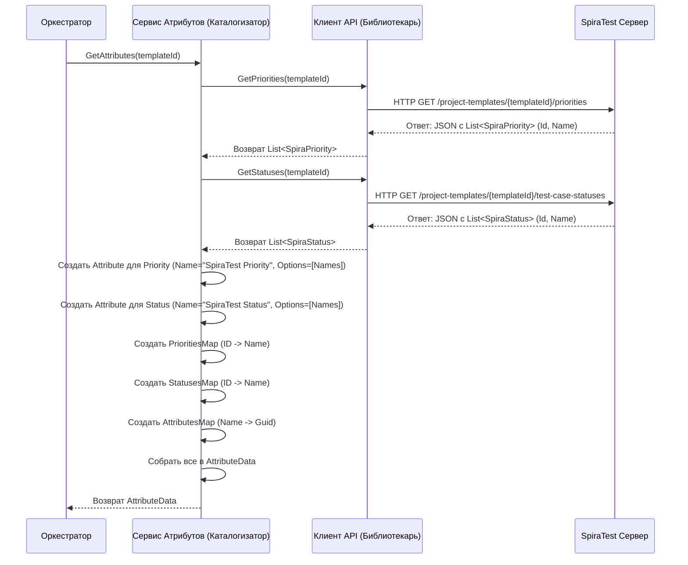

# Chapter 4: Сервис Работы с Атрибутами


В [предыдущей главе](03_сервис_работы_с_разделами_.md) мы научились восстанавливать структуру папок (разделов) нашего проекта из SpiraTest с помощью [Сервиса Работы с Разделами](03_сервис_работы_с_разделами_.md). Теперь у нас есть "скелет" нашего экспорта. Но чего не хватает? Не хватает деталей, которые описывают сами тест-кейсы, например, их важность (приоритет) или текущее состояние (статус).

Представьте, что вы переносите картотеку книг. Вы уже расставили шкафы и полки (разделы), но теперь вам нужно понять, какие метки использовать для каждой книги: "Жанр", "Состояние", "Год издания". Причем для каждой метки есть свои возможные значения ("Фантастика", "Детектив"; "Новая", "Потрепанная"; "1999", "2023"). Без этой информации ваша картотека будет неполной.

В SpiraTest тест-кейсы тоже имеют такие "метки" — их называют **пользовательские атрибуты**. Самые распространенные — это "Приоритет" (например, 'Высокий', 'Средний', 'Низкий') и "Статус" ('Пройден', 'Провален', 'В разработке'). Проблема в том, что эти списки значений могут настраиваться для каждого проекта в SpiraTest! Нам нужно узнать, какие именно значения используются в *нашем* проекте, чтобы правильно отобразить их при экспорте.

Именно эту задачу решает **Сервис Работы с Атрибутами (`AttributeService`)**.

## Знакомьтесь, "Каталогизатор" SpiraTest

Этот сервис действует как **каталогизатор** или **специалист по стандартам**. Его работа — выяснить, какие стандартные "метки" (атрибуты) и какие возможные "значения" (опции) для этих меток существуют в нашем проекте SpiraTest.

*   **Библиотека (SpiraTest):** Содержит информацию не только о книгах (тест-кейсах), но и о стандартных способах их классификации (атрибутах вроде "Приоритет", "Статус") и допустимых значениях для каждого атрибута.
*   **Каталогизатор (`AttributeService`):** Обращается к "библиотеке" (SpiraTest) и запрашивает: "Какие приоритеты у вас используются? А какие статусы?".
*   **Каталог (Результат работы сервиса):** Получив ответы, каталогизатор формирует четкие списки:
    *   Список самих атрибутов, которые мы хотим перенести (например, "Приоритет SpiraTest", "Статус SpiraTest").
    *   Для каждого атрибута — список его возможных значений (например, ["Высокий", "Средний", "Низкий"] для приоритета).
    *   Удобные "словари" для перевода: как называется приоритет с ID=1 в SpiraTest? Как называется статус с ID=3?

Главная цель **Сервиса Работы с Атрибутами** — получить из SpiraTest актуальные списки возможных значений для ключевых полей и подготовить их в формате, удобном для дальнейшей обработки и экспорта тест-кейсов.

## Как это использовать? Контракт `IAttributeService`

Чтобы другие компоненты ([Оркестратор Экспорта](01_оркестратор_экспорта_.md) или [Сервис Конвертации Тест-кейсов](05_сервис_конвертации_тест_кейсов_.md)) могли запросить эту информацию у "каталогизатора", существует интерфейс `IAttributeService`. Он очень прост:

```csharp
// Файл: Services/IAttributeService.cs
using SpiraTestExporter.Models; // Используем модели для описания данных

namespace SpiraTestExporter.Services;

// Интерфейс ("запрос") для Сервиса Работы с Атрибутами
public interface IAttributeService
{
    // Метод получает ID ТИПОВОГО ПРОЕКТА (шаблона) SpiraTest
    // и возвращает подготовленные данные об атрибутах
    Task<AttributeData> GetAttributes(int projectTemplateId);
}
```

*   `Task<AttributeData>`: Метод асинхронный (общение со SpiraTest занимает время) и вернет объект `AttributeData`, когда закончит.
*   `int projectTemplateId`: Входной параметр. В SpiraTest списки атрибутов (как приоритеты и статусы) часто привязаны не к самому проекту, а к его **шаблону** (Template). Клиент API уже знает, как получить ID шаблона для нашего проекта.

### Что возвращает `GetAttributes`? Модель `AttributeData`

Метод `GetAttributes` возвращает специальный контейнер `AttributeData`, который содержит всю собранную информацию:

```csharp
// Файл: Models/AttributeData.cs (Структура класса)
using Attribute = Models.Attribute; // Используем класс Attribute из проекта Models

namespace SpiraTestExporter.Models;

public class AttributeData
{
    // 1. Список атрибутов в формате нашей целевой системы
    public List<Attribute> Attributes { get; set; }
    // 2. Карта: Название атрибута (наше) -> его уникальный ID (наш)
    public Dictionary<string, Guid> AttributesMap { get; set; }
    // 3. Карта: ID Приоритета Spira -> Название Приоритета
    public Dictionary<int, string> PrioritiesMap { get; set; }
    // 4. Карта: ID Статуса Spira -> Название Статуса
    public Dictionary<int, string> StatusesMap { get; set; }
}
```

Давайте разберем каждую часть:

1.  `List<Attribute> Attributes`: Это список объектов, описывающих атрибуты так, как они будут представлены в *результате* экспорта. Например, здесь будет объект для "Приоритет SpiraTest" и объект для "Статус SpiraTest". Каждый такой объект `Attribute` содержит:
    *   `Id`: Уникальный `Guid`, который мы сами генерируем для этого атрибута.
    *   `Name`: Имя атрибута (например, "SpiraTest Priority").
    *   `Options`: Список строк с возможными *текстовыми* значениями (именно это мы и запрашивали у SpiraTest!), например `["Высокий", "Средний", "Низкий"]`.
2.  `Dictionary<string, Guid> AttributesMap`: Карта для быстрого поиска нашего `Guid` по нашему же имени атрибута. Например, `AttributesMap["SpiraTest Priority"]` вернет `Guid` для атрибута приоритета.
3.  `Dictionary<int, string> PrioritiesMap`: Очень важный "словарь перевода" для приоритетов. Он связывает *числовой ID* приоритета из SpiraTest с его *текстовым названием*. Например, если в SpiraTest приоритет 'Высокий' имеет ID=1, в словаре будет запись `{ 1, "Высокий" }`. Это понадобится, когда мы будем обрабатывать тест-кейсы: у тест-кейса будет указан `PriorityId = 1`, и с помощью этой карты мы сможем понять, что это значит "Высокий".
4.  `Dictionary<int, string> StatusesMap`: То же самое, но для статусов тест-кейсов. Связывает ID статуса из SpiraTest с его названием. Например, `{ 2, "Пройден" }`.

### Пример использования

[Оркестратор Экспорта](01_оркестратор_экспорта_.md) использует `AttributeService` после получения информации о проекте и его разделах:

```csharp
// Фрагмент из Services/ExportService.cs (Оркестратор)
public async Task ExportProject()
{
    // ... (Шаг 1: Получаем проект -> project) ...
    var project = await _client.GetProject();

    // ... (Шаг 2: Получаем разделы -> sectionData) ...
    var sectionData = await _sectionService.GetSections(project.Id);

    // Шаг 3: Обращаемся к Сервису Атрибутов
    _logger.LogInformation("Запрос атрибутов проекта (приоритеты, статусы)...");
    // Вызываем нашего "каталогизатора", передавая ID ШАБЛОНА проекта
    AttributeData attributeData = await _attributeService.GetAttributes(project.TemplateId);
    _logger.LogDebug("Атрибуты получены.");

    // Теперь у нас есть:
    // - attributeData.Attributes: Список атрибутов для целевой системы.
    // - attributeData.PrioritiesMap: Карта для перевода ID приоритета Spira в имя.
    // - attributeData.StatusesMap: Карта для перевода ID статуса Spira в имя.
    // - attributeData.AttributesMap: Карта имен атрибутов в их Guid.

    // ... (Шаг 4: Конвертация тест-кейсов)
    // Эти карты (PrioritiesMap, StatusesMap) будут переданы в
    // Сервис Конвертации Тест-кейсов, чтобы он мог правильно
    // преобразовать ID приоритетов и статусов в их названия.
    var testCaseData = await _testCaseService.ConvertTestCases(
        project.Id,
        sectionData.SectionMap,
        attributeData.PrioritiesMap, // <-- Используем карту приоритетов
        attributeData.StatusesMap,   // <-- Используем карту статусов
        attributeData.AttributesMap
        );
    // ...
}
```

Как видите, результат работы `AttributeService` (`attributeData`) напрямую используется на следующем шаге для корректной конвертации тест-кейсов.

## Как это работает под капотом?

Давайте проследим за шагами нашего "каталогизатора" (`AttributeService`), когда его просят выполнить работу (`GetAttributes`):

1.  **Получение Задания:** Сервис получает ID шаблона проекта (`projectTemplateId`).
2.  **Запрос Приоритетов:** Он обращается к "библиотекарю" ([Клиент SpiraTest API](02_клиент_spiratest_api_.md)) с просьбой: "Пожалуйста, дай мне список всех возможных приоритетов для шаблона с ID = `projectTemplateId`". Клиент API выполняет соответствующий запрос к SpiraTest (`GetPriorities`).
3.  **Запрос Статусов:** Аналогично, сервис просит клиента API: "А теперь дай мне список всех возможных статусов для этого же шаблона". Клиент API выполняет запрос (`GetStatuses`).
4.  **Получение Ответов:** Клиент API возвращает два списка:
    *   Список объектов `SpiraPriority`, где каждый содержит `Id` (число) и `Name` (строка, например, "Высокий").
    *   Список объектов `SpiraStatus`, где каждый содержит `Id` (число) и `Name` (строка, например, "Пройден").
5.  **Формирование Атрибутов для Целевой Системы:** Сервис создает два объекта `Attribute` (из пространства имен `Models`):
    *   Один для приоритета: Задает ему `Name = Constants.Priority` (например, "SpiraTest Priority"), генерирует новый `Guid`, и в поле `Options` записывает *только* названия (`Name`) из полученного списка `SpiraPriority`.
    *   Второй для статуса: Аналогично, `Name = Constants.Status` ("SpiraTest Status"), новый `Guid`, и в `Options` — названия из `SpiraStatus`.
    *   Используемые имена "SpiraTest Priority" и "SpiraTest Status" хранятся в константах для единообразия.
    ```csharp
    // Файл: Models/Constants.cs
    namespace SpiraTestExporter.Models;

    public class Constants
    {
        // Стандартные имена для атрибутов в нашей системе
        public const string Priority = "SpiraTest Priority";
        public const string Status = "SpiraTest Status";
    }
    ```
6.  **Создание Карт Перевода:** Сервис создает словари (`Dictionary`):
    *   `PrioritiesMap`: Используя список `SpiraPriority`, он создает пары `{ Id, Name }`.
    *   `StatusesMap`: Используя список `SpiraStatus`, он создает пары `{ Id, Name }`.
    *   `AttributesMap`: Используя созданные на шаге 5 объекты `Attribute`, он создает пары `{ Name, Id }`.
7.  **Упаковка и Возврат:** Все созданные списки и карты упаковываются в объект `AttributeData`, который и возвращается как результат.

### Диаграмма процесса



### Заглянем в код (`AttributeService.cs`)

**1. Конструктор:**

```csharp
// Файл: Services/AttributeService.cs (Начало)
using Microsoft.Extensions.Logging;
using SpiraTestExporter.Client; // Для IClient
using SpiraTestExporter.Models; // Для SpiraPriority, SpiraStatus, AttributeData, Constants
using Attribute = Models.Attribute; // Используем псевдоним, т.к. Attribute есть и в системе

namespace SpiraTestExporter.Services;

public class AttributeService : IAttributeService
{
    private readonly ILogger<AttributeService> _logger; // Для логов
    private readonly IClient _client; // Наш "библиотекарь" Spira API

    // Конструктор: получаем логгер и клиента API
    public AttributeService(ILogger<AttributeService> logger, IClient client)
    {
        _logger = logger;
        _client = client; // Сохраняем клиента для использования в GetAttributes
    }

    // ... (Метод GetAttributes ниже) ...
}
```

*   Как и другие сервисы, `AttributeService` получает через конструктор необходимые ему зависимости: логгер и, самое главное, `IClient`, чтобы иметь возможность запрашивать данные у SpiraTest.

**2. Метод `GetAttributes`:**

```csharp
// Файл: Services/AttributeService.cs (Метод GetAttributes)
public async Task<AttributeData> GetAttributes(int projectTemplateId)
{
    _logger.LogInformation("Получение атрибутов для шаблона проекта {ProjectTemplateId}", projectTemplateId);

    // Шаг 2 и 3: Запрашиваем приоритеты и статусы у клиента API
    var priorities = await _client.GetPriorities(projectTemplateId);
    var statuses = await _client.GetStatuses(projectTemplateId);
    _logger.LogDebug("Получено {PriorityCount} приоритетов и {StatusCount} статусов",
                     priorities.Count, statuses.Count);

    // Шаг 5: Формируем список атрибутов для целевой системы
    var attributes = new List<Attribute>
    {
        // Создаем атрибут для Приоритета
        new()
        {
            Id = Guid.NewGuid(), // Наш уникальный ID
            Name = Constants.Priority, // Имя из констант ("SpiraTest Priority")
            IsRequired = false, // Указываем как необязательный
            IsActive = true,    // Указываем как активный
            // Берем ТОЛЬКО имена из списка приоритетов Spira
            Options = priorities.Select(p => p.Name).ToList() // ["Высокий", "Средний", ...]
        },
        // Создаем атрибут для Статуса
        new()
        {
            Id = Guid.NewGuid(), // Наш уникальный ID
            Name = Constants.Status, // Имя из констант ("SpiraTest Status")
            IsRequired = false,
            IsActive = true,
            // Берем ТОЛЬКО имена из списка статусов Spira
            Options = statuses.Select(s => s.Name).ToList() // ["Пройден", "Провален", ...]
        }
    };

    // Шаг 6 и 7: Создаем карты и упаковываем все в AttributeData
    return new AttributeData
    {
        Attributes = attributes, // Список атрибутов для целевой системы
        // Карта: Имя атрибута -> его Guid
        AttributesMap = attributes.ToDictionary(a => a.Name, a => a.Id),
        // Карта: ID приоритета Spira -> Имя приоритета Spira
        PrioritiesMap = priorities.ToDictionary(p => p.Id, p => p.Name),
        // Карта: ID статуса Spira -> Имя статуса Spira
        StatusesMap = statuses.ToDictionary(s => s.Id, s => s.Name)
    };
}
```

*   Метод четко следует описанной логике: запрашивает данные через `_client`, затем использует LINQ (`Select`, `ToList`, `ToDictionary`) для удобного преобразования полученных списков (`priorities`, `statuses`) в нужную структуру `AttributeData`.
*   Обратите внимание, как `Select(p => p.Name)` используется для извлечения только имен из объектов `SpiraPriority` и `SpiraStatus` при заполнении `Options`.
*   `ToDictionary(...)` — это мощный метод LINQ, который позволяет легко превратить список объектов в словарь (карту), указав, какое поле объекта использовать в качестве ключа (`p => p.Id`) и какое в качестве значения (`p => p.Name`).

## Заключение

В этой главе мы разобрались с **Сервисом Работы с Атрибутами (`AttributeService`)**. Мы поняли его ключевую роль: он действует как "каталогизатор", который запрашивает у SpiraTest актуальные списки возможных значений для таких полей, как "Приоритет" и "Статус". Затем он преобразует эту информацию в удобный формат: создает описание этих атрибутов для нашей целевой системы и формирует "словари-переводчики" (`PrioritiesMap`, `StatusesMap`), которые связывают числовые ID из SpiraTest с их понятными текстовыми названиями.

Эти данные, особенно карты перевода, критически важны для следующего шага — обработки самих тест-кейсов. Теперь, когда [Оркестратор Экспорта](01_оркестратор_экспорта_.md) собрал информацию о структуре проекта ([Сервис Работы с Разделами](03_сервис_работы_с_разделами_.md)) и о возможных значениях атрибутов ([Сервис Работы с Атрибутами]), он готов передать все это главному исполнителю.

В следующей главе мы погрузимся в работу [Сервиса Конвертации Тест-кейсов](05_сервис_конвертации_тест_кейсов_.md), который берет всю подготовленную информацию и занимается непосредственно преобразованием тест-кейсов из формата SpiraTest в формат нашей целевой системы.

---

Generated by [AI Codebase Knowledge Builder](https://github.com/The-Pocket/Tutorial-Codebase-Knowledge)