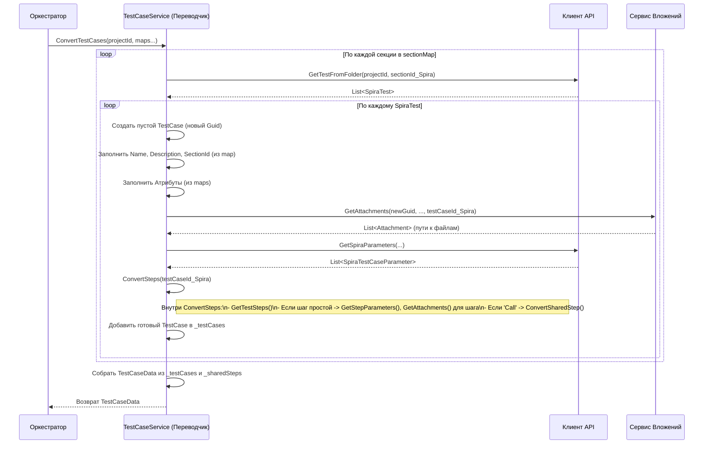

# Chapter 5: Сервис Конвертации Тест-кейсов


В [предыдущей главе](04_сервис_работы_с_атрибутами_.md) мы подготовили почву: [Сервис Работы с Разделами](03_сервис_работы_с_разделами_.md) построил нам структуру папок, а [Сервис Работы с Атрибутами](04_сервис_работы_с_атрибутами_.md) предоставил "словари" для понимания приоритетов и статусов из SpiraTest. Теперь у нас есть все вспомогательные данные. Пришло время заняться главным блюдом — самими тест-кейсами!

Представьте, что вы получили текст на одном языке (данные о тест-кейсе из SpiraTest) и вам нужно точно перевести его на другой язык (формат, понятный для импорта в другую систему, например, Test IT), сохранив при этом весь смысл, структуру и детали. Именно эту роль выполняет **Сервис Конвертации Тест-кейсов (`TestCaseService`)**.

Это **центральный процессор** всего процесса экспорта. Он берет необработанную информацию по каждому тест-кейсу из SpiraTest, которую ему предоставляет [Клиент SpiraTest API](02_клиент_spiratest_api_.md), и, используя ранее собранные данные о структуре разделов и атрибутах, "переводит" ее в конечный формат.

## Зачем нужен "Переводчик" Тест-кейсов?

Когда [Клиент SpiraTest API](02_клиент_spiratest_api_.md) получает данные о тест-кейсе, эта информация представлена в терминах SpiraTest:

*   У него есть `TestCaseId` (числовой ID из SpiraTest).
*   У него есть `PriorityId` (например, `1`).
*   У него есть `StatusId` (например, `2`).
*   У него есть `TestCaseFolderId` (ID папки в SpiraTest).
*   Шаги описаны в формате SpiraTest (`SpiraStep`), и некоторые шаги могут ссылаться на другие тест-кейсы (`LinkedTestCaseId`).
*   Вложения привязаны к ID SpiraTest.

Нашей целевой системе (например, импортеру Test IT) нужны данные в *другом* формате (`TestCase`, `SharedStep`, `Step` из проекта `Models`):

*   Нужен новый, уникальный `Id` (типа `Guid`).
*   Приоритет и статус должны быть представлены как *текстовые* значения определенных атрибутов.
*   Тест-кейс должен быть привязан к `SectionId` (нашему `Guid`) из [Сервиса Работы с Разделами](03_сервис_работы_с_разделами_.md).
*   Шаги должны быть преобразованы в формат `Step`.
*   Ссылки на другие тест-кейсы (`LinkedTestCaseId`) должны быть преобразованы в использование `SharedStep` (общих шагов) с *их* новыми `Guid`.
*   Вложения должны быть связаны с *новым* `Guid` тест-кейса или шага.

**Сервис Конвертации Тест-кейсов** выполняет именно эту "переводческую" работу:

*   **Преобразует основные данные:** Имя, описание.
*   **Переводит атрибуты:** Использует карты (`PrioritiesMap`, `StatusesMap`) из [Сервиса Работы с Атрибутами](04_сервис_работы_с_атрибутами_.md) для преобразования `PriorityId` и `StatusId` в текстовые значения.
*   **Размещает в правильном разделе:** Использует карту (`SectionMap`) из [Сервиса Работы с Разделами](03_сервис_работы_с_разделами_.md) для определения `SectionId`.
*   **Конвертирует шаги:** Обрабатывает простые шаги, параметры шагов (`SpiraStepParameter`) и, что важно, **связанные тест-кейсы** (`LinkedTestCaseId`).
*   **Обрабатывает Общие Шаги (Shared Steps):** Тест-кейсы, на которые ссылаются шаги других тест-кейсов в SpiraTest, преобразуются в "общие шаги" (`SharedStep`) в нашей целевой модели. Сервис следит, чтобы один и тот же общий шаг был конвертирован только один раз.
*   **Привязывает вложения:** Координирует работу с [Сервисом Обработки Вложений](06_сервис_обработки_вложений_.md) для связывания файлов с новыми ID.
*   **Конвертирует параметры тест-кейса:** Преобразует `SpiraTestCaseParameter` в формат `Iterations` целевой модели.

## Как это использовать? Контракт `ITestCaseService`

[Оркестратор Экспорта](01_оркестратор_экспорта_.md) поручает всю работу по конвертации тест-кейсов этому сервису, вызывая его единственный метод, определенный в интерфейсе `ITestCaseService`:

```csharp
// Файл: Services/ITestCaseService.cs
using SpiraTestExporter.Models; // Используем модели TestCaseData и др.

namespace SpiraTestExporter.Services;

// Интерфейс ("задание") для Сервиса Конвертации Тест-кейсов
public interface ITestCaseService
{
    // Главный метод для конвертации всех тест-кейсов проекта
    Task<TestCaseData> ConvertTestCases(
        int projectId,                       // ID проекта в SpiraTest
        Dictionary<int, Guid> sectionMap,    // Карта: ID папки Spira -> ID нашего раздела (от SectionService)
        Dictionary<int, string> priorities,  // Карта: ID приоритета Spira -> Название (от AttributeService)
        Dictionary<int, string> statuses,    // Карта: ID статуса Spira -> Название (от AttributeService)
        Dictionary<string, Guid> attributesMap // Карта: Название атрибута -> ID нашего атрибута (от AttributeService)
    );
}
```

*   `Task<TestCaseData>`: Метод асинхронный (так как он запрашивает много данных у API) и возвращает `TestCaseData`.
*   **Входные параметры:**
    *   `projectId`: ID проекта SpiraTest.
    *   `sectionMap`: Та самая карта из [Сервиса Работы с Разделами](03_сервис_работы_с_разделами_.md), чтобы сервис знал, в какой раздел (`SectionId`) поместить конвертированный тест-кейс.
    *   `priorities`, `statuses`: Карты-переводчики из [Сервиса Работы с Атрибутами](04_сервис_работы_с_атрибутами_.md), чтобы перевести `PriorityId` и `StatusId` в текст.
    *   `attributesMap`: Карта из [Сервиса Работы с Атрибутами](04_сервис_работы_с_атрибутами_.md), чтобы знать ID (`Guid`) атрибутов "Priority" и "Status" в нашей целевой модели.

### Что возвращает `ConvertTestCases`? Модель `TestCaseData`

Результат работы сервиса упакован в объект `TestCaseData`:

```csharp
// Файл: Models/TestCaseData.cs (Структура класса)
using Models; // Используем TestCase и SharedStep из проекта Models

namespace SpiraTestExporter.Models;

// Контейнер для сконвертированных тест-кейсов и общих шагов
public class TestCaseData
{
    // Список всех конвертированных тест-кейсов в целевом формате
    public List<TestCase> TestCases { get; set; }
    // Список всех уникальных общих шагов в целевом формате
    public List<SharedStep> SharedSteps { get; set; }
}
```

*   `TestCases`: Список всех "обычных" тест-кейсов, преобразованных в наш целевой формат (`TestCase` из `Models`).
*   `SharedSteps`: Список всех тест-кейсов из SpiraTest, которые использовались как "_вызываемые_" шаги (linked test cases). Они преобразуются в специальный формат `SharedStep` (из `Models`). Этот список содержит только уникальные общие шаги.

### Пример использования (в Оркестраторе)

Мы уже видели, как [Оркестратор Экспорта](01_оркестратор_экспорта_.md) вызывает этот сервис:

```csharp
// Фрагмент из Services/ExportService.cs (Оркестратор)
public async Task ExportProject()
{
    // ... (Шаг 1: Получаем проект -> project) ...
    // ... (Шаг 2: Получаем разделы -> sectionData) ...
    // ... (Шаг 3: Получаем атрибуты -> attributeData) ...

    // Шаг 4: Вызываем Сервис Конвертации Тест-кейсов
    _logger.LogInformation("Конвертация тест-кейсов...");
    // Передаем ID проекта и все необходимые карты
    TestCaseData testCaseData = await _testCaseService.ConvertTestCases(
        project.Id,
        sectionData.SectionMap,    // Карта разделов
        attributeData.PrioritiesMap, // Карта приоритетов
        attributeData.StatusesMap,   // Карта статусов
        attributeData.AttributesMap  // Карта атрибутов
    );
    _logger.LogDebug($"Конвертировано {testCaseData.TestCases.Count} тест-кейсов и {testCaseData.SharedSteps.Count} общих шагов.");

    // Шаг 5: Сохраняем результаты (передаем testCaseData сервису записи)
    // ...
}
```

## Как это работает под капотом?

Представим нашего "переводчика" за работой. Когда [Оркестратор Экспорта](01_оркестратор_экспорта_.md) вызывает `ConvertTestCases`, происходит следующее:

1.  **Подготовка:** Сервис получает ID проекта и все карты (`sectionMap`, `priorities`, `statuses`, `attributesMap`). Он также инициализирует внутренние словари для хранения уже сконвертированных тест-кейсов (`_testCases`) и общих шагов (`_sharedSteps`), чтобы избежать дублирования работы.
2.  **Обход Разделов:** Сервис берет карту `sectionMap` и для каждой записи (которая соответствует папке в SpiraTest) делает следующее:
    *   **Запрос Тест-кейсов Папки:** Просит [Клиента SpiraTest API](02_клиент_spiratest_api_.md) дать список всех тест-кейсов (`SpiraTest`) именно из этой папки (`section.Key` - это ID папки Spira).
3.  **Конвертация Тест-кейса (Для каждого `SpiraTest` из папки):**
    *   **Создание Целевого Объекта:** Создается новый объект `TestCase` (из `Models`) с уникальным `Id = Guid.NewGuid()`.
    *   **Базовые Поля:** Копируются `Name` и `Description`.
    *   **Раздел:** Находится `SectionId` (наш `Guid`) по `testCase.FolderId` из `sectionMap`.
    *   **Атрибуты (Приоритет/Статус):**
        *   Берется `testCase.PriorityId`. Если оно есть, в карте `priorities` ищется соответствующее имя (например, "Высокий"). Создается объект `CaseAttribute` с `Id` атрибута приоритета (из `attributesMap`) и значением "Высокий".
        *   Аналогично для статуса: по `testCase.StatusId` находится имя в `statuses` (например, "Пройден"), создается `CaseAttribute` с `Id` атрибута статуса и значением "Пройден".
    *   **Вложения Тест-кейса:** Вызывается `IAttachmentService.GetAttachments` для получения списка вложений этого тест-кейса и связывания их с новым `testCaseId`.
    *   **Параметры Тест-кейса:** Запрашиваются параметры (`SpiraTestCaseParameter`) у клиента API и конвертируются в формат `Iterations`.
    *   **Конвертация Шагов:** Вызывается внутренняя функция (например, `ConvertSteps`), которая:
        *   Запрашивает шаги (`SpiraStep`) для `testCase.TestCaseId` у клиента API.
        *   Для каждого `SpiraStep`:
            *   **Простой Шаг:** Если нет `LinkedTestCaseId`, создается объект `Step`, копируются `Description` (в `Action`), `ExpectedResult` (в `Expected`). Запрашиваются и конвертируются параметры шага (`SpiraStepParameter`), результат записывается в `TestData`. Запрашиваются вложения шага у `IAttachmentService`.
            *   **Связанный Шаг ("Call"):** Если есть `LinkedTestCaseId`, значит, это вызов другого тест-кейса (который должен стать общим шагом). Вызывается другая внутренняя функция (например, `ConvertSharedStep`) для обработки этого `LinkedTestCaseId`. Эта функция вернет `Guid` уже существующего или только что созданного `SharedStep`. В создаваемом объекте `Step` заполняется только поле `SharedStepId`.
    *   **Кэширование:** Сконвертированный `TestCase` (или `SharedStep`, если он конвертировался как зависимость) добавляется во внутренний словарь (`_testCases` или `_sharedSteps`) по его оригинальному ID из SpiraTest для быстрого доступа в будущем.
4.  **Сборка Результата:** После обхода всех разделов и тест-кейсов, сервис собирает все значения из своих внутренних словарей (`_testCases.Values`, `_sharedSteps.Values`) в объект `TestCaseData`.
5.  **Возврат:** Объект `TestCaseData` возвращается Оркестратору.

### Диаграмма процесса (Упрощенная)



### Логика обработки Общих Шагов (`ConvertSharedStep`)

Это важная часть. Когда `ConvertSteps` встречает шаг типа "Call" с `LinkedTestCaseId`:

1.  **Проверка Кэша Общих Шагов:** Сначала сервис смотрит, нет ли уже сконвертированного `SharedStep` с таким `LinkedTestCaseId` во внутреннем словаре `_sharedSteps`. Если есть — возвращает его `Guid`.
2.  **Проверка Кэша Обычных Тест-кейсов:** Если в `_sharedSteps` нет, сервис проверяет словарь `_testCases`. Возможно, этот `LinkedTestCaseId` уже был сконвертирован как обычный тест-кейс ранее. Если да — сервис *перемещает* его из `_testCases` в `_sharedSteps` (преобразуя `TestCase` в `SharedStep`) и возвращает его `Guid`. Это нужно, потому что если на тест-кейс есть хотя бы одна ссылка "Call", он должен считаться общим шагом.
3.  **Конвертация Нового Общего Шага:** Если нигде не найден, значит, это первый раз, когда мы встречаем этот `LinkedTestCaseId`. Сервис:
    *   Запрашивает полную информацию об этом тест-кейсе (`SpiraTest`) у клиента API по `LinkedTestCaseId`.
    *   Создает *новый* объект `SharedStep` с новым `Guid`.
    *   Заполняет его поля (Name, Description, Атрибуты, Вложения и т.д.), во многом так же, как для обычного `TestCase`. Важно: он *рекурсивно* вызывает `ConvertSteps` для шагов этого общего шага!
    *   Добавляет созданный `SharedStep` в словарь `_sharedSteps` по `LinkedTestCaseId`.
    *   Возвращает `Guid` созданного `SharedStep`.

Эта логика с использованием кэшей (`_sharedSteps`, `_testCases`) и перемещением гарантирует, что каждый тест-кейс из SpiraTest будет сконвертирован ровно один раз, либо как `TestCase`, либо как `SharedStep`.

### Заглянем в код (`TestCaseService.cs`)

**1. Конструктор и Поля:**

```csharp
// Файл: Services/TestCaseService.cs (Начало)
using Microsoft.Extensions.Logging;
using Models; // Для TestCase, SharedStep, Step и т.д.
using SpiraTestExporter.Client; // Для IClient
using SpiraTestExporter.Models; // Для SpiraTest, SpiraStep и т.д.
using Constants = SpiraTestExporter.Models.Constants; // Для имен атрибутов

namespace SpiraTestExporter.Services;

public class TestCaseService : ITestCaseService
{
    private readonly ILogger<TestCaseService> _logger;
    private readonly IClient _client; // Клиент для запросов к SpiraTest
    private readonly IAttachmentService _attachmentService; // Сервис для работы с вложениями
    // Кэши для хранения уже конвертированных объектов
    private readonly Dictionary<int, SharedStep> _sharedSteps; // Кэш общих шагов (Spira ID -> SharedStep)
    private readonly Dictionary<int, TestCase> _testCases;     // Кэш обычных тест-кейсов (Spira ID -> TestCase)
    public const int _duration = 10000; // Примерное время выполнения (для целевой системы)

    public TestCaseService(ILogger<TestCaseService> logger, IClient client, IAttachmentService attachmentService)
    {
        _logger = logger;
        _client = client;
        _attachmentService = attachmentService;
        // Инициализируем кэши при создании сервиса
        _sharedSteps = new Dictionary<int, SharedStep>();
        _testCases = new Dictionary<int, TestCase>();
    }

    // ... (Методы ConvertTestCases, ConvertSteps, ConvertSharedStep ниже) ...
}
```

*   Сервис получает свои зависимости: логгер, клиент API и сервис вложений.
*   Ключевую роль играют словари `_sharedSteps` и `_testCases` для кэширования результатов и предотвращения повторной конвертации.

**2. Основной метод `ConvertTestCases` (Упрощенный фрагмент):**

```csharp
// Файл: Services/TestCaseService.cs (Часть метода ConvertTestCases)
public async Task<TestCaseData> ConvertTestCases(int projectId, Dictionary<int, Guid> sectionMap,
    Dictionary<int, string> priorities, Dictionary<int, string> statuses, Dictionary<string, Guid> attributesMap)
{
    _logger.LogInformation("Начинаем конвертацию тест-кейсов...");
    // Очистка кэшей перед новым запуском (на всякий случай)
    _testCases.Clear();
    _sharedSteps.Clear();

    // Шаг 2: Обход Разделов
    foreach (var section in sectionMap) // section.Key = Spira Folder ID, section.Value = наш Section Guid
    {
        // Запрос тест-кейсов этой папки
        var spiraTestCases = await _client.GetTestFromFolder(projectId, section.Key);

        // Шаг 3: Конвертация каждого тест-кейса
        foreach (var spiraTestCase in spiraTestCases)
        {
            // Пропускаем, если этот тест-кейс УЖЕ был обработан (например, как общий шаг)
            if (_testCases.ContainsKey(spiraTestCase.TestCaseId) || _sharedSteps.ContainsKey(spiraTestCase.TestCaseId))
            {
                continue;
            }

            _logger.LogDebug("Конвертируем Тест-кейс {Id}: {Name}", spiraTestCase.TestCaseId, spiraTestCase.Name);

            var testCaseId = Guid.NewGuid(); // Новый уникальный ID

            // Получаем вложения для тест-кейса
            var attachments = await _attachmentService.GetAttachments(testCaseId, projectId, ArtifactType.TestCase, spiraTestCase.TestCaseId);

            // Рекурсивно конвертируем шаги (этот метод может вызвать ConvertSharedStep)
            var steps = await ConvertSteps(projectId, testCaseId /* наш новый ID */, spiraTestCase.TestCaseId /* Spira ID */,
                                           sectionMap, priorities, statuses, attributesMap);

            // Получаем параметры тест-кейса
            var parameters = await _client.GetSpiraParameters(projectId, spiraTestCase.TestCaseId);
            var iterations = ConvertParametersToIterations(parameters); // Вспомогательная функция

            // Создаем объект TestCase для целевой системы
            var testCaseModel = new TestCase
            {
                Id = testCaseId,
                Name = spiraTestCase.Name,
                Description = spiraTestCase.Description,
                SectionId = section.Value, // ID нашего раздела из карты
                Steps = steps,
                Attachments = attachments,
                Iterations = iterations,
                Priority = PriorityType.Medium, // Значения по умолчанию для Test IT
                State = StateType.NotReady,    // Значения по умолчанию для Test IT
                Duration = _duration,         // Значение по умолчанию
                Attributes = new List<CaseAttribute> // Заполняем атрибуты
                {
                    // Атрибут Приоритет
                    new() {
                        Id = attributesMap[Constants.Priority], // ID атрибута из карты
                        Value = spiraTestCase.PriorityId.HasValue ? priorities[spiraTestCase.PriorityId.Value] : "Medium" // Имя из карты
                    },
                    // Атрибут Статус
                    new() {
                        Id = attributesMap[Constants.Status], // ID атрибута из карты
                        Value = statuses[spiraTestCase.StatusId] // Имя из карты
                    }
                },
                // Инициализация пустых списков
                Tags = new List<string>(),
                Links = new List<Link>(),
                PreconditionSteps = new List<Step>(),
                PostconditionSteps = new List<Step>()
            };

            // Добавляем в кэш ОБЫЧНЫХ тест-кейсов
            _testCases.Add(spiraTestCase.TestCaseId, testCaseModel);
        }
    }

    _logger.LogInformation("Конвертация завершена.");
    // Шаг 4: Сборка Результата
    return new TestCaseData
    {
        TestCases = _testCases.Values.ToList(), // Берем все из кэша тест-кейсов
        SharedSteps = _sharedSteps.Values.ToList() // Берем все из кэша общих шагов
    };
}
```

 *   Этот код показывает основной цикл обхода разделов и тест-кейсов.
 *   Он демонстрирует использование карт (`sectionMap`, `priorities`, `statuses`, `attributesMap`) для заполнения полей `SectionId` и `Attributes`.
 *   Вызов `ConvertSteps` запускает обработку шагов.
 *   Важна проверка `_testCases.ContainsKey(...) || _sharedSteps.ContainsKey(...)` перед началом конвертации, чтобы избежать дублирования, если тест-кейс уже был обработан как зависимость (общий шаг).

**3. Конвертация Шагов (`ConvertSteps`, Упрощенно):**

```csharp
// Файл: Services/TestCaseService.cs (Метод ConvertSteps)
// Конвертирует шаги для заданного тест-кейса Spira
private async Task<List<Step>> ConvertSteps(int projectId, Guid ownerId /*Наш ID*/, int testCaseIdSpira /*Spira ID*/, /*...карты...*/ )
{
    var steps = new List<Step>(); // Список для конвертированных шагов
    _logger.LogDebug("Конвертируем шаги для тест-кейса Spira ID {TestCaseIdSpira}", testCaseIdSpira);

    var spiraSteps = await _client.GetTestSteps(projectId, testCaseIdSpira); // Получаем шаги из Spira

    foreach (var spiraStep in spiraSteps)
    {
        // Проверяем, является ли шаг вызовом другого тест-кейса ("Call")
        // Spira использует поле Description для этого, но в реальности может быть иначе!
        // Здесь упрощено: проверяем наличие LinkedId.
        if (spiraStep.LinkedId.HasValue)
        {
            _logger.LogDebug("Шаг {Position} - это вызов общего шага ID {LinkedId}",
                             spiraStep.Position, spiraStep.LinkedId.Value);
            // --> Это вызов Общего Шага

            // Вызываем функцию конвертации/получения Общего Шага
            // Она вернет Guid существующего или нового SharedStep
            var sharedStepId = await ConvertSharedStep(projectId, spiraStep.LinkedId.Value, /*...карты...*/);

            // Создаем шаг в целевом формате, указывая ТОЛЬКО ID общего шага
            steps.Add(new Step
            {
                SharedStepId = sharedStepId, // Главное - указать этот ID
                // Остальные поля (Action, Expected...) для такого шага пусты
                Action = string.Empty,
                Expected = string.Empty,
                TestData = string.Empty,
                ActionAttachments = new List<string>(),
                ExpectedAttachments = new List<string>(),
                TestDataAttachments = new List<string>()
            });
        }
        else
        {
            // --> Это обычный шаг
            _logger.LogDebug("Шаг {Position} - обычный шаг.", spiraStep.Position);

            // Получаем параметры этого шага
            var stepParameters = await _client.GetStepParameters(projectId, testCaseIdSpira, spiraStep.Id);
            var testData = ConvertStepParametersToString(stepParameters); // Вспомогательная функция

            // Получаем вложения этого шага
            var stepAttachments = await _attachmentService.GetAttachments(ownerId, projectId,
                                                                          ArtifactType.Step, spiraStep.Id);

            // Создаем обычный шаг в целевом формате
            steps.Add(new Step
            {
                Action = spiraStep.Description,   // Действие
                Expected = spiraStep.ExpectedResult, // Ожидаемый результат
                TestData = testData,             // Параметры шага
                ActionAttachments = new List<string>(), // Пока не поддерживается разделение
                ExpectedAttachments = new List<string>(), // Пока не поддерживается разделение
                TestDataAttachments = stepAttachments, // Все вложения шага идут сюда
                SharedStepId = null // Это не ссылка на общий шаг
            });
        }
    }
    return steps;
}
```

*   Этот метод различает обычные шаги и шаги-ссылки (`LinkedId`).
*   Для шагов-ссылок он вызывает `ConvertSharedStep`.
*   Для обычных шагов он запрашивает параметры и вложения и создает объект `Step`.

**4. Конвертация Общего Шага (`ConvertSharedStep`, Логика):**

```csharp
// Файл: Services/TestCaseService.cs (Логика ConvertSharedStep, псевдокод)
private async Task<Guid> ConvertSharedStep(int projectId, int linkedIdSpira, /*...карты...*/)
{
    // 1. Проверка кэша _sharedSteps
    if (_sharedSteps.TryGetValue(linkedIdSpira, out var cachedSharedStep))
    {
        _logger.LogDebug("Общий шаг {linkedIdSpira} найден в кэше SharedSteps.", linkedIdSpira);
        return cachedSharedStep.Id; // Нашли в кэше - возвращаем ID
    }

    // 2. Проверка кэша _testCases (и перемещение, если найден)
    if (_testCases.TryGetValue(linkedIdSpira, out var existingTestCase))
    {
        _logger.LogDebug("Общий шаг {linkedIdSpira} найден в кэше TestCases. Перемещаем в SharedSteps.", linkedIdSpira);
        // Удаляем из обычных тест-кейсов
        _testCases.Remove(linkedIdSpira);
        // Создаем SharedStep на основе TestCase
        var convertedSharedStep = ConvertTestCaseToSharedStep(existingTestCase); // Вспомогательный метод
        // Добавляем в кэш общих шагов
        _sharedSteps.Add(linkedIdSpira, convertedSharedStep);
        return convertedSharedStep.Id; // Возвращаем ID
    }

    // 3. Конвертация нового общего шага
    _logger.LogDebug("Общий шаг {linkedIdSpira} не найден в кэшах. Конвертируем как новый SharedStep.", linkedIdSpira);
    // Запрашиваем данные тест-кейса Spira по linkedIdSpira
    var spiraTestCase = await _client.GetTestById(projectId, linkedIdSpira);
    var newSharedStepId = Guid.NewGuid();

    // Рекурсивно конвертируем шаги ДЛЯ ЭТОГО общего шага
    var steps = await ConvertSteps(projectId, newSharedStepId, linkedIdSpira, /*...карты...*/);
    // Получаем вложения, атрибуты, параметры... (аналогично ConvertTestCases)
    var attachments = await _attachmentService.GetAttachments(newSharedStepId, projectId, ArtifactType.TestCase, linkedIdSpira);
    var attributes = ConvertAttributes(spiraTestCase, /*...карты...*/); // Вспомогательный метод

    // Создаем объект SharedStep
    var sharedStep = new SharedStep {
        Id = newSharedStepId,
        Name = spiraTestCase.Name,
        SectionId = sectionMap[spiraTestCase.FolderId!.Value], // Важно: общий шаг тоже имеет раздел!
        Steps = steps,
        Attachments = attachments,
        Attributes = attributes,
        // ... другие поля ...
    };

    // Добавляем в кэш общих шагов
    _sharedSteps.Add(linkedIdSpira, sharedStep);
    return newSharedStepId; // Возвращаем ID нового общего шага
}
```

*   Этот псевдокод иллюстрирует описанную ранее логику с проверкой кэшей и созданием/перемещением `SharedStep`.

## Заключение

В этой главе мы погрузились в самое сердце процесса экспорта — **Сервис Конвертации Тест-кейсов (`TestCaseService`)**. Мы увидели, что он действует как умный "переводчик", принимая необработанные данные о тест-кейсах из SpiraTest и, используя контекст (структуру разделов и атрибуты), предоставленный другими сервисами, meticulously преобразует их в целевой формат. Мы разобрали, как он обрабатывает основные поля, атрибуты, шаги (включая сложные случаи с общими шагами), параметры и координирует получение вложений. Использование кэширования (`_testCases`, `_sharedSteps`) позволяет ему работать эффективно и избегать дублирования.

Теперь у нас есть полностью сформированные данные тест-кейсов и общих шагов. Однако мы лишь упомянули обработку вложений. Как именно файлы скачиваются и связываются с нашими новыми объектами?

В следующей, заключительной главе по основным компонентам, мы подробно рассмотрим [Сервис Обработки Вложений](06_сервис_обработки_вложений_.md), который отвечает за скачивание файлов из SpiraTest и их правильное сохранение для нашего экспорта.

---

Generated by [AI Codebase Knowledge Builder](https://github.com/The-Pocket/Tutorial-Codebase-Knowledge)