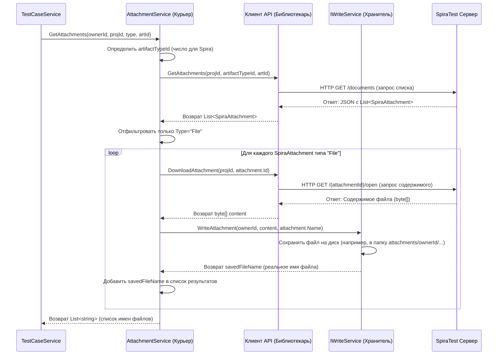

# Chapter 6: Сервис Обработки Вложений


В [предыдущей главе](05_сервис_конвертации_тест_кейсов_.md) мы разобрались с [Сервисом Конвертации Тест-кейсов](05_сервис_конвертации_тест_кейсов_.md), который преобразует данные о тест-кейсах и их шагах из формата SpiraTest в нашу целевую модель. Мы упоминали, что он также координирует работу с вложениями, но не углублялись в детали. Как же программа скачивает файлы, прикрепленные к тест-кейсам или шагам в SpiraTest, и куда она их сохраняет?

За эту задачу отвечает **Сервис Обработки Вложений (`AttachmentService`)**.

## Знакомьтесь, "Курьерская Служба" Вложений

Представьте себе курьерскую службу для файлов. Когда вы делаете заказ (экспортируете тест-кейс), и к нему приложены какие-то документы или картинки (вложения), обычный "переводчик" (`TestCaseService`) не пойдет сам за этими файлами на "склад" (SpiraTest). Он вызовет специальную службу — **Сервис Обработки Вложений**.

Этот сервис работает так:

1.  **Получает список посылок:** Ему сообщают, какие именно файлы (вложения) нужно доставить для конкретного тест-кейса или шага. Этот список он получает от "библиотекаря" ([Клиента SpiraTest API](02_клиент_spiratest_api_.md)).
2.  **Забирает посылки со склада:** Для каждого файла в списке он обращается к [Клиенту SpiraTest API](02_клиент_spiratest_api_.md) и запрашивает его содержимое — "забирает" файл из SpiraTest.
3.  **Доставляет получателю:** Скачанный файл нужно куда-то сохранить. Сервис Обработки Вложений использует другой сервис, отвечающий за запись файлов на диск (`IWriteService`), чтобы сохранить содержимое файла локально.
4.  **Предоставляет отчет:** После того как все запрошенные файлы скачаны и сохранены, сервис возвращает список имен файлов, как они были сохранены на диске. Это "отчет о доставке".

+получает+список,+скачивает+из+SpiraTest,+сохраняет+на+диск)

*Рисунок: Сервис Обработки Вложений действует как курьер: получает задание, забирает файлы из SpiraTest и сохраняет их локально.*

Основная задача **Сервиса Обработки Вложений** — инкапсулировать (спрятать внутри себя) весь процесс работы с файлами: получение информации о них, скачивание и сохранение.

## Как это использовать? Контракт `IAttachmentService`

Чтобы другие сервисы, в первую очередь [Сервис Конвертации Тест-кейсов](05_сервис_конвертации_тест_кейсов_.md), могли попросить "курьера" доставить файлы, существует интерфейс `IAttachmentService`. Он определяет, что должен уметь делать сервис вложений:

```csharp
// Файл: Services/IAttachmentService.cs
using SpiraTestExporter.Models; // Используем enum ArtifactType

namespace SpiraTestExporter.Services;

// Интерфейс ("заказ на доставку") для Сервиса Обработки Вложений
public interface IAttachmentService
{
    // Метод для получения и сохранения вложений для указанного артефакта
    // Возвращает список имен сохраненных файлов
    Task<List<string>> GetAttachments(
        Guid ownerId,         // Наш УНИКАЛЬНЫЙ ID (TestCase или SharedStep), к которому крепятся файлы
        int projectId,       // ID проекта в SpiraTest
        ArtifactType artifactType, // Тип артефакта (Тест-кейс или Шаг)
        int artifactId        // ID артефакта В SpiraTest (TestCaseId или StepId)
    );
}
```

*   `Task<List<string>>`: Метод асинхронный (скачивание файлов занимает время) и вернет список строк (`string`), когда закончит. Каждая строка — это имя файла, сохраненного локально.
*   **Входные параметры:**
    *   `ownerId`: Важный параметр! Это *наш* уникальный `Guid` (не из SpiraTest), который мы присвоили тест-кейсу или общему шагу в [Сервисе Конвертации Тест-кейсов](05_сервис_конвертации_тест_кейсов_.md). Он используется для организации сохраненных файлов (например, чтобы все вложения одного тест-кейса лежали в одной папке).
    *   `projectId`: ID проекта в SpiraTest. Нужен для запросов к API.
    *   `artifactType`: Указывает, к чему прикреплен файл — к тест-кейсу (`ArtifactType.TestCase`) или к шагу (`ArtifactType.Step`). Это нужно, чтобы правильно сформировать запрос к API SpiraTest.
    *   `artifactId`: Это ID самого тест-кейса или шага *в SpiraTest*. Используется для запроса списка его вложений.

### Что такое `ArtifactType`?

Это простое перечисление (`enum`), которое помогает нам различать, для какого типа объекта мы запрашиваем вложения:

```csharp
// Файл: Models/ArtifactType.cs
namespace SpiraTestExporter.Models;

// Перечисление для типов артефактов Spira, имеющих вложения
public enum ArtifactType
{
    TestCase, // Вложение принадлежит Тест-кейсу
    Step      // Вложение принадлежит Шагу
}
```

### Пример использования (в `TestCaseService`)

[Сервис Конвертации Тест-кейсов](05_сервис_конвертации_тест_кейсов_.md) вызывает `GetAttachments` как для самого тест-кейса, так и для каждого его шага (если они есть):

```csharp
// Фрагмент из Services/TestCaseService.cs (Метод Конвертации Тест-кейса)
// ... внутри цикла по SpiraTestCase ...
var testCaseId = Guid.NewGuid(); // Создали НАШ ID для тест-кейса

// Вызываем "курьера" для доставки вложений САМОГО тест-кейса
var attachments = await _attachmentService.GetAttachments(
    testCaseId,             // Наш ID тест-кейса
    projectId,              // ID проекта Spira
    ArtifactType.TestCase,  // Тип: Тест-кейс
    spiraTestCase.TestCaseId // ID тест-кейса в Spira
);

// ... создаем объект TestCaseModel ...
testCaseModel.Attachments = attachments; // Сохраняем список имен файлов

// ... (внутри метода ConvertSteps, который вызывается для тест-кейса) ...
// ... внутри цикла по SpiraStep ...

// Вызываем "курьера" для доставки вложений ШАГА
var stepAttachments = await _attachmentService.GetAttachments(
    ownerId, // Наш ID родительского TestCase или SharedStep
    projectId,          // ID проекта Spira
    ArtifactType.Step,  // Тип: Шаг
    spiraStep.Id        // ID шага в Spira
);

// ... создаем объект Step ...
stepModel.TestDataAttachments = stepAttachments; // Сохраняем список имен файлов для шага
```

Как видите, `TestCaseService` просто "заказывает доставку", передавая необходимые идентификаторы, и получает в ответ список имен сохраненных файлов, который он потом записывает в поля `Attachments` или `TestDataAttachments` наших целевых моделей `TestCase` и `Step`.

## Как это работает под капотом?

Давайте проследим путь "курьера" (`AttachmentService`), когда его вызывают методом `GetAttachments`:

1.  **Получение Задания:** Сервис получает все необходимые ID: `ownerId` (наш Guid), `projectId`, `artifactType` и `artifactId` (Spira ID).
2.  **Определение Типа для API:** Преобразует наш `ArtifactType` (например, `TestCase`) в числовой код, понятный SpiraTest API (например, `1`). Для этого используется вспомогательный метод `GetArtifactTypeId`.
3.  **Запрос Списка Вложений:** Обращается к [Клиенту SpiraTest API](02_клиент_spiratest_api_.md) (`IClient`) и просит: "Дай список документов для проекта `projectId`, артефакта типа `N` (число из шага 2) с ID `artifactId`". Клиент выполняет метод `GetAttachments(projectId, N, artifactId)`.
4.  **Получение Списка:** Клиент возвращает список объектов `SpiraAttachment`. Каждый такой объект содержит ID вложения (`Id`), его имя (`Name`) и тип (`Type`, например, "File" или "URL").
```csharp
   // Файл: Models/SpiraAttachment.cs (Структура, получаемая от Клиента API)
   // Поля помечены атрибутами для корректной десериализации JSON от Spira
   public class SpiraAttachment
   {
       [JsonPropertyName("AttachmentId")]
       public int Id { get; set; } // ID вложения в Spira

       [JsonPropertyName("FilenameOrUrl")]
       public string Name { get; set; } // Имя файла или URL

       [JsonPropertyName("AttachmentTypeName")]
       public string Type { get; set; } // Тип: "File" или "URL"
   }
```
5.  **Фильтрация Файлов:** Нас интересуют только реальные файлы, а не ссылки (URL). Сервис отбирает из полученного списка только те `SpiraAttachment`, у которых `Type` равен "File".
6.  **Цикл по Файлам:** Для каждого отфильтрованного вложения (`attachment`) сервис выполняет:
    *   **Запрос Содержимого:** Обращается к [Клиенту SpiraTest API](02_клиент_spiratest_api_.md) и говорит: "Скачай содержимое файла с ID `attachment.Id` для проекта `projectId`". Клиент выполняет метод `DownloadAttachment(projectId, attachment.Id)`.
    *   **Получение Содержимого:** Клиент возвращает содержимое файла в виде массива байт (`byte[]`).
    *   **Сохранение Файла:** Сервис обращается к сервису записи (`IWriteService`) и просит: "Сохрани этот массив байт (`content`) с именем `attachment.Name` и свяжи его с нашим ID `ownerId`". Сервис записи (`_writeService.WriteAttachment`) выполняет сохранение (например, в подпапку с именем `ownerId`) и возвращает *реальное* имя, под которым файл был сохранен (оно может немного отличаться от оригинального для избежания конфликтов).
    *   **Добавление в Результат:** Имя сохраненного файла добавляется во внутренний список имен.
7.  **Возврат Отчета:** После обработки всех файлов из списка, сервис возвращает накопленный список имен сохраненных файлов.

### Диаграмма процесса



### Заглянем в код (`AttachmentService.cs`)

**1. Конструктор:**

```csharp
// Файл: Services/AttachmentService.cs (Начало)
using JsonWriter; // Для интерфейса IWriteService
using Microsoft.Extensions.Logging;
using SpiraTestExporter.Client; // Для IClient
using SpiraTestExporter.Models; // Для SpiraAttachment, ArtifactType

namespace SpiraTestExporter.Services;

public class AttachmentService : IAttachmentService
{
    private readonly ILogger<AttachmentService> _logger; // Для логов
    private readonly IClient _client; // "Библиотекарь" Spira API
    private readonly IWriteService _writeService; // Сервис для записи файлов

    // Конструктор: получаем логгер, клиента API и сервис записи
    public AttachmentService(ILogger<AttachmentService> logger, IClient client, IWriteService writeService)
    {
        _logger = logger;
        _client = client;
        _writeService = writeService; // Сохраняем сервис записи
    }

    // ... (Методы GetAttachments и GetArtifactTypeId ниже) ...
}
```

*   Сервис зависит от трех компонентов: логгера, [Клиента SpiraTest API](02_клиент_spiratest_api_.md) (для получения данных из Spira) и `IWriteService` (для сохранения файлов на диск). Все они передаются через конструктор.

**2. Основной метод `GetAttachments`:**

```csharp
// Файл: Services/AttachmentService.cs (Метод GetAttachments)
public async Task<List<string>> GetAttachments(Guid ownerId, int projectId, ArtifactType artifactType, int artifactId)
{
    _logger.LogInformation("Получаем вложения для {ArtifactType} с ID {ArtifactId}", artifactType, artifactId);

    // Шаг 2: Определяем числовой ID типа артефакта для Spira API
    var spiraArtifactTypeId = GetArtifactTypeId(artifactType);

    // Шаг 3: Запрашиваем список вложений у клиента API
    var attachments = await _client.GetAttachments(projectId, spiraArtifactTypeId, artifactId);
    var attachmentNames = new List<string>(); // Список для имен сохраненных файлов

    _logger.LogDebug("Получено {Count} записей о вложениях от Spira.", attachments.Count);

    // Шаг 5 и 6: Фильтруем и обрабатываем только файлы
    // Используем LINQ .Where() для фильтрации
    foreach (var attachment in attachments.Where(att => att.Type.Equals("File", StringComparison.OrdinalIgnoreCase)))
    {
        _logger.LogDebug("Обработка файла: {FileName} (ID: {AttachmentId})", attachment.Name, attachment.Id);
        try
        {
            // Шаг 6а: Скачиваем содержимое файла
            var content = await _client.DownloadAttachment(projectId, attachment.Id);
            _logger.LogDebug("Файл {FileName} скачан ({Size} байт).", attachment.Name, content.Length);

            // Шаг 6б: Сохраняем файл через сервис записи
            // Передаем наш ownerId, содержимое и оригинальное имя
            var savedFileName = await _writeService.WriteAttachment(ownerId, content, attachment.Name);
            _logger.LogDebug("Файл сохранен как: {SavedFileName}", savedFileName);

            // Шаг 6в: Добавляем реальное имя в результат
            attachmentNames.Add(savedFileName);
        }
        catch (Exception ex)
        {
            // Важно: Логгируем ошибку, но не прерываем весь процесс из-за одного файла
            _logger.LogError(ex, "Ошибка при обработке вложения ID {AttachmentId}, Файл {FileName}",
                             attachment.Id, attachment.Name);
        }
    }

    _logger.LogInformation("Обработано {Count} файлов.", attachmentNames.Count);
    // Шаг 7: Возвращаем список имен
    return attachmentNames;
}
```

*   Этот метод точно следует описанному алгоритму. Он вызывает `_client` для получения списка и скачивания, фильтрует результаты с помощью `Where()`, затем в цикле вызывает `_client.DownloadAttachment` и `_writeService.WriteAttachment`.
*   Использование `try-catch` внутри цикла важно, чтобы ошибка при скачивании или сохранении одного файла не остановила обработку остальных вложений.

**3. Вспомогательный метод `GetArtifactTypeId`:**

```csharp
// Файл: Services/AttachmentService.cs (Метод GetArtifactTypeId)
// Преобразует наш enum ArtifactType в числовой код, понятный SpiraTest API
private static int GetArtifactTypeId(ArtifactType artifactType)
{
    // Используем конструкцию switch expression (C# 8.0+)
    return artifactType switch
    {
        ArtifactType.TestCase => 1, // Тест-кейсам в Spira API соответствует тип 1
        ArtifactType.Step     => 2, // Шагам тест-кейсов соответствует тип 2 (возможно, другой - уточнено по коду)
        // Если появится новый тип в ArtifactType, но его не будет здесь,
        // возникнет исключение, что поможет обнаружить ошибку.
        _ => throw new ArgumentOutOfRangeException(nameof(artifactType), artifactType, "Неизвестный тип артефакта для Spira API")
    };
}
```

*   Этот простой метод использует `switch expression` для перевода значения `ArtifactType` в соответствующий код типа артефакта в SpiraTest API. Это позволяет остальному коду работать с понятными именами (`TestCase`, `Step`), а этот метод занимается деталями преобразования для API. *(Примечание: Реальные ID типов артефактов в SpiraTest API могут отличаться, здесь использованы значения 1 и 2 из предоставленного кода как примеры)*.

## Заключение

В этой главе мы подробно рассмотрели **Сервис Обработки Вложений (`AttachmentService`)**. Мы поняли, что он выполняет роль "курьерской службы", отвечая за получение информации о файлах, прикрепленных к артефактам в SpiraTest, их скачивание с помощью [Клиента SpiraTest API](02_клиент_spiratest_api_.md) и сохранение на локальный диск через сервис записи (`IWriteService`). Возвращаемый им список имен сохраненных файлов используется [Сервисом Конвертации Тест-кейсов](05_сервис_конвертации_тест_кейсов_.md) для заполнения соответствующих полей в экспортируемых данных.

На этом мы завершаем обзор основных сервисов, отвечающих за извлечение и преобразование данных из SpiraTest в проекте `SpiraTestExporter`. Мы проследили весь путь: от координации процесса [Оркестратором](01_оркестратор_экспорта_.md) до взаимодействия с API ([Клиент API](02_клиент_spiratest_api_.md)), построения структуры ([Сервис Разделов](03_сервис_работы_с_разделами_.md)), обработки атрибутов ([Сервис Атрибутов](04_сервис_работы_с_атрибутами_.md)), основной конвертации ([Сервис Тест-кейсов](05_сервис_конвертации_тест_кейсов_.md)) и, наконец, обработки файлов ([Сервис Вложений](06_сервис_обработки_вложений_.md)). Понимание роли каждого из этих компонентов дает ясную картину того, как работает экспорт данных.

---

Generated by [AI Codebase Knowledge Builder](https://github.com/The-Pocket/Tutorial-Codebase-Knowledge)