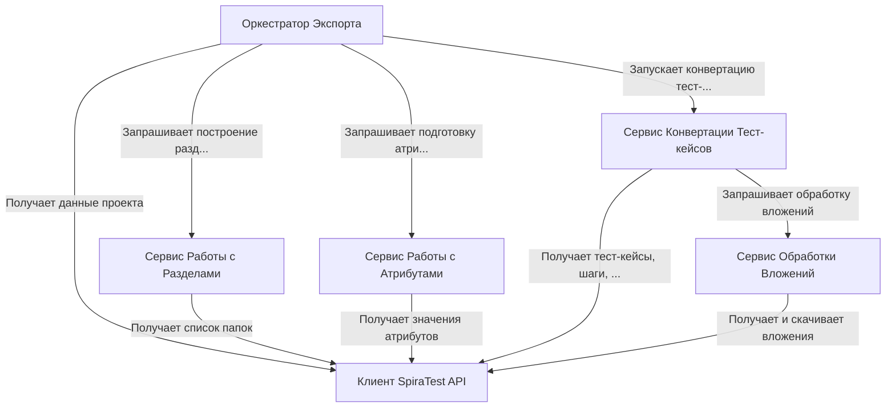

# Tutorial: SpiraTestExporter

Этот проект помогает **автоматически перенести** данные из системы управления тестированием **SpiraTest**.
Он работает как *координатор*, который последовательно запрашивает информацию: о структуре *папок (разделов)*, об *атрибутах* (таких как приоритет и статус), и о самих *тест-кейсах* с их шагами и прикрепленными файлами.
Для получения этих данных используется **API SpiraTest**.
В конце все собранные и *преобразованные* данные, включая скачанные *вложения*, сохраняются в специальном формате, готовом для импорта в другую систему (например, Test IT).

**Source Repository:** [None](None)

## Chapters

1. [Оркестратор Экспорта
](01_оркестратор_экспорта_.md)
2. [Клиент SpiraTest API
](02_клиент_spiratest_api_.md)
3. [Сервис Работы с Разделами
](03_сервис_работы_с_разделами_.md)
4. [Сервис Работы с Атрибутами
](04_сервис_работы_с_атрибутами_.md)
5. [Сервис Конвертации Тест-кейсов
](05_сервис_конвертации_тест_кейсов_.md)
6. [Сервис Обработки Вложений
](06_сервис_обработки_вложений_.md)

---

Generated by [AI Codebase Knowledge Builder](https://github.com/The-Pocket/Tutorial-Codebase-Knowledge)