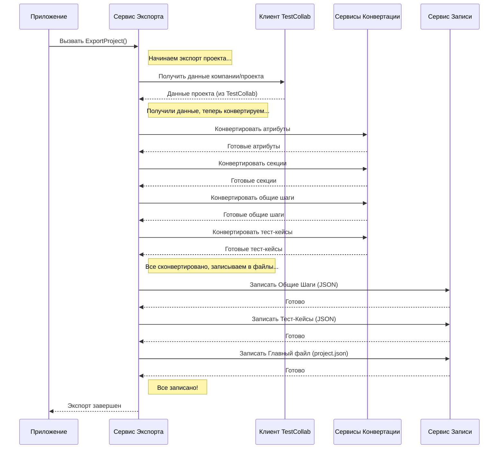

# Chapter 1: Сервис экспорта


Добро пожаловать в руководство по `TestCollabExporter`! В этой первой главе мы познакомимся с главным дирижером всего оркестра экспорта данных — **Сервисом Экспорта** (`ExportService`).

## Какую проблему он решает?

Представьте, что у вас есть проект в системе управления тестированием TestCollab. В нем хранится много важной информации: тест-кейсы, их шаги, секции (папки), пользовательские атрибуты и так далее. Теперь вы хотите перенести всю эту информацию в другую систему или просто сохранить ее в удобном для анализа формате, например, в виде JSON-файлов.

Как это сделать? Нужно выполнить несколько шагов:

1.  **Получить данные:** Подключиться к TestCollab и "вытащить" всю необходимую информацию о проекте.
2.  **Преобразовать данные:** Исходные данные из TestCollab могут быть не в том формате, который вам нужен. Их нужно преобразовать (сконвертировать) в структуру, понятную для вашей целевой системы или для дальнейшей обработки.
3.  **Сохранить данные:** Записать преобразованные данные в файлы на вашем компьютере.

Выполнять все эти шаги вручную сложно и утомительно. Нужен кто-то, кто будет управлять всем процессом от начала до конца.

## Решение: Сервис Экспорта (`ExportService`)

`ExportService` — это и есть тот самый управляющий. Он выступает в роли **менеджера проекта** для экспорта данных. Его основная задача — координировать работу других специализированных сервисов:

*   Он просит [Клиент API TestCollab](03_клиент_api_testcollab_.md) сходить в TestCollab и принести нужные данные.
*   Затем он передает эти данные различным сервисам конвертации (например, [Сервис конвертации тест-кейсов](04_сервис_конвертации_тест_кейсов_.md) и [Сервис конвертации секций](05_сервис_конвертации_секций_.md)), чтобы они привели их к нужному формату ([Модели данных](02_модели_данных_.md)).
*   Наконец, он отдает готовые, преобразованные данные [Сервису записи данных (JsonWriter)](06_сервис_записи_данных__jsonwriter__.md), который аккуратно сохраняет их в JSON-файлы.

Сам `ExportService` не занимается деталями получения, конвертации или записи. Он лишь знает, *кого* попросить и *в каком порядке*, чтобы добиться конечной цели — полного экспорта данных проекта.

## Как это используется?

Основная точка входа в приложение (`App.cs`) использует `ExportService` для запуска всего процесса. Взгляните на этот упрощенный фрагмент кода:

```csharp
// File: App.cs
using Microsoft.Extensions.Logging;
using TestCollabExporter.Services; // Подключаем наши сервисы

namespace TestCollabExporter;

public class App
{
    private readonly ILogger<App> _logger;
    private readonly IExportService _exportService; // Ссылка на наш сервис экспорта

    // При создании App, мы получаем готовый ExportService
    public App(ILogger<App> logger,  IExportService exportService)
    {
        _logger = logger;
        _exportService = exportService;
    }

    public void Run(string[] args)
    {
        _logger.LogInformation("Запуск приложения");

        // Вот он, главный вызов! Запускаем экспорт.
        _exportService.ExportProject().Wait(); // Ждем завершения экспорта

        _logger.LogInformation("Приложение завершает работу");
    }
}
```

Как видите, для запуска всего сложного процесса экспорта из основного кода приложения достаточно всего одной строки: `_exportService.ExportProject().Wait();`. Мы просто просим "менеджера" начать работу, и он берет все остальное на себя.

**Что происходит в результате?**

После вызова `ExportProject()` и его успешного завершения, в указанной папке (обычно `./TestManagementStudio/Root/ProjectName/...`) появятся JSON-файлы, содержащие экспортированные данные: тест-кейсы, общие шаги и главный файл `project.json` со структурой проекта.

## Под капотом: Как работает `ExportService`?

Давайте заглянем внутрь и посмотрим, как `ExportService` координирует работу.

**Шаг за шагом (общая схема):**

1.  **Запрос:** Приложение вызывает метод `ExportProject()` у `ExportService`.
2.  **Получение данных:** `ExportService` обращается к [Клиент API TestCollab](03_клиент_api_testcollab_.md) и просит предоставить информацию о компании и проекте из TestCollab.
3.  **Конвертация:** Получив исходные данные, `ExportService` последовательно вызывает специализированные сервисы для конвертации:
    *   Сервис атрибутов
    *   [Сервис конвертации секций](05_сервис_конвертации_секций_.md)
    *   Сервис общих шагов
    *   [Сервис конвертации тест-кейсов](04_сервис_конвертации_тест_кейсов_.md)
    Каждый сервис преобразует свою часть данных в нужный формат ([Модели данных](02_модели_данных_.md)).
4.  **Запись:** `ExportService` передает конвертированные данные (общие шаги, тест-кейсы, общую структуру проекта) [Сервису записи данных (JsonWriter)](06_сервис_записи_данных__jsonwriter__.md) для сохранения в JSON-файлы.
5.  **Завершение:** После того как все данные записаны, `ExportService` завершает свою работу, и приложение может закончить выполнение.

**Визуализация процесса (диаграмма последовательности):**



**Посмотрим на код:**

Сначала взглянем, как `ExportService` получает доступ ко всем своим "помощникам" (другим сервисам). Это происходит через механизм под названием "внедрение зависимостей" (Dependency Injection) в конструкторе класса:

```csharp
// File: Services\ExportService.cs
using JsonWriter;
using Microsoft.Extensions.Logging;
using Models;
using TestCollabExporter.Client;
using TestCollabExporter.Services;

public class ExportService : IExportService
{
    // Приватные поля для хранения ссылок на другие сервисы
    private readonly ILogger<ExportService> _logger;
    private readonly IClient _client; // Для получения данных из TestCollab
    private readonly ISectionService _sectionService; // Для конвертации секций
    private readonly ITestCaseService _testCaseService; // Для конвертации тест-кейсов
    private readonly ISharedStepService _sharedStepService; // Для конвертации общих шагов
    private readonly IAttributeService _attributeService; // Для конвертации атрибутов
    private readonly IWriteService _writeService; // Для записи в файлы

    // Конструктор: Сюда передаются экземпляры всех нужных сервисов
    public ExportService(ILogger<ExportService> logger, IClient client, ISectionService sectionService,
        ITestCaseService testCaseService, ISharedStepService sharedStepService, IAttributeService attributeService,
        IWriteService writeService)
    {
        // Сохраняем переданные сервисы в приватные поля
        _logger = logger;
        _client = client;
        _sectionService = sectionService;
        _testCaseService = testCaseService;
        _sharedStepService = sharedStepService;
        _attributeService = attributeService;
        _writeService = writeService;
    }

    // ... остальной код метода ExportProject ...
}
```

Здесь `ExportService` объявляет, что для своей работы ему нужны `IClient`, `ISectionService`, `ITestCaseService` и так далее. Специальный механизм (о нем мы не будем говорить подробно) автоматически предоставляет ему готовые экземпляры этих сервисов при создании `ExportService`. Таким образом, наш "менеджер" сразу получает все необходимые инструменты и контакты "специалистов".

Теперь посмотрим на сам метод `ExportProject`, который выполняет основную работу:

```csharp
// File: Services\ExportService.cs (продолжение)
public async Task ExportProject()
{
    _logger.LogInformation("Начинаем экспорт проекта");

    // 1. Получаем исходные данные из TestCollab
    var companies = await _client.GetCompany(); // Получаем компанию
    var project = await _client.GetProject(companies); // Получаем проект
    // Подробнее об этом в главе [Клиент API TestCollab](03_клиент_api_testcollab_.md)

    // 2. Конвертируем данные с помощью специализированных сервисов
    var attributes = await _attributeService.ConvertAttributes(project.CompanyId); // Атрибуты
    var sections = await _sectionService.ConvertSections(project.Id); // Секции
    // Подробнее о секциях: [Сервис конвертации секций](05_сервис_конвертации_секций_.md)
    var sharedSteps = await _sharedStepService.ConvertSharedSteps(/*...*/); // Общие шаги
    var testCases = await _testCaseService.ConvertTestCases(/*...*/); // Тест-кейсы
    // Подробнее о тест-кейсах: [Сервис конвертации тест-кейсов](04_сервис_конвертации_тест_кейсов_.md)

    _logger.LogInformation("Данные сконвертированы, начинаем запись...");

    // 3. Записываем общие шаги и тест-кейсы в отдельные файлы
    foreach (var sharedStep in sharedSteps.SharedSteps)
    {
        await _writeService.WriteSharedStep(sharedStep);
    }
    foreach (var testCase in testCases)
    {
        await _writeService.WriteTestCase(testCase);
    }
    // Подробнее о записи: [Сервис записи данных (JsonWriter)](06_сервис_записи_данных__jsonwriter__.md)

    // 4. Готовим общую структуру проекта для главного JSON файла
    var root = new Root // Используем модель данных Root
    {
        ProjectName = project.Name,
        Attributes = attributes.Attributes,
        Sections = sections.Sections,
        TestCases = testCases.Select(t => t.Id).ToList(), // Список ID тест-кейсов
        SharedSteps = sharedSteps.SharedSteps.Select(s => s.Id).ToList() // Список ID общих шагов
    };
    // Подробнее о структуре данных: [Модели данных](02_модели_данных_.md)

    // 5. Записываем главный файл project.json
    await _writeService.WriteMainJson(root);

    _logger.LogInformation("Экспорт проекта завершен");
}
```

Этот код наглядно демонстрирует роль `ExportService` как координатора:

*   Он **последовательно вызывает** другие сервисы (`_client`, `_attributeService`, `_sectionService`, `_testCaseService`, `_sharedStepService`, `_writeService`).
*   Он **передает данные** между сервисами (например, ID проекта, полученный от `_client`, передается в сервисы конвертации).
*   Он **собирает результаты** работы сервисов конвертации и формирует финальную структуру (`Root`) для записи в главный файл.

## Заключение

Мы познакомились с `ExportService` — сердцем процесса экспорта в `TestCollabExporter`. Он работает как менеджер проекта, который не выполняет всю работу сам, а эффективно руководит командой специализированных сервисов, чтобы шаг за шагом достичь цели: получить данные из TestCollab, преобразовать их и сохранить в нужном формате. Понимание роли `ExportService` помогает увидеть общую картину работы приложения.

В следующей главе мы подробнее рассмотрим структуры данных, которые используются для представления информации во время экспорта. Перейдем к изучению [Модели данных](02_модели_данных_.md).

---

Generated by [AI Codebase Knowledge Builder](https://github.com/The-Pocket/Tutorial-Codebase-Knowledge)