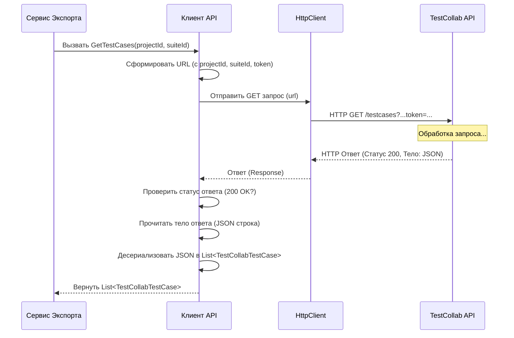

# Chapter 3: Клиент API TestCollab


В [предыдущей главе](02_модели_данных_.md) мы разобрались с [Моделями данных](02_модели_данных_.md) — "чертежами", которые описывают структуру информации в нашем приложении, включая данные, получаемые из TestCollab. Мы знаем, *в каком виде* эти данные должны существовать внутри программы (например, классы `TestCollabTestCase`, `TestCollabSuite`). Но как эта информация вообще попадает к нам с удаленного сервера TestCollab?

Именно для этого и существует **Клиент API TestCollab**.

## Какую проблему он решает?

Представьте, что ваш проект `TestCollabExporter` — это офис, а вся нужная информация (тест-кейсы, секции, атрибуты) находится в другом здании — на сервере TestCollab. Вы не можете просто телепортировать эти данные. Вам нужен кто-то, кто:

1.  Знает точный адрес сервера TestCollab.
2.  Имеет "пропуск" (ключ доступа или токен) для входа.
3.  Умеет общаться с сотрудниками TestCollab на их "языке" (языке API — Application Programming Interface).
4.  Может взять ваш запрос (например, "Дайте мне все тест-кейсы из проекта X"), сходить в TestCollab, получить ответ и принести его вам в понятном виде.

Выполнять все эти шаги каждый раз, когда вам нужны данные, было бы сложно и отвлекало бы от основной задачи — экспорта и преобразования данных.

## Решение: Клиент API TestCollab (`Client`)

`Client` (и его интерфейс `IClient`) — это и есть наш специалист по общению с внешним миром, а точнее — с сервером TestCollab. Его можно представить как **курьера** или **переводчика API**:

*   **Курьер:** Он получает "заказы" от других частей программы (в основном от [Сервиса Экспорта](01_сервис_экспорта_.md)) на получение определенной информации. Он едет по указанному адресу (URL сервера TestCollab), используя свой пропуск (токен API), забирает "посылку" (данные в формате JSON) и привозит ее обратно.
*   **Переводчик API:** TestCollab отдает данные в своем формате (JSON) и по своим правилам (спецификация API). Клиент "переводит" наши запросы в формат, понятный TestCollab (HTTP-запросы), а полученные ответы (JSON) — в формат, понятный нашей программе (объекты классов [Моделей данных](02_модели_данных_.md), таких как `TestCollabProject`, `TestCollabTestCase`).

Главная задача клиента — **скрыть всю сложность взаимодействия с TestCollab API** от остальной части приложения. Сервисам вроде [Сервиса Экспорта](01_сервис_экспорта_.md) не нужно знать о токенах, HTTP-запросах или деталях JSON. Они просто просят клиента: "Дай мне проекты" или "Скачай этот файл", и получают готовый результат.

## Ключевые обязанности Клиента

Наш `Client` умеет выполнять следующие задачи:

*   Получать информацию о **компании пользователя** (чтобы знать, в рамках какой компании искать проекты).
*   Находить конкретный **проект** по его имени.
*   Получать список **секций** (suites) внутри проекта.
*   Получать список **тест-кейсов** для конкретного проекта (и секции).
*   Получать список **общих шагов** (reusable steps).
*   Получать список **пользовательских полей** (custom fields).
*   **Скачивать вложения** по предоставленной ссылке.

Для выполнения этих задач он использует **HTTP-запросы** к API TestCollab и обрабатывает полученные **JSON-ответы**, преобразуя их в объекты наших [Моделей данных](02_модели_данных_.md).

## Как это используется? "Меню" услуг клиента (`IClient`)

Чтобы другие части программы знали, какие именно "услуги" предоставляет клиент, существует интерфейс `IClient`. Это как меню в ресторане — оно перечисляет все, что можно заказать у клиента.

```csharp
// File: Client\IClient.cs (упрощенно)
using TestCollabExporter.Models; // Используем модели для данных из TestCollab

namespace TestCollabExporter.Client;

// Интерфейс определяет, ЧТО умеет делать клиент
public interface IClient
{
    // Получить информацию о компании
    Task<TestCollabCompanies> GetCompany();

    // Получить информацию о проекте (нужны данные о компании)
    Task<TestCollabProject> GetProject(TestCollabCompanies companies);

    // Получить список секций для проекта
    Task<List<TestCollabSuite>> GetSuites(int projectId);

    // Получить список тест-кейсов для проекта и секции
    Task<List<TestCollabTestCase>> GetTestCases(int projectId, int suiteId);

    // Получить список общих шагов для проекта
    Task<List<TestCollabSharedStep>> GetSharedSteps(int projectId);

    // Получить пользовательские поля для компании
    Task<List<TestCollabCustomField>> GetCustomFields(int companyId);

    // Скачать файл по ссылке (возвращает массив байт)
    Task<byte[]> DownloadAttachment(string link);
}
```

*   **Пояснение:** Этот код не выполняет никаких действий, он лишь описывает "контракт". Любой класс, который захочет быть "клиентом TestCollab API", должен будет реализовать все эти методы. Например, метод `GetProject` обещает вернуть объект типа `TestCollabProject`, а метод `GetTestCases` — список `TestCollabTestCase`. Обратите внимание, что все методы возвращают `Task<...>` — это означает, что они работают асинхронно (не блокируя основную программу во время ожидания ответа от сервера).

[Сервис Экспорта](01_сервис_экспорта_.md) использует этот интерфейс, чтобы запросить у клиента необходимые данные на начальном этапе экспорта:

```csharp
// Внутри ExportService.cs (Фрагмент из Главы 1)
public async Task ExportProject()
{
    _logger.LogInformation("Начинаем экспорт проекта");

    // Используем КЛИЕНТА для получения исходных данных
    var companies = await _client.GetCompany();       // Просим у клиента компанию
    var project = await _client.GetProject(companies); // Просим проект
    var suites = await _client.GetSuites(project.Id); // Просим секции
    // ... и так далее для тест-кейсов, общих шагов...

    // ... дальше идет конвертация и запись ...
}
```

## Заглянем под капот: Как работает `Client`?

Теперь посмотрим на реализацию — класс `Client`, который выполняет всю работу по общению с API.

**Шаг 1: Настройка (Конструктор)**

Когда приложение запускается, создается экземпляр `Client`. В этот момент ему нужно узнать важные детали: адрес сервера TestCollab и секретный токен для доступа. Эта информация берется из конфигурационного файла (`appsettings.json`).

```csharp
// File: Client\Client.cs (упрощенно, только конструктор)
using System.Text.Json;
using Microsoft.Extensions.Configuration; // Для чтения конфигурации
using Microsoft.Extensions.Logging;
using TestCollabExporter.Models;

namespace TestCollabExporter.Client;

public class Client : IClient // Этот класс РЕАЛИЗУЕТ интерфейс IClient
{
    private readonly ILogger<Client> _logger;
    private readonly HttpClient _httpClient; // Инструмент для отправки HTTP-запросов
    private readonly string _token;          // Наш "пропуск" в TestCollab
    private readonly string _projectName;    // Имя проекта, который мы ищем

    // Конструктор: выполняется при создании объекта Client
    public Client(ILogger<Client> logger, IConfiguration configuration)
    {
        _logger = logger;

        // Читаем настройки из конфигурации (например, appsettings.json)
        var section = configuration.GetSection("testCollab");
        var url = section["url"];       // Получаем адрес сервера
        var token = section["token"];         // Получаем токен доступа
        var projectName = section["projectName"]; // Получаем имя проекта

        // Проверяем, что все настройки указаны (упрощено)
        if (string.IsNullOrEmpty(url) || string.IsNullOrEmpty(token) || string.IsNullOrEmpty(projectName))
        {
            throw new ArgumentException("Не указаны URL, токен или имя проекта в конфигурации!");
        }

        _projectName = projectName;
        _token = token;

        // Создаем и настраиваем HttpClient - наш инструмент для "походов" в интернет
        _httpClient = new HttpClient();
        _httpClient.BaseAddress = new Uri(url); // Указываем базовый адрес TestCollab
    }

    // ... здесь будут методы для получения данных (GetProject, GetTestCases и т.д.) ...
}
```

*   **Пояснение:** Конструктор получает доступ к конфигурации (`IConfiguration`) и логгеру (`ILogger`). Он читает URL сервера TestCollab, токен API и искомое имя проекта из раздела `testCollab` в конфигурации. Затем он сохраняет токен и имя проекта для последующего использования и создает основной инструмент для работы с сетью — `HttpClient`, сразу указывая ему базовый адрес API TestCollab. Теперь наш "курьер" знает, куда ходить и какой у него пропуск.

**Шаг 2: Выполнение запроса (Пример: `GetTestCases`)**

Когда [Сервис Экспорта](01_сервис_экспорта_.md) вызывает, например, метод `GetTestCases`, `Client` выполняет следующие действия:

1.  Формирует правильный URL для запроса, включая ID проекта, ID секции и токен.
2.  Использует `_httpClient` для отправки GET-запроса по этому URL.
3.  Ждет ответа от сервера TestCollab.
4.  Проверяет, успешен ли ответ (например, код состояния 200 OK).
5.  Читает тело ответа (это будет строка в формате JSON).
6.  Использует `System.Text.Json.JsonSerializer` для преобразования ("десериализации") этой JSON-строки в список объектов модели `TestCollabTestCase` (наши [Модели данных](02_модели_данных_.md)).
7.  Возвращает этот список [Сервису Экспорта](01_сервис_экспорта_.md).

```csharp
// File: Client\Client.cs (упрощенно, метод GetTestCases)
public async Task<List<TestCollabTestCase>> GetTestCases(int projectId, int suiteId)
{
    _logger.LogInformation("Получаем тест-кейсы для проекта {ProjectId} и секции {SuiteId}", projectId, suiteId);

    // 1. Формируем URL запроса к API TestCollab
    var requestUrl = $"testcases?project={projectId}&suite.id={suiteId}&token={_token}";

    // 2. Отправляем GET-запрос и ждем ответ
    var response = await _httpClient.GetAsync(requestUrl);

    // 4. Проверяем, успешен ли ответ
    if (!response.IsSuccessStatusCode)
    {
        _logger.LogError("Не удалось получить тест-кейсы. Код: {StatusCode}", response.StatusCode);
        // В реальном коде здесь будет более детальная обработка ошибки
        throw new Exception($"Ошибка получения тест-кейсов: {response.StatusCode}");
    }

    // 5. Читаем содержимое ответа (JSON) как строку
    var content = await response.Content.ReadAsStringAsync();

    // 6. Преобразуем JSON-строку в список объектов TestCollabTestCase
    var testCases = JsonSerializer.Deserialize<List<TestCollabTestCase>>(content);

    _logger.LogDebug("Найдено {Count} тест-кейсов", testCases!.Count);

    // 7. Возвращаем результат
    return testCases;
}
```

*   **Пояснение:** Этот метод показывает типичный цикл работы клиента: сформировать URL -> отправить запрос (`GetAsync`) -> проверить статус -> прочитать содержимое (`ReadAsStringAsync`) -> преобразовать JSON в объекты C# (`JsonSerializer.Deserialize`). Вся сложность работы с HTTP и JSON скрыта внутри этого метода. Для [Сервиса Экспорта](01_сервис_экспорта_.md) это просто вызов `_client.GetTestCases(...)`, который возвращает готовый список объектов.

**Визуализация процесса:**

Давайте представим, как [Сервис Экспорта](01_сервис_экспорта_.md) запрашивает тест-кейсы у `Client`:



*   **Пояснение:** Диаграмма показывает шаги: `ExportService` делает запрос `Client`. `Client` использует `HttpClient` для общения с `TestCollab API`. Получив ответ, `Client` обрабатывает его и возвращает результат (`List<TestCollabTestCase>`) обратно `ExportService`.

## Заключение

Клиент API TestCollab (`Client`) — это важный компонент, который служит "мостом" между нашим приложением `TestCollabExporter` и внешним сервером TestCollab. Он инкапсулирует (скрывает) все детали сетевого взаимодействия и работы с API:

*   Отправляет **HTTP-запросы**.
*   Использует **токен** для аутентификации.
*   **Парсит JSON**-ответы.
*   Преобразует данные в понятные приложению **[Модели данных](02_модели_данных_.md)** (`TestCollab...`).

Благодаря клиенту, остальная часть приложения, например [Сервис Экспорта](01_сервис_экспорта_.md), может просто запрашивать нужные данные, не беспокоясь о том, *как* они получаются с удаленного сервера.

Теперь, когда мы знаем, как получить "сырые" данные из TestCollab с помощью Клиента API, нам нужно их преобразовать в целевой формат, который мы хотим сохранить. В следующей главе мы рассмотрим, как это делается для одного из ключевых типов данных — тест-кейсов, и познакомимся с [Сервис конвертации тест-кейсов](04_сервис_конвертации_тест_кейсов_.md).

---

Generated by [AI Codebase Knowledge Builder](https://github.com/The-Pocket/Tutorial-Codebase-Knowledge)